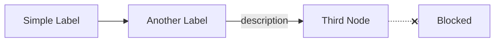

# AGENTS.md

This file provides guidance to AI coding agents when working with code in this repository.

## Project Overview

This is a Hugo-based personal technical blog (kane.mx) focusing on cloud computing, AI/ML, and software engineering. The site uses the hugo-clarity theme with comprehensive SEO optimizations and supports both English and Chinese content.

## Development Commands

### Hugo Commands
```bash
# Start development server
hugo server -D --port 1313

# Build for production
hugo --minify

# Create new post
hugo new posts/YYYY/post-name/index.md

# Create new post with page bundles
hugo new posts/YYYY/post-title/index.md --kind post-bundle
```

### Content Management
```bash
# Optimize images (existing script)
./scripts/image_optimize.sh

# Check for broken links (if needed)
hugo --gc --minify --cleanDestinationDir
```

## Content Structure and Organization

### Directory Structure
- `content/posts/YYYY/` - Blog posts organized by year (2016-2025)
- `content/posts/series-name/` - Multi-part series (e.g., deep-dive-clickstream-analytics, effective-cloud-computing)
- `static/` - Static assets (images, files, robots.txt, manifest.json)
- `layouts/` - Custom Hugo templates and partials
- `config/_default/` - Hugo configuration files

### Post Organization Patterns
- **Single Posts**: `content/posts/YYYY/post-title/index.md` (with page bundles)
- **Series Posts**: `content/posts/series-name/part-name/index.md`
- **Archive Posts**: `content/posts/archive/` for older content

## Blog Writing Style and SEO Guidelines

### Front Matter Template
Always include comprehensive front matter for optimal SEO:

```yaml
---
title: "Descriptive Title with Keywords" # 60 chars max for SEO
description: "Detailed description with key concepts and value proposition" # 155 chars max
date: YYYY-MM-DD
lastmod: YYYY-MM-DD # Update when making significant changes
draft: false # Set to true for drafts
thumbnail: ./images/cover.png # Use page bundles with local images
usePageBundles: true # Enable for posts with images
featured: true # For homepage sidebar
codeMaxLines: 70 # Default 70, adjust based on content
codeLineNumbers: true # Enable for technical posts
toc: true # Enable for long posts
categories:
- Primary Category # Use existing categories from other posts
- Secondary Category
isCJKLanguage: false # Set to true for Chinese content
tags:
- Technology Tag 1 # Use specific, searchable tags
- Technology Tag 2
- Framework Name
- Programming Language
keywords: # SEO keywords for better search visibility
- primary keyword phrase
- secondary keyword phrase
- technology specific terms
series: series-name # For multi-part content
---
```

### Date and Directory Guidelines

**IMPORTANT**: Before creating a new post:
1. **Check the current date** from the environment context (provided in system prompt as "Today's date")
2. **Use the correct year** for both the `date` field in front matter AND the directory path (`content/posts/YYYY/`)
3. **Set `lastmod`** to the same date as `date` for new posts

Example: If today is 2026-01-15, create the post in `content/posts/2026/post-name/` with `date: 2026-01-15`.

### Writing Style Guidelines

#### Technical Content Structure
1. **Introduction** - Clear problem statement and value proposition
2. **Architecture/Overview** - High-level system design with diagrams
3. **Implementation Details** - Step-by-step technical implementation
4. **Code Examples** - Working code with syntax highlighting
5. **Best Practices** - Lessons learned and recommendations
6. **Conclusion** - Summary and resources

#### Content Characteristics
- **Professional and Technical**: Focus on practical, implementable solutions
- **Detailed Implementation**: Include working code examples and architectural diagrams
- **SEO-Optimized**: Use keyword-rich titles, descriptions, and structured content
- **Bilingual Support**: Support both English and Chinese content (set `isCJKLanguage` accordingly)
- **Visual Elements**: Include cover images, diagrams, and code snippets
- **External Resources**: Link to official documentation, GitHub repos, and related articles

#### Technical Writing Best Practices
- Use Mermaid diagrams for system architecture and flow charts
- Include practical, runnable code examples
- Provide context for why certain technical decisions were made
- Link to official documentation and external resources
- Use structured headings (H2, H3) for better SEO and readability
- Include "Resources" section at the end with relevant links
- **Reference-Style Links**: Use reference-style links (footer annotations) for ALL links (both external URLs and internal Hugo relref) to keep content clean and maintainable

#### Mermaid Diagram Guidelines

The hugo-clarity theme uses mermaid v11. Avoid syntax that causes rendering failures:

**Do NOT use in node labels:**
- HTML tags like `<br/>` — use shorter plain text labels instead
- `@` symbol — write `Lambda Edge` not `Lambda@Edge`
- Unicode special characters (e.g., `✗`) — use mermaid's built-in `-.-x` for crossed links
- Quoted strings with HTML — `["App Service<br/>(Fargate)"]` will fail

**Safe patterns:**


**Always verify** Mermaid diagrams render correctly using the Hugo server + Chrome DevTools workflow below.

#### Reference-Style Link Guidelines

**Format**: All links should use `[link text][reference-id]` in content, with definitions at the end of the document.

**External Links** (URLs):
```markdown
For detailed information, see the [AWS documentation][aws-docs].

<!-- At end of document -->
[aws-docs]: https://docs.aws.amazon.com/
```

**Internal Links** (Hugo relref):
```markdown
See my previous post on [MCP Authorization][mcp-oauth-guide].

<!-- At end of document -->
[mcp-oauth-guide]: 
```

**Link Organization at Document End**:

Organize all reference links by category with HTML comments for clarity:

```markdown
---

<!-- OAuth and RFC Specifications -->
[rfc-7636]: https://datatracker.ietf.org/doc/html/rfc7636
[rfc-8707]: https://datatracker.ietf.org/doc/html/rfc8707

<!-- Official Documentation -->
[keycloak-docs]: https://www.keycloak.org/documentation
[aws-docs]: https://docs.aws.amazon.com/

<!-- GitHub Repository -->
[project-repo]: https://github.com/username/repository

<!-- Related Articles (Internal Links) -->
[mcp-oauth-guide]: 
[other-post]: 
```

**Benefits**:
- Clean, readable content without inline URLs
- Single source of truth for all links
- Easy to update URLs in one place
- Clear organization by category
- Works for both external URLs and internal Hugo links

### SEO Optimization Standards

The blog implements comprehensive SEO optimizations (see `SEO_OPTIMIZATIONS.md`):
- Structured data (schema.org) for articles and breadcrumbs
- Open Graph and Twitter Card meta tags
- Optimized sitemaps with priorities and change frequencies
- PWA support with web manifest
- Image lazy loading and WebP support
- Security headers and performance optimizations

#### SEO Checklist for New Posts
- [ ] Keyword-optimized title (under 60 characters)
- [ ] Meta description (120-155 characters)
- [ ] Relevant tags and categories
- [ ] Internal links to related posts
- [ ] External links to authoritative sources
- [ ] Alt text for images
- [ ] Proper heading structure (H1 > H2 > H3)
- [ ] Cover image optimized for social sharing

### Content Optimization with Gemini CLI

Use **gemini** (Gemini CLI) in headless mode to optimize blog post writing style based on guidelines in `AGENTS.md`:

```bash
# Create optimization prompt
cat > /tmp/optimize_prompt.txt << 'EOF'
You are optimizing a technical blog post for kane.mx based on these guidelines:

GUIDELINES FROM AGENTS.MD:
- SEO-friendly titles (under 60 characters)
- Meta descriptions (120-155 characters)
- Proper heading structure (H1, H2, H3)
- Keyword-rich content
- Professional technical writing style
- Use reference-style links for external URLs
- Clear, concise technical explanations

CURRENT BLOG POST:
EOF

# Append the blog post content
cat content/posts/YYYY/post-name/index.md >> /tmp/optimize_prompt.txt

# Add task instructions
cat >> /tmp/optimize_prompt.txt << 'EOF'

TASK:
Optimize this blog post's writing style to be:
1. More professional and technically precise
2. Better structured for SEO
3. Clearer and more concise
4. Following the blog's established style guidelines

Return ONLY the optimized markdown content without any explanations or comments.
EOF

# Run gemini to optimize (with 16GB memory and latest flash model)
NODE_OPTIONS="--max-old-space-size=16384" gemini --model gemini-2.5-flash --output-format text "$(cat /tmp/optimize_prompt.txt)" > /tmp/optimized_post.md

# Extract clean content (skip error messages)
tail -n +20 /tmp/optimized_post.md > content/posts/YYYY/post-name/index.md

# Clean up
rm /tmp/optimize_prompt.txt /tmp/optimized_post.md
```

**When to Use Gemini Optimization**:
- After creating a new blog post draft
- When refining technical explanations
- To improve SEO optimization
- For consistency with blog's writing style

**Benefits**:
- Professional technical writing style
- Better SEO optimization
- Improved clarity and structure
- Consistent tone across posts

### Post Verification with Hugo Server + Chrome DevTools

**MANDATORY**: After writing or modifying a blog post, verify rendering using the local Hugo server and Chrome DevTools MCP. This catches Mermaid diagram errors, broken layouts, and rendering issues that `hugo --minify` alone cannot detect.

#### Verification Workflow

```bash
# 1. Start Hugo dev server (use available port)
hugo server -D --port 1315 --bind 0.0.0.0 &
```

Then use Chrome DevTools MCP tools to verify:

1. **Navigate** to the post URL with `navigate_page`
2. **Check console errors** with `list_console_messages` (filter `types: ["error"]`)
3. **Verify Mermaid diagrams** — evaluate JS to check all `.mermaid` elements have rendered SVGs and no "Syntax error" text:
   ```javascript
   // Check all mermaid diagrams rendered
   document.querySelectorAll('.mermaid').forEach(el => {
     console.log(el.querySelector('svg') !== null, el.textContent.includes('Syntax error'));
   });
   ```
4. **Take screenshots** of key sections with `take_screenshot` to visually confirm layout
5. **Scroll to specific sections** (tables, diagrams, code blocks) and screenshot each

#### When to Run Verification
- After creating a new post (before committing)
- After Gemini CLI optimization (may alter Mermaid syntax)
- After any edit to Mermaid diagrams
- Before final commit of a post

#### Cleanup
```bash
# Stop Hugo server when done
kill %1  # or find and kill the hugo process
```

### LLM Team Review (Triple-Reviewer Editorial Pass)

For substantive posts (technical deep-dives, opinion pieces, posts that will rank for high-intent SEO terms), run an editorial review across **three different LLM reviewers in parallel**: Codex (GPT-5), Claude Sonnet 4.6, and Gemini 3.1 Pro Preview. Each model has different strengths and blind spots, so the consensus across three is meaningfully more reliable than one.

Use this when the cost of shipping a wrong claim is high (factual SEO, technical authority posts) or when you want a credibility check before publishing.

#### Why Three Reviewers

- **Codex** — strong at fact-checking via web search; will pull current docs and pricing; flags overclaims
- **Sonnet 4.6** — strong at editorial flow, internal consistency, and catching logic gaps between sections
- **Gemini 3.1 Pro Preview** — strong at structural critique and missing-context flags; current training data (knows recent model versions / pricing); occasionally hallucinates specific quoted strings — always grep the post before "fixing" anything Gemini quotes

When all three agree, the issue is real. When two of three agree, it's worth fixing. When only one flags something, evaluate on its own merits and be willing to push back.

#### Review Workflow

**Step 1: Build the review prompt.** Write a self-contained prompt that includes:
- Post context (which series it belongs to, prior posts)
- What changed since v1 (only on second-pass reviews)
- Specific claims worth fact-checking (pricing, AZ counts, parameter names, version-sensitive features)
- The exact output format you want (Verdict / Top issues / Specific corrections / What's strong)
- The full post body appended at the end

```bash
# Build prompt + post into single input
cat /tmp/review_prompt.md content/posts/YYYY/post-name/index.md > /tmp/review_full.md
```

**Step 2: Dispatch all three reviewers in parallel.** Run each via Bash with `run_in_background: true` so they execute concurrently.

```bash
# Codex
cat /tmp/review_full.md | codex exec --skip-git-repo-check --color never - > /tmp/review_codex.md 2>&1

# Claude Sonnet 4.6 via Bedrock (model is sonnet under the existing claude wrapper)
EDITOR=vim CLAUDE_CODE_EXPERIMENTAL_AGENT_TEAMS=1 AWS_REGION=us-west-2 \
  ANTHROPIC_DEFAULT_SONNET_MODEL='<bedrock-inference-profile-arn>' \
  ANTHROPIC_MODEL='<bedrock-inference-profile-arn>' \
  CLAUDE_CODE_USE_BEDROCK=1 \
  /home/ubuntu/.local/bin/claude --print --model sonnet --bare --dangerously-skip-permissions \
    < /tmp/review_full.md > /tmp/review_sonnet.md 2>&1

# Gemini 3.1 Pro Preview (requires gemini-cli >= 0.41.x)
gemini --model gemini-3.1-pro-preview --yolo --prompt "$(cat /tmp/review_full.md)" > /tmp/review_gemini.md 2>&1
```

Typical wall-clock: codex 4–7 min (web research is slow), sonnet 1–2 min, gemini 1–4 min. Codex usually finishes last because it does the most independent fact-checking.

**Step 3: Synthesize.** Categorize findings as:
- **Strong consensus** (all 3 agree) → must fix
- **Significant** (2 of 3 agree) → must fix unless you have a specific counter-reason
- **Single-reviewer flags** → evaluate on merits, often genuine but sometimes hallucinated
- **What everyone praised** → keep, don't accidentally edit out

Group fixes by priority:
- **P0** — factual errors, broken claims, wrong parameter names, SEO-blocking issues (title length, etc.)
- **P1** — credibility issues (overclaims, missing security context, date-stamping)
- **P2** — polish (consistency, configurability caveats, additional caveats)

**Step 4: Verify uncertain facts before applying edits.** When two reviewers disagree on a fact, look it up:
- AWS facts → `aws ec2 describe-...` directly, or AWS docs via WebFetch
- GitHub facts → official docs via WebFetch (e.g., `docs.github.com/en/actions/...`)
- Module/library facts → `gh api repos/.../contents/...` to read the actual source
- Pricing → real-time API or vendor pricing page (always with date stamp in post)

Don't trust any single LLM's pricing/version/availability claim — they all have stale training data. **Verify before editing the post.**

**Step 5: Apply edits + re-render.** Use the standard Hugo verification workflow above to confirm Mermaid still renders, links resolve, no console errors.

**Step 6: Optional second-pass review.** For high-stakes posts, run the same three-reviewer flow on the revised version. The second pass usually moves verdicts from "substantial edits" to "minor edits / ship" and catches new issues introduced by the first round of fixes.

#### Common Hallucinations to Watch For

- **Gemini** sometimes invents quoted text that isn't in the post — always grep the post for any string Gemini quotes before "fixing" it.
- **Codex** sometimes cites stale pricing or claims a feature is "outdated" when it's actually current — verify with the AWS API or vendor docs.
- **Sonnet** sometimes flags parameter names as wrong based on inference — verify against the actual module source.

#### Saving Reviews

Keep `/tmp/review_codex.md`, `/tmp/review_sonnet.md`, `/tmp/review_gemini.md` until the post is published. They are useful for:
- Linking to specific corrections in commit messages
- Re-checking whether a flagged issue was actually addressed
- Building intuition over time about which reviewer is reliable for which kind of claim

Clean them up after the post is shipped.

## Theme Configuration

### Hugo Clarity Theme
- Location: `themes/hugo-clarity/`
- Custom overrides in: `layouts/` directory
- Modified files for SEO: `layouts/partials/head.html`, `layouts/partials/json-ld.html`

### Site Configuration
- Main config: `config/_default/config.toml`
- Languages: `config/_default/languages.toml`
- Menus: `config/_default/menus/menu.en.toml`, `config/_default/menus/menu.zh.toml`
- Parameters: `config/_default/params.toml`

## Multi-Language Support

### Language Configuration
- Default language: English (`en`)
- Supported languages: English and Chinese
- Chinese posts: Set `isCJKLanguage: true` in front matter
- Language-specific menus in `config/_default/menus/`

### Content Organization
- English posts: Standard organization
- Chinese posts: Include `isCJKLanguage: true` in front matter
- Shared resources: Use Hugo's i18n system when needed

## Image Handling

### Cover Image Generation

**MANDATORY**: Use the **canvas-design** skill for ALL cover image creation. This ensures consistent, museum-quality craftsmanship across all blog posts.

Skills are **model-invoked** - Claude automatically decides when to use them based on context. To trigger the canvas-design skill, simply ask Claude to create a cover image with a detailed design brief.

#### Design Brief Template

When requesting a cover image, provide:
- **Post topic**: Main subject and key concepts
- **Visual style**: Light theme (preferred), modern, technical
- **Key elements**: What should be visually represented (terminal, notification, flow diagram, etc.)
- **Dimensions**: 1200x630px for social sharing

#### Example Design Brief

```
Create a cover image for a blog post about Claude Code notification hooks.

Topic: Desktop notifications via OSC escape sequences for VSCode Remote SSH
Style: Light theme, technical but sophisticated, museum-quality craftsmanship
Key elements:
- Terminal window showing Claude Code execution (left)
- Signal flow with OSC 777 label (center)
- Desktop notification popup (right)
- Flow diagram at bottom: Claude Code → Hook → OSC → SSH → Desktop
Colors: Blue (#2563eb) for signals, green (#16a34a) for success, white background
```

#### Post-Generation Requirements

1. **Review the output** - Ensure thumbnail visibility at small sizes
2. **Request light theme** if dark theme is generated
3. **Clean up temporary files**:
```bash
# Remove the design philosophy markdown file
rm content/posts/YYYY/post-name/design-philosophy.md
```

#### Design Guidelines

- **Theme**: Light background (white/off-white) preferred
- **Style**: Modern, professional, tech-focused aesthetic
- **Content**: Visual representation of the post's main concept
- **Text**: Minimal - only essential labels, no paragraphs
- **Format**: PNG with high quality
- **Dimensions**: 1200x630px (optimized for social media cards)
- **File location**: Save to `./images/cover.png` in post directory
- **Thumbnail test**: Preview at 400x225px to ensure readability

#### Thumbnail Optimization

The canvas-design skill should produce images that:
- Use **large, bold visual elements** visible at small sizes
- Keep **text minimal and large** (labels only)
- Use **high contrast colors** for key elements
- Include **flow diagrams** to explain technical concepts
- Avoid fine details that disappear when scaled down

### Image Optimization
- Use page bundles (`usePageBundles: true`) for posts with images
- Store images in `./images/` relative to post
- Use `scripts/image_optimize.sh` for optimization
- Include WebP versions when possible
- Optimize for lazy loading (already implemented site-wide)

### Image Best Practices
- Cover images: 1200x630px for social sharing (use canvas-design skill)
- Thumbnails: 400x225px for homepage cards - always test cover at this size
- Screenshots: Use high-resolution with proper compression
- Diagrams: Prefer Mermaid or SVG for scalability

## Series and Multi-Part Content

### Series Configuration
- Use `series: series-name` in front matter
- Organize in dedicated directories: `content/posts/series-name/`
- Include navigation between parts
- Create series landing page with overview

### Series Menu and Slug Coordination

The top-nav **Series dropdown** in `config/_default/menus/menu.en.toml` is **manually curated** — Hugo does not auto-generate it from the series taxonomy. New series introduced via front matter alone will **not** appear in the menu.

**Whenever you create a new series, also add a menu entry**:

```toml
[[main]]
  parent = "Series"
  name = "Model Context Protocol (MCP)"   # human-readable name (parens, casing OK)
  url = "/series/model-context-protocol/" # MUST match the slug used in `series:` front matter
  weight = 5                              # lower = earlier in dropdown
```

**Verify menu URLs match real series slugs.** A menu entry pointing at `/series/<slug>/` only renders posts if at least one post has `series: <slug>` in its front matter. Hugo will still build a 200-OK page for the URL (because of the taxonomy fallback), but the post list will be empty. This silent dead-link mode is easy to miss without clicking through every menu item.

To audit, list all series slugs in use vs. what the menu points at:

```bash
# Series slugs actually used by posts
grep -rh "^series:" content/posts/ | awk -F': ' '{print $2}' | sort -u

# Series slugs referenced by the menu
grep -E "url = \"/series/" config/_default/menus/menu.en.toml
```

Any URL in the menu that doesn't appear in the post-side list is a dead link.

**Verify after every series rename**: even if the post-side change deploys cleanly, the menu still points at the old slug until manually updated. Use Chrome DevTools to actually click through the homepage Series dropdown — `curl /series/<slug>/` returns 200 even for empty taxonomy pages, so HTTP status is not enough.

### Cross-Referencing
Use Hugo's `relref` shortcode for internal links:
```markdown
[Part 2]()
```

## Performance and Deployment

### Build Process
- Site builds via GitHub Actions (see `.github/workflows/hugo.yml`)
- Deploys to GitHub Pages automatically
- Minification and optimization enabled in production

### Performance Features
- Resource hints (preconnect, dns-prefetch)
- Asset preloading for critical resources
- Image lazy loading
- Service worker for PWA capabilities
- Optimized CSS and JS minification