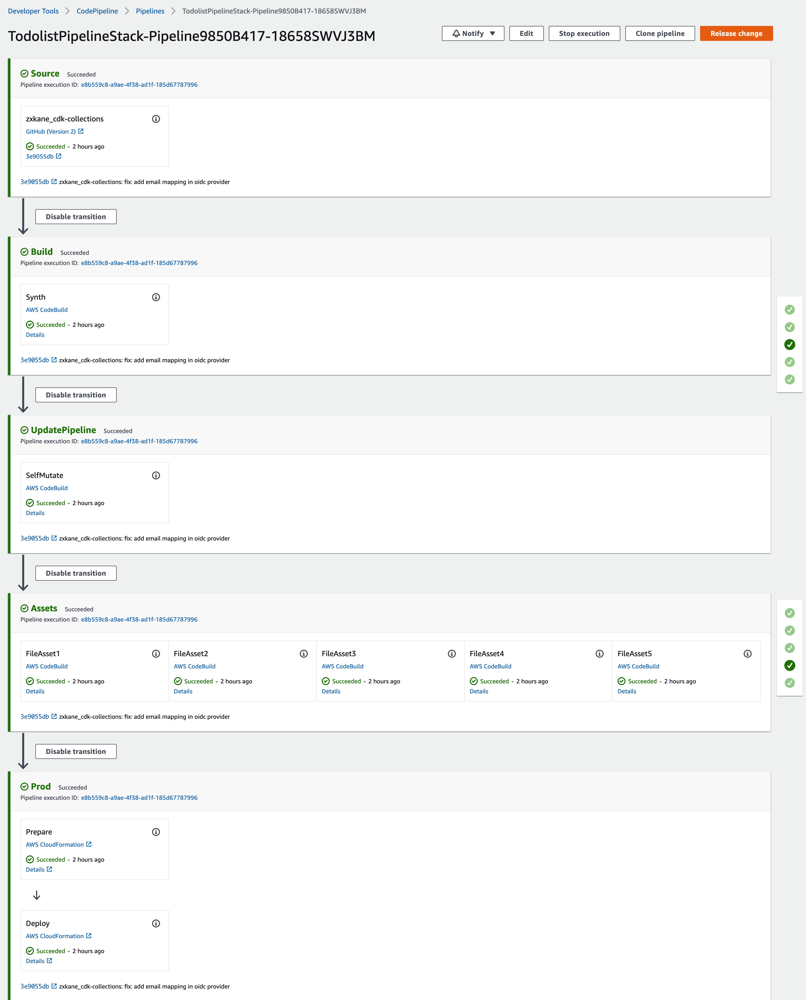

DevOps pipeline is a key component of project operation, 
it helps you automate steps in your software delivery process.

Amazon itself has rich expirence on DevOps with large scale services, 
it [shares the lesson and learn][builders-library-with-cd] from operating the Amazon's services. 
You can read [this summary post][deployment-at-amazon] written in Chinese.

Also AWS provides fully managed SaaS services for the lifecycle of software development, including
[AWS CodePipeline][codepipeline] for automating continuous delivery pipelines, 
[AWS CodeCommit][codecommit] for securely hosting highly scalable private Git repositories,
[AWS CodeArtifact][codeartifact] for artifact management,
[AWS CodeBuild][codebuild] for building and testing code with continuous scaling and
[AWS CodeDeploy][codedeploy] for automating code deployments to maintain application uptime.

<!--more-->
AWS Code series services are feasible to build the different DevOps pipelines to 
satisfy the customer's requirements. But it's required some work to assemble 
the building blocks to build the pipeline.

[CDK Pipeline][cdk-pipeline] is an abstract to simplify the builder experience 
to build DevOps pipeline for CDK application. It leveages the Infrastructure as Code 
and [Construct][construct-hub] to standarndize and customize the pipeline of CDK application.

The pipeline code just has few lines and looks like below,

```ts
    const connectArn = scope.node.tryGetContext('SourceConnectionArn');
    if (!connectArn) {throw new Error('Must specify the arn of source repo connection.');}
    const oidcSecret: string = scope.node.tryGetContext('OIDCSerectArn');
    if (!oidcSecret) {throw new Error('Must specify the context "OIDCSerectArn" for storing secret.');}

    const pipeline = new CodePipeline(this, 'Pipeline', {
      synth: new ShellStep('Synth', {
        input: CodePipelineSource.connection('zxkane/cdk-collections', 'master', {
          connectionArn: connectArn,
          codeBuildCloneOutput: true,
        }),
        installCommands: [
          'git submodule init && git submodule update && git submodule sync',
          'npm i --prefix serverlesstodo/frontend',
          'npm run build --prefix serverlesstodo/frontend',
          'yarn --cwd serverlesstodo install --check-files --frozen-lockfile',
        ],
        commands: [
          'cd serverlesstodo',
          'npx projen',
          'npx projen test',
          `npx cdk synth serverlesstodo -c OIDCSerectArn=${oidcSecret} -c SourceConnectionArn=${connectArn} -c CognitoDomainPrefix=todolist-userpool-prod`,
        ],
        primaryOutputDirectory: 'serverlesstodo/cdk.out/',
      }),
      dockerEnabledForSynth: true,
      codeBuildDefaults: {
        cache: Cache.local(LocalCacheMode.SOURCE, LocalCacheMode.DOCKER_LAYER),
      },
      synthCodeBuildDefaults: {
        partialBuildSpec: BuildSpec.fromObject({
          version: '0.2',
          phases: {
            install: {
              'runtime-versions': {
                nodejs: 14,
              },
            },
          },
        }),
      },
    });

    pipeline.addStage(new TodolistApplication(this, 'Prod', {
      env: {
        account: process.env.CDK_DEFAULT_ACCOUNT,
        region: process.env.CDK_DEFAULT_REGION,
      },
    }));
```

Some key points in above pipeline code snippet,

- this example code hosts on Github, so using [CodeStar][codestar] connection to fetch code from Github
- `synth` of `CodePipeline` is the configuration of CodeBuild project, it installs the
dependencies of project then build, test and generate the deployment artifacts(CloudFormation template),
see [docs of deploying from source][deploy-from-source]
- the CDK pipeline has built-in mutation step to update pipeline itself before deploying the application

After deploying the pipeline stack, the screenshot of pipeline looks like below,


As usual, all AWS resources are orchestrated by a [AWS CDK project][example-repo], it's easliy to be deployed to any account and any region of AWS!

Happying continuously deploy your application :rocket: :laughing::laughing::laughing:

[builders-library-with-cd]: https://aws.amazon.com/builders-library/?nc1=h_ls&cards-body.sort-by=item.additionalFields.sortDate&cards-body.sort-order=desc&awsf.filter-content-category=content-category%23software-delivery-operations&awsf.filter-content-type=*all&awsf.filter-content-level=*all
[deployment-at-amazon]: 
[codepipeline]: https://aws.amazon.com/codepipeline/
[codecommit]: https://aws.amazon.com/codecommit/
[codebuild]: https://aws.amazon.com/codebuild/
[codedeploy]: https://aws.amazon.com/codedeploy/
[codeartifact]: https://aws.amazon.com/codeartifact/
[cdk-pipeline]: https://docs.aws.amazon.com/cdk/api/v2/docs/aws-cdk-lib.pipelines-readme.html
[construct-hub]: https://constructs.dev/
[codestar]: https://aws.amazon.com/codestar/
[deploy-from-source]: https://github.com/zxkane/cdk-collections/tree/master/serverlesstodo#deploy-web-application-from-source
[example-repo]: https://github.com/zxkane/cdk-collections/tree/master/serverlesstodo