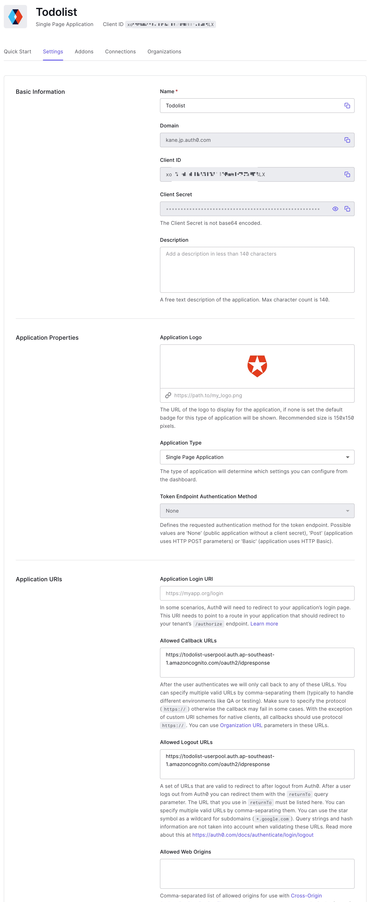
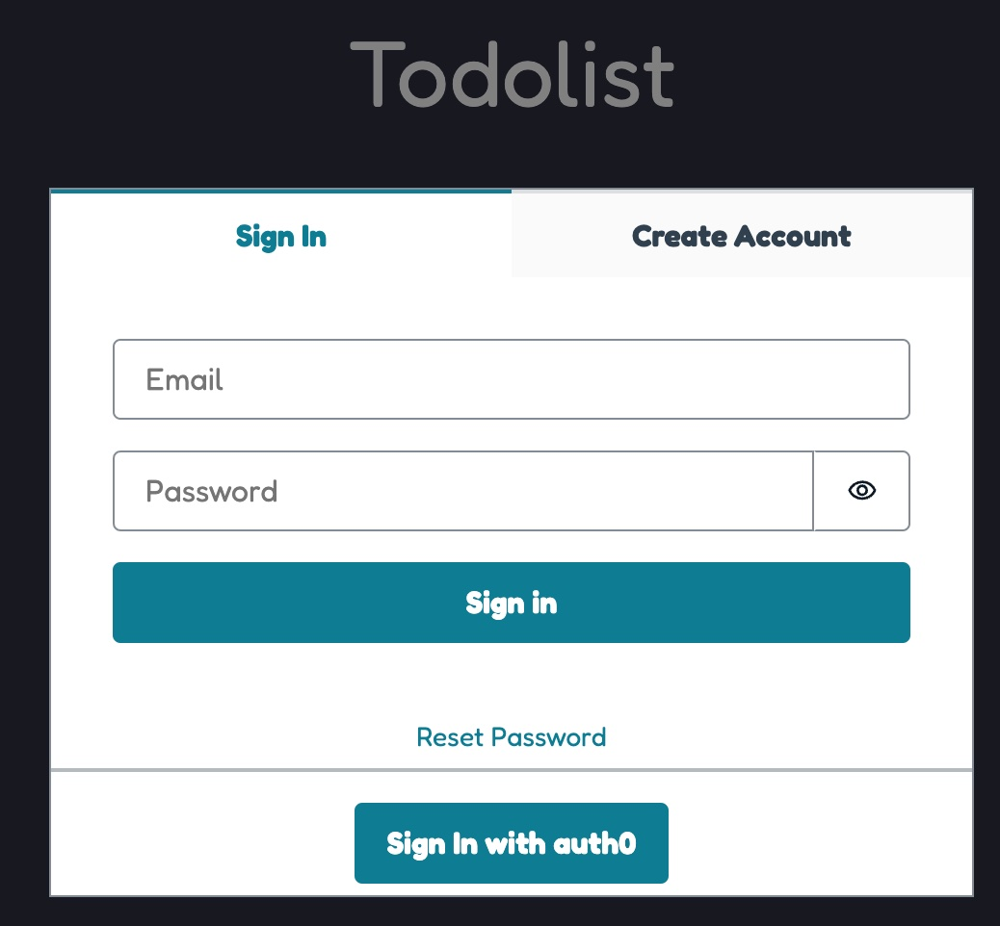

When working on either 2C application or 2B service, the customers do not want to 
or is not allowed to sign up the new account, they can login the application via existing
IdP or enterprise SSO. So, building the application supports the federated OIDC login 
to address such requirements.

This post extends the capability of [Todolist application protected by Amazon Cognito][protect-website-with-cognito],
using [Auth0][auth0] as the third party [OpenID Connect][openid] provider introduces the external user pool.

<!--more-->

The application also uses the [AWS Amplify][amplify] to build the frontend capabilities(for example,
authentication, invoke backend restful api), [Amazon Cognito][cognito] providing both
federated OIDC login and self-managed users sign in/sign up, 
and [Amazon API Gateway][api-gateway] providing the backend API and validating the token with OIDC provider.

Below is the key procedures to add the federated OIDC login to [the existing web application protected by Cognito][protect-website-with-cognito],

**1. Update the authorizer of API Gateway to validate the token issued by OIDC providers.**

The previous authorizer is using API Gateway Cognito authorizer, it only can validate the token issued by Cognito user pool.
Cognito user pool also [complies with the OIDC standard][cognito-user-pool-using-token],
using [Lambda authorizer][apigateway-lambda-authorizer] can implement to validate the tokens issued by either Cognito user pool and third party OIDC provider.

The CDK code creates a lambda function as **Lambda Authorizer** of API Gateway, which sets the supported OIDC issuers as environment,
```ts {hl_lines=["10"]}
    const authFunc = new NodejsFunction(this, `${resourceName}AuthFunc`, {
      entry: path.join(__dirname, './lambda.d/authorizer/index.ts'),
      handler: 'handler',
      architecture: Architecture.ARM_64,
      timeout: Duration.seconds(5),
      memorySize: 128,
      runtime: Runtime.NODEJS_16_X,
      tracing: Tracing.ACTIVE,
      environment: {
        ISSUERS: issuers,
        RESOURCE_PREFIX: Arn.format({
          service: 'execute-api',
          resource: api.restApiId,
        }, Stack.of(this)),
      },
    });
```
The custom lambda authorizer uses the [Auth0's jwt-decode][jwt-decode] and [AWS JWT Verify][aws-jwt-verify]
to verify the [ID tokens][id-token] issued by OIDC provider. See [source][jwt-verify-src] for detail implementation.

**2. [Add the third party OIDC provider to Cognito user pool][cognito-user-pools-oidc-idp].** It involves the client information
with secrets generated by OIDC provider, we use the [AWS Secrets Manager][secrets-manager] to securely store the credentials.

As prerequisites of this step, you must create an application in your OIDC provider.
For example, [creating an application in Auth0][auth0-create-app], then configure 
the allowed callback URLs to the [pool domain][cognito-user-pools-assign-domain].
The next saving the issuer domain, client id, client secret and name(will be readable string in UI)
to a secret in Secrets Manager.


The code snippet of CDK creates the external OIDC provider looks like below,
```ts
    const oidcSecretArn = this.node.tryGetContext('OIDCSerectArn');
    var oidcProvider: UserPoolIdentityProviderOidc | undefined;
    if (oidcSecretArn) {
      const secret = Secret.fromSecretAttributes(this, 'OIDCSecret', {
        secretCompleteArn: oidcSecretArn,
      });
      oidcProvider = new UserPoolIdentityProviderOidc(this, 'FedarationOIDC', {
        clientId: secret.secretValueFromJson('clientId').toString(),
        clientSecret: secret.secretValueFromJson('clientSecret').toString(),
        issuerUrl: secret.secretValueFromJson('issuerUrl').toString(),
        name: secret.secretValueFromJson('name').toString(),
        userPool: userpool,
        scopes: [
          'profile',
          'openid',
          'email',
        ],
      });
      userpool.registerIdentityProvider(oidcProvider);
    }
```


**3. Update the amplify configuration file with OIDC provider information.**
```ts {hl_lines=["10-16"]}
    const amplifyConfFile = 'aws-exports.json';
    const body =
`{
  "aws_project_region": "${Aws.REGION}",
  "Auth": {
    "region": "${Aws.REGION}",
    "userPoolId": "${poolInfo.userpool.userPoolId}",
    "userPoolWebClientId": "${poolInfo.client.userPoolClientId}",
    "authenticationFlowType": "USER_SRP_AUTH",
    "oauth": {
      "name": "${poolInfo.oidc.name}",
      "domain": "${poolInfo.poolDomain.domainName}.auth.${Aws.REGION}.amazoncognito.com",
      "scope": ["email", "openid", "aws.cognito.signin.user.admin", "profile"],
      "redirectSignIn": "${poolInfo.oidc.signinUrl}",
      "redirectSignOut": "${poolInfo.oidc.signinUrl}",
      "responseType": "code"
    }
  },
  "API": {
    "endpoints": [
      {
        "name": "backend-api",
        "endpoint": "https://${cloudFrontS3.cloudFrontWebDistribution.distributionDomainName}/prod/"
      }
    ]
  }
}`;
```

**4. Customize the Amplify's [React Authenticator component][react-authoricator] to
add the federated OIDC login entrance.**
```jsx {hl_lines=["20-28"]}
    SignIn: {
      Footer() {
        const { toResetPassword } = useAuthenticator();
  
        return (
          <View textAlign="center">
            <Divider orientation="horizontal" />
            <Text>
              {
                !isAuthenticated && (
                  <View
                    as="div"
                    backgroundColor="var(--amplify-colors-white)"
                    borderRadius="6px"
                    color="var(--amplify-colors-blue-60)"
                    height="4rem"
                    maxWidth="100%"
                    padding="1rem"
                    >
                    <Button
                      variation="primary"
                      onClick={
                        () => {
                          Auth.federatedSignIn({ customProvider: oidcProviderName });
                        }}
                    >
                      Sign In with {oidcProviderName}
                    </Button>
                  </View>
                )
              }
            </Text>            
          </View>
        );
      },
    }, 
```
The new look of Amplify's authoricator component looks like below with both self-managed user pool and federated OIDC login,


As usual, all AWS resources are orchestrated by a [AWS CDK project][example-repo], it's easliy to be deployed to any account and any region of AWS!

Happying logging your website with externl OIDC provider :lock: :laughing::laughing::laughing:

[protect-website-with-cognito]: 
[auth0]: https://auth0.com/
[openid]: https://en.wikipedia.org/wiki/OpenID
[cognito]: https://aws.amazon.com/cognito/
[amplify]: https://aws.amazon.com/amplify/
[api-gateway]: https://aws.amazon.com/api-gateway/
[cognito-user-pool-using-token]: https://docs.aws.amazon.com/en_us/cognito/latest/developerguide/amazon-cognito-user-pools-using-tokens-with-identity-providers.html
[apigateway-lambda-authorizer]: https://docs.aws.amazon.com/apigateway/latest/developerguide/apigateway-use-lambda-authorizer.html
[jwt-decode]: https://github.com/auth0/jwt-decode
[aws-jwt-verify]: https://github.com/awslabs/aws-jwt-verify
[id-token]: https://openid.net/specs/openid-connect-core-1_0.html#CodeIDToken
[jwt-verify-src]: https://github.com/zxkane/cdk-collections/blob/master/serverlesstodo/src/lambda.d/authorizer/decode-verify-jwt.ts
[cognito-user-pools-oidc-idp]: https://docs.aws.amazon.com/en_us/cognito/latest/developerguide/cognito-user-pools-oidc-idp.html
[secrets-manager]: https://aws.amazon.com/secrets-manager/
[auth0-create-app]: https://auth0.com/docs/get-started/auth0-overview/create-applications
[cognito-user-pools-assign-domain]: https://docs.aws.amazon.com/en_us/cognito/latest/developerguide/cognito-user-pools-assign-domain.html
[react-authoricator]: https://ui.docs.amplify.aws/react/connected-components/authenticator
[example-repo]: https://github.com/zxkane/cdk-collections/tree/master/serverlesstodo