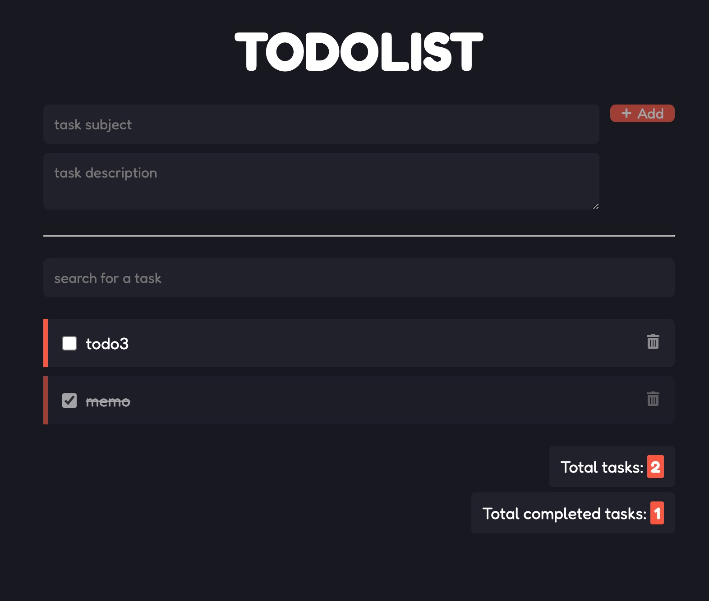

It's a well known pattern to distribute the website via CDN globally, 
it reduces the latency of the site and improve the availibity and security leveraging the infrastructure of cloud provider.

Using CDN service [CloudFront][cloudfront] and simple storage [S3][s3] on AWS hosts the static website.
It well fits the SPA(single page application) framework technologies, for example, React, Vue and Angularjs.
There are lots of existing project and code snippets to sharing this pattern, 
such as [CloudFront to S3 and API Gateway][cloudfront-s3-pattern-2] and [AWS S3 / React Website Pattern][cloudfront-s3-pattern-1].

<!--more-->

In the TODO application it reuses an existing project [Todolist][react-todo] built by React.
The original Todolist application is a pure client application without communicating the backend service.
In this demo the Todolist application is updated to communicate with [Restful TODO APIs][restful-api] created by Amazon API Gateway.
Also the restful backend API is distributed by CDN CloudFront to reduce the latency and protect the origin service without crossing domain request.

The demo uses the [aws-cloudfront-s3 construct][cloudfront-to-s3] from [AWS Solutions Constructs][solutions-construct] to simplify orchestrating
the CloudFront to S3/API Gateway pattern. And use [AWS S3 Deployment Construct Library][s3-deployment] to publish the static web page to S3 bucket.
See below code snippet how archive it in CDK.



As usual, all AWS resources are orchestrated by [AWS CDK project][example-repo], it's easliy to be deployed to any account and any region of AWS!

Happying distributing the website :globe_with_meridians: :laughing::laughing::laughing:

[cloudfront]: https://aws.amazon.com/cloudfront/
[s3]: https://aws.amazon.com/s3/
[cloudfront-s3-pattern-1]: https://github.com/cdk-patterns/serverless/blob/main/s3-react-website/README.md
[cloudfront-s3-pattern-2]: https://serverlessland.com/patterns/cloudfront-s3-lambda-cdk
[cloudfront-to-s3]: https://docs.aws.amazon.com/solutions/latest/constructs/aws-cloudfront-s3.html
[react-todo]: https://github.com/rasmoo-edtech/react-todolist
[restful-api]: 
[solutions-construct]: https://docs.aws.amazon.com/solutions/latest/constructs/welcome.html
[s3-deployment]: https://docs.aws.amazon.com/cdk/api/v2/docs/aws-cdk-lib.aws_s3_deployment-readme.html
[example-repo]: https://github.com/zxkane/cdk-collections/tree/master/serverlesstodo