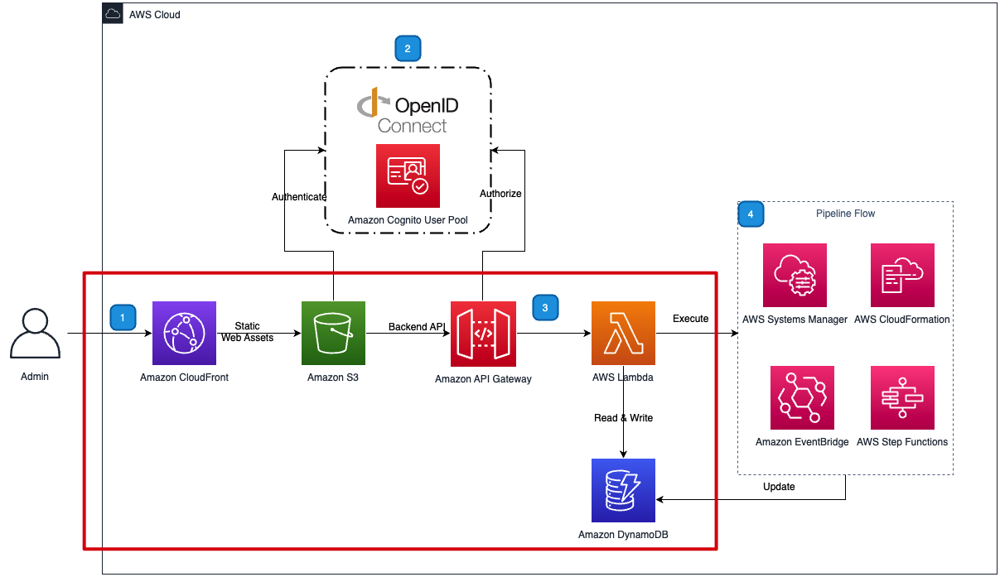
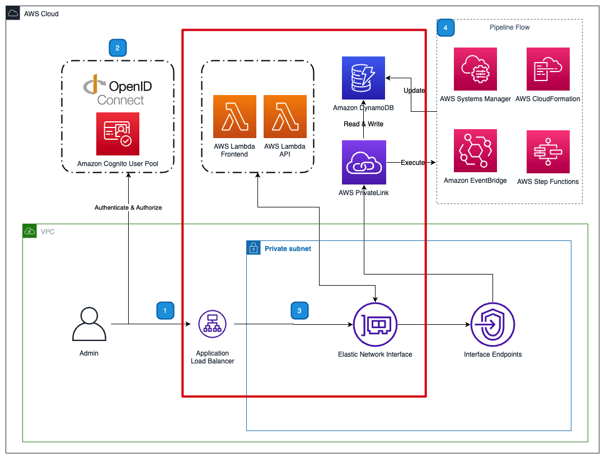

> **Disclaimer**: the cover image was generated by StableDiffusionXL with prompts 'cover image, spring boot, flask framework running in aws lambda'.

When deploying and operating a web application on the cloud, you prefer to use your favorite programming language and web framework. Also, you want to benefit from Serverless technologies for stability, scalability, cost optimization, and operation excellence.

[AWS Lambda Web Adapter][web-adapter] is a tool that perfectly meets your expectations. It lifts and shifts the web application based on your preferred language and web framework, including FastAPI, Flask, Django, Express.js, Next.js, Spring Boot, Nginx, PHP, Rust, Golang Gin, Laravel, ASP.NET, and so on! You don't have to change any code to migrate your application to Lambda runtime. It also supports WebSocket and streaming features that work well with your LLM applications.

Another use case is that you can orchestrate your cloud infrastructure to support different network topologies without changing any code. Assuming you are ISV, your customers want to deploy your services as both public service and private service. With lambda web adapter, you can share the source code of the service, just orchestrating the AWS services to meet the requirements.

### Public service pattern: CloudFront + S3 + API Gateway + Lambda

You can use CloudFront to publish your entire web service. Using S3 to host all static content of your site and API Gateway with Lambda integration serves as the backend API.

### Private service pattern: Application Load Balancer (ALB) + Lambda

With lambda web adapter, you can deploy your web application with Amazon VPC without exposing it to the internet. In this pattern, we choose ALB as the gateway of network traffic, then forward the different requests to two Lambda functions running web frontend and backend correspondingly.

In [Clickstream Analytics on AWS][clickstream-solution] solution it applies the above patterns to [deploy its web console][clickstream-deployment] for different network topologies without changing the code of the web application. Also, the solution implements the above pattern as CDK constructs for replication using,

- [CloudFront + S3 + API Gateway + Lambda][pattern-1-construct]
- [ALB + Lambda][pattern-2-construct]

### Learns

While implementing the above patterns in the Clickstream solution, we learned the below tips for applying them on AWS.

- For CloudFront + S3 + API Gateway + Lambda
  - Put API Gateway behind CloudFront for the same origin
  - Use CloudFront function to rewrite requests for React Browser Router
  - Can not enable access log of CloudFront in the same region when deploying to opt-in regions
- For ALB + Lambda
  - The payload size for Lambda behind ALB is 1MB
    - Split the bundled JS into multiple chunks
  - Handle with the authentication and authorization via your Web framework

I presented this topic in AWSUGTW today in Chinese. Below are the slides in the community sharing,



[web-adapter]: https://github.com/awslabs/aws-lambda-web-adapter
[clickstream-solution]: https://aws.amazon.com/solutions/implementations/clickstream-analytics-on-aws/
[clickstream-deployment]: https://awslabs.github.io/clickstream-analytics-on-aws/en/deployment/
[pattern-1-construct]: https://github.com/awslabs/clickstream-analytics-on-aws/blob/main/src/control-plane/cloudfront-s3-portal.ts
[pattern-2-construct]: https://github.com/awslabs/clickstream-analytics-on-aws/blob/main/src/control-plane/alb-lambda-portal.ts