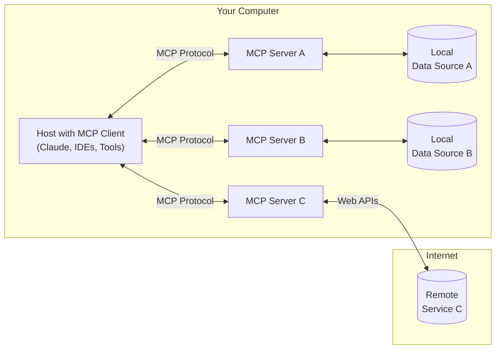

Ever wished you could conjure up the perfect images for your blog posts or articles without leaving your editor? Wouldn't it be amazing to generate professional-quality visuals with just a few keystrokes while you're in your creative flow?

Well, grab your virtual paintbrush because we're about to dive into how you can do exactly that using GenAI's image generation capabilities with Model Context Protocol (MCP) server!

<!--more-->

## The Magic Behind the Scenes: Model Context Protocol (MCP)

Think of [Model Context Protocol][mcp] (MCP) as the universal translator for AI applications. Just like how USB-C lets you plug anything into anything (well, almost), MCP is the cool new standard that helps Large Language Models (LLMs) talk to all sorts of data sources and tools.

*The elegant simplicity of MCP Architecture*

Here's how this clever system works:

- **MCP Hosts**: Your favorite apps like Claude Desktop and IDEs that want to tap into the AI goodness
- **MCP Clients**: The friendly middlemen ensuring smooth conversations between apps and servers
- **MCP Servers**: The specialized workers that make the magic happen
- **Local Data Sources**: Your computer's treasure trove of files and services
- **Remote Services**: The vast world of internet services at your fingertips

What makes MCP really shine is its ability to:

- Plug and play with a growing collection of pre-built tools
- Switch between different AI providers as easily as changing TV channels
- Keep your data safe and sound within your own setup

## Amazon Nova Canvas: Your AI Art Studio

[Amazon Nova Canvas][nova-canvas] is like having a professional artist at your beck and call. This cutting-edge image generation model from AWS turns your ideas into stunning visuals, whether you describe them in words or show it reference images.

What's in the toolbox?

- **Creative Control**: Want to tweak colors or adjust layouts? Just tell it what you want!
- **Magic Wand for Images**: Need to swap backgrounds or remove objects? Nova's got your back
- **Safety First**: Built-in watermarking and content checks keep things professional and traceable

Let's see it in action! Here's what happened when I asked Nova to create "a dinosaur sitting in a teacup":



Pretty neat, right? Nova took this whimsical idea and turned it into something that's both charming and surprisingly believable. The way it handled the size difference between our tea-loving dino and its delicate perch is just *chef's kiss*.

## Making It Work: MCP Server for Amazon Bedrock Nova Canvas

Ready to connect your favorite editor to this image-generating wonderland? Enter the [Amazon Bedrock MCP Server][bedrock-mcp-server] - your bridge to Nova Canvas's creative powers.

This open-source gem comes packed with:

- Text-to-image generation that actually works
- Fine-tuning through negative prompts (for when you want to say "but definitely not like that!")
- Flexible size and quality settings
- Consistent results with seed control
- Rock-solid error handling (because we all need a safety net)

### Playing Nice with Others: MCP Client Integration

The beauty of MCP is how well it plays with others. Here are some of your soon-to-be favorite companions:

- **Claude Desktop App**: The full package with all the bells and whistles
- **Continue**: Your open-source coding buddy that speaks MCP fluently
- **Cline**: A VS Code extension that makes AI feel like a natural part of your workflow

#### Setting Up Claude Desktop

Want to start generating images in Claude Desktop? Here's your quick setup guide:

1. Get your AWS credentials sorted (with Bedrock permissions)
2. Add a sprinkle of MCP server config to Claude Desktop settings

Here's what the magic looks like in action:



## Wrapping Up

As we roll into the New Year, it's incredible to see tools like Nova Canvas and MCP making creative AI so accessible and fun to use. Whether you're a developer, writer, or creative soul, generating professional images is now as easy as describing what's in your imagination.

The future is looking bright (and beautifully illustrated) with these tools at our fingertips. As we step into 2025, we can expect even more exciting developments in the world of AI-assisted creativity.

Here's to a New Year filled with endless creative possibilities! May your prompts be inspired and your generations be spectacular. 🎨✨

[mcp]: https://modelcontextprotocol.io/introduction
[nova-canvas]: https://aws.amazon.com/ai/generative-ai/nova/creative/
[mcp-clients]: https://modelcontextprotocol.io/clients
[bedrock-mcp-server]: https://github.com/aws-samples/bedrock-mcp-server