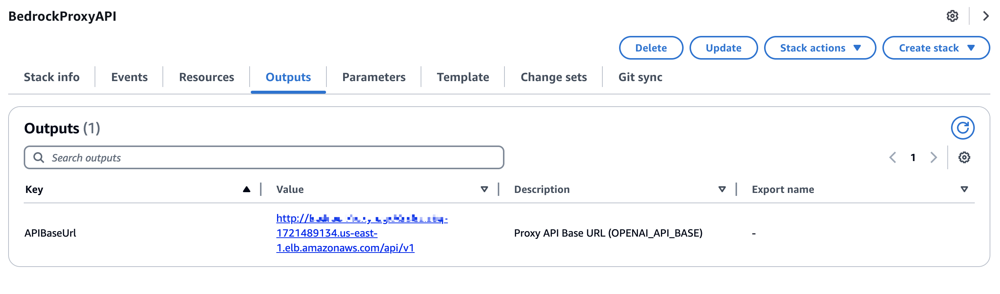
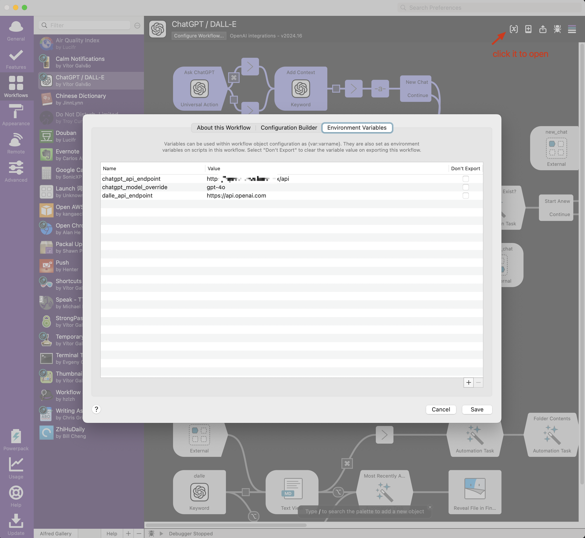

Many [Alfred][alfred] users enjoy the convenience of [the OpenAI ChatGPT workflow][alfred-workflow] for quick AI-powered assistance. However, with the introduction of [Amazon's Bedrock][bedrock] Claude 3 and 3.5 models, some may want to leverage these powerful alternatives. In this post, we'll explore how to set up a custom gateway to access Bedrock Claude models instead of the OpenAI API for your Alfred OpenAI workflow.

## Why Use Bedrock Claude?

1. Potentially lower costs compared to OpenAI's API
2. Access to the latest Claude models
3. Data privacy considerations (your data stays within AWS)
4. Integration with other AWS services

## Setting Up the Bedrock Access Gateway

[Bedrock Access Gateway][bedrock-gateway] provides OpenAI-compatible RESTful APIs for Amazon Bedrock. It supports streaming responses via server-sent events (SSE) and is compatible with various Bedrock model families, including Anthropic Claude 3 (Haiku/Sonnet/Opus), Claude 3.5 Sonnet, Meta Llama 3, Mistral, and more features.

To set up the Bedrock access gateway endpoint in your AWS account, follow the [deployment guide][bedrock-gateway-deployment]. You can choose to deploy using either [AWS Lambda][lambda] or [AWS Fargate for Amazon ECS][fargate-for-ecs] as the compute resource based on your cost and performance trade-off. Once the deployment is complete, you can find the gateway endpoint in the **Outputs** tab of the CloudFormation stack, as shown below:

## Configuring the Alfred ChatGPT Workflow

Now, we need to configure the Alfred ChatGPT workflow to use our Bedrock gateway:

1. Open **Alfred Preferences**
2. Install the [the ChatGPT workflow][alfred-workflow] then choose it in workflow tab
3. Replace the OpenAI API endpoint with your API Gateway URL(**NOTE**: remove the trailing `/v1` from the url got from the stack output)

4. Specify the API key when depoloying the Bedrock Access Gateway as OpenAPI key

## Testing the Integration

Try out some prompts in Alfred to ensure everything is working correctly. You should now be using Bedrock Claude models instead of OpenAI!

## Conclusion

By setting up this custom gateway, you can leverage the power of Amazon's Bedrock Claude models within your familiar Alfred OpenAI workflow. This approach offers flexibility, potentially lower costs, and the ability to keep your data within the AWS ecosystem.

Remember to monitor your usage and costs, as Bedrock pricing may differ from OpenAI's. Happy prompting!

[alfred]: https://www.alfredapp.com/
[alfred-workflow]: https://www.alfredapp.com/workflows/
[openai-workflow]: https://alfred.app/workflows/alfredapp/openai/
[bedrock]: https://aws.amazon.com/bedrock/?nc1=h_ls
[bedrock-gateway]: https://github.com/aws-samples/bedrock-access-gateway
[bedrock-gateway-deployment]: https://github.com/aws-samples/bedrock-access-gateway?tab=readme-ov-file#deployment
[lambda]: https://aws.amazon.com/lambda/
[fargate-for-ecs]: https://docs.aws.amazon.com/AmazonECS/latest/developerguide/AWS_Fargate.html