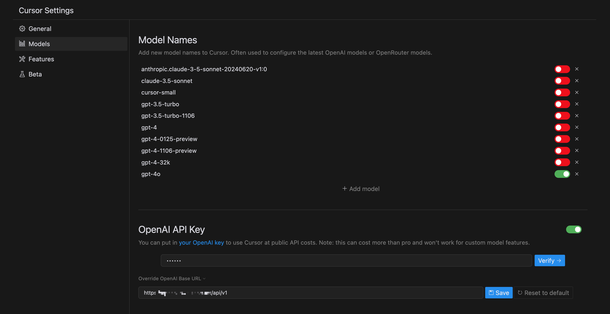

[Cursor][cursor] is a powerful AI-assisted programming Integrated Development Environment (IDE) that comes with built-in Large Language Model (LLM) capabilities to aid in coding. With the introduction of [Amazon's Bedrock][bedrock] Claude 3.5 model, developers now have access to advanced alternatives. In this post, we'll explore how to set up a custom gateway for Amazon Bedrock with the Claude Sonnet 3.5 foundation model and use it in Cursor as a custom model provider. This approach allows us to harness the cutting-edge language model capabilities of Amazon Bedrock within the familiar Cursor environment, potentially offering enhanced performance and cost-effectiveness for AI-assisted coding tasks.

## Setting Up the Bedrock Access Gateway

Follow the steps outlined in [this post][alfred-bedrock-gateway] to set up your Bedrock gateway.

## Configuring Cursor to Use Bedrock Gateway

To configure Cursor to use our Bedrock gateway:

1. Open the full settings of Cursor
2. Navigate to the **Models** section
3. Input the Bedrock gateway endpoint URL and API key (specified in the previous step) into the **OpenAI API Key** field

4. Choose any GPT model as your Cursor model. The Bedrock gateway will forward your request to Claude or other LLMs you've configured in the Bedrock gateway.

## Testing the Integration

Try out some prompts in Cursor to ensure everything is working correctly. You should now be using Claude Sonnet 3.5 models via Amazon Bedrock!

## Conclusion

By setting up this custom gateway, you can leverage the power of Amazon's Bedrock models (such as Anthropic's Claude or Meta's Llama) within your familiar Cursor environment. This approach offers flexibility, potentially lower costs, and the ability to keep your data within the AWS ecosystem.

Remember to monitor your usage and costs, as Bedrock pricing follows a pay-as-you-go model. Happy coding!

[cursor]: https://www.cursor.com/
[bedrock]: https://aws.amazon.com/bedrock/
[alfred-bedrock-gateway]: 
