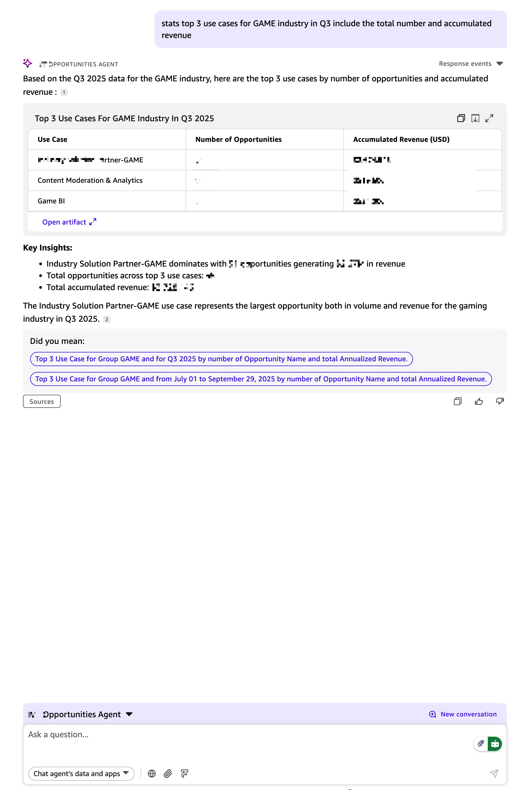

## Introduction

Business intelligence has long been the domain of specialists, requiring complex tools and time-consuming analysis. But what if you could simply *ask* your data questions in plain English and receive comprehensive, visualized answers in seconds? What if you could automate your weekly reporting with a simple conversation?

**Amazon Quick Suite** is AWS's answer. It's a generative AI-powered business intelligence platform designed to democratize data analysis, making it accessible to everyone in your organization—no machine learning expertise required.

In this deep dive, we'll explore the game-changing benefits of Quick Suite and share five essential best practices for building production-ready data analysis agents. Whether you're new to AWS or an experienced developer, this guide will help you avoid common pitfalls and accelerate your path to AI-driven insights.

## What is Amazon Quick Suite?

Amazon Quick Suite is a comprehensive business intelligence platform that combines five powerful components:

1.  **Quick Index**: A unified knowledge base that consolidates documents, files, and application data to power AI-driven insights. It creates a secure, searchable repository and automatically indexes unstructured data.
2.  **Quick Research**: A powerful agent that conducts research across enterprise data and external sources to deliver contextual, actionable insights in minutes. It breaks down complex questions, gathers information, and validates findings with citations.
3.  **Quick Sight**: An AI-powered BI solution that transforms data into insights through natural language queries and interactive visualizations. It enables users to build dashboards, perform what-if analysis, and respond with one-click actions.
4.  **Quick Flows**: A tool for automating repetitive tasks using natural language. It fetches information, takes action in business applications, generates content, and handles process-specific requirements.
5.  **Quick Automate**: A solution for enterprise-scale process automation that transforms complex business processes into multi-agent workflows, complete with advanced orchestration, governance, and observability.

The platform serves three user personas:

-   **Readers**: Access dashboards, run automations, and consume insights.
-   **Authors**: Build datasets, create agents, and design workflows.
-   **Administrators**: Manage permissions, monitor costs, and maintain data sources.

What truly sets Quick Suite apart is its conversational AI interface. Instead of wrestling with complex query languages, you can ask questions and get intelligent, context-aware responses backed by your organization's data.

## Four Powerful Benefits of Amazon Quick Suite

### 1. Custom Chat Agents with Your Data

Create **AI agents** that understand your business domain and answer questions using your organization's private data—no coding required.

**Key Features**:
-   Upload company documentation, policies, and procedures as agent knowledge.
-   Connect to multiple data sources: databases (RDS, PostgreSQL), SaaS apps (Salesforce, Jira), data warehouses (Redshift), and spreadsheets.
-   Ask questions in plain English and receive answers with auto-generated visualizations.
-   Export results as reports, dashboards, or data files.

**Example in Action**:
```plaintext
You: "Show me our top 10 products by revenue this quarter
     compared to last quarter, broken down by region."

Agent: [Queries database, performs analysis, generates comparative charts]

You: "Why did the Northeast region decline?"

Agent: [Analyzes details, identifies patterns, visualizes root causes]
```

The agent maintains conversational context, understands your business logic, and automatically chooses the right visualizations, turning complex data analysis into a natural dialogue.


*Example: An Amazon Quick Suite agent analyzing business data with natural language queries.*

### 2. Simple Workflow Automation with Quick Flows

Automate repetitive tasks by describing them in natural language.

**How It Works**:
Simply describe your workflow, and Quick Flows builds it for you.

```plaintext
You describe: "Every Monday morning, check last week's sales data,
              generate a summary report, and email it to leadership."

Quick Flows creates: A complete, automated workflow that:
→ Connects to the sales database
→ Filters the previous week's data
→ Calculates key metrics
→ Generates a formatted report
→ Emails it to the specified recipients
```

**What You Can Automate**:
-   **Data Gathering**: Fetch information from databases, applications, and external APIs.
-   **Notifications**: Send updates via email, Slack, or Microsoft Teams.
-   **Content Generation**: Create brand-compliant reports and documentation.
-   **Approval Routing**: Handle conditional logic and multi-step approvals.
-   **Scheduled Tasks**: Run daily, weekly, or monthly processes automatically.

With over 50 pre-built connectors for services like Slack, Jira, and Salesforce, Quick Flows streamlines your operations.

### 3. Enterprise-Scale Automation with Quick Automate

For complex business processes requiring sophisticated orchestration and governance, **Quick Automate** provides enterprise-grade automation powered by Amazon Bedrock agents.

**Key Differentiators**:
-   **Multi-Agent Orchestration**: Coordinate specialized agents for research, analysis, and execution.
-   **Dynamic AI Planning**: Break down complex tasks and adapt based on real-time results.
-   **Human-in-the-Loop**: Pause workflows for human approval at critical decision points.
-   **Enterprise Governance**: Enforce role-based access, audit logging, and compliance tracking.
-   **Full Observability**: Monitor performance with real-time metrics and execution history.

**When to Use Quick Flows vs. Quick Automate**:
-   **Quick Flows**: Ideal for simple tasks, notifications, and basic data workflows.
-   **Quick Automate**: Best for mission-critical processes, multi-system orchestration, and regulated compliance workflows.

### 4. Seamless Collaboration and Sharing

Share insights, agents, and workflows across your organization while maintaining enterprise-grade security.

**Shareable Assets**:
-   **Dashboards**: Share or embed visualizations with granular permissions and row-level security.
-   **AI Agents**: Package custom agents as reusable organizational assets.
-   **Workflows**: Distribute Quick Flows templates across teams with version control.
-   **Datasets**: Publish curated datasets for governed, self-service analysis.

**Enterprise Security**:
-   Single Sign-On (SSO) integration with your identity provider.
-   Data encryption at rest and in transit.
-   Complete audit logging for compliance (GDPR, HIPAA, SOC 2).
-   Row-level security to ensure users only see authorized data.

## 5 Best Practices for Production-Ready BI Agents

These five practices are critical for building reliable and accurate data analysis agents.

### Practice 1: Preview Every Transformation Step

Amazon Quick Suite's visual data preparation interface lets you transform data without SQL, but the key to success is **previewing after every single change**. One bad transformation can corrupt everything downstream.

**The Visual Workflow**:
Amazon Quick Suite visualizes your transformations as a sequential pipeline, where each step is editable.

```mermaid
flowchart LR
    A[Import Data] --> P1{Preview}
    P1 --> B[Filter Rows] --> P2{Preview}
    P2 --> C[Cast Types] --> P3{Preview}
    P3 --> D[Create Columns] --> P4{Preview}
    P4 --> E[Aggregate] --> P5{Preview}
    P5 --> F[Join Tables] --> P6{Preview}
    P6 --> G[Publish Dataset]

    style P1 fill:#60a5fa,stroke:#3b82f6,color:#fff
    style P2 fill:#60a5fa,stroke:#3b82f6,color:#fff
    style P3 fill:#60a5fa,stroke:#3b82f6,color:#fff
    style P4 fill:#60a5fa,stroke:#3b82f6,color:#fff
    style P5 fill:#60a5fa,stroke:#3b82f6,color:#fff
    style P6 fill:#60a5fa,stroke:#3b82f6,color:#fff
    style G fill:#10b981,stroke:#059669,color:#fff
```



**Example**:
```plaintext
Step 1: Import sales_data.csv → Preview shows 10,000 rows. ✓
Step 2: Filter out test transactions → Preview shows 9,847 rows. ✓
Step 3: Cast "sale_date" from String to Date → Preview shows proper dates. ✓
Step 4: Cast "amount" from String to Decimal → Preview shows 12 nulls. ⚠️
        → Investigation: Found "$1,234.56" format needs cleaning.
        → Add step: Remove "$" and "," before casting.
        → Preview again: 0 nulls. ✓
```
This iterative validation is crucial for building reliable datasets.

### Practice 2: Handle DateTime Conversion Carefully

When datetime strings don't match supported formats, Amazon Quick Suite doesn't fail—it silently converts them to **null**. This can lead to incomplete results that are difficult to detect.

**The Problem**:
```plaintext
Your data: "2025.10.29" (dot separator - not supported)
After cast to Date: NULL
Import status: ✓ Success (no error!)
Query result: Missing dates, inaccurate metrics.
```

**Supported Formats** ([AWS docs][date-formats]):
-   **ISO 8601 (Recommended)**: `yyyy-MM-dd'T'HH:mm:ss.SSSZ`
-   **Common US Formats**: `MM/dd/yyyy HH:mm:ss` and `MM-dd-yyyy`

**⚠️ Important**: Always use a 4-digit year (`yyyy`). Two-digit years (`yy`) are not supported and will result in nulls.

**Prevention**: Always preview your data after a datetime conversion and check for unexpected nulls.

### Practice 3: Sanitize Monetary Values

Financial data is often formatted with currency symbols and commas (`"$1,234.56"`), which Amazon Quick Suite interprets as strings. Attempts to perform calculations on these fields will fail or produce incorrect results.

**The Solution**:
Clean the data either before import or during dataset preparation in Amazon Quick Suite.

1.  **Create a calculated field** to remove symbols and commas:
    ```
    parseDecimal(replace(replace(revenue, "$", ""), ",", ""))
    ```
2.  **Preview the conversion** to ensure all values are now numeric.
3.  **Set the field role** to "Measure" (see Practice 4).
4.  **Hide the original string field** to avoid confusion.

For high-precision financial calculations, use the `Decimal-fixed` data type to prevent floating-point errors.

### Practice 4: Set Field Roles Explicitly (Measure vs. Dimension)

Amazon Quick Suite assigns every field a role: **Measure** (for aggregation) or **Dimension** (for grouping). The auto-detection can be wrong, leading to broken analytics.

-   **Measure**: A field you can aggregate (e.g., SUM, AVG). Examples: `revenue`, `quantity`.
-   **Dimension**: A field you use to group or filter. Examples: `product_category`, `region`, `customer_id`.

**Common Mistake**: A numeric `customer_id` might be auto-detected as a Measure, leading to meaningless calculations like `AVG(customer_id)`.

**Best Practice**: Manually set roles for all fields.
-   Numeric IDs (`customer_id`, `zip_code`) should be **Dimensions**.
-   Calculated metrics (`profit`, `conversion_rate`) should be **Measures**.

### Practice 5: Implement Row-Level Security (RLS)

**Row-Level Security (RLS)** is essential for controlling data access in multi-user environments. It restricts which rows users can see in a dataset. (RLS is an Amazon QuickSight Enterprise Edition feature).

**How It Works**:
RLS uses a separate **rules dataset** to define permissions.

```plaintext
Main Dataset (sales_data):        Rules Dataset (sales_rls_rules):
order_id, region, amount          UserName, region
O-1001, East, $5000               alice@company.com, East
O-1002, West, $8000               bob@company.com, West
O-1003, East, $3000               alice@company.com, East

When alice queries → She only sees "East" region rows.
When bob queries → He only sees "West" region rows.
```

**Critical Limitation**: RLS rules only work with **text fields**. To filter by numbers or dates, you must first cast those fields to strings in your rules dataset.

**Implementation Steps**:
1.  **Create a Rules Dataset**: A CSV or database table with `UserName` and the fields to restrict.
2.  **Upload the Rules**: Create a new dataset in Amazon Quick Suite and mark it as containing RLS rules.
3.  **Apply to Main Dataset**: In your main dataset's permissions, apply the rules dataset.

## Quick Start: Build Your First AI Agent in 7 Steps

Let's build a **Customer Support Analytics Agent**.

**Goal**: Analyze support tickets to identify trends, measure team performance, and predict resolution times.

1.  **Prepare Your Data**: Start with a `support_tickets.csv` file containing ticket details.
2.  **Create & Transform Dataset**: In Amazon Quick Suite, create a new dataset and apply transformations.
    -   **Fix Dates**: Use `parseDate` to convert date strings to the correct format.
    -   **Clean Money**: Use `parseDecimal` and `replace` to clean monetary values.
    -   **Calculate Metrics**: Create new fields like `resolution_hours` using `dateDiff`.
    -   **Set Roles**: Define `agent_id` as a Dimension and `resolution_hours` as a Measure.
3.  **Create a Topic**: Make your dataset conversational by linking it to a new Topic and adding custom instructions like `"SLA is 24 hours"`.
4.  **Create a Space**: Bundle your Topic and related documentation into a Space for your support team.
5.  **Create the Chat Agent**: Create an agent, link it to your Space, and give it a persona, such as `"You are a support analytics assistant."`
6.  **Test with Real Questions**: Validate the agent with progressively complex queries, from simple counts to comparative analyses.
7.  **Share with Your Team**: Deploy the agent, space, and topic for your organization to use.

## Conclusion

Amazon Quick Suite represents a fundamental shift in business intelligence. By combining generative AI with a comprehensive BI platform, it empowers everyone in an organization to interact with data conversationally.

The key to success lies in a disciplined approach. By following the five best practices—previewing every transformation, handling data types carefully, and implementing robust security—you can build reliable, production-ready AI agents that deliver real business value.

The future of BI is conversational, intelligent, and accessible. Amazon Quick Suite brings that future to your organization today.

## Resources

- [Amazon Quick Suite Official Documentation][quicksuite-docs]
- [Supported Data Types and Formats in QuickSight][data-types]
- [Row-Level Security (RLS) Guide for QuickSight][rls-guide]

---

*Have you built AI-powered analytics agents with Amazon Quick Suite? Share your experiences and lessons learned in the comments below!*

[quicksuite-docs]: https://docs.aws.amazon.com/quicksuite/latest/userguide/what-is.html
[data-types]: https://docs.aws.amazon.com/quicksuite/latest/userguide/supported-data-types-and-values.html
[date-formats]: https://docs.aws.amazon.com/quicksuite/latest/userguide/supported-data-types-and-values.html#supported-date-formats
[rls-guide]: https://docs.aws.amazon.com/quicksuite/latest/userguide/topics-data-rls.html