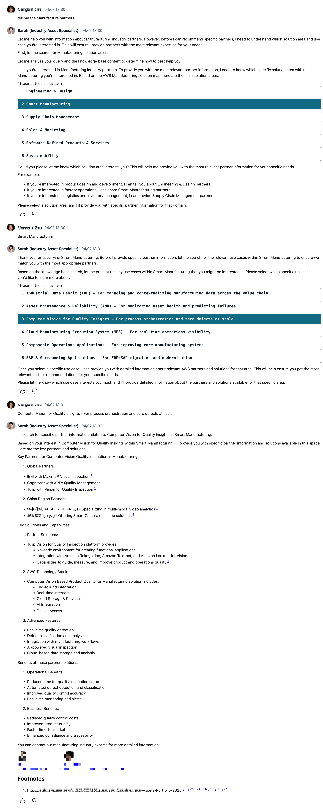

## Overview

In this article, I'll share my experience building an agentic chatbot on AWS using Amazon Bedrock, Amplify Gen2, and Amplify AI kit. This project, called Industry Assistant Portal, serves as an internal industry assistant that provides industry-specific AWS solutions guidance. The chatbot leverages Amazon Bedrock's powerful foundation models and knowledge base capabilities to deliver contextually relevant information about AWS industry solutions.

The journey of building this chatbot taught me valuable lessons about implementing agentic AI systems that can reason, plan, and execute complex tasks while maintaining context awareness. I'll cover the architecture, implementation details, challenges faced, and key learnings from this project.

## Architecture

The Portal is built with a modern tech stack:

- **Frontend**: Next.js 14 with Amplify UI React components (including AIConversation component)
- **Backend**: AWS Amplify Gen2 with GraphQL API
- **AI Services**: Amazon Bedrock (Claude Sonnet 3.5 v2 and Haiku 3.5)
- **Knowledge Base**: Amazon Bedrock Knowledge Base
- **Vector Search**: Amazon OpenSearch Serverless's vector search capabilities are used to retrieve relevant documents
- **Authentication**: Amazon Cognito


The architecture follows a serverless approach, with the frontend hosted on Amplify Hosting and the backend services managed through Amplify Gen2. The chatbot's intelligence comes from Amazon Bedrock's foundation models, particularly Claude Sonnet 3.5 v2, enhanced with a custom knowledge base containing industry-specific information.

## Key Components

### 1. Agentic Conversation Flow

The heart of the system is an agentic conversation flow that follows a structured approach to understanding and responding to user queries:

1. **Intention Validation**: Every user query is first analyzed to determine if it falls within the chatbot's domain of expertise (AWS solutions and guidance for specific industries).
2. **Sequential Intent Identification**: The chatbot follows a strict sequence to identify the industry, solution area, and specific use case the user is interested in.
3. **Knowledge Base Integration**: Relevant information is retrieved from the knowledge base to provide accurate and up-to-date responses.
4. **Response Generation**: The chatbot generates comprehensive responses with proper citations and relevant industry contacts.




This structured approach ensures that the chatbot provides relevant and accurate information while guiding users through a logical conversation flow.

### 2. Knowledge Base Integration

One of the most powerful features of the chatbot is its integration with Amazon Bedrock Knowledge Base. The knowledge base contains curated information about AWS industry solutions, best practices, and partner offerings.

The integration is implemented through a custom resolver that:

1. Accepts user queries as input
2. Performs vector search against the knowledge base
3. Applies filtering based on metadata (e.g., updated date, status)
4. Uses reranking to improve relevance of results
5. Returns the most relevant documents to inform the chatbot's responses


```javascript
export function request(ctx) {
  const { input } = ctx.args;
  const { KNOWLEDGE_BASE_ID, RERANK_MODEL_ARN } = ctx.env;

  return {
    resourcePath: `/knowledgebases/${KNOWLEDGE_BASE_ID}/retrieve`,
    method: "POST",
    params: {
      headers: {
        "Content-Type": "application/json",
      },
      body: JSON.stringify({
        retrievalQuery: {
          text: input,
        },
        retrievalConfiguration: {
          vectorSearchConfiguration: {
            numberOfResults: 30,
            filter: {
              orAll: [
                {
                  greaterThan: {
                    key: 'updated_date',
                    value: <relative date>,
                  },
                },
                {
                  equals: {
                    key: 'status',
                    value: <status>,
                  }
                }
              ]
            },
            rerankingConfiguration: {
              type: 'BEDROCK_RERANKING_MODEL',
              bedrockRerankingConfiguration: {
                modelConfiguration: {
                  modelArn: RERANK_MODEL_ARN,
                },
                numberOfRerankedResults: 10
              }
            }
          }
        },
      }),
    },
  };
}
```

This approach ensures that the chatbot has access to the most relevant and up-to-date information when responding to user queries.

### 3. User Interface

The chatbot's user interface is built using Next.js and Amplify UI React components (especially **\<AIConversation\>**), providing a clean and intuitive chat experience. Key features include:

- Markdown rendering with support for code blocks, tables, and lists
- Custom rendering for special content types (contacts, user choices) generated by LLM
- Message feedback mechanism for continuous improvement
- Responsive design for desktop and mobile devices

The UI is designed to handle various response formats, including:

- Text responses with proper formatting
- User choice prompts for guided conversations
- Contact information for industry experts
- Error messages with appropriate styling

## Implementation Highlights

### Amplify Gen2 Configuration

The project leverages Amplify Gen2's TypeScript-based configuration for defining backend resources. This approach provides type safety and better developer experience compared to traditional YAML or JSON configurations.

```typescript
export const schema = a.schema({
  knowledgeBase: CONFIG.knowledgeBaseId
    ? a
        .query()
        .arguments({
          input: a.string(),
        })
        .handler(
          a.handler.custom({
            dataSource: 'KnowledgeBaseDataSource',
            entry: './resolvers/kbResolver.js',
          })
        )
        .returns(a.string())
        .authorization((allow) => allow.authenticated())
    : a.customType({
        input: a.string(),
        kbId: a.string(),
      }),

  chat: a.conversation({
      aiModel: modelId,
      systemPrompt: `You are industry assistant, a highly skilled AWS Industry solutions expert...`,
      tools: [
        ...(CONFIG.knowledgeBaseId ? [
          a.ai.dataTool({
            name: 'searchDocumentation',
            description: `Performs a similarity search over the documentation...`,
            query: a.ref('knowledgeBase'),
          }),
        ] : []),
        a.ai.dataTool({
          name: 'intentionCheck',
          description: `Analyzes the user's intention...`,
          query: a.ref('chatIntention'),
        }),
      ],
      inferenceConfiguration: {
        maxTokens: 3600,
        temperature: 0.1,
        topP: 0.6,
      },
  }).authorization((allow) => allow.owner()),
});
```

This configuration defines the GraphQL schema, AI conversation resources, and authorization rules in a concise and maintainable way.

### Agentic Behavior with Function Calling

The chatbot's agentic behavior is implemented using Amazon Bedrock's function calling capabilities. Two main functions are defined:

1. **searchDocumentation**: Performs similarity search over the knowledge base to retrieve relevant information.
2. **intentionCheck**: Analyzes the user's intention to determine if it meets the criteria for appropriate responses.

These functions allow the chatbot to:

- Retrieve relevant information from the knowledge base
- Validate user queries against its domain of expertise
- Guide users through a structured conversation flow
- Provide accurate and contextually relevant responses

## Challenges and Solutions

### Challenge 1: Structured Conversation Flow

**Challenge**: Implementing a structured conversation flow that guides users through industry selection, solution area identification, and use case specification without feeling rigid or unnatural.

**Solution**: I designed a sequential intent identification framework that analyzes user queries at multiple levels:

1. First checking if the query relates to supported industries
2. Then identifying specific solution areas within that industry
3. Finally determining the specific use case the user is interested in

This approach allows the chatbot to maintain context while guiding users through a logical conversation flow. The implementation uses a combination of knowledge base retrieval and intent analysis to make this process feel natural.

### Challenge 2: Knowledge Base Integration

**Challenge**: Integrating the knowledge base effectively to provide accurate and relevant information while handling the limitations of retrieval-augmented generation.

**Solution**: The solution involved two key aspects:

1. **Data Preprocessing and Conversion**:
   - Converting various internal resources (PPT, PDF, HTML, etc.) into Markdown format for consistent processing
   - Implementing effective chunking strategies to ensure chunks aren't too large but contain sufficient context
   - Preserving document structure and relationships between sections during chunking
   - Adding metadata to chunks to enable effective filtering and retrieval

2. **Optimized Retrieval Implementation**:
   - Implementing a custom resolver that performs vector search with a relatively high number of results (30)
   - Applying metadata filtering to focus on recent or important documents
   - Using reranking to improve relevance of results
   - Returning a manageable number of reranked results (10)

3. **Knowledge Base Sync Workflow**:
   - Implementing a daily sync process to keep the knowledge base up-to-date
   - Monitoring ingestion jobs to ensure data quality
   - Publishing metrics to CloudWatch for observability

This comprehensive approach ensures that the chatbot has access to the most relevant and up-to-date information while avoiding context window limitations. The careful preprocessing of knowledge base data proved to be just as important as the retrieval mechanism itself, as it directly impacts the quality and relevance of the information available to the model.

### Challenge 3: Response Quality and Citations

**Challenge**: Ensuring response quality with proper citations while maintaining a natural conversation flow.

**Solution**: I implemented a comprehensive response formatting system that:

1. Structures responses in a natural conversation flow
2. Includes citations when providing answers based on knowledge base retrieval
3. Formats citations as footnotes with proper links
4. Includes a references section at the end of responses

This approach ensures that responses are both informative and trustworthy, with clear attribution to source materials.

## Key Learnings

### 1. The Power of Structured Prompting

One of the most important lessons from this project is the power of structured prompting. By designing a clear and logical framework for the chatbot's behavior, I was able to create a system that feels intelligent and helpful without going off-track.

The sequential intent identification framework ensures that the chatbot:

- Stays within its domain of expertise
- Guides users through a logical conversation flow
- Provides relevant and accurate information

This structured approach is essential for creating agentic AI systems that can handle complex tasks while maintaining context awareness.

### 2. Knowledge Base Design Matters

The design of the knowledge base significantly impacts the quality of the chatbot's responses. Key considerations include:

- **Document Chunking**: Finding the right balance between document size and context preservation
- **Metadata Enrichment**: Adding relevant metadata to enable effective filtering
- **Regular Updates**: Keeping the knowledge base up-to-date with the latest information
- **Quality Control**: Ensuring that the knowledge base contains accurate and relevant information

Investing time in knowledge base design pays dividends in the quality of the chatbot's responses.

### 3. User Experience Considerations

Creating a good user experience for an agentic chatbot involves more than just accurate responses. Important considerations include:

- **Response Formatting**: Using markdown, tables, and other formatting to improve readability
- **Guided Options**: Providing clear choices when users need to select from multiple options
- **Error Handling**: Gracefully handling errors and providing helpful guidance
- **Feedback Mechanisms**: Allowing users to provide feedback on responses for continuous improvement

These considerations help create a chatbot that feels helpful and intuitive to use.

## Future Improvements

While the current implementation is functional and useful, there are several areas for future improvement:

1. **Multi-modal Support**: Adding support for image and document upload to enable more complex interactions
2. **Personalization**: Tailoring responses based on user preferences and history
3. **Improved Analytics**: Implementing more comprehensive analytics to track usage patterns and identify areas for improvement
4. **Enhanced Knowledge Base**: Expanding the knowledge base with more industry-specific information and use cases
5. **Multi-language Support**: Adding support for multiple languages to serve a global audience

## Conclusion

Building an agentic chatbot on AWS using Amazon Bedrock and Amplify Gen2 has been a rewarding experience. The combination of powerful foundation models, knowledge base integration, and a well-designed conversation flow creates a system that can provide valuable industry-specific guidance.

The key to success lies in the structured approach to conversation design, effective knowledge base integration, and attention to user experience details. By following these principles, you can create agentic AI systems that are both powerful and user-friendly.

As AI technology continues to evolve, the possibilities for agentic chatbots will only expand. I'm excited to see how this field develops and how these systems can be further enhanced to provide even more value to users.

## Resources

- [Amazon Bedrock Documentation](https://docs.aws.amazon.com/bedrock/latest/userguide/what-is-bedrock.html)
- [Amplify Gen2 Documentation](https://docs.amplify.aws/gen2/)
- [Next.js Documentation](https://nextjs.org/docs)
- [Amplify UI React Documentation](https://ui.docs.amplify.aws/)
- [Amplify AI kit](https://docs.amplify.aws/react/ai/)
