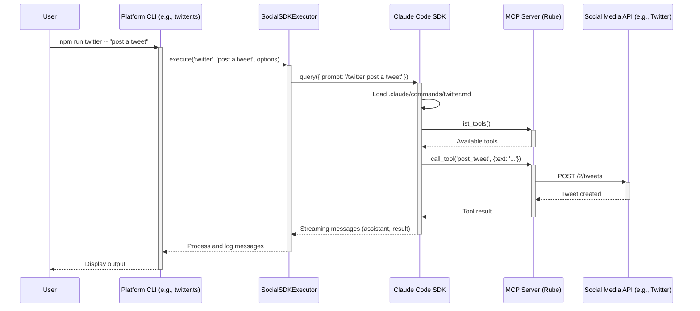

## Introduction

If you've been following the AI space, you know that "agents" are the next big thing. These autonomous, intelligent systems promise to revolutionize how we automate complex tasks. But building them can be a daunting undertaking, often involving a tangled web of conversation management, tool integration, and state tracking.

What if I told you there's a framework that handles the heavy lifting, letting you focus on your agent's unique logic? Enter **Claude Code**. It has evolved beyond a simple CLI tool into a powerful AI application framework for building sophisticated AI applications.

In this deep dive and Claude Code tutorial, I'll show you how to leverage Claude Code's SDK and infrastructure to create intelligent agents that can interact with external services, maintain conversations, and execute complex agentic workflows. This guide is based on the [social-agents](https://github.com/zxkane/social-agents) project, a real-world implementation that demonstrates Claude Code's capabilities for multi-platform social media automation. We'll explore the AI agent architecture, patterns, and best practices that make it an excellent choice for your AI agent development.

## What Makes Claude Code Special for Agent Development?

So what sets Claude Code apart from the crowd of AI frameworks? While many tools leave you wrestling with conversation state, tool integration, and response streaming, Claude Code delivers these as core, out-of-the-box features for building AI agents:

### 🧠 **Intelligent Conversation Management**
- Built-in session tracking and resumption for stateful workflows.
- Maintains context across multiple interactions.
- Automatically stores conversation history in a simple JSONL format.

### 🔧 **Seamless Tool Integration via MCP**
- Natively supports the [Model Context Protocol (MCP)](https://modelcontextprotocol.io/) for connecting to local or remote tools.
- Provides standardized tool discovery, execution, and permission management.

### ⚡ **Effortless Streaming Responses**
- Processes AI responses in real-time with progress tracking.
- Natively handles different message types (system, assistant, user, tool results).
- Comes with built-in error handling and recovery mechanisms.

### 🎯 **Intuitive Agent Customization**
- Define agent behaviors declaratively using simple Markdown files (`.claude/commands/*.md`).
- Easily customize system prompts and agent personalities.
- Provides a natural language interface for triggering complex operations.

## Architecture Overview

Let's examine how the `social-agents` project structures a multi-platform agent system. The architecture is designed for modularity and scalability.

```
social-agents/
├── src/
│   ├── social-sdk-executor.ts  # Core agent execution engine
│   ├── env-loader.ts           # Environment configuration
│   ├── logger.ts              # Structured logging
│   └── types.ts               # TypeScript definitions
├── .claude/
│   └── commands/
│       ├── twitter.md         # Twitter agent configuration
│       ├── reddit.md          # Reddit agent configuration
│       └── linkedin.md        # LinkedIn agent configuration
├── twitter.ts                 # Twitter command interface
├── reddit.ts                  # Reddit command interface
├── linkedin.ts                # LinkedIn command interface
├── .mcp.json                  # MCP server configuration
└── package.json               # Scripts and dependencies
```

This architecture demonstrates several key patterns for building agentic applications:

1.  **Generic Executor Pattern**: A single `SocialSDKExecutor` handles the core logic for all platforms.
2.  **Platform-Specific Commands**: Individual TypeScript files create dedicated command-line interfaces for each social media platform.
3.  **Declarative Agent Configuration**: Markdown files in the `.claude/commands/` directory define each agent's unique behavior, tools, and prompts.
4.  **Standardized MCP Integration**: External services are connected through a single, unified protocol.

Here’s a look at the interaction flow:



## Core Implementation: The Agent Executor

At the heart of our agent is the executor. This is the engine that drives the AI interaction, orchestrating everything from loading configurations to processing streaming responses. Let's break down how it works.

Here's a simplified version of the implementation:

```typescript
import { query, type SDKMessage, type McpServerConfig } from '@anthropic-ai/claude-code';

export class SocialSDKExecutor {
  static async execute(platform: string, prompt: string, options: SocialOptions): Promise<void> {
    // Load MCP server configuration
    const mcpServers = this.loadMCPServers();

    // Build the slash command with platform and options
    const slashCommand = `/${platform} ${prompt} ${options.dryRun ? '--dry-run' : ''}`.trim();

    // Execute the command using the Claude Code SDK
    const response = query({
      prompt: slashCommand,
      options: {
        mcpServers: mcpServers,
        cwd: process.cwd(),
        ...(options.resume && { resume: options.resume })
      }
    });

    // Process the streaming responses
    for await (const message of response) {
      await this.processMessage(message, options.verbose);
    }
  }

  private static async processMessage(message: SDKMessage, verbose: boolean): Promise<void> {
    switch (message.type) {
      case 'assistant':
        // Handle AI responses
        console.log(message.message.content);
        break;
      case 'result':
        // Handle execution results
        if (message.subtype === 'success') {
          console.log('Operation completed successfully!');
        }
        break;
      case 'system':
        // Handle system messages (e.g., model info, MCP status)
        if (verbose) {
          console.log(`System: ${message.model}`);
        }
        break;
    }
  }
}
```

## Slash Command Configuration

The real power of this framework comes from configuring agent behaviors through simple Markdown files. These "slash commands" are the brains of the operation, defining what an agent *is* and what it *can do*.

Here’s how the Twitter agent is defined in `.claude/commands/twitter.md`:

```markdown
---
allowed-tools: mcp__rube__RUBE_SEARCH_TOOLS, mcp__rube__RUBE_MULTI_EXECUTE_TOOL, mcp__rube__RUBE_CREATE_PLAN
description: Twitter/X engagement and content creation specialist
argument-hint: [natural language request] [--dry-run] [--verbose]
---

You are an expert Twitter operations specialist with comprehensive AI-driven capabilities.

AVAILABLE OPERATIONS (when RUBE tools are accessible):
• Generate viral tweets, threads, and engaging content
• Search and analyze Twitter posts, trends, and conversations
• Engage with tweets through likes, retweets, and replies
• Monitor topics, hashtags, and mentions for social listening
• Analyze sentiment, engagement metrics, and performance data

EXECUTION APPROACH:
1. Try to use RUBE_SEARCH_TOOLS to discover available Twitter tools.
2. If permission is needed, explain the requirement clearly.
3. Execute operations using RUBE_MULTI_EXECUTE_TOOL.
4. Provide detailed results, insights, and recommendations.

Execute the following Twitter operation: $ARGUMENTS
```

This configuration file tells Claude Code:
- **Tools**: Which MCP tools the agent is permitted to use.
- **Persona**: The agent's designated role and capabilities.
- **Logic**: How to handle different scenarios, such as permissions or failures.
- **Task**: The specific operation to execute, passing in the user's arguments.

## MCP Integration for External Services

The Model Context Protocol (MCP) enables seamless integration with external services. Instead of writing custom API clients for every service, you just point to an MCP server. The configuration is straightforward in `.mcp.json`:

```json
{
  "mcpServers": {
    "rube": {
      "type": "http",
      "url": "https://rube.app/mcp",
      "headers": {
        "Authorization": "Bearer ${RUBE_API_TOKEN}"
      }
    }
  }
}
```

In this project, we connect to [RUBE](https://rube.app/), an MCP server that provides a massive library of pre-built tool integrations. This instantly gives our agent access to:
- Twitter/X API operations
- Reddit API integration
- LinkedIn automation
- **Over 500 other applications**
- A unified way to discover and execute tools.

## Platform-Specific Command Interfaces

To make the agents easy to use from the command line, each platform gets its own wrapper script. This provides a clean, dedicated entry point for each agent.

```typescript
// twitter.ts
import { SocialSDKExecutor, type SocialOptions } from './src/social-sdk-executor.js';

async function main() {
  const args = process.argv.slice(2);

  // Parse command-line options
  const options: SocialOptions = {
    dryRun: args.includes('--dry-run'),
    verbose: args.includes('--verbose'),
    resume: extractResumeId(args)
  };

  // Extract the natural language prompt
  const prompt = args
    .filter(arg => !arg.startsWith('--'))
    .join(' ');

  // Execute with the generic executor, specifying the 'twitter' platform
  await SocialSDKExecutor.execute('twitter', prompt, options);
}

main().catch(console.error);
```

This approach provides:
- **A Consistent Interface**: The same patterns are used across all platforms.
- **Platform Flexibility**: It's easy to add new platforms by creating a new command file.
- **Command-Line Integration**: It uses standard Unix-style flags and arguments.
- **Type Safety**: It offers full TypeScript support with proper error handling.

## Session Management and Conversation Continuity

One of the most frustrating parts of building chatbots is managing conversation history. Claude Code turns this into a superpower with its built-in session management. You don't have to do anything; it just works.

```bash
# Start a new conversation
npm run twitter -- "create viral content about TypeScript"
# Output: 📌 Session ID: 77552924-a31c-4c1a-a07c-990855aa95a3

# Resume and continue the conversation
npm run twitter -- "now create a follow-up thread" --resume 77552924-a31c-4c1a-a07c-990855aa95a3

# Keep iterating within the same context
npm run twitter -- "make it more technical" --resume 77552924-a31c-4c1a-a07c-990855aa95a3
```

Sessions are automatically stored locally in `~/.claude/projects/` as JSONL transcripts, enabling:
- **Stateful Workflows**: Maintain context across multiple interactions.
- **Conversation History**: Review previous exchanges and decisions.
- **Debugging**: Trace the execution flow to identify issues.
- **Collaboration**: Share session IDs with team members to pick up where you left off.

## Error Handling and Fallback Strategies

Robust agent applications require comprehensive error handling. The `social-agents` project demonstrates several useful patterns for building resilient agents.

### Permission Management
The agent can detect when it needs permissions for a tool and inform the user.
```typescript
// Handle MCP tool permission requirements
if (!toolsAccessible) {
  logger.info('🔑 Permission Required for RUBE MCP Server');
  logger.info('Please grant permission when prompted to enable operations.');
  return;
}
```

### Graceful Degradation
If a tool fails or isn't available, the agent can fall back to a different mode of operation, such as providing strategic advice instead of executing a task.
```typescript
// Provide strategic guidance when tools aren't available
if (message.type === 'result' && message.subtype === 'error') {
  logger.warning('Tools not accessible - providing strategic guidance instead.');
  // Continue with educational/planning mode
}
```

## Advanced Patterns and Best Practices

As you build more complex agents, you'll find these patterns from the `social-agents` project invaluable.

### Prioritized Environment Configuration
The project uses a sophisticated system for loading environment variables, ensuring that local overrides are respected while maintaining sensible defaults.

```typescript
export function loadEnvironment(): EnvironmentConfig {
  // Priority: .env.local → system environment variables
  const localEnvPath = path.join(process.cwd(), '.env.local');

  // Load and merge configurations
  const env = {
    ...process.env,
    ...loadEnvFile(localEnvPath) // .env.local has the highest priority
  };

  return validateEnvironment(env);
}
```

### Streaming Response Processing
Handle different message types as they arrive to provide a rich, real-time user experience.

```typescript
for await (const message of response) {
  switch (message.type) {
    case 'assistant':
      // Stream AI responses in real-time
      process.stdout.write(message.message.content);
      break;
    case 'system':
      // Capture session IDs and server status
      if (message.session_id) {
        sessionId = message.session_id;
      }
      break;
    case 'result':
      // Handle final outcomes of tool executions
      displayResults(message);
      break;
  }
}
```

### Type Safety with Zod Validation
Ensure runtime type safety for configurations and options using [Zod](https://zod.dev/).

```typescript
import { z } from 'zod';

const SocialOptionsSchema = z.object({
  dryRun: z.boolean(),
  verbose: z.boolean(),
  resume: z.string().optional()
});

export type SocialOptions = z.infer<typeof SocialOptionsSchema>;
```

## Building Your Own Agent Application

Ready to build your own autonomous agent? Here's a quick-start guide to get you up and running in minutes.

### 1. Project Setup
```bash
npm init -y
npm install @anthropic-ai/claude-code tsx typescript @types/node
```

### 2. Create the Core Executor
Create a generic executor to handle the agent's core logic.
```typescript
// src/agent-executor.ts
import { query } from '@anthropic-ai/claude-code';

export class AgentExecutor {
  static async execute(agentType: string, prompt: string, options: AgentOptions) {
    const response = query({
      prompt: `/${agentType} ${prompt}`,
      options: {
        mcpServers: await this.loadMCPServers(),
        cwd: process.cwd()
      }
    });

    for await (const message of response) {
      // Your message processing logic here
    }
  }
}
```

### 3. Configure Agent Behaviors
Create a file at `.claude/commands/my-agent.md` to define your agent's persona and tools.

```markdown
---
allowed-tools: your_mcp_tools_here
description: A short description of your agent
---

You are an expert assistant for [your domain].

Execute the following operation: $ARGUMENTS
```

### 4. Create the Command Interface
Create a simple command-line entry point for your agent.
```typescript
// my-agent.ts
import { AgentExecutor } from './src/agent-executor.js';

async function main() {
  const args = process.argv.slice(2);
  const prompt = args.join(' ');

  await AgentExecutor.execute('my-agent', prompt, {
    dryRun: args.includes('--dry-run'),
    verbose: args.includes('--verbose')
  });
}

main().catch(console.error);
```

### 5. Configure MCP Servers
Create a `.mcp.json` file to connect to your tools.

```json
{
  "mcpServers": {
    "your-service": {
      "type": "http",
      "url": "https://your-mcp-server.com",
      "headers": {
        "Authorization": "Bearer ${YOUR_API_TOKEN}"
      }
    }
  }
}
```

## Conclusion

Claude Code represents a significant step forward in AI application development. By providing built-in conversation management, MCP integration, and streaming responses, it eliminates much of the boilerplate that traditionally plagued agent development.

The `social-agents` project demonstrates how these capabilities enable sophisticated, multi-platform automation with surprisingly little code. The slash command architecture makes agents configurable and maintainable, while the generic executor pattern ensures consistency across different domains.

Key takeaways for your own agent applications:

1.  **Start with the Executor Pattern**: Build a generic executor that can handle multiple agent types.
2.  **Use Slash Commands**: Configure agent behaviors through `.claude/commands/*.md` files.
3.  **Embrace MCP Integration**: Connect to external services through standardized protocols.
4.  **Implement Session Management**: Support conversation continuity and stateful workflows.
5.  **Plan for Fallbacks**: Handle permissions, errors, and degraded functionality gracefully.
6.  **Test with Dry Run**: Build safe testing into every operation.

Whether you're building social media automation, customer service bots, or complex workflow orchestration, Claude Code provides the foundation for sophisticated agentic applications. The patterns from the `social-agents` project offer a proven template for scaling AI automation across multiple domains and platforms.

The future of AI application development is agentic, and Claude Code gives you the tools to build it today. I encourage you to clone the `social-agents` repository, experiment with the patterns, and start building your own intelligent agents.

## Resources

- [Social Agents Repository](https://github.com/zxkane/social-agents) - Complete implementation example
- [Claude Code SDK Documentation](https://docs.claude.com/en/docs/claude-code/sdk/sdk-overview) - Official documentation and guides
- [RUBE MCP Server](https://rube.app/) - 500+ app integrations for your agents
- [Model Context Protocol](https://modelcontextprotocol.io/) - Learn about MCP standards

---

*Have you built agentic applications with Claude Code? Share your experiences and patterns in the comments below!*
