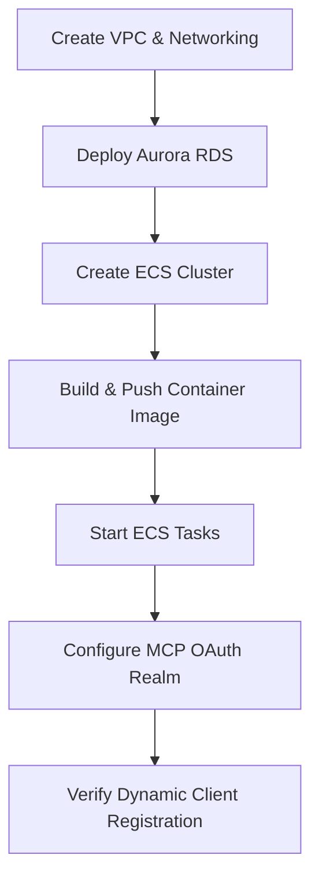
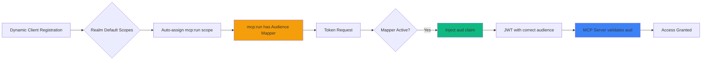

## Introduction

The Model Context Protocol (MCP) ecosystem mandates OAuth 2.1-compliant authorization servers to facilitate secure, federated access to AI model services. MCP clients, such as Claude Code, Cursor, and VS Code extensions, rely on modern OAuth specifications including Dynamic Client Registration (RFC 7591), PKCE (RFC 7636), and crucially, Resource Indicators (RFC 8707) for audience-restricted tokens.

However, most Identity-as-a-Service (IDaaS) providers, including the open-source Keycloak platform, currently lack full RFC 8707 support. Keycloak, while robust in OAuth 2.0 capabilities, employs a proprietary `audience` parameter in contrast to the standardized `resource` parameter defined in RFC 8707. For a comprehensive analysis of this compatibility landscape, refer to my previous post: [Technical Deconstruction of MCP Authorization: A Deep Dive into OAuth 2.1 and IETF RFC Specifications][mcp-oauth-deep-dive].

This article provides a detailed guide on **configuring Keycloak as an MCP-compatible authorization server** through strategic use of protocol mappers and realm configuration. The implemented solution encompasses:

-   **RFC 8707 Workaround**: Custom audience protocol mappers to inject correct `aud` claims into JWT tokens.
-   **Dynamic Client Registration**: Automated client onboarding via realm default scopes.
-   **Zero-Configuration MCP Support**: Automatic audience restriction without manual client configuration.
-   **Infrastructure Automation**: Terraform deployment on AWS utilizing ECS Fargate and Aurora PostgreSQL.

Upon completion of this guide, you will possess a clear understanding of how to configure Keycloak for seamless MCP client support, enabling dynamic client registration with automated audience restriction.

## Architecture Overview

This deployment leverages AWS managed services to establish a scalable Keycloak infrastructure tailored for MCP OAuth workflows.

### Core Components

**Compute Layer (ECS Fargate)**

Keycloak operates as containerized workloads on AWS Fargate, offering managed compute capacity:

-   **Custom Docker Image**: Built from the official Keycloak 26.4.4 release, pre-configured with JDBC_PING for clustering.
-   **Multi-AZ Deployment**: Tasks are strategically distributed across multiple Availability Zones for resilience.
-   **Health Monitoring**: Integrated with AWS CloudWatch Container Insights for robust performance and health visibility.

**Database Layer (Aurora PostgreSQL)**

Amazon Aurora provides a highly available, scalable PostgreSQL-compatible database backend:

-   **Database Engine**: PostgreSQL 16 (Keycloak 26.4.4 requires PostgreSQL 13+ minimum, 16.8 recommended).
-   **Scalability**: Aurora Serverless v2, featuring configurable capacity and auto-scaling.
-   **High Availability**: Multi-AZ deployment with automatic failover mechanisms.
-   **Security**: Data encryption at rest and automated backup procedures.

**Load Balancing (Application Load Balancer)**

The Application Load Balancer (ALB) manages TLS termination and intelligent traffic distribution:

-   **HTTPS/TLS**: Certificate management handled by AWS Certificate Manager (ACM).
-   **Health Checks**: Continuously monitors Keycloak health endpoints to ensure service availability.
-   **Session Affinity**: Supports sticky sessions for maintaining stateful client connections.

**Networking Infrastructure**

A Virtual Private Cloud (VPC) provides a logically isolated network environment:

-   **Subnets**: Public and private subnets distributed across multiple Availability Zones.
-   **NAT Gateways**: Enable secure outbound internet access for resources within private subnets.
-   **VPC Endpoints**: Facilitate private connectivity to select AWS services.
-   **Security Groups**: Enforce granular network access controls.

### Deployment Workflow

The infrastructure deployment adheres to a phased approach:



This structured methodology ensures that foundational infrastructure is provisioned prior to implementing MCP-specific Keycloak configurations.

## Understanding Keycloak's RFC 8707 Gap

To comprehend the necessity of custom configuration in this deployment, we must analyze the incompatibility between Keycloak's audience implementation and the MCP specification's requirements.

### The RFC 8707 Standard

[RFC 8707 (Resource Indicators for OAuth 2.0)][rfc-8707] specifies a standardized mechanism for audience restriction within OAuth access tokens. This specification introduces a `resource` parameter, which clients include in both authorization and token requests:

```http
POST /token HTTP/1.1
Host: auth.example.com
Content-Type: application/x-www-form-urlencoded

grant_type=authorization_code
&code=ABC123
&redirect_uri=https://client.example.com/callback
&resource=https://api.example.com    ← Target audience
&client_id=CLIENT_ID
```

The Authorization Server (AS) utilizes this `resource` parameter to populate the JWT's `aud` (audience) claim, thereby ensuring the token's validity is restricted to the specified Resource Server (RS).

### Keycloak's Proprietary Approach

Keycloak's audience functionality was implemented **prior to the publication of RFC 8707** in February 2020. As detailed in the [MCP authorization compatibility matrix][mcp-oauth-compatibility-matrix], Keycloak employs a proprietary `audience` parameter that predates the standardized approach.

**The Problem**: MCP clients (e.g., Claude Code, Cursor, VS Code extensions) adhere to RFC 8707 and transmit the `resource` parameter. Keycloak, however, disregards this parameter, resulting in JWT tokens that either lack the mandatory `aud` claim or contain incorrect audience values.

**The Consequence**: MCP servers validate the `aud` claim to mitigate token replay attacks, addressing the "Confused Deputy" problem. Without proper audience restriction, tokens risk rejection or potential misuse across disparate resource servers.

### The Workaround Architecture

The proposed solution strategically leverages Keycloak's Protocol Mappers to automatically inject the correct `aud` claim, circumventing the absence of native RFC 8707 support. This architecture integrates three key components:



**Component 1: Audience Protocol Mapper**

A hardcoded claim mapper, associated with the `mcp:run` client scope, injects the MCP server's URL into the `aud` claim:

```hcl
resource "keycloak_openid_hardcoded_claim_protocol_mapper" "mcp_run_audience_mapper" {
  realm_id        = keycloak_realm.mcp.id
  client_scope_id = keycloak_openid_client_scope.mcp_run.id
  name            = "mcp-audience"

  claim_name       = "aud"
  claim_value      = var.resource_server_uri  # e.g., "https://mcp-server.example.com/mcp"
  claim_value_type = "String"

  add_to_id_token     = false
  add_to_access_token = true   # ← Critical: Only in access tokens
  add_to_userinfo     = false
}
```

**Component 2: Realm Default Scopes**

By configuring `mcp:run` as a realm-wide default scope, all clients, including those registered via Dynamic Client Registration, automatically inherit this audience mapper:

```hcl
resource "keycloak_realm_default_client_scopes" "mcp_realm_defaults" {
  realm_id = keycloak_realm.mcp.id

  default_scopes = [
    "profile",
    "email",
    "mcp:run",    # ← Critical: Auto-assigned to DCR clients
    "roles",
    "web-origins",
    "acr",
    "basic",
  ]
}
```

**Component 3: DCR Allowed Scopes Configuration**

Client Registration Policies are configured to permit `mcp:run` within the allowed scopes for dynamically registered clients. This step is performed using the Keycloak Admin REST API due to current Terraform provider limitations:

```bash
# Extract Client Registration Policy component ID
COMPONENT_ID=$(curl -s "${KEYCLOAK_URL}/admin/realms/mcp/components" \
  -H "Authorization: Bearer ${ADMIN_TOKEN}" | \
  jq -r '.[] | select(.name=="Allowed Client Scopes") | .id')

# Update allowed scopes to include mcp:run
curl -X PUT "${KEYCLOAK_URL}/admin/realms/mcp/components/${COMPONENT_ID}" \
  -H "Authorization: Bearer ${ADMIN_TOKEN}" \
  -H "Content-Type: application/json" \
  -d '{
    "config": {
      "allow-default-scopes": ["true"],
      "allowed-client-scopes": ["openid", "profile", "email", "mcp:run"]
    }
  }'
```

### Complete Flow of Operations

When an MCP client (e.g., Claude Code) attempts to access a protected MCP server:

1.  **Discovery**: The client retrieves the MCP server's metadata (RFC 9728) to identify the required Authorization Server.
2.  **Registration**: The client dynamically registers with Keycloak via a POST request to `/clients-registrations/openid-connect`.
3.  **Automatic Scope Inheritance**: Keycloak automatically assigns the `mcp:run` scope (due to realm default configuration) to the newly registered client.
4.  **Authorization Flow**: The client initiates the OAuth Authorization Code flow, incorporating PKCE.
5.  **Token Issuance**: Keycloak generates a JWT access token, and the audience mapper injects the `aud: "https://mcp-server.example.com/mcp"` claim.
6.  **Validation**: The MCP server validates the `aud` claim against its own identifier and grants access to the MCP resources.

**Result**: The MCP client achieves full functionality without requiring any manual configuration within the Keycloak administrative console. This pattern of realm default scopes combined with an audience mapper establishes fully automated MCP compatibility.

## MCP OAuth 2.1 Configuration Deep Dive

This section details the Terraform configurations that transform a standard Keycloak deployment into an MCP-compliant authorization server.

### RFC Compliance Matrix

The implementation ensures OAuth 2.1 compatibility through selective RFC adoption:

| RFC | Specification | Implementation Status | Notes |
|-----|--------------|----------------------|-------|
| **RFC 7591** | Dynamic Client Registration | ✅ **Complete** | Anonymous DCR enabled for zero-configuration clients |
| **RFC 7636** | PKCE (Proof Key for Code Exchange) | ✅ **Complete** | S256 challenge method mandatory for all clients |
| **RFC 8414** | Authorization Server Metadata | ✅ **Complete** | OIDC discovery at `/.well-known/openid-configuration` |
| **RFC 8707** | Resource Indicators | ✅ **Complete** | Via audience mapper workaround (native support in development) |
| **RFC 9728** | Protected Resource Metadata | ⚠️ **MCP Server-dependent** | Implemented by MCP servers, not the AS |

### Realm Configuration

The MCP realm (`mcp-realm.tf`) is meticulously configured to establish security policies and token lifespans, optimized for AI model access patterns:

```hcl
resource "keycloak_realm" "mcp" {
  realm   = "mcp"
  enabled = true

  display_name      = "MCP Authorization Server"
  display_name_html = "<b>Model Context Protocol</b>"

  # Token lifespans - optimized for MCP sessions
  access_token_lifespan           = "1h"      # Longer for AI workflows
  sso_session_idle_timeout        = "30m"
  sso_session_max_lifespan        = "10h"
  offline_session_idle_timeout    = "720h"    # 30 days

  # Security policies
  ssl_required = "external"  # Require HTTPS for external connections

  password_policy = "length(12) and upperCase(1) and lowerCase(1) and digits(1) and specialChars(1)"

  security_defenses {
    headers {
      x_frame_options                 = "DENY"
      content_security_policy         = "frame-src 'self'; frame-ancestors 'self'; object-src 'none';"
      content_security_policy_report_only = ""
      x_content_type_options          = "nosniff"
      x_robots_tag                    = "none"
      x_xss_protection                = "1; mode=block"
      strict_transport_security       = "max-age=31536000; includeSubDomains"
    }

    brute_force_detection {
      permanent_lockout              = false
      max_login_failures             = 5
      wait_increment_seconds         = 60
      quick_login_check_milli_seconds = 1000
      minimum_quick_login_wait_seconds = 60
      max_failure_wait_seconds       = 900
      failure_reset_time_seconds     = 900
    }
  }
}
```

### Client Scopes and Audience Mapper

The `mcp:run` client scope (`mcp-scopes.tf`) forms the core of the workaround, intelligently combining scope definition with the critical audience mapper:

```hcl
# Define the mcp:run client scope
resource "keycloak_openid_client_scope" "mcp_run" {
  realm_id               = keycloak_realm.mcp.id
  name                   = "mcp:run"
  description            = "Scope for MCP model execution with audience restriction"
  consent_screen_text    = "Access MCP model servers"
  include_in_token_scope = true
}

# Attach the audience mapper to mcp:run scope
resource "keycloak_openid_hardcoded_claim_protocol_mapper" "mcp_run_audience_mapper" {
  realm_id        = keycloak_realm.mcp.id
  client_scope_id = keycloak_openid_client_scope.mcp_run.id
  name            = "mcp-audience"

  claim_name       = "aud"
  claim_value      = var.resource_server_uri
  claim_value_type = "String"

  add_to_id_token     = false
  add_to_access_token = true
  add_to_userinfo     = false
}

# Make mcp:run a default scope for all clients
resource "keycloak_realm_default_client_scopes" "mcp_realm_defaults" {
  realm_id = keycloak_realm.mcp.id

  default_scopes = [
    "profile",
    "email",
    keycloak_openid_client_scope.mcp_run.name,  # ← Critical
    "roles",
    "web-origins",
    "acr",
    "basic",
  ]
}
```

**Key Design Decision**: The mapper specifically configures `add_to_access_token = true` and `add_to_id_token = false`. This intentional design ensures the `aud` claim is present in the access token (for resource server validation) but excluded from the ID token (consumed by the client for user information).

### Two-Phase Deployment Pattern

The Keycloak Terraform Provider currently exhibits a limitation: it cannot directly manage Client Registration Policies, which govern DCR behavior. This necessitates a hybrid deployment approach:

**Phase 1: Terraform Resources** (`terraform apply`)

This phase declaratively provisions the infrastructure:
-   Realm with defined security policies
-   Client scopes with embedded protocol mappers
-   Realm default scopes
-   Optional example clients

**Phase 2: REST API Configuration** (Bash scripts)

This phase configures imperative settings using the Keycloak Admin REST API:

1.  **`fix-allowed-scopes.sh`**: Modifies the Client Registration Policy to include `mcp:run` in the allowed scopes list.
2.  **`disable-trusted-hosts.sh`**: Removes the Trusted Hosts policy to accommodate custom redirect URI schemes (e.g., `cursor://`, `vscode://`, `claude://`).
3.  **`enable-dcr.sh`**: Verifies Dynamic Client Registration functionality and confirms proper scope inheritance.

The integrated `deploy.sh` orchestrator automates the execution of both phases:

```bash
#!/bin/bash
set -e

echo "Phase 1: Terraform deployment..."
terraform init
terraform apply -auto-approve

echo "Phase 2: REST API configuration..."
./fix-allowed-scopes.sh
./disable-trusted-hosts.sh

echo "Verification: Testing DCR..."
./enable-dcr.sh

echo "Deployment complete! MCP OAuth 2.1 realm ready."
```

### Trusted Hosts Policy Removal

MCP clients frequently employ non-standard redirect URI schemes that Keycloak's default policies typically reject. The solution involves completely removing the Trusted Hosts policy component:

```bash
# Find the Trusted Hosts policy component
TRUSTED_HOSTS_ID=$(curl -s "${KEYCLOAK_URL}/admin/realms/mcp/components" \
  -H "Authorization: Bearer ${ADMIN_TOKEN}" | \
  jq -r '.[] | select(.name=="Trusted Hosts") | .id')

# Delete it entirely
curl -X DELETE "${KEYCLOAK_URL}/admin/realms/mcp/components/${TRUSTED_HOSTS_ID}" \
  -H "Authorization: Bearer ${ADMIN_TOKEN}"
```

**Security Consideration**: This action allows all redirect URI schemes, including `http://localhost:*` for development purposes. For production deployments safeguarding sensitive data, it is recommended to implement a custom policy that explicitly whitelists only approved schemes such as `https://`, `cursor://`, `vscode://`, and `claude://`.

## Infrastructure Components

Beyond the OAuth configuration, several AWS infrastructure components provide essential support for the deployment.

### JDBC_PING Clustering for ECS Fargate

Keycloak's native clustering mechanism, JGroups, typically relies on UDP multicast for node discovery. However, AWS VPCs do not support multicast, and ECS Fargate instances lack static IP addresses. The adopted solution is **JDBC_PING**, which utilizes the PostgreSQL database as a robust coordination mechanism.

**How JDBC_PING Functions**:

1.  Each Keycloak container registers its IP address and port within the `JGROUPSPING` table in PostgreSQL.
2.  Containers periodically query this table to discover active cluster members.
3.  Session data is replicated across the discovered cluster members.
4.  Upon container termination, its corresponding entry is gracefully removed from the table.

**Configuration** (`cache-ispn-jdbc-ping.xml`):

```xml
<config xmlns="urn:org:jgroups"
        xmlns:xsi="http://www.w3.org/2001/XMLSchema-instance"
        xsi:schemaLocation="urn:org:jgroups http://www.jgroups.org/schema/jgroups-4.2.xsd">
    <TCP bind_addr="${jgroups.bind.address,jgroups.tcp.address:SITE_LOCAL}"
         bind_port="${jgroups.bind.port,jgroups.tcp.port:7800}"
         recv_buf_size="5m"
         send_buf_size="1m"
         max_bundle_size="64k"/>

    <JDBC_PING
        connection_driver="org.postgresql.Driver"
        connection_url="${env.KC_DB_URL}"
        connection_username="${env.KC_DB_USERNAME}"
        connection_password="${env.KC_DB_PASSWORD}"
        initialize_sql="CREATE TABLE IF NOT EXISTS JGROUPSPING (
            own_addr VARCHAR(200) NOT NULL,
            cluster_name VARCHAR(200) NOT NULL,
            ping_data BYTEA,
            constraint PK_JGROUPSPING PRIMARY KEY (own_addr, cluster_name)
        );"
        info_writer_sleep_time="500"
        remove_all_data_on_view_change="true"
        stack.combine="REPLACE"
        stack.position="MPING"/>

    <MERGE3 min_interval="10000" max_interval="30000"/>
    <FD_SOCK/>
    <FD_ALL timeout="60000" interval="15000"/>
    <VERIFY_SUSPECT timeout="5000"/>
    <pbcast.NAKACK2 use_mcast_xmit="false" xmit_interval="1000"/>
    <UNICAST3 xmit_interval="500"/>
    <pbcast.STABLE desired_avg_gossip="50000" max_bytes="8m"/>
    <pbcast.GMS print_local_addr="true" join_timeout="2000"/>
    <UFC max_credits="2m" min_threshold="0.4"/>
    <MFC max_credits="2m" min_threshold="0.4"/>
    <FRAG2 frag_size="60k"/>
</config>
```

**Keycloak Container Configuration**:

The `Dockerfile` integrates this configuration during the build process:

```dockerfile
FROM quay.io/keycloak/keycloak:26.4.4 as builder

ENV KC_HEALTH_ENABLED=true
ENV KC_METRICS_ENABLED=true
ENV KC_HTTP_RELATIVE_PATH=/auth
ENV KC_DB=postgres

# Copy JDBC_PING configuration
COPY ./cache-ispn-jdbc-ping.xml /opt/keycloak/conf/cache-ispn-jdbc-ping.xml

# Build optimized image
RUN /opt/keycloak/bin/kc.sh build --cache-config-file=cache-ispn-jdbc-ping.xml

FROM quay.io/keycloak/keycloak:26.4.4
COPY --from=builder /opt/keycloak /opt/keycloak

EXPOSE 7800  # JDBC_PING coordination port
ENTRYPOINT ["/opt/keycloak/bin/kc.sh"]
```

**ECS Task Definition**:

The ECS task definition exposes port 7800 to facilitate cluster communication:

```json
{
  "containerDefinitions": [{
    "name": "keycloak",
    "image": "${ecr_repository_url}:${image_tag}",
    "portMappings": [
      {
        "containerPort": 8080,
        "protocol": "tcp"
      },
      {
        "containerPort": 7800,
        "protocol": "tcp"
      }
    ],
    "environment": [
      {"name": "KC_DB", "value": "postgres"},
      {"name": "KC_DB_URL", "value": "jdbc:postgresql://..."},
      {"name": "KC_PROXY_HEADERS", "value": "xforwarded"},
      {"name": "KC_CACHE_CONFIG_FILE", "value": "cache-ispn-jdbc-ping.xml"}
    ],
    "secrets": [
      {"name": "KC_DB_PASSWORD", "valueFrom": "arn:aws:ssm:..."},
      {"name": "KEYCLOAK_ADMIN_PASSWORD", "valueFrom": "arn:aws:ssm:..."}
    ],
    "healthCheck": {
      "command": ["CMD-SHELL", "curl -f http://localhost:8080/auth/health || exit 1"],
      "interval": 30,
      "timeout": 5,
      "retries": 3
    }
  }]
}
```

**Result**: ECS can dynamically scale tasks up or down. New containers automatically join the cluster, and terminated containers are gracefully removed, ensuring session data persistence across container restarts.

### Aurora Serverless v2 Configuration

Aurora Serverless v2 offers a PostgreSQL-compatible database with sub-second scaling and granular pay-per-second billing:

```hcl
module "aurora_postgresql" {
  source  = "terraform-aws-modules/rds-aurora/aws"
  version = "~> 8.0"

  name           = "keycloak-db"
  engine         = "aurora-postgresql"
  engine_version = "16.8"
  instance_class = "db.serverless"
  instances = {
    one = {}
    two = {}  # Multi-AZ for high availability
  }

  serverlessv2_scaling_configuration = {
    min_capacity = 0.5  # 1 GB RAM - minimal idle cost
    max_capacity = 2    # 4 GB RAM - handles production traffic
  }

  vpc_id               = module.vpc.vpc_id
  db_subnet_group_name = aws_db_subnet_group.aurora.name
  security_group_rules = {
    keycloak_ingress = {
      source_security_group_id = aws_security_group.keycloak_ecs.id
    }
  }

  storage_encrypted = true
  apply_immediately = true

  backup_retention_period = 7
  preferred_backup_window = "03:00-04:00"

  database_name   = "keycloak"
  master_username = "keycloak"
}
```

**Scaling Behavior**: Aurora Serverless v2 actively monitors database load (CPU, connections, memory) and adjusts ACU capacity in sub-second increments. Typical Keycloak workload scaling ranges are:

-   **Idle/Development**: 0.5 ACU (approximately $0.12/hour)
-   **Normal Production**: 1-1.5 ACU (approximately $0.24/hour)
-   **High Load (authentication storms)**: 1.5-2 ACU (approximately $0.36/hour)

### ECS Service Configuration

The ECS service is responsible for managing task placement and continuous health monitoring:

```hcl
resource "aws_ecs_service" "keycloak" {
  name            = "keycloak"
  cluster         = aws_ecs_cluster.main.id
  task_definition = aws_ecs_task_definition.keycloak.arn
  desired_count   = var.desired_count  # 2 for HA

  launch_type = "FARGATE"
  platform_version = "LATEST"

  deployment_maximum_percent         = 200  # Allow 2x capacity during updates
  deployment_minimum_healthy_percent = 100  # Always maintain full capacity
  health_check_grace_period_seconds  = 600  # Allow time for Keycloak startup

  network_configuration {
    subnets         = module.vpc.private_subnets
    security_groups = [aws_security_group.keycloak_ecs.id]
  }

  load_balancer {
    target_group_arn = aws_lb_target_group.keycloak.arn
    container_name   = "keycloak"
    container_port   = 8080
  }

  depends_on = [aws_lb_listener.https]
}
```

**Deployment Strategy**: This configuration ensures zero-downtime updates through the following sequence:

1.  New tasks are initiated, temporarily increasing capacity to 200%.
2.  New tasks successfully pass health checks (Keycloak startup is allotted 600 seconds).
3.  Traffic is progressively diverted to the new tasks.
4.  Old tasks are gracefully drained and terminated.
5.  The system returns to its stable state of 100% capacity (2 tasks).

## Deployment Walkthrough

This section provides a comprehensive, step-by-step guide for deploying the Keycloak infrastructure.

### Prerequisites

**Local Tools**:
-   Terraform >= 1.0
-   AWS CLI v2, configured with appropriate credentials
-   Docker (for building container images)
-   `jq` (for JSON parsing in scripts)
-   `make` (optional, for simplified command execution)

**AWS Permissions**:
-   Creation of VPC, Subnet, Security Group, and NAT Gateway resources.
-   Provisioning of RDS Aurora cluster and instances.
-   Management of ECS cluster, task definitions, and services.
-   Creation of ECR repositories and pushing container images.
-   Creation of IAM roles for ECS task execution.
-   Read/write access to SSM Parameter Store.
-   Creation of ACM certificates (or access to an existing certificate ARN).

### Step 1: Clone and Initialize Infrastructure

```bash
# Clone the repository
git clone https://github.com/your-org/terraform-keycloak-aws.git
cd terraform-keycloak-aws

# Create a new environment
cp -r environments/template environments/production
cd environments/production

# Configure terraform.tfvars
cat > terraform.tfvars <<EOF
aws_region          = "us-east-1"
environment         = "production"
vpc_cidr            = "10.0.0.0/16"
availability_zones  = ["us-east-1a", "us-east-1b"]

# Start with 0 to avoid costs during initial setup
desired_count       = 0

# Use existing ACM certificate or create new one
certificate_arn     = "arn:aws:acm:us-east-1:ACCOUNT:certificate/CERT_ID"
domain_name         = "auth.example.com"

# Database configuration
db_instance_class   = "db.serverless"
db_allocated_storage = 20
db_engine_version   = "16.8"

# Aurora Serverless v2 scaling
aurora_serverless_min_capacity = 0.5
aurora_serverless_max_capacity = 2
EOF

# Initialize and create infrastructure (no running tasks yet)
make all
# Or manually:
# terraform init
# terraform plan
# terraform apply
```

**Result**: The VPC, subnets, NAT gateways, Aurora RDS, ECS cluster, and ALB are successfully provisioned. No ECS tasks are yet operational.

### Step 2: Build and Push Container Image

```bash
cd ../../build/keycloak

# Configure environment
export AWS_REGION=us-east-1
export ENV_NAME=production

# Build and push (uses Makefile automation)
make all

# Or manually:
# aws ecr get-login-password --region us-east-1 | \
#   docker login --username AWS --password-stdin $(aws sts get-caller-identity --query Account --output text).dkr.ecr.us-east-1.amazonaws.com
# docker build -t keycloak-mcp:latest .
# docker tag keycloak-mcp:latest ECR_URL:latest
# docker push ECR_URL:latest
```

**Result**: A custom Keycloak container image, configured with JDBC_PING clustering, is built and pushed to Amazon ECR.

### Step 3: Scale Up ECS Service

```bash
cd ../../environments/production

# Update terraform.tfvars
sed -i 's/desired_count = 0/desired_count = 2/' terraform.tfvars

# Apply changes
make update
# Or: terraform apply
```

**Result**: Two Keycloak containers are launched within private subnets, establish a cluster via JDBC_PING, and register with the ALB. Keycloak becomes accessible at `https://auth.example.com/auth`.

### Step 4: Create Admin User

```bash
# Get admin password from SSM Parameter Store
ADMIN_PASSWORD=$(aws ssm get-parameter \
  --name "/keycloak/production/admin_password" \
  --with-decryption \
  --query Parameter.Value \
  --output text)

echo "Admin URL: https://auth.example.com/auth/admin"
echo "Username: admin"
echo "Password: ${ADMIN_PASSWORD}"
```

Log in to the Keycloak admin console to verify the deployment's integrity.

### Step 5: Configure MCP OAuth Realm

```bash
cd mcp-oauth

# Auto-generate configuration from parent deployment
./init-from-parent.sh --mcp-server-url "https://mcp-server.example.com/mcp"

# Review generated terraform.tfvars
cat terraform.tfvars

# Deploy MCP OAuth realm (Terraform + REST API)
make deploy

# Verify Dynamic Client Registration
./enable-dcr.sh
```

**Result**: The MCP realm is successfully created and configured with:
-   An `mcp:run` client scope, incorporating the audience mapper.
-   Properly configured realm default scopes.
-   Enabled and verified Dynamic Client Registration.
-   Removal of the Trusted Hosts policy.

### Step 6: Test with MCP Client

Configure an MCP client (e.g., Claude Code, Cursor, VS Code) to establish a connection:

**MCP Server Configuration Example**:
```json
{
  "servers": {
    "my-mcp-server": {
      "url": "https://mcp-server.example.com/mcp",
      "auth": {
        "type": "oauth",
        "authorizationUrl": "https://auth.example.com/auth/realms/mcp/protocol/openid-connect/auth",
        "tokenUrl": "https://auth.example.com/auth/realms/mcp/protocol/openid-connect/token"
      }
    }
  }
}
```

**Expected Flow**:
1.  The MCP client discovers Authorization Server metadata from Keycloak's OIDC discovery endpoint.
2.  The client dynamically registers via DCR, obtaining a `client_id`.
3.  The client initiates the Authorization Code flow with PKCE.
4.  The user authenticates through Keycloak.
5.  The client receives a JWT access token containing `aud: "https://mcp-server.example.com/mcp"`.
6.  The MCP server validates the token's `aud` claim and grants access to MCP resources.

## Deployment Considerations

### High Availability Configuration

The deployment is engineered for high availability, incorporating redundancy across multiple layers:

**Multi-AZ Distribution**:
-   **ECS Tasks**: Distributed across two or more Availability Zones using ECS placement strategies.
-   **Aurora**: Multi-AZ cluster with automated failover, achieving a Recovery Time Objective (RTO) typically under 60 seconds.
-   **ALB**: Employs cross-zone load balancing by default.
-   **NAT Gateways**: One per AZ (total of two) for independent outbound connectivity.

**Failure Scenarios**:
-   **Single ECS Task Failure**: The ALB reroutes traffic to healthy tasks, and ECS automatically initiates a replacement.
-   **Availability Zone Failure**: Aurora promotes a replica, and ECS tasks in other AZs continue to serve traffic.
-   **Database Primary Failure**: Aurora automatically fails over to a replica in a different AZ.

**Zero-Downtime Deployments**:

The `deployment_minimum_healthy_percent = 100` configuration ensures continuous full capacity during service updates:

```
Initial state:     [Task1] [Task2]         (100% capacity)
Update triggered:  [Task1] [Task2] [Task3] [Task4]  (200% capacity)
Health checks:     [Task1] [Task2] [Task3✓] [Task4✓]
Drain old:         [Task3✓] [Task4✓]
Final state:       [Task3] [Task4]         (100% capacity)
```

### Monitoring and Observability

**CloudWatch Logs**:

All container output is streamed to CloudWatch Logs with configurable retention policies:

```hcl
resource "aws_cloudwatch_log_group" "keycloak" {
  name              = "/ecs/keycloak"
  retention_in_days = 30
}
```

**Key Logs to Monitor**:
-   **Authentication failures**: Search for `WARN.*org.keycloak.events`.
-   **Database errors**: Search for `ERROR.*Hibernate`.
-   **Clustering issues**: Search for `WARN.*JGroups` or `JDBC_PING`.

**Container Insights**:

ECS Container Insights should be enabled for comprehensive cluster-level metrics:

```hcl
resource "aws_ecs_cluster" "main" {
  name = "keycloak-cluster"

  setting {
    name  = "containerInsights"
    value = "enabled"
  }
}
```

This provides metrics for:
-   CPU and memory utilization per task.
-   Network ingress/egress.
-   Task startup and health check durations.

**Keycloak Built-in Endpoints**:

-   **Health**: `https://auth.example.com/auth/health` → Returns `{"status": "UP"}`.
-   **Metrics (Prometheus)**: `https://auth.example.com/auth/metrics` → Offers detailed application metrics.
-   **Server Info**: Accessible via Admin Console → Server Info → provides version, clustering status, and memory usage.

**Recommended Alarms**:

```hcl
resource "aws_cloudwatch_metric_alarm" "ecs_cpu_high" {
  alarm_name          = "keycloak-cpu-high"
  comparison_operator = "GreaterThanThreshold"
  evaluation_periods  = "2"
  metric_name         = "CPUUtilization"
  namespace           = "AWS/ECS"
  period              = "300"
  statistic           = "Average"
  threshold           = "80"
  alarm_description   = "ECS CPU utilization is too high"
  alarm_actions       = [aws_sns_topic.alerts.arn]

  dimensions = {
    ClusterName = aws_ecs_cluster.main.name
    ServiceName = aws_ecs_service.keycloak.name
  }
}

resource "aws_cloudwatch_metric_alarm" "aurora_cpu_high" {
  alarm_name          = "keycloak-db-cpu-high"
  comparison_operator = "GreaterThanThreshold"
  evaluation_periods  = "2"
  metric_name         = "CPUUtilization"
  namespace           = "AWS/RDS"
  period              = "300"
  statistic           = "Average"
  threshold           = "80"
  alarm_description   = "Aurora CPU utilization is too high"
  alarm_actions       = [aws_sns_topic.alerts.arn]

  dimensions = {
    DBClusterIdentifier = module.aurora_postgresql.cluster_id
  }
}
```

### Security Best Practices

**Encryption Everywhere**:
-   **ALB**: Enforces TLS 1.2+ with ACM certificates.
-   **RDS**: AES-256 encryption at rest, managed by KMS.
-   **ECR**: Encrypted container images.
-   **Parameter Store**: SecureString encryption for sensitive credentials.
-   **In-transit**: All external communication is secured via HTTPS.

**Secrets Management**:

Sensitive values are securely stored in AWS Systems Manager Parameter Store:

```bash
# Store admin password
aws ssm put-parameter \
  --name "/keycloak/production/admin_password" \
  --value "$(openssl rand -base64 32)" \
  --type SecureString

# Store database password
aws ssm put-parameter \
  --name "/keycloak/production/db_password" \
  --value "$(openssl rand -base64 32)" \
  --type SecureString
```

ECS tasks retrieve secrets at runtime through IAM role permissions, eliminating hardcoded credentials in task definitions or source code.

**Network Isolation**:
-   **ECS Tasks**: Confined to private subnets (no direct internet access).
-   **RDS**: Located in private subnets, accessible only from the ECS security group.
-   **ALB**: Deployed in public subnets (internet-facing).
-   **NAT Gateways**: Reside in public subnets, providing outbound-only internet access for private subnets.

**Security Group Rules**:

```hcl
# ALB security group - allow HTTPS from anywhere
resource "aws_security_group" "alb" {
  name_prefix = "keycloak-alb-"
  vpc_id      = module.vpc.vpc_id

  ingress {
    from_port   = 443
    to_port     = 443
    protocol    = "tcp"
    cidr_blocks = ["0.0.0.0/0"]
  }

  egress {
    from_port   = 0
    to_port     = 0
    protocol    = "-1"
    cidr_blocks = ["0.0.0.0/0"]
  }
}

# ECS security group - allow traffic only from ALB
resource "aws_security_group" "keycloak_ecs" {
  name_prefix = "keycloak-ecs-"
  vpc_id      = module.vpc.vpc_id

  ingress {
    from_port       = 8080
    to_port         = 8080
    protocol        = "tcp"
    security_groups = [aws_security_group.alb.id]
  }

  # Allow clustering between ECS tasks
  ingress {
    from_port = 7800
    to_port   = 7800
    protocol  = "tcp"
    self      = true
  }

  egress {
    from_port   = 0
    to_port     = 0
    protocol    = "-1"
    cidr_blocks = ["0.0.0.0/0"]
  }
}

# RDS security group - allow traffic only from ECS
resource "aws_security_group" "aurora" {
  name_prefix = "keycloak-aurora-"
  vpc_id      = module.vpc.vpc_id

  ingress {
    from_port       = 5432
    to_port         = 5432
    protocol        = "tcp"
    security_groups = [aws_security_group.keycloak_ecs.id]
  }
}
```

### Troubleshooting Common Issues

**Issue 1: DCR Clients Missing `mcp:run` Scope**

**Symptoms**: Dynamically registered clients receive tokens without the `aud` claim, or with `aud: []` (an empty array).

**Root Cause**: The `mcp:run` scope is not configured as a realm default scope, or the Client Registration Policy does not permit it.

**Solution**:

```bash
# Verify realm default scopes
curl -s "${KEYCLOAK_URL}/admin/realms/mcp" \
  -H "Authorization: Bearer ${ADMIN_TOKEN}" | \
  jq '.defaultDefaultClientScopes'

# Expected output should include "mcp:run".
# If missing, recreate the realm or manually add via the admin console:
# Realm Settings → Client Scopes → Default Client Scopes → Add "mcp:run".

# Verify Client Registration Policy allows mcp:run
cd environments/production/mcp-oauth
./fix-allowed-scopes.sh
```

**Issue 2: Trusted Hosts Policy Blocking Custom Redirect URIs**

**Symptoms**: Dynamic Client Registration succeeds, but authorization requests fail with an "Invalid redirect URI" error for schemes like `cursor://` or `vscode://`.

**Root Cause**: Keycloak's Trusted Hosts policy defaults to rejecting non-HTTPS schemes.

**Solution**:

```bash
cd environments/production/mcp-oauth
./disable-trusted-hosts.sh
```

Verify within the admin console: Client Registration → Policies → (confirm "Trusted Hosts" policy is absent).

**Issue 3: Clustering Failures ("Split Brain")**

**Symptoms**: Users experience inconsistent authentication states, or sessions unexpectedly expire. Logs display repeated `VIEW_CHANGE` messages or `WARN.*JDBC_PING` errors.

**Root Cause**: JDBC_PING communication issues, typically due to:
-   Database connectivity problems.
-   Security group rules blocking port 7800.
-   Multiple tasks simultaneously attempting to write to the `JGROUPSPING` table.

**Solution**:

```bash
# Check JGROUPSPING table
psql -h AURORA_ENDPOINT -U keycloak -d keycloak -c "SELECT * FROM JGROUPSPING;"

# The table should display one row per running ECS task.
# If empty or stale, investigate:
# 1. Ensure the security group permits port 7800 between ECS tasks.
# 2. Verify the `KC_DB_URL` environment variable is correct.
# 3. Confirm database credentials are valid.

# Restart the ECS service to force a cluster re-join
aws ecs update-service \
  --cluster keycloak-cluster \
  --service keycloak \
  --force-new-deployment
```

**Issue 4: ALB Health Checks Failing**

**Symptoms**: ECS tasks initiate, pass initial health checks, but then repeatedly fail and restart.

**Root Cause**: The health check path `/auth/health` may not respond promptly during Keycloak startup (which can take 60-120 seconds), or the health check interval is too aggressive.

**Solution**:

Increase the health check grace period:

```hcl
resource "aws_ecs_service" "keycloak" {
  # ...
  health_check_grace_period_seconds = 600  # 10 minutes
}
```

Alternatively, utilize a more reliable health check path:

```hcl
resource "aws_lb_target_group" "keycloak" {
  # ...
  health_check {
    enabled             = true
    path                = "/auth/realms/master"  # More reliable than /auth/health
    port                = "traffic-port"
    protocol            = "HTTP"
    timeout             = 5
    interval            = 30
    healthy_threshold   = 2
    unhealthy_threshold = 3
    matcher             = "200"
  }
}
```

## Conclusion

This guide has elucidated the process of configuring Keycloak as an MCP-compatible OAuth 2.1 authorization server. By strategically leveraging Keycloak's protocol mapper extensibility and realm configuration, this solution effectively addresses the platform's native lack of RFC 8707 support, while enabling a zero-configuration experience for MCP clients.

**Key Implementation Takeaways**:

1.  **Audience Mapper Workaround**: Custom protocol mappers are employed to inject the requisite `aud` claim into JWT access tokens, compensating for Keycloak's inherent RFC 8707 limitations.
2.  **Realm Default Scopes**: The configuration of `mcp:run` as a realm default scope ensures that all dynamically registered clients automatically inherit the audience mapper.
3.  **Two-Phase Configuration**: A hybrid approach, combining Terraform resources with REST API configuration, effectively navigates the current limitations of the Keycloak Terraform provider concerning Client Registration Policies.
4.  **Automated Infrastructure**: Terraform modules facilitate repeatable AWS deployments, incorporating ECS Fargate, Aurora PostgreSQL, and essential networking components.

**When to Choose Keycloak for MCP**:

-   **Self-hosted Requirements**: When on-premises or private cloud deployment is mandated.
-   **Keycloak-Specific Features**: When advanced features like user federation, identity brokering, or custom authentication flows are necessary.
-   **Cost Considerations**: For scenarios prioritizing open-source licensing with infrastructure-only costs.
-   **Customization Needs**: When full control over authentication flows and user management is essential.

**Alternative Solutions for Consideration**:

For organizations preferring managed identity solutions, IDaaS providers offering native RFC 8707 support should be evaluated:
-   **Amazon Cognito**: Provides native RFC 8707 support, though it requires custom implementation for the DCR endpoint.
-   **Ping Identity**: Offers comprehensive RFC 8707 and RFC 7591 compliance (as detailed in the [MCP authorization compatibility analysis][mcp-oauth-ping-identity]).

For a deeper technical understanding of the OAuth 2.1 specifications and RFC requirements underpinning MCP authorization, refer to my comprehensive analysis: [Technical Deconstruction of MCP Authorization: A Deep Dive into OAuth 2.1 and IETF RFC Specifications][mcp-oauth-deep-dive].

The complete Terraform configuration, Dockerfile, and deployment automation scripts are available in the [terraform-keycloak-aws repository][terraform-keycloak-aws-repo].

## Resources & References

### Official Documentation

-   **[Keycloak Documentation][keycloak-docs]**: Official Keycloak server administration and configuration guide.
-   **[AWS ECS Best Practices][ecs-best-practices]**: AWS guidance on container orchestration with ECS Fargate.
-   **[Aurora Serverless v2 Documentation][aurora-serverless-docs]**: Detailed information on Aurora Serverless scaling and configuration.

### OAuth and MCP Specifications

-   **[RFC 7591 - OAuth 2.0 Dynamic Client Registration][rfc-7591]**: Dynamic client registration protocol specification.
-   **[RFC 7636 - Proof Key for Code Exchange (PKCE)][rfc-7636]**: PKCE specification for authorization code flow protection.
-   **[RFC 8707 - Resource Indicators for OAuth 2.0][rfc-8707]**: Audience restriction via resource parameter.
-   **[Model Context Protocol Specification][mcp-spec]**: Official MCP specification and requirements.

### Related Articles

-   [Technical Deconstruction of MCP Authorization: A Deep Dive into OAuth 2.1 and IETF RFC Specifications][mcp-oauth-deep-dive]: Comprehensive analysis of OAuth 2.1 RFCs and MCP requirements.
-   [Building an MCP Agentic Chatbot on AWS][mcp-agentic-chatbot]: Patterns for MCP server implementation on AWS.
-   [Using MCP Client OAuthClientProvider with AWS Agentcore][mcp-oauth-client-provider]: Practical OAuth client implementation with MCP.

### GitHub Repository

-   **[terraform-keycloak-aws][terraform-keycloak-aws-repo]**: Complete source code for this deployment, including Terraform modules, Dockerfile, and deployment automation scripts.

---

<!-- OAuth and RFC Specifications -->
[rfc-7591]: https://datatracker.ietf.org/doc/html/rfc7591
[rfc-7636]: https://datatracker.ietf.org/doc/html/rfc7636
[rfc-8707]: https://datatracker.ietf.org/doc/html/rfc8707
[mcp-spec]: https://modelcontextprotocol.io/specification/versioning

<!-- Official Documentation -->
[keycloak-docs]: https://www.keycloak.org/documentation
[ecs-best-practices]: https://docs.aws.amazon.com/AmazonECS/latest/bestpracticesguide/intro.html
[aurora-serverless-docs]: https://docs.aws.amazon.com/AmazonRDS/latest/AuroraUserGuide/aurora-serverless-v2.html

<!-- GitHub Repository -->
[terraform-keycloak-aws-repo]: https://github.com/zxkane/terraform-keycloak-aws

<!-- Related Articles (Internal Links) -->
[mcp-oauth-deep-dive]: 
[mcp-oauth-compatibility-matrix]: 
[mcp-oauth-ping-identity]: 
[mcp-agentic-chatbot]: 
[mcp-oauth-client-provider]: 
