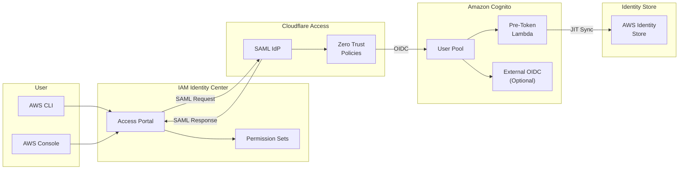

AWS IAM Identity Center (formerly AWS SSO) provides centralized access management for AWS accounts and applications. While it natively supports SAML 2.0 for external identity providers, many organizations prefer OIDC-based authentication through providers like Amazon Cognito. This post demonstrates how to use [Cloudflare Access][cloudflare-access] as a SAML bridge between Amazon Cognito and AWS IAM Identity Center with automatic just-in-time (JIT) user provisioning.

<!--more-->

## The Challenge

AWS IAM Identity Center only accepts **SAML 2.0** for external identity providers. However, you might want to use an OIDC provider like Amazon Cognito for several reasons:

- **Unified Identity**: Use Cognito as a central user directory across your applications
- **Social Login Federation**: Federate Cognito with Google, Facebook, or enterprise OIDC providers
- **Flexible Authentication**: Leverage Cognito's MFA, adaptive authentication, and custom flows
- **Zero Trust Integration**: Combine with Cloudflare Access policies for enhanced security

The solution is to use **Cloudflare Access** as a SAML Identity Provider that bridges OIDC tokens from Cognito to SAML assertions for AWS IAM Identity Center, while a Pre-Token Lambda automatically provisions users in AWS Identity Store.

## Architecture Overview



### Authentication Flow

1. User accesses AWS access portal or initiates `aws sso login`
2. AWS IAM Identity Center redirects to Cloudflare Access (SAML IdP)
3. Cloudflare Access authenticates user via Amazon Cognito (OIDC)
4. Cognito's Pre-Token Lambda creates user in Identity Store if not exists (JIT provisioning)
5. Cognito returns tokens with `identity_store_user_id` claim
6. Cloudflare sends SAML assertion back to AWS IAM Identity Center
7. User gains access to AWS resources based on permission sets

## Solution Components

The solution consists of three main components:

### 1. Amazon Cognito User Pool

Cognito serves as the OIDC provider and user directory:

- **User Authentication**: Native authentication or federation with external OIDC providers
- **OAuth 2.0/OIDC**: Provides standard OIDC endpoints for Cloudflare Access
- **Pre-Token Lambda Trigger**: Invokes JIT provisioning before token generation

### 2. Cloudflare Access (SAML Bridge)

Cloudflare Access acts as a SAML Identity Provider:

- **SAML IdP**: Generates SAML assertions for AWS IAM Identity Center
- **OIDC Authentication**: Authenticates users via Cognito's OIDC endpoints
- **Zero Trust Policies**: Apply access controls before allowing AWS access

### 3. Pre-Token Generation Lambda

A Lambda function triggered by Cognito before token generation:

- **JIT Provisioning**: Creates users in AWS Identity Store on first login
- **Idempotent**: Handles race conditions with conflict detection
- **Claims Injection**: Adds `identity_store_user_id` to tokens

## Implementation

The complete solution is available as an [AWS CDK project on GitHub][github-repo].

### Project Structure

```
cloudflare-access-for-aws-idc/
├── bin/
│   └── app.ts                      # CDK app entry point
├── lib/
│   └── cognito-cloudflare-stack.ts # Main CDK stack
├── lambda/
│   └── pre-token-generation/
│       └── index.ts                # JIT user sync Lambda
└── test/
    ├── cognito-cloudflare-stack.test.ts
    └── lambda/
        └── pre-token-generation.test.ts
```

### CDK Stack Highlights

The CDK stack creates the following resources:

```typescript
export interface CognitoCloudflareStackProps extends cdk.StackProps {
  identityStoreId: string;        // AWS Identity Store ID
  cloudflareTeamName: string;     // Cloudflare Access team name
  externalOidcProvider?: {        // Optional external OIDC federation
    providerName: string;
    clientId: string;
    clientSecret: string;
    issuerUrl: string;
  };
}
```

Key components created:

- **Cognito User Pool** with secure password policies and email-based sign-in
- **Pre-Token Generation Lambda** with Identity Store permissions
- **User Pool Client** configured for Cloudflare Access callback
- **CloudWatch Dashboard** and alarms for operational monitoring
- **Secrets Manager** secret for client credentials

### Pre-Token Generation Lambda

The Lambda function synchronizes users to AWS Identity Store using the [Cognito Pre Token Generation V2 trigger][cognito-pre-token]:

```typescript
async function syncUserToIdentityStore(
  email: string,
  givenName: string,
  familyName: string,
  displayName: string
): Promise<string> {
  // Check if user exists in Identity Store
  let identityStoreUserId = await findUserInIdentityStore(email);

  // Create user if not exists
  if (!identityStoreUserId) {
    try {
      identityStoreUserId = await createUserInIdentityStore(
        email, givenName, familyName, displayName
      );
    } catch (error) {
      // Handle race condition: another request created the user
      if (error instanceof ConflictException) {
        identityStoreUserId = await findUserInIdentityStore(email);
      } else {
        throw error;
      }
    }
  }

  return identityStoreUserId;
}
```

The Lambda adds the Identity Store user ID to both ID and access tokens:

```typescript
event.response.claimsAndScopeOverrideDetails = {
  idTokenGeneration: {
    claimsToAddOrOverride: {
      identity_store_user_id: identityStoreUserId,
    },
  },
  accessTokenGeneration: {
    claimsToAddOrOverride: {
      identity_store_user_id: identityStoreUserId,
    },
  },
};
```

### Smart Name Derivation

When user attributes lack name information, the Lambda derives names from the email address:

```typescript
// If both names are empty, derive from email prefix
if (!givenName && !familyName) {
  const emailPrefix = email.split('@')[0];
  const nameParts = emailPrefix.split(/[._-]/);

  if (nameParts.length >= 2) {
    // john.doe@example.com -> Given: John, Family: Doe
    givenName = capitalize(nameParts[0]);
    familyName = nameParts.slice(1).map(capitalize).join(' ');
  } else {
    // johndoe@example.com -> Given: Johndoe, Family: User
    givenName = capitalize(emailPrefix);
    familyName = 'User';
  }
}
```

## Deployment

### Prerequisites

1. AWS Account with IAM Identity Center enabled
2. [Cloudflare account][cloudflare-zero-trust] with Zero Trust (Access)
3. Node.js 18+ and AWS CDK CLI installed

### Step 1: Find Your Identity Store ID

```bash
aws sso-admin list-instances \
  --query 'Instances[0].IdentityStoreId' \
  --output text
```

### Step 2: Deploy the CDK Stack

```bash
# Clone the repository
git clone https://github.com/zxkane/cloudflare-access-for-aws-idc.git
cd cloudflare-access-for-aws-idc

# Install dependencies
npm install

# Deploy
npx cdk deploy \
  --context identityStoreId=<your-identity-store-id> \
  --context cloudflareTeamName=<your-team-name>
```

### Stack Outputs

Note these outputs for Cloudflare configuration:

| Output | Description |
|--------|-------------|
| `CognitoIssuerUrl` | OIDC Issuer URL |
| `AuthorizationEndpoint` | OAuth authorization endpoint |
| `TokenEndpoint` | OAuth token endpoint |
| `JwksUri` | JSON Web Key Set URI |
| `UserPoolClientId` | Cognito client ID |
| `ClientSecretArn` | ARN of client secret in Secrets Manager |

### Step 3: Configure Cloudflare Access

#### Add OIDC Identity Provider

In [Cloudflare Zero Trust dashboard][cloudflare-dashboard]:

1. Go to **Settings** > **Authentication** > **Login methods**
2. Click **Add new** > **OpenID Connect**
3. Configure:
   - **Name**: Amazon Cognito
   - **App ID**: Use `UserPoolClientId` from stack outputs
   - **Client Secret**: Retrieve from Secrets Manager using `ClientSecretArn`
   - **Auth URL**: Use `AuthorizationEndpoint` from stack outputs
   - **Token URL**: Use `TokenEndpoint` from stack outputs
   - **Certificate URL**: Use `JwksUri` from stack outputs
   - **Scopes**: `openid email profile`
4. Save the configuration

#### Create SAML Application for AWS

1. Go to **Access** > **Applications** > **Add an application**
2. Select **SaaS** > **AWS**
3. Configure SAML settings:
   - **Entity ID**: `urn:amazon:webservices`
   - **ACS URL**: Get from AWS IAM Identity Center external IdP settings
   - **Name ID Format**: Email
4. Assign access policies
5. Download the SAML metadata

### Step 4: Configure AWS IAM Identity Center

1. Open **AWS IAM Identity Center** console
2. Go to **Settings** → **Identity source** → **Actions** → **Change identity source**
3. Select **External identity provider**
4. Upload Cloudflare's SAML metadata or configure manually:
   - **IdP sign-in URL**: From Cloudflare application settings
   - **IdP issuer URL**: From Cloudflare application settings
   - **IdP certificate**: Download from Cloudflare
5. Complete the configuration

### Step 5: Create Permission Sets and Assignments

After users authenticate for the first time, they are automatically provisioned in Identity Store. You can then:

1. Create **Permission Sets** with appropriate IAM policies
2. Assign users to AWS accounts with permission sets

## Using AWS CLI with SSO

Once configured, users can authenticate via the CLI:

```bash
# Configure SSO profile
aws configure sso
# Enter: SSO start URL, SSO Region, account, role

# Login
aws sso login --profile my-sso-profile

# Use AWS CLI
aws s3 ls --profile my-sso-profile
```

The login flow opens a browser, redirects through Cloudflare Access and Cognito for authentication, and returns credentials to the CLI.

## Optional: External OIDC Federation

To federate Cognito with an external OIDC provider (Google, Okta, Auth0, etc.):

```bash
npx cdk deploy \
  --context identityStoreId=<your-identity-store-id> \
  --context cloudflareTeamName=<your-team-name> \
  --context externalOidcProviderName=Google \
  --context externalOidcClientId=<google-client-id> \
  --context externalOidcClientSecret=<google-client-secret> \
  --context externalOidcIssuerUrl=https://accounts.google.com
```

This enables "Login with Google" (or any OIDC provider) for AWS Console and CLI access through the entire chain: External IdP → Cognito → Cloudflare → IAM Identity Center.

## Monitoring and Troubleshooting

### CloudWatch Dashboard

The stack creates a dashboard with:

- Lambda invocation and error metrics
- User sync success/failure rates
- Conflict and skip metrics
- Duration approaching timeout alerts

### Alarms

| Alarm | Threshold | Description |
|-------|-----------|-------------|
| Lambda Errors | > 0 in 5 min | Any Lambda execution errors |
| Lambda Throttles | > 0 in 5 min | Lambda throttling events |
| Sync Failures | > 5 in 5 min | Identity Store sync failures |
| Duration | p99 > 25s | Approaching 30s timeout |

### Common Issues

**"Looks like this code isn't right"**

This usually means the user's `UserName` in Identity Store doesn't match the SAML NameID (email). Delete the manually-created user in Identity Center and let the Lambda recreate them on next login.

**"User not found in Identity Store"**

- Verify Pre-Token Lambda has `identitystore:CreateUser` permission
- Check CloudWatch Logs for sync errors
- Verify the Identity Store ID is correct

**Lambda Times Out**

The Lambda has a 30-second timeout. If Identity Store API calls are slow:

- Check AWS service health
- Review CloudWatch logs for specific errors

## Security Considerations

- **Secrets Management**: Client secrets stored in AWS Secrets Manager
- **Least Privilege IAM**: Lambda only has `GetUserId` and `CreateUser` permissions
- **No Self-Signup**: Cognito User Pool configured for admin-only user creation
- **Secure OAuth**: Only authorization code flow enabled (no implicit grant)
- **Zero Trust**: Cloudflare Access policies provide additional security layer
- **X-Ray Tracing**: Full observability for debugging and auditing

## Conclusion

This solution enables OIDC-based authentication for AWS IAM Identity Center by leveraging Cloudflare Access as a SAML bridge. Key benefits include:

- **Flexible Identity**: Use Amazon Cognito as your identity provider with optional external OIDC federation
- **Zero Trust Security**: Apply Cloudflare Access policies before AWS access
- **Automatic Provisioning**: JIT user creation eliminates manual user management
- **Serverless Architecture**: No infrastructure to manage beyond the CDK stack

The complete source code is available on [GitHub][github-repo].

## Resources

- [AWS IAM Identity Center Documentation][idc-docs]
- [Amazon Cognito Documentation][cognito-docs]
- [Cloudflare Access Documentation][cloudflare-docs]
- [AWS CDK Documentation][cdk-docs]

---

<!-- GitHub Repository -->
[github-repo]: https://github.com/zxkane/cloudflare-access-for-aws-idc

<!-- Cloudflare -->
[cloudflare-access]: https://www.cloudflare.com/products/zero-trust/access/
[cloudflare-zero-trust]: https://www.cloudflare.com/products/zero-trust/
[cloudflare-dashboard]: https://one.dash.cloudflare.com/
[cloudflare-docs]: https://developers.cloudflare.com/cloudflare-one/policies/access/

<!-- AWS Documentation -->
[idc-docs]: https://docs.aws.amazon.com/singlesignon/
[cognito-docs]: https://docs.aws.amazon.com/cognito/
[cognito-pre-token]: https://docs.aws.amazon.com/cognito/latest/developerguide/user-pool-lambda-pre-token-generation.html
[cdk-docs]: https://docs.aws.amazon.com/cdk/
