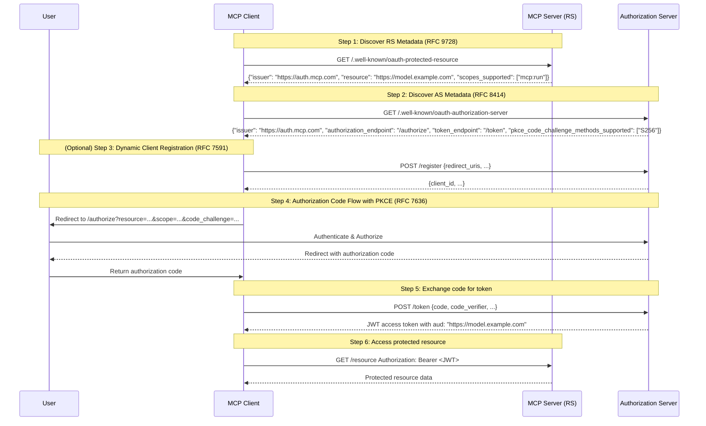

## Executive Summary

This article provides a deep-dive technical analysis of the Model Context Protocol (MCP) authorization flow. The central insight is that MCP's authorization model is not a generic application of OAuth 2.0 but a sophisticated implementation of the emerging **OAuth 2.1 standard**.

The MCP protocol deliberately rejects the flexible but less secure patterns of the original 2012 OAuth framework (RFC 6749). Instead, it adopts a modern, secure-by-default, and dynamic protocol stack built on three pillars:

1.  **Mandatory Security**: Following modern security best practices (RFC 9700), MCP mandates the Authorization Code flow with PKCE (RFC 7636) for all client types to prevent code interception attacks.
2.  **Token Specificity**: It uses Resource Indicators (RFC 8707) to issue precisely audience-restricted and verifiable JWT Access Tokens (RFC 7519), mitigating the "Confused Deputy" problem.
3.  **Dynamic Federation**: It combines Dynamic Client Registration (RFC 7591), Authorization Server Metadata (RFC 8414), and, most critically, **Protected Resource Metadata (RFC 9728)** to enable a fully decentralized and programmatic ecosystem.

MCP's mandatory requirement for **RFC 9728** is the key that unlocks its dynamic authorization flow, allowing clients to discover authorization requirements directly from the resource server (the "model"). By aligning with OAuth 2.1 principles, MCP establishes itself as a reference implementation for next-generation, secure, and federated API authorization.

## Table 1: Key RFC Specifications for the MCP Authorization Flow

| RFC Number | Title | Publication Date | Status | Function in the MCP/OAuth 2.1 Stack |
|------------|-------|------------------|--------|-------------------------------------|
| RFC 6749 | The OAuth 2.0 Authorization Framework | October 2012 | Standards Track | Core framework (historical baseline); defines roles and the Authorization Code flow |
| RFC 6750 | The OAuth 2.0 Bearer Token Usage | October 2012 | Standards Track | Defines the `Authorization: Bearer` header for token usage |
| RFC 7636 | Proof Key for Code Exchange (PKCE) | September 2015 | Standards Track | Protects the Authorization Code flow from interception attacks; mandatory in 2.1 |
| RFC 7519 | JSON Web Token (JWT) | May 2015 | Standards Track | Defines the self-contained, verifiable access token format, enabling stateless validation |
| RFC 8707 | Resource Indicators for OAuth 2.0 | February 2020 | Standards Track | Allows clients to specify the token's target audience (resource), solving token ambiguity |
| RFC 7591 | OAuth 2.0 Dynamic Client Registration | July 2015 | Standards Track | Allows clients to register automatically via an API, enabling dynamic scaling |
| RFC 8414 | OAuth 2.0 Authorization Server Metadata | June 2018 | Standards Track | Allows clients to dynamically discover AS endpoints and capabilities (e.g., PKCE support) |
| RFC 9728 | OAuth 2.0 Protected Resource Metadata | April 2025 | Standards Track | **Key MCP Requirement**. Allows RS (Resource Servers) to publish their authorization needs (like AS and scope) |
| RFC 9700 | OAuth 2.0 Security Best Current Practice | January 2025 | Best Current Practice | Codifies security lessons; formally deprecates insecure grant types (like Implicit) |
| draft-ietf-oauth-v2-1 | The OAuth 2.1 Authorization Framework | In Progress | IETF Draft | Consolidates all the above best practices; set to replace RFC 6749 and 6750 |

---

## Part 1: Deconstructing the OAuth 2.0 Baseline and Its Gaps

This section examines the original 2012 OAuth 2.0 specifications. While foundational, they established a "framework" that left critical security and interoperability gaps—gaps that the MCP technology stack is specifically designed to close.

### 1.1 RFC 6749: The OAuth 2.0 Authorization Framework

Published in October 2012, RFC 6749 defined the core OAuth 2.0 model.

**Key Concepts**:

*   **Roles**: Defines the four primary roles: Resource Owner (user), Client (application), Authorization Server (AS), and Resource Server (RS).
*   **Delegated Access**: Establishes a model where a third-party client can obtain limited access to an HTTP service on behalf of a user, without handling the user's credentials.
*   **Grant Types**: Describes several flows for obtaining access tokens:
    *   **Authorization Code Flow**: The primary flow for web servers. It involves redirecting the user to the AS for approval and exchanging a temporary code for an access token. The user's credentials are never exposed to the client.
    *   **Implicit Flow**: A simplified flow for client-side applications (SPAs), where the access token is returned directly to the user-agent.
    *   **Resource Owner Password Credentials (ROPC) Flow**: Allows the client to collect the user's username and password directly.
    *   **Client Credentials Flow**: Used for machine-to-machine (M2M) authorization where the client acts on its own behalf.

### 1.2 RFC 6750: The OAuth 2.0 Bearer Token Usage

Published alongside RFC 6749, this specification defines the "Bearer" token.

**Key Concepts**:

*   **Bearer Token**: An access token where simple possession is sufficient to gain authorization. The client is not required to prove possession of a cryptographic key.
*   **Token Presentation**: Specifies that the primary method for presenting the token is the HTTP `Authorization` header: `Authorization: Bearer <token>`.

**Security Considerations**:

Because possession grants access, bearer tokens must be protected from leakage during transit (requiring TLS/HTTPS) and at rest. The specification warns against passing bearer tokens in URLs, a practice explicitly forbidden by the later OAuth 2.1 draft.

### 1.3 Identifying the Gaps: The "Framework" vs. "Protocol" Problem

The primary weakness of the original OAuth 2.0 specifications was not a single flaw but their **excessive flexibility**. As a "framework," it left too many security-critical decisions to implementers, resulting in a patchwork of extensions and a high number of insecure deployments.

The MCP technology stack systematically addresses **six key gaps** left by the 2012 baseline:

1.  **Insecure Flows**: The Implicit flow, designed for SPAs, is highly vulnerable to token leakage and is now deprecated by the security BCP (RFC 9700) and removed from OAuth 2.1.
2.  **Flow Vulnerabilities**: The Authorization Code flow itself was vulnerable to "authorization code interception" attacks when used by public clients like native apps.
3.  **Lack of a Standard Token Format**: RFC 6749 did not define a token format, leading to the prevalence of "opaque" tokens. These tokens forced the RS to make a "Token Introspection" call back to the AS for every request, creating performance bottlenecks and tight coupling.
4.  **Lack of a Standard Token Audience**: Without a defined audience, a token from one AS could be accepted by any RS that trusted it. This led to the "Confused Deputy" attack, where a client could trick an RS into accepting a token intended for a different resource.
5.  **Lack of Discovery Mechanisms**: RFC 6749 assumed clients were manually configured with AS endpoint addresses. This "out-of-band" configuration is not viable in a dynamic, federated ecosystem like MCP.
6.  **Risks of ROPC**: The ROPC flow required clients to handle plaintext user passwords, violating the core principle of delegated authorization and creating a significant security risk.

The MCP specification directly solves each of these problems by adopting the subsequent RFCs that matured the OAuth standard.

---

## Part 2: Building a Modern Security Foundation

This section details the RFCs that form the non-negotiable security baseline for modern OAuth implementations, including MCP and the broader OAuth 2.1 standard.

### 2.1 RFC 7636: Mitigating Interception Attacks with PKCE

Published in September 2015, RFC 7636 (Proof Key for Code Exchange) was originally designed to protect public clients (like native apps) using the Authorization Code flow.

**Problem Solved**: PKCE mitigates the "authorization code interception" attack, where a malicious app intercepts the code being redirected back to a legitimate client.

**Mechanism**:

PKCE introduces a dynamic, hash-based challenge-response mechanism:

1.  **`code_verifier`**: The client generates a high-entropy random string, the `code_verifier`.
2.  **`code_challenge`**: The client hashes the `code_verifier` using SHA-256 and Base64URL-encodes it to create the `code_challenge`.
3.  **Authorization Request**: The client sends the `code_challenge` and `code_challenge_method="S256"` to the `/authorization` endpoint. The AS stores these values.
4.  **Token Exchange**: When exchanging the authorization code at the `/token` endpoint, the client must provide the original, un-hashed `code_verifier`.
5.  **Server Verification**: The AS hashes the received `code_verifier` and compares it to the stored `code_challenge`. It only issues an access token if they match.

**Analysis**:

PKCE's role evolved significantly over time. Initially a patch for public clients, its core security value—**dynamically proving that the client redeeming the code is the same one that initiated the flow**—was recognized as beneficial for all client types.

As a result, the emerging OAuth 2.1 standard mandates PKCE for **all clients** using the Authorization Code flow. By adopting the 2.1 stack, MCP inherits this "PKCE-by-default" security posture, transforming PKCE from a patch into a foundational security layer.

### 2.2 RFC 9700: Codifying Security Best Practices (BCP)

Published in January 2025, RFC 9700 (OAuth 2.0 Security Best Current Practice) is a critical document that consolidates a decade of security lessons learned since the original framework. It serves as the theoretical foundation for OAuth 2.1.

**Key Mandates**:

*   **Formally Deprecates Insecure Flows**: Explicitly recommends against using the Implicit Flow and the Resource Owner Password Credentials (ROPC) Flow due to their security risks.
*   **Elevates Security Controls**: Upgrades many optional recommendations to "MUST" or "SHOULD" requirements, including:
    *   Using the `state` parameter to prevent CSRF.
    *   Requiring PKCE for all clients.
    *   Requiring exact string matching for `redirect_uris`.
    *   Recommending sender-constrained tokens (e.g., mTLS, DPoP) to prevent token replay.

**Analysis**:

RFC 9700 is the IETF's official acknowledgment of OAuth's architectural evolution. It provides an authoritative guide for secure implementation, moving developers away from the complex and often insecure "patchwork" of early OAuth 2.0 extensions. By aligning with OAuth 2.1, MCP's designers are building on the IETF's latest security consensus, not the outdated 2012 framework.

### 2.3 RFC 7519: Defining a Standard Token Structure with JWT

Published in May 2015, RFC 7519 (JSON Web Token) standardized a compact, URL-safe format for representing claims between two parties.

**Key Concepts**:

*   **Structure**: A JWT consists of three Base64URL-encoded parts separated by dots: `Header.Payload.Signature`.
    *   **Header**: Declares the token type (`JWT`) and signing algorithm (`alg`).
    *   **Payload**: Contains "claims" about the subject, such as issuer and expiration time.
    *   **Signature**: A cryptographic signature that verifies the token's integrity and authenticity.
*   **Registered Claims**: Defines standard claims, including:
    *   `iss` (Issuer): The AS that issued the token.
    *   `sub` (Subject): The user or entity the token represents.
    *   `aud` (Audience): The intended recipient (the RS).
    *   `exp` (Expiration Time): The token's expiration timestamp.
    *   `iat` (Issued At): The token's issuance timestamp.

**Analysis**:

In a federated system like MCP, JWTs are the architectural linchpin for high-performance, stateless authorization.

In the era of opaque tokens, a Resource Server (RS) had to make a "Token Introspection" (RFC 7662) API call back to the Authorization Server (AS) to validate every request. This created tight coupling and a severe performance bottleneck.

In contrast, a JWT is **self-contained**. The RS can validate it locally and statelessly by:
1.  Checking the `exp` claim for expiration.
2.  Checking the `iss` claim to verify the issuer.
3.  Checking the `aud` claim to ensure the token was issued for itself.
4.  Using the AS's public key (discoverable via RFC 8414) to validate the signature.

For a protocol like MCP, which protects high-throughput AI model endpoints, this stateless validation is not a convenience—**it is an architectural necessity**. Adopting JWTs is a prerequisite for building the scalable, decoupled system MCP aims to be.

---

## Part 3: The Core of MCP: A Dynamic, Federated Authorization Ecosystem

This section analyzes the RFCs that transform OAuth from a manually configured system into the dynamic, programmatic, and federated protocol that MCP requires.

### 3.1 RFC 8707: Solving Token Ambiguity with Resource Indicators

Published in February 2020, RFC 8707 (Resource Indicators for OAuth 2.0) was created to solve the "token ambiguity" problem.

**Problem Solved**:

In classic OAuth 2.0, the AS had no standard way of knowing which API the client intended to use the token for. This created the **"Confused Deputy"** attack: a client could request a token for a low-privilege API (e.g., "Photos API") and then replay it at a high-privilege API (e.g., "Documents API"). If both APIs trusted the same AS, the token would be accepted, violating the principle of least privilege.

**Mechanism**:

*   The specification defines a new request parameter: `resource`.
*   The client includes one or more `resource` parameters in its authorization and token requests, explicitly stating the URI of the target Resource Server.
*   The AS must use this `resource` parameter to "audience-restrict" the token. In a JWT, this means placing the `resource` value into the `aud` (Audience) claim.

**Analysis**:

RFC 8707 provides the technical mechanism to enforce fine-grained authorization in a federated system. While RFC 7519 defines the `aud` claim, RFC 8707 defines the protocol for populating it based on client intent.

This audience restriction is the fundamental solution to the "Confused Deputy" problem. Now, the "Documents API" will inspect the `aud` claim and reject any token intended for the "Photos API," even if the signature and expiration are valid. For MCP, where a client may interact with many different AI models, this is non-negotiable. A token issued for "Model A" must never be usable at "Model B."

### 3.2 The "Discovery Trifecta": Enabling a Fully Dynamic Ecosystem

This section explains how three RFCs combine to create the automated, zero-configuration flow that MCP depends on. The central question is: How can a client, starting with only an MCP model's address, automatically perform the entire OAuth flow without any manual configuration?

The **"Discovery Trifecta" (RFC 7591, 8414, and 9728)** transforms OAuth from a system of manually configured parts into a dynamic, discoverable protocol.

#### 3.2.1 Pillar 1: RFC 7591 - Dynamic Client Registration (DCR)

Published in July 2015, RFC 7591 (OAuth 2.0 Dynamic Client Registration Protocol) solves a critical scaling problem.

**Problem Solved**: How does a client obtain a `client_id`? In classic OAuth, this was a manual process (e.g., using a developer portal), which cannot scale in a federated ecosystem.

**Mechanism**:

*   The specification defines a "Client Registration Endpoint" on the AS.
*   A client POSTs its metadata (e.g., `redirect_uris`, app name) as a JSON payload to this endpoint.
*   The AS validates the request and responds with a new `client_id` and other registration details.

**Role in MCP**: DCR enables scale. New AI applications ("MCP clients") can be spun up and programmatically register with "MCP Authorization Servers" without human intervention, which is essential for a large-scale, multi-tenant ecosystem.

#### 3.2.2 Pillar 2: RFC 8414 - Authorization Server Metadata

Published in June 2018, RFC 8414 (OAuth 2.0 Authorization Server Metadata) standardized the successful "discovery" concept from OpenID Connect.

**Problem Solved**: How does a client discover an AS's endpoints (e.g., `/authorization`, `/token`) and capabilities (e.g., supported PKCE methods)?

**Mechanism**:

*   The specification defines a "well-known" URI: `/.well-known/oauth-authorization-server`, appended to the AS's issuer identifier.
*   A client performs an HTTP GET to this endpoint (e.g., `https://as.example.com/.well-known/oauth-authorization-server`).
*   The AS returns a JSON document containing its configuration details: `authorization_endpoint`, `token_endpoint`, `issuer`, `scopes_supported`, `pkce_code_challenge_methods_supported`, etc.

**Role in MCP**: The MCP specification mandates that clients **must** support this discovery mechanism. This decouples the client from the AS implementation, as the client only needs a single issuer URL to discover all protocol endpoints and features dynamically.

#### 3.2.3 Pillar 3: RFC 9728 - Protected Resource Metadata

Published in April 2025 after an 8.5-year journey, RFC 9728 (OAuth 2.0 Protected Resource Metadata) is the newest and most critical piece of the MCP stack.

**Problem Solved**: This RFC provides the **"missing link"** in the OAuth ecosystem. We could dynamically register clients (RFC 7591) and discover AS endpoints (RFC 8414), but how does a client, starting only with a Resource Server's address, know which AS to talk to and what authorization parameters to request?

**Mechanism**:

*   The specification defines a metadata format for the Resource Server (RS).
*   It specifies a "well-known" URI on the RS: `/.well-known/oauth-protected-resource`.
*   A client GETs this endpoint to retrieve a JSON document describing the RS's authorization requirements, including the `issuer` (the AS it trusts), `scopes_supported`, and its own `resource` identifier (for RFC 8707).

**Role in MCP**: This is the **core enabling standard** for the MCP flow. The specification explicitly states: "**MCP clients MUST use OAuth 2.0 Protected Resource Metadata (RFC 9728) for authorization server discovery.**"

### Analysis of the Complete MCP Dynamic Flow

With the "Discovery Trifecta," the entire authorization process becomes automated:

1.  An MCP client is given the URI of an MCP server (RS), e.g., `https://model.example.com`.
2.  The client queries `https://model.example.com/.well-known/oauth-protected-resource` (per RFC 9728).
3.  The RS responds with its requirements: "My issuer is `https://auth.mcp.com`, and you must request `scope=mcp:run` and `resource=https://model.example.com`."
4.  The client now knows the AS's issuer and queries `https://auth.mcp.com/.well-known/oauth-authorization-server` (per RFC 8414).
5.  The AS responds with its endpoints (`/authorize`, `/token`) and capabilities (e.g., PKCE S256 support).
6.  The client, now fully informed, initiates the Authorization Code flow with PKCE (RFC 7636), redirecting the user with the `code_challenge`, `scope`, and `resource` parameters.
7.  The user authenticates, and the client receives an authorization code. It exchanges this code at the `/token` endpoint, providing the `code_verifier`.
8.  The AS issues a JWT access token (RFC 7519) with the payload containing `aud: "https://model.example.com"` (from RFC 8707) and `iss: "https://auth.mcp.com"`.
9.  The client presents this token to `https://model.example.com` using the `Authorization: Bearer` header (RFC 6750).
10. The RS statelessly validates the token's signature, expiration, issuer, and, most critically, its audience (`aud`), then grants access.

**Conclusion**: The final publication of RFC 9728 was the key technical enabler for realizing MCP's vision of a fully federated and dynamic authorization model.

---

## Part 4: The Final Picture: MCP as a Reference Implementation for OAuth 2.1

This final part synthesizes the preceding analysis to show that the protocol stack mandated by MCP is, by definition, the emerging OAuth 2.1 standard.

### 4.1 draft-ietf-oauth-v2-1: The OAuth 2.1 Authorization Framework

The OAuth 2.1 draft, currently in progress, is not a rewrite but a **consolidation and refinement** of the best practices developed over the last decade. Its goal is to replace and obsolete the original RFC 6749 and RFC 6750 by absorbing mature extensions into the baseline and removing insecure patterns.

**Key Differences from OAuth 2.0**:

*   **Added**: PKCE (RFC 7636) is now mandatory for the Authorization Code flow.
*   **Added**: Incorporates security requirements from the BCP (RFC 9700), such as strict `redirect_uri` matching.
*   **Added**: Recommends the use of Resource Indicators (RFC 8707) and AS Metadata (RFC 8414).
*   **Removed**: The Implicit flow (`response_type=token`) is omitted entirely.
*   **Removed**: The Resource Owner Password Credentials (ROPC) flow is omitted entirely.
*   **Removed**: Sending bearer tokens in URL query parameters is forbidden.

### 4.2 Final Analysis: MCP as a Reference Implementation of OAuth 2.1

The MCP authorization flow **is** the OAuth 2.1 flow, enhanced with the most modern discovery mechanisms.

*   MCP mandates the "Discovery Trifecta" (RFC 9728, RFC 8414), representing the cutting edge of the OAuth ecosystem.
*   By aligning with OAuth 2.1, MCP implicitly adopts the security BCP of RFC 9700, the PKCE mechanism of RFC 7636, and the token specificity of RFC 8707.
*   It inherits the deprecation of the insecure Implicit and ROPC flows, guaranteeing a secure-by-default posture.

**Conclusion**: MCP serves as a "domain-specific profile" of OAuth 2.1. Its designers have selected a complete, modern, and dynamic set of specifications to build a protocol that is not just secure but also federation-capable and scalable—precisely what the AI ecosystem it serves requires. The specification is a textbook example of how to build a modern, interoperable authorization protocol.

---

## Visualizing the MCP Authorization Flow with Mermaid

The following diagram illustrates the complete MCP authorization flow, showing how the "Discovery Trifecta" enables dynamic federation:



---

## Analyzing IDaaS Provider Compatibility for the MCP Flow

As the Model Context Protocol gains traction, Identity-as-a-Service (IDaaS) providers are evaluating support for its authorization flow. This section tracks the current state of compatibility across major identity platforms.

### Support Matrix

| Provider | OAuth 2.1 Core (w/ PKCE) | RFC 8707 (Resource Indicators) | RFC 7591 (Dynamic Client Reg.) | Summary & Key Incompatibilities |
|----------|--------------------------|--------------------------------|--------------------------------|-----------------------------------|
| **Auth0** | Yes | No (Incompatible) | Yes | Uses proprietary audience parameter. Auth0's legacy audience parameter conflicts with the MCP-mandated resource parameter. |
| **Okta** | Yes | No | Yes | Does not support RFC 8707. Okta's documentation explicitly states the resource parameter/claim is not supported for this function. |
| **Amazon Cognito** | Yes | Yes | No (Workaround) | Natively supports RFC 8707. No native DCR. Requires a custom endpoint (e.g., API Gateway + Lambda) to emulate RFC 7591. |
| **Microsoft Entra ID** | Yes | No (Incompatible) | No | Uses proprietary scope parameter. Entra ID rejects the resource parameter and uses a non-standard scope={resource}/.default syntax. No DCR support is planned. |
| **Google Cloud Identity** | Yes (Caveat) | No (Incompatible) | No | Requires manual registration. Google does not support DCR. Uses proprietary "custom audiences" instead of RFC 8707. PKCE flow still requires a client secret. |
| **Keycloak (OSS)** | Yes | No (Workaround) | Yes | Uses proprietary audience parameter. RFC 8707 is not supported but is in development. The workaround is using Keycloak's audience parameter with a custom "Audience Mapper". |
| **Ping Identity** | Yes | Yes | Yes | **Fully Compliant**. Natively supports both RFC 8707 (since v12.1) and a mature implementation of RFC 7591. |
| **OneLogin** | Yes | No Data | Yes | RFC 8707 support is unknown. The provider supports DCR and proper PKCE, but there is no documentation confirming or-denying support for the resource parameter. |
| **Zitadel (OSS)** | Yes | No | No | Lacks support for both standards. Documentation explicitly states RFC 8707 is not supported and will cause an error. DCR is a known feature request but is not implemented. |

### Key Insights

*   **RFC 8707 is the Critical Bottleneck**: The `resource` parameter (RFC 8707) is the primary compatibility issue. Only **Amazon Cognito and Ping Identity** natively support this MCP-mandatory specification. Most major providers (Auth0, Okta, Microsoft, Google) use proprietary audience parameters that predate the standard, creating a significant barrier to adoption.
*   **Dynamic Client Registration is Unevenly Implemented**: While many providers support RFC 7591, major cloud vendors like Google and Microsoft have chosen not to implement it, requiring manual client registration that conflicts with MCP's goal of zero-configuration federation.
*   **PKCE is Nearly Universal**: All reviewed providers support PKCE (RFC 7636). However, Google's implementation is non-compliant, as it still requires a `client_secret` in a flow designed to eliminate it.
*   **Only One Provider is Fully Compliant**: At present, **Ping Identity** is the only IDaaS provider that natively supports all MCP-required specifications, including both RFC 8707 and RFC 7591.

### Workarounds for Providers Without RFC 8707 Support

Given that RFC 8707 is the main compatibility hurdle, MCP implementers can consider these strategies:

1.  **Provider-Specific Token Exchange**: Use RFC 8693 (Token Exchange) where available to exchange a generic token for a resource-specific one.
2.  **Audience Mapper Configuration**: For extensible platforms like Keycloak, configure custom audience mappers to emulate RFC 8707 behavior.
3.  **Authorization Server Proxy**: Deploy a lightweight proxy to translate between MCP's `resource` parameter and a provider's proprietary audience parameter.
4.  **Scope-Based Resources**: For Microsoft Entra ID, encode resource identifiers in the `scope` parameter using their proprietary format (`scope={resource}/.default`).

This analysis reveals that MCP's dynamic federation model faces significant headwinds from IDaaS provider incompatibility. Until major providers adopt RFC 8707, production MCP deployments will require custom integration work or reliance on fully compliant providers.

---

## Provider-Specific Analysis

This section provides a more detailed breakdown of the compatibility status for each provider.

### Auth0 (an Okta company)

Auth0 strongly supports OAuth 2.1 and has excellent DCR support. However, it is **incompatible with MCP's mandatory RFC 8707 requirement**. Auth0 implemented a non-standard `audience` parameter years before RFC 8707 was finalized and does not accept the standard `resource` parameter.

### Okta

As a leader in the IETF OAuth working group, Okta fully supports the OAuth 2.1 core and provides a compliant DCR API. However, like Auth0, it is **incompatible** because its documentation explicitly states it does not support the `resource` parameter for audience restriction as defined in RFC 8707.

### Amazon Cognito

Cognito is **partially compliant and a viable option with custom engineering**. It is one of the few providers that **natively supports RFC 8707** (Resource Indicators). However, it **lacks native support for RFC 7591** (DCR). The standard workaround is to build a custom DCR endpoint using AWS API Gateway and Lambda to call Cognito's internal APIs.

### Microsoft Entra ID (formerly Azure AD)

Entra ID is **incompatible with the MCP flow on two critical points**. First, it rejects the `resource` parameter and uses a proprietary mechanism where the resource is specified within the `scope` parameter (e.g., `scope=https://graph.microsoft.com/.default`). Second, Microsoft has stated it has **no plans to implement RFC 7591** (DCR).

### Google Cloud Identity

The Google Identity Platform is **incompatible and highly proprietary**. It does not support DCR, requiring manual client creation. It also does not support RFC 8707, instead using a non-standard "custom audience" (`aud`) claim. Furthermore, its PKCE implementation is non-compliant, as it **still requires a `client_secret`** for a flow designed to be secretless.

### Keycloak (OSS)

This open-source project is **partially compliant**. It offers excellent, extensible support for DCR but does not support RFC 8707 out-of-the-box. This is a known issue with active development. The established workaround is to use Keycloak's proprietary `audience` parameter and configure a custom "Audience Mapper."

For a complete implementation guide showing how to deploy Keycloak on AWS with full MCP OAuth 2.1 support—including the audience mapper workaround, JDBC_PING clustering for zero-downtime deployments, and automated Terraform orchestration—see [Implementing MCP OAuth 2.1 with Keycloak on AWS][keycloak-mcp-implementation]. The guide provides infrastructure code, step-by-step deployment instructions, and detailed configuration examples for making Keycloak compatible with MCP clients through realm default scopes and protocol mappers.

### Ping Identity (PingFederate)

Ping Identity is the **most compliant provider on this list**. Its platform offers mature, robust support for RFC 7591 (DCR) and, as of version 12.1, provides full, standards-compliant support for RFC 8707 (Resource Indicators).

### OneLogin (by One Identity)

OneLogin appears **partially compliant, but with incomplete data**. The platform supports RFC 7591 (DCR) and correctly implements PKCE. However, there is **no available documentation** to confirm or deny its support for the MCP-mandatory `resource` parameter (RFC 8707).

### Zitadel (OSS)

As a newer open-source platform, Zitadel is **not yet compliant with the MCP flow**. Its documentation clearly states that it does not support RFC 8707 and will reject requests containing the `resource` parameter. Similarly, RFC 7591 (DCR) is not implemented and remains a feature request.

---

## Resources & References

### Official Specifications

- **[RFC 6749 - The OAuth 2.0 Authorization Framework][rfc-6749]**: The original 2012 OAuth 2.0 specification
- **[RFC 6750 - The OAuth 2.0 Bearer Token Usage][rfc-6750]**: Bearer token specification
- **[RFC 7636 - Proof Key for Code Exchange (PKCE)][rfc-7636]**: PKCE extension for authorization code interception protection
- **[RFC 7519 - JSON Web Token (JWT)][rfc-7519]**: JWT token format specification
- **[RFC 8707 - Resource Indicators for OAuth 2.0][rfc-8707]**: Audience restriction via resource parameter
- **[RFC 7591 - OAuth 2.0 Dynamic Client Registration][rfc-7591]**: Dynamic client registration protocol
- **[RFC 8414 - OAuth 2.0 Authorization Server Metadata][rfc-8414]**: AS discovery and metadata
- **[RFC 9728 - OAuth 2.0 Protected Resource Metadata][rfc-9728]**: RS discovery and authorization requirements **[NEW - April 2025]**
- **[RFC 9700 - OAuth 2.0 Security Best Current Practice][rfc-9700]**: Security BCP and OAuth 2.1 foundation **[NEW - January 2025]**
- **[draft-ietf-oauth-v2-1-14 - OAuth 2.1 Authorization Framework][oauth-2-1-draft]**: Latest OAuth 2.1 draft

### MCP Specification

- **[Model Context Protocol Specification][mcp-spec]**: Official MCP specification
- **[MCP Authorization Documentation][mcp-auth-docs]**: MCP-specific authorization requirements

### Related Articles

- [MCP OAuth Evolution: SEP-991 Simplifies Client Registration][sep-991-post]: How Client ID Metadata Documents replace Dynamic Client Registration **[NEW]**
- [Building an MCP Agentic Chatbot on AWS][mcp-agentic-chatbot]: My previous exploration of MCP server implementation
- [Using MCP Client OAuthClientProvider with AWS Agentcore][mcp-oauth-client-provider]: Practical implementation of MCP OAuth client patterns
- [Implementing MCP OAuth 2.1 with Keycloak on AWS][keycloak-mcp-implementation]: Complete guide to configuring Keycloak as an MCP-compatible authorization server

---

## Appendix: Detailed RFC Timeline

```
2012-10: RFC 6749 (OAuth 2.0 Framework) 📜
2012-10: RFC 6750 (Bearer Tokens)         📜
2015-05: RFC 7519 (JWT)                   🔐
2015-07: RFC 7591 (Dynamic Registration)  🔄
2015-09: RFC 7636 (PKCE)                  🔒
2018-06: RFC 8414 (AS Metadata)           🔍
2020-02: RFC 8707 (Resource Indicators)   🎯
2025-01: RFC 9700 (Security BCP)          🛡️ [RECENT]
2025-04: RFC 9728 (Protected Resource)    🔗 [LATEST]
2025-??: OAuth 2.1 (Final)                🚀 [IN PROGRESS]
```

*Key milestones in OAuth's evolution toward MCP requirements*

---

<!-- OAuth and RFC Specifications -->
[rfc-6749]: https://tools.ietf.org/html/rfc6749
[rfc-6750]: https://tools.ietf.org/html/rfc6750
[rfc-7636]: https://tools.ietf.org/html/rfc7636
[rfc-7519]: https://tools.ietf.org/html/rfc7519
[rfc-8707]: https://tools.ietf.org/html/rfc8707
[rfc-7591]: https://tools.ietf.org/html/rfc7591
[rfc-8414]: https://tools.ietf.org/html/rfc8414
[rfc-9728]: https://tools.ietf.org/html/rfc9728
[rfc-9700]: https://tools.ietf.org/html/rfc9700
[oauth-2-1-draft]: https://datatracker.ietf.org/doc/html/draft-ietf-oauth-v2-1-14

<!-- MCP Specifications -->
[mcp-spec]: https://spec.modelcontextprotocol.io/
[mcp-auth-docs]: https://modelcontextprotocol.io/specification/2025-06-18/basic/authorization

<!-- Related Articles (Internal Links) -->
[sep-991-post]: 
[keycloak-mcp-implementation]: 
[mcp-agentic-chatbot]: 
[mcp-oauth-client-provider]: 
