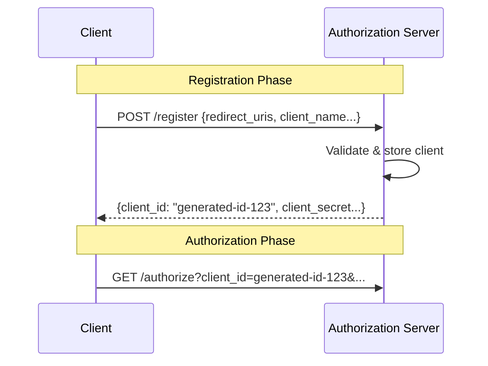
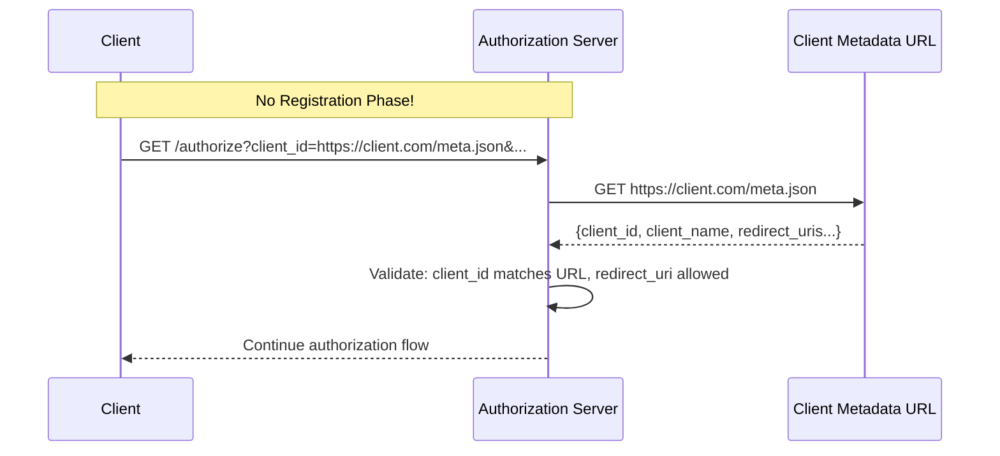

## The Problem with Dynamic Client Registration

In my [previous deep-dive into MCP authorization][mcp-oauth-deep-dive], I analyzed how the protocol builds on OAuth 2.1 with mandatory PKCE, Resource Indicators (RFC 8707), and the "Discovery Trifecta" of RFC 7591, 8414, and 9728. Dynamic Client Registration (DCR) was positioned as the key enabler for MCP's federated ecosystem.

However, DCR has significant practical limitations:

| Challenge | Impact |
|-----------|--------|
| Requires AS support for public registration API | Many identity providers don't offer this |
| Forces OAuth proxy infrastructure | Added complexity when AS lacks DCR |
| Manual IT involvement | End users need admin help for each registration |

The MCP ecosystem faces a unique challenge: **unbounded clients connecting to unbounded servers** with no prior relationship. DCR, while standardized, often requires workarounds in practice.

## SEP-991: URL-Based Client Identity

On MCP's first anniversary, the team [announced][mcp-anniversary] a simplified approach: **OAuth Client ID Metadata Documents** (SEP-991). This mechanism is now officially part of the [2025-11-25 stable specification][mcp-stable-spec].

### Core Concept

Instead of registering with the Authorization Server, the client **hosts its own identity document** at an HTTPS URL. The `client_id` itself becomes the URL pointing to this metadata.

```
client_id = "https://my-mcp-client.com/.well-known/oauth-client.json"
```

### Metadata Document Structure

The client hosts a JSON document containing its OAuth metadata:

```json
{
  "client_id": "https://my-mcp-client.com/.well-known/oauth-client.json",
  "client_name": "My MCP Client",
  "redirect_uris": [
    "https://my-mcp-client.com/callback",
    "http://localhost:8080/callback"
  ],
  "token_endpoint_auth_method": "none",
  "grant_types": ["authorization_code"],
  "response_types": ["code"]
}
```

**Key fields:**
- `client_id`: Must exactly match the document's URL
- `client_name`: Displayed to users during authorization
- `redirect_uris`: Allowed callback URLs
- `token_endpoint_auth_method`: `none` for public clients, `private_key_jwt` for confidential

## New Client Registration Priority

The specification defines a clear priority order:

| Priority | Method | When to Use |
|----------|--------|-------------|
| 1 | Pre-registered credentials | Known client-server relationships |
| 2 | **Client ID Metadata Documents** | Server supports `client_id_metadata_document_supported` |
| 3 | Dynamic Client Registration | Fallback if AS supports RFC 7591 |
| 4 | Manual user entry | Last resort |

SEP-991 now takes precedence over DCR when supported.

## Authorization Flow Comparison

### Traditional DCR Flow



### SEP-991 Flow



**Key difference**: The client never registers. The AS fetches and validates the metadata on-demand.

## Server Discovery Support

Authorization Servers declare SEP-991 support in their metadata (RFC 8414):

```json
{
  "issuer": "https://auth.example.com",
  "authorization_endpoint": "https://auth.example.com/authorize",
  "token_endpoint": "https://auth.example.com/token",
  "client_id_metadata_document_supported": true
}
```

Clients check this field before using URL-based client IDs.

## Specification Status

| Version | SEP-991 Status |
|---------|----------------|
| 2025-03-26 | Not included |
| 2025-06-18 | Not included |
| **2025-11-25 (current)** | **Included** |

The feature is now officially part of the stable MCP specification.

## SDK Implementation Status

Not all official MCP SDKs have implemented SEP-991 yet. Here's the current support matrix:

| SDK | Language | SEP-991 Support | Notes |
|-----|----------|-----------------|-------|
| [typescript-sdk][ts-sdk] | TypeScript | ✅ Implemented | Full CIMD support with capability detection |
| [python-sdk][py-sdk] | Python | ✅ Implemented | Full CIMD support with graceful fallback |
| [rust-sdk][rust-sdk] | Rust | ❌ Not yet | Standard OAuth 2.1 + DCR only |
| [go-sdk][go-sdk] | Go | ❌ Not yet | RFC 8414 metadata only |
| [kotlin-sdk][kotlin-sdk] | Kotlin | ❓ Unknown | OAuth support not documented |
| [csharp-sdk][csharp-sdk] | C# | ❌ No OAuth | Protocol implementation only |

### TypeScript SDK Example

```typescript
// The SDK automatically detects server support
const supportsUrlBasedClientId =
  metadata?.client_id_metadata_document_supported === true;

// When supported, uses URL as client_id
if (supportsUrlBasedClientId && clientMetadataUrl) {
  clientInformation = { client_id: clientMetadataUrl };
}
```

### Python SDK Example

```python
# Validates metadata URL format
# "client_metadata_url must be a valid HTTPS URL with a non-root pathname"

# Creates client info from metadata URL when supported
client_information = create_client_info_from_metadata_url(
    self.context.client_metadata_url,
    redirect_uris=self.context.client_metadata.redirect_uris,
)
```

Both SDKs implement the priority order: check `client_id_metadata_document_supported` → use CIMD if available → fall back to DCR.

## Implementation Impact

### For MCP Clients

**Requirements:**
- Host metadata document at HTTPS URL with path component
- Ensure `client_id` in document matches the URL exactly
- Include all required fields: `client_id`, `client_name`, `redirect_uris`

**Benefits:**
- No registration API calls needed
- Self-managed identity
- Works with any AS that supports SEP-991

### For Authorization Servers

**Requirements:**
- Implement metadata document fetching and validation
- Verify `client_id` matches fetched URL
- Respect HTTP cache headers for metadata
- Declare support via `client_id_metadata_document_supported`

**Trust model:**
- HTTPS domain ownership proves client identity
- Servers can restrict to trusted domains or allow any HTTPS client

## Relationship to Existing Infrastructure

For those who followed my guide on [implementing MCP OAuth with Keycloak][keycloak-mcp], SEP-991 represents a significant simplification. Instead of configuring DCR endpoints and client registration flows, implementations can now:

1. Host a static JSON file on the client's domain
2. Configure the Authorization Server to fetch and validate client metadata URLs
3. Eliminate the need for client pre-registration or DCR infrastructure

This aligns with MCP's goal of **zero-configuration federation**.

## Summary

SEP-991 shifts the client registration paradigm:

| Aspect | DCR (Legacy) | Client ID Metadata (New) |
|--------|--------------|--------------------------|
| Who registers | Authorization Server | Client self-hosts |
| client_id format | Server-generated string | HTTPS URL |
| Coordination needed | Yes (API call) | No |
| Identity verification | Registration-time | Fetch-time (HTTPS domain) |

The change transforms "server registers client" into "client proves identity"—a fundamental simplification for MCP's open ecosystem.

---

## Resources

### Specifications

- [SEP-991 Discussion][sep-991]: Original proposal on GitHub
- [MCP Authorization Spec (2025-11-25)][mcp-stable-spec]: Current stable specification with Client ID Metadata Documents

### Related Articles

- [Technical Deconstruction of MCP Authorization][mcp-oauth-deep-dive]: Deep-dive into MCP's OAuth 2.1 foundation
- [Implementing MCP OAuth 2.1 with Keycloak on AWS][keycloak-mcp]: Practical deployment guide

---

<!-- Specifications -->
[sep-991]: https://github.com/modelcontextprotocol/specification/discussions/991
[mcp-stable-spec]: https://modelcontextprotocol.io/specification/2025-11-25/basic/authorization
[mcp-anniversary]: https://blog.modelcontextprotocol.io/posts/2025-11-25-first-mcp-anniversary/

<!-- Official SDKs -->
[ts-sdk]: https://github.com/modelcontextprotocol/typescript-sdk
[py-sdk]: https://github.com/modelcontextprotocol/python-sdk
[rust-sdk]: https://github.com/modelcontextprotocol/rust-sdk
[go-sdk]: https://github.com/modelcontextprotocol/go-sdk
[kotlin-sdk]: https://github.com/modelcontextprotocol/kotlin-sdk
[csharp-sdk]: https://github.com/modelcontextprotocol/csharp-sdk

<!-- Related Articles (Internal Links) -->
[mcp-oauth-deep-dive]: 
[keycloak-mcp]: 
