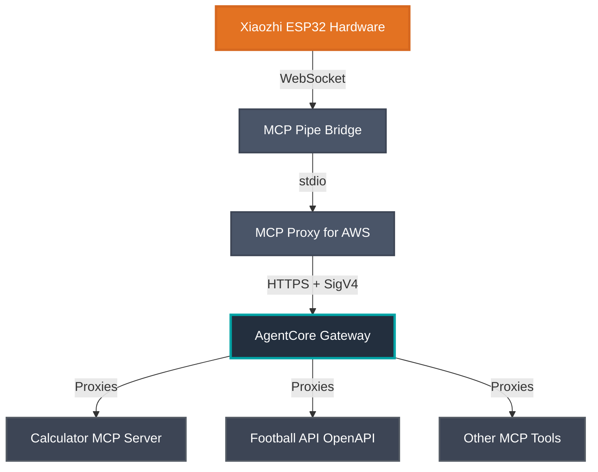
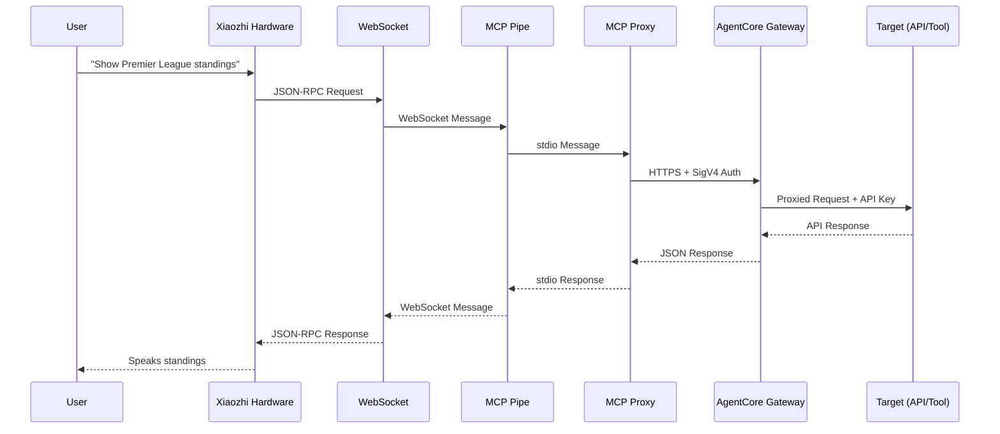

The [Xiaozhi hardware][xiaozhi-repo] is an impressive ESP32-based AI voice assistant capable of offline wake-up, multi-language support, and cloud connectivity. But what if you want your Xiaozhi device to access multiple AI tools, APIs, and services without managing complex integrations on the hardware side? This is where Amazon Bedrock AgentCore Gateway shines as a unified aggregation layer for Model Context Protocol (MCP) servers.

In this guide, I'll walk you through building a distributed MCP architecture that connects Xiaozhi hardware to multiple cloud services through a single WebSocket connection, leveraging AgentCore Gateway to aggregate tools ranging from simple calculators to complex RESTful APIs like real-time football data.

## The Challenge: Connecting Edge Devices to Multiple AI Tools

Xiaozhi hardware excels at voice interaction and local control, but extending its capabilities to access dozens of cloud services presents several challenges:

1. **Connection Management**: Each MCP server requires its own connection, protocol handling, and authentication
2. **Resource Constraints**: ESP32 devices have limited memory and processing power for managing multiple connections
3. **API Key Security**: Storing numerous API keys on edge devices poses security risks
4. **Scalability**: Adding new tools requires firmware updates and device reconfiguration

The solution? Use a gateway pattern to aggregate all MCP servers into a single endpoint that your Xiaozhi device can access through one WebSocket connection.

## Architecture Overview

Our architecture consists of five key components working together:



**Component Breakdown**:

1. **Xiaozhi Hardware**: ESP32-based voice assistant that connects via WebSocket to the MCP endpoint
2. **MCP Pipe Bridge**: A Python-based bidirectional bridge that translates between WebSocket and stdio protocols, managing multiple MCP server processes
3. **MCP Proxy for AWS**: A specialized proxy that translates MCP stdio protocol to AWS HTTP/SSE with SigV4 authentication
4. **Amazon Bedrock AgentCore Gateway**: Managed service that aggregates multiple MCP targets into a unified interface with IAM-based authentication
5. **Gateway Targets**: Individual MCP servers (local tools) and OpenAPI endpoints (RESTful APIs)

## Implementation Guide

### Part 1: Setting Up the MCP Pipe Bridge

The MCP Pipe Bridge is the crucial component that connects your Xiaozhi hardware to the cloud-based gateway. It manages WebSocket connections and spawns MCP server processes.

#### Configuration File

Create `mcp_config.json` to define your MCP servers:

```json
{
  "mcpServers": {
    "aws-proxy-gateway": {
      "type": "stdio",
      "command": "uvx",
      "args": [
        "mcp-proxy-for-aws@latest",
        "https://YOUR-GATEWAY-ID.gateway.bedrock-agentcore.us-west-2.amazonaws.com/mcp",
        "--region",
        "us-west-2",
        "--log-level",
        "DEBUG",
        "--service",
        "bedrock-agentcore"
      ]
    }
  }
}
```

#### The Bridge Implementation

The MCP Pipe (`mcp_pipe.py`) handles bidirectional communication between WebSocket and stdio:

```python
import asyncio
import websockets
import json
import subprocess
from typing import Dict, List

class MCPPipe:
    def __init__(self, websocket_url: str, config: dict):
        self.websocket_url = websocket_url
        self.config = config
        self.processes: Dict[str, subprocess.Popen] = {}

    async def start_server(self, name: str, server_config: dict):
        """Launch an MCP server process"""
        process = subprocess.Popen(
            [server_config['command']] + server_config.get('args', []),
            stdin=subprocess.PIPE,
            stdout=subprocess.PIPE,
            stderr=subprocess.PIPE,
            text=True
        )
        self.processes[name] = process
        return process

    async def bridge_messages(self, websocket, process):
        """Bidirectional message forwarding"""
        async def ws_to_stdio():
            async for message in websocket:
                # Forward WebSocket messages to process stdin
                process.stdin.write(message + '\n')
                process.stdin.flush()

        async def stdio_to_ws():
            while True:
                # Read from process stdout and send to WebSocket
                line = process.stdout.readline()
                if line:
                    await websocket.send(line.strip())
                await asyncio.sleep(0.01)

        await asyncio.gather(ws_to_stdio(), stdio_to_ws())
```

**Key Features**:
- **Auto-reconnection**: Exponential backoff (1s → 600s max) for resilience
- **Multi-server management**: Spawns and monitors multiple child processes
- **Bidirectional streaming**: Real-time message forwarding in both directions

#### Docker Deployment

For production deployment, use Docker with systemd auto-start:

```dockerfile
FROM python:3.13-slim

# Install uv package manager
RUN curl -LsSf https://astral.sh/uv/install.sh | sh

# Copy application files
WORKDIR /app
COPY requirements.txt mcp_pipe.py mcp_config.json ./
RUN pip install --no-cache-dir -r requirements.txt

# Run as non-root user
RUN useradd -m -u 1000 mcpuser
USER mcpuser

CMD ["python", "mcp_pipe.py"]
```

**Docker Compose** (`docker-compose.yml`):

```yaml
services:
  mcp-pipe:
    build: .
    restart: always
    network_mode: "host"  # Access EC2 instance metadata
    env_file: .env
    environment:
      - AWS_REGION=us-west-2
      - MCP_ENDPOINT=wss://api.xiaozhi.me/mcp/?token=${XIAOZHI_TOKEN}
    volumes:
      - ./mcp_config.json:/app/mcp_config.json:ro
```

### Part 2: Deploying Amazon Bedrock AgentCore Gateway

Amazon Bedrock AgentCore Gateway provides the aggregation layer that combines multiple MCP targets into a single endpoint.

#### Gateway Creation

The gateway can be created through AWS Console or CLI. The key configuration includes:

```bash
# Create gateway
aws bedrock-agentcore create-gateway \
  --name xiaozhi-gateway \
  --description "MCP aggregation gateway for Xiaozhi hardware" \
  --region us-west-2

# Note the gateway identifier returned (example format)
# Example output: YOUR-GATEWAY-ID
```

#### IAM Permissions

The gateway requires specific IAM permissions to access credential providers and secrets:

```json
{
  "Version": "2012-10-17",
  "Statement": [
    {
      "Sid": "GetWorkloadAccessToken",
      "Effect": "Allow",
      "Action": ["bedrock-agentcore:GetWorkloadAccessToken"],
      "Resource": "*"
    },
    {
      "Sid": "GetResourceApiKey",
      "Effect": "Allow",
      "Action": ["bedrock-agentcore:GetResourceApiKey"],
      "Resource": "*"
    },
    {
      "Sid": "GetCredentials",
      "Effect": "Allow",
      "Action": ["secretsmanager:GetSecretValue"],
      "Resource": ["arn:aws:secretsmanager:*:*:secret:bedrock-agentcore-identity!*"]
    }
  ]
}
```

#### Connecting via MCP Proxy for AWS

The `mcp-proxy-for-aws` package handles authentication and protocol translation:

```bash
# Install and run the proxy
uvx mcp-proxy-for-aws@latest \
  https://YOUR-GATEWAY-ID.gateway.bedrock-agentcore.us-west-2.amazonaws.com/mcp \
  --region us-west-2 \
  --service bedrock-agentcore \
  --log-level DEBUG
```

The proxy automatically:
- Uses EC2 instance profile or local AWS credentials
- Signs requests with AWS Signature Version 4 (SigV4)
- Translates MCP stdio protocol to HTTP/SSE
- Handles streaming responses from the gateway

### Part 3: Adding Gateway Targets

Now let's add actual functionality by configuring gateway targets.

#### Example 1: Local Calculator MCP Server

A simple calculator tool demonstrates local MCP server integration:

```python
from fastmcp import FastMCP
import math
import ast
import operator

mcp = FastMCP("Calculator")

# Safe operators for mathematical expressions
SAFE_OPERATORS = {
    ast.Add: operator.add,
    ast.Sub: operator.sub,
    ast.Mult: operator.mul,
    ast.Div: operator.truediv,
    ast.Pow: operator.pow,
    ast.USub: operator.neg,
}

def safe_eval_math(expression: str) -> float:
    """
    Safely evaluate mathematical expressions using AST parsing.
    Only allows basic arithmetic operations and whitelisted math functions.
    """
    tree = ast.parse(expression, mode='eval')

    safe_funcs = {
        'sqrt': math.sqrt,
        'sin': math.sin,
        'cos': math.cos,
        'tan': math.tan,
        'log': math.log,
        'abs': abs,
    }

    def eval_node(node):
        if isinstance(node, ast.Num):
            return node.n
        elif isinstance(node, ast.BinOp):
            left = eval_node(node.left)
            right = eval_node(node.right)
            return SAFE_OPERATORS[type(node.op)](left, right)
        elif isinstance(node, ast.UnaryOp):
            operand = eval_node(node.operand)
            return SAFE_OPERATORS[type(node.op)](operand)
        elif isinstance(node, ast.Call):
            if isinstance(node.func, ast.Name):
                func_name = node.func.id
                if func_name in safe_funcs:
                    args = [eval_node(arg) for arg in node.args]
                    return safe_funcs[func_name](*args)
            raise ValueError("Function not allowed")
        else:
            raise ValueError("Unsupported operation")

    return eval_node(tree.body)

@mcp.tool()
def calculator(expression: str) -> dict:
    """
    Safely evaluate mathematical expressions.
    Supports: +, -, *, /, **, and math functions (sqrt, sin, cos, tan, log, abs)

    Examples:
    - "25 * 17"
    - "sqrt(144)"
    - "2 ** 10"
    """
    try:
        result = safe_eval_math(expression)
        return {"success": True, "result": result}
    except Exception as e:
        return {"success": False, "error": str(e)}

if __name__ == "__main__":
    mcp.run(transport="stdio")
```

**Security Note**: This implementation uses AST (Abstract Syntax Tree) parsing to safely evaluate mathematical expressions without the security risks of arbitrary code execution. It only permits whitelisted operations and functions, preventing code injection attacks.

**Usage Flow**:
1. User asks Xiaozhi: "What is 25 times 17?"
2. Request flows: Xiaozhi → WebSocket → MCP Pipe → Calculator
3. Calculator safely evaluates: `safe_eval_math("25 * 17")` → 425
4. Response returns through the chain
5. Xiaozhi responds: "The result is 425"

#### Example 2: Football API via OpenAPI Target

For external APIs, use OpenAPI targets with credential providers.

**Step 1: Create Credential Provider**

```bash
# Create provider for API key storage
aws bedrock-agentcore-control create-api-key-credential-provider \
  --name FootballAPICredentialProvider \
  --description "RapidAPI Football API Key"

# Store the API key
aws bedrock-agentcore-control update-api-key-credential-provider \
  --name FootballAPICredentialProvider \
  --api-key "YOUR_RAPIDAPI_KEY"
```

**Step 2: Define OpenAPI Schema**

Create `football-api-openapi.yaml` with essential league IDs embedded in descriptions to reduce API calls:

```yaml
openapi: 3.0.3
info:
  title: Football API
  version: 1.0.0
  description: |
    Access live football data including fixtures, standings, and statistics.

    **Common League IDs** (use directly to avoid extra API calls):
    - Premier League: 39
    - La Liga: 140
    - Bundesliga: 78
    - Serie A: 135
    - Champions League: 2
    - Europa League: 3

servers:
  - url: https://api-football-v1.p.rapidapi.com/v3

paths:
  /standings:
    get:
      operationId: getStandings
      summary: Get league standings
      parameters:
        - name: league
          in: query
          required: true
          schema:
            type: integer
          description: League ID (e.g., 39 for Premier League)
        - name: season
          in: query
          required: true
          schema:
            type: integer
          description: Season year (e.g., 2025)
      responses:
        '200':
          description: Standings data

  /fixtures:
    get:
      operationId: getFixtures
      summary: Get match fixtures
      parameters:
        - name: league
          in: query
          schema:
            type: integer
        - name: season
          in: query
          required: true
          schema:
            type: integer
        - name: date
          in: query
          schema:
            type: string
          description: Date in YYYY-MM-DD format
      responses:
        '200':
          description: Fixtures data
```

**Step 3: Configure Gateway Target**

The gateway target configuration links the OpenAPI schema with credential injection:

```json
{
  "gatewayIdentifier": "YOUR-GATEWAY-ID",
  "name": "FootballAPITarget",
  "targetConfiguration": {
    "mcp": {
      "openApiSchema": {
        "s3": {
          "uri": "s3://your-bucket/football-api-openapi.yaml"
        }
      }
    }
  },
  "credentialProviderConfigurations": [{
    "credentialProviderType": "API_KEY",
    "credentialProvider": {
      "apiKeyCredentialProvider": {
        "providerArn": "arn:aws:bedrock-agentcore:us-west-2:YOUR-ACCOUNT-ID:token-vault/default/apikeycredentialprovider/FootballAPICredentialProvider",
        "credentialLocation": "HEADER",
        "credentialParameterName": "x-rapidapi-key"
      }
    }
  }]
}
```

**How It Works**:

1. LLM recognizes "Premier League" and league ID 39 from schema description
2. Generates request: `getStandings({ league: 39, season: 2025 })`
3. Gateway retrieves API key from credential provider
4. Injects headers: `x-rapidapi-key` and `x-rapidapi-host`
5. Proxies to: `https://api-football-v1.p.rapidapi.com/v3/standings?league=39&season=2025`
6. Returns response through the chain to Xiaozhi

This approach reduces API calls by **50%** by embedding common league IDs directly in the schema documentation.

## Request Flow Walkthrough

Let's trace a complete request from voice query to spoken response:



**Step-by-Step**:

1. **User speaks**: "Show me Premier League standings"
2. **Xiaozhi processes**: Converts speech to text, sends to LLM
3. **LLM determines tool**: Recognizes need for `getStandings` with league ID 39
4. **Request propagates**: Xiaozhi → WebSocket → MCP Pipe → MCP Proxy → Gateway
5. **Gateway routes**: Identifies Football API target, retrieves API key
6. **API call**: Gateway proxies request to RapidAPI with authentication
7. **Response flows back**: API → Gateway → MCP Proxy → MCP Pipe → WebSocket → Xiaozhi
8. **Xiaozhi speaks**: "Here are the Premier League standings: Manchester City is first with 65 points..."

## Use Cases and Benefits

This distributed MCP architecture enables powerful use cases:

### Use Cases

1. **Voice-Controlled Calculations**: "What's the square root of 12,345?"
2. **Real-Time Sports Data**: "When is Manchester United's next match?"
3. **Smart Home Integration**: Control devices through natural language
4. **Personal Productivity**: "Schedule a meeting for tomorrow at 3 PM"
5. **Information Retrieval**: "What's the weather forecast for Tokyo?"

### Key Benefits

**1. Unified Interface**
- Single WebSocket connection for all tools
- No complex client-side integration logic
- Consistent error handling and retry mechanisms

**2. Scalability**
- Add new tools without firmware updates
- Independent scaling of gateway and targets
- Parallel request processing

**3. Security**
- API keys stored in AWS Secrets Manager
- IAM-based authentication and authorization
- No sensitive data on edge devices
- Safe execution environments for tools

**4. Resilience**
- Automatic reconnection with exponential backoff
- Target-level health monitoring
- Graceful degradation if individual tools fail

**5. Cost Optimization**
- Schema optimization reduces API calls by 50%
- Shared credential providers across gateways
- Pay-per-use pricing for gateway requests

## Troubleshooting Tips

When issues arise, check these common areas:

- **Connection Issues**: Verify WebSocket connectivity, authentication tokens, and network firewall rules
- **Gateway Errors**: Ensure IAM permissions are correctly configured on the gateway service role
- **Tool Failures**: Validate input schemas, check API rate limits, and review credential provider settings
- **Logs**: Use `docker compose logs -f mcp-pipe` to monitor the bridge process in real-time

## Conclusion

By combining Xiaozhi hardware, MCP Pipe bridge, and Amazon Bedrock AgentCore Gateway, you've built a robust distributed AI architecture that brings cloud-scale capabilities to edge devices. This pattern demonstrates how Model Context Protocol can unify diverse tools and APIs into a single, manageable interface.

The architecture is extensible—you can add more MCP servers, integrate additional APIs through OpenAPI targets, or even connect multiple Xiaozhi devices to the same gateway. The gateway pattern provides a clean separation of concerns: hardware focuses on voice interaction, the bridge handles connectivity, and the gateway manages tool aggregation and authentication.

As MCP adoption grows, this architecture positions you to leverage new tools and services as they become available, all without touching your edge device firmware.

## Resources

- [Xiaozhi ESP32 Hardware Repository][xiaozhi-repo] - Open-source AI voice assistant hardware based on ESP32
- [MCP Calculator Sample with Pipe & Docker][mcp-calculator] - Example implementation of MCP Pipe bridge and Docker deployment for Xiaozhi
- [AgentCore Gateway Football API Target][gateway-football] - CDK implementation for deploying Football API as an OpenAPI target to AgentCore Gateway
- [MCP Proxy for AWS][mcp-proxy-aws] - Official AWS proxy for connecting MCP clients to Amazon Bedrock AgentCore Gateway with SigV4 authentication
- [Amazon Bedrock AgentCore Gateway Quick Start][agentcore-gateway] - Official AWS documentation for getting started with Amazon Bedrock AgentCore Gateway
- [Model Context Protocol Specification][mcp-spec] - Complete MCP protocol specification and documentation

[xiaozhi-repo]: https://github.com/78/xiaozhi-esp32
[mcp-calculator]: https://github.com/zxkane/mcp-calculator
[gateway-football]: https://github.com/zxkane/agentcore-football-api
[mcp-proxy-aws]: https://github.com/aws/mcp-proxy-for-aws
[agentcore-gateway]: https://docs.aws.amazon.com/bedrock-agentcore/latest/devguide/gateway-quick-start.html
[mcp-spec]: https://spec.modelcontextprotocol.io/
