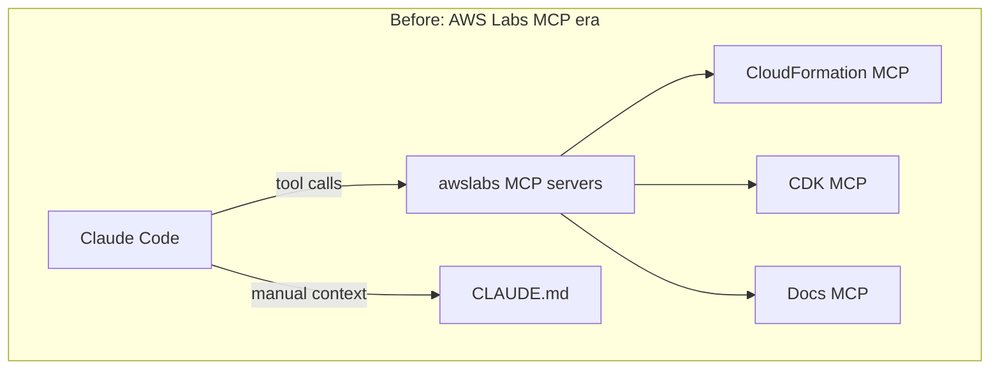
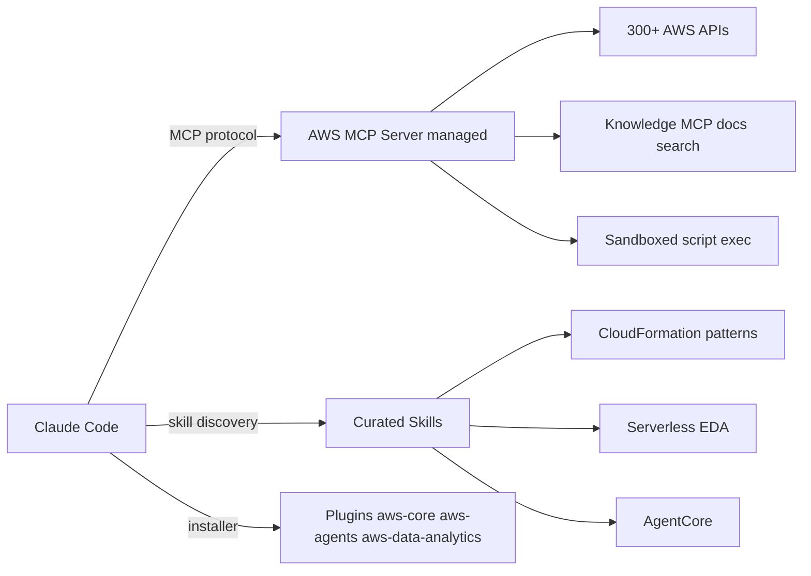

If you've been using Claude Code for AWS development, you've probably seen the pattern: you paste a CloudFormation snippet into your session, Claude suggests something plausible, you deploy it, and the stack events stream lights up with `CREATE_FAILED` on a property the model couldn't have known about — because its training data stopped months ago.

The usual workaround has been hand-rolling context into `CLAUDE.md`: copying service endpoint quirks, IAM condition key syntax, and PrivateLink DNS formats that the model gets wrong. It works, but it's manual, fragile, and grows without bound.

AWS shipped the [Agent Toolkit for AWS][agent-toolkit-aws] (GA) on May 6, 2026 — the official, AWS-supported path forward from the community-grade [AWS Labs][aws-labs] MCP servers, skills, and plugins. Three plugins (`aws-core`, `aws-agents`, `aws-data-analytics`) bundle 30+ curated skills and the AWS MCP Server, [now also GA][aws-mcp-ga-blog]. Plugins ship for Claude Code and Codex out of the box; Kiro and other agents connect through direct MCP server configuration.

This is the fix. But installing it without thinking will burn tokens or open your IAM scope wider than you want. This post is the integration guide for developers already running Claude Code on Bedrock.

---

## Why Claude Code Fails on AWS

The failure modes are consistent:

**Outdated knowledge.** CloudFormation resource schemas evolve. New condition keys appear. Deprecations happen. A model trained before late 2025 won't know about recent additions like `AWS::Bedrock::AgentCore` or new IAM session-tag conditions. It will confidently write something that parses but doesn't deploy.

**Multi-service wiring drift.** A real workload involves IAM, VPC, security groups, CloudWatch, and the actual service — five or six resources that must reference each other in exactly the right way. Claude gets the first two right and starts fabricating ARN formats by resource three.

**No environment awareness.** The model doesn't know your account ID, your VPC endpoint DNS suffixes, or which AZs your subnets are in. Every context injection you forget is a hallucinated placeholder.

The usual answer — more `CLAUDE.md` context — is a patch, not a solution. What you actually need is live AWS knowledge wired into the tool-call loop.

---

## What's in the Toolkit (and How It Differs from AWS Labs)

Before the toolkit, the ecosystem looked like this:



AWS Labs MCP servers were community-grade: useful, but inconsistently maintained, with no end-to-end skill evaluation and no official IAM scoping guidance.

The Agent Toolkit formalizes three layers:



**Skills** are curated packages of instructions and reference materials — validated CloudFormation patterns, Well-Architected serverless heuristics, CDK idioms. They don't make API calls. They constrain the model toward patterns that actually work, and they're loaded on demand so unused skills don't burn context.

**AWS MCP Server** is a managed remote endpoint (`https://aws-mcp.<region>.api.aws/mcp`) reached through the `mcp-proxy-for-aws` stdio shim. It exposes three things to the agent:

- Full AWS API coverage across 300+ services through one authenticated endpoint
- Sandboxed Python execution for multi-step operations
- Real-time documentation search via the Knowledge MCP (`https://knowledge-mcp.global.api.aws`), which needs no AWS credentials

**Plugins** are the delivery mechanism. Three of them at GA:

| Plugin | Coverage |
|---|---|
| `aws-core` | Service selection, CDK/CloudFormation, serverless, containers, storage, observability, billing, SDK usage, deployment. **Start here.** |
| `aws-agents` | Building AI agents on AWS with Amazon Bedrock and AgentCore. |
| `aws-data-analytics` | Data lake, analytics, ETL with S3 Tables, Glue, Athena. |

The concrete improvement over AWS Labs:

- **IAM context keys that distinguish agent actions from human actions** — you can write a policy that allows write-actions for the human role but read-only when reached through the MCP server, even if the underlying role permits writes.
- **CloudWatch metrics and CloudTrail audit logging on every MCP request** — agent activity is observable, not invisible.
- **Skills with end-to-end evaluation** — not just "someone wrote a markdown file."

AWS Labs continues to accept contributions; over time, the best of it transitions into the toolkit.

---

## Installing in Claude Code

Three commands. Run them inside a Claude Code session:

```bash
# Add the marketplace
/plugin marketplace add aws/agent-toolkit-for-aws

# Install the core plugin (start here)
/plugin install aws-core@agent-toolkit-for-aws

# Optional: agents and analytics plugins
/plugin install aws-agents@agent-toolkit-for-aws
/plugin install aws-data-analytics@agent-toolkit-for-aws
```

The plugin ships an `.mcp.json` that registers the AWS MCP Server through `uvx mcp-proxy-for-aws@latest`. So you need [`uv`][uv-docs] installed locally:

```bash
# macOS / Linux
curl -LsSf https://astral.sh/uv/install.sh | sh
```

For documentation search and skill discovery, no AWS credentials are needed. The Knowledge MCP is unauthenticated. For API calls and sandboxed script execution, you do need credentials configured locally — see my [earlier post on credential_process][credential-process-guide] for a pattern that doesn't leave plaintext keys in `~/.aws/credentials`.

### Codex and Other Agents

The same marketplace works in Codex:

```bash
codex plugin marketplace add aws/agent-toolkit-for-aws
```

For agents without plugin support (Kiro and others), configure the AWS MCP Server directly in the agent's MCP config and install skills from the toolkit repo with `npx skills add aws/agent-toolkit-for-aws/skills`.

---

## Scoping IAM Without Footguns

The biggest mistake I've watched developers make: pointing the AWS MCP Server at credentials with `AdministratorAccess`. The toolkit's most important IAM feature exists precisely so you don't have to.

**The agent-vs-human IAM distinction.** Every request the AWS MCP Server forwards on your behalf carries the [`aws:ViaAWSMCPService`][aws-via-mcp-key] context key, which is `true` when an MCP server makes the call and `false` when the principal calls AWS directly. You can write IAM policies that gate behavior on that key — read-only on the agent path, full access on the human path — without splitting roles or vending separate credentials.

A minimal policy that denies destructive actions when reached through the MCP server, while leaving the underlying role's permissions untouched for direct human use:

```json
{
  "Version": "2012-10-17",
  "Statement": [
    {
      "Sid": "DenyDestructiveActionsViaMCP",
      "Effect": "Deny",
      "Action": [
        "cloudformation:DeleteStack",
        "iam:Delete*",
        "iam:Put*",
        "s3:DeleteBucket",
        "dynamodb:DeleteTable"
      ],
      "Resource": "*",
      "Condition": {
        "Bool": {
          "aws:ViaAWSMCPService": "true"
        }
      }
    }
  ]
}
```

This is the canonical pattern from the [AWS IAM docs][aws-via-mcp-key] — the same condition key drives every "agent vs. human" boundary you might want to enforce.

If you want the agent to deploy (not just validate), bound the blast radius by narrowing the resource ARN to a stack-name prefix and constraining the resource types the change set can touch:

```json
{
  "Version": "2012-10-17",
  "Statement": [
    {
      "Sid": "AgentDeployBoundedStackNames",
      "Effect": "Allow",
      "Action": [
        "cloudformation:CreateChangeSet",
        "cloudformation:ExecuteChangeSet",
        "cloudformation:DescribeChangeSet"
      ],
      "Resource": "arn:aws:cloudformation:*:*:stack/claude-code-*/*",
      "Condition": {
        "ForAllValues:StringEquals": {
          "cloudformation:ResourceTypes": [
            "AWS::Lambda::*",
            "AWS::IAM::Role",
            "AWS::Logs::*",
            "AWS::Events::*",
            "AWS::DynamoDB::Table"
          ]
        }
      }
    }
  ]
}
```

Two caveats — both important.

`ForAllValues:StringEquals` evaluates as `true` when the multi-valued key is **absent** from the request. So if the caller doesn't pass `ResourceTypes`, this policy imposes no resource-type restriction at all. To actually enforce the constraint, either require the caller to always pass `ResourceTypes` (workflow convention or service control policy), or pair the existing condition with a `Null` block that denies when the key is missing:

```json
"Condition": {
  "Null": {
    "cloudformation:ResourceTypes": "false"
  },
  "ForAllValues:StringEquals": {
    "cloudformation:ResourceTypes": [ "AWS::Lambda::*", "..." ]
  }
}
```

And if you want this `Allow` to apply only to agent-initiated changes, add an `aws:ViaAWSMCPService: true` condition — the same context key as the `Deny` policy above, used here to scope the allow to MCP traffic instead of denying it.

**Use short-lived credentials.** Don't bake long-lived keys into `~/.aws/credentials`. Assume a role and vend session tokens through `credential_process` — the same pattern works for the MCP server because it just reads from the local credential chain.

---

## Before/After: Building an EventBridge Pipe

Illustrative composite — wiring a DynamoDB stream into SQS via EventBridge Pipes, with the IAM role to make it work. The failure modes below are real ones I've watched models produce; the token figures are rough orders of magnitude, not measurements.

**Without the toolkit.** Claude tends to produce templates with one or more of:

- `DependsOn` that creates a circular reference
- DynamoDB table missing `StreamSpecification` (`StreamViewType: NEW_AND_OLD_IMAGES` not set), so Pipes has no stream to source from
- A Pipes role trust policy that targets the wrong service principal — `events.amazonaws.com` instead of `pipes.amazonaws.com`
- Trust policy missing the `aws:SourceArn` / `aws:SourceAccount` confused-deputy conditions

Two or three rounds of correction. Order of 8K input tokens before the template deploys cleanly.

**With `aws-core` installed.** The relevant skills activate — `aws-serverless` (which has an EventBridge Pipes reference under `orchestration.md` and a `DynamoDB Streams → Pipes → Lambda` pattern in `architecture.md`), `aws-messaging-and-streaming` (Pipes service-principal and confused-deputy guidance), and `aws-iam` (trust policy correctness). The Knowledge MCP can confirm the current `AWS::Pipes::Pipe` schema if needed. Claude produces a deployable template on the first pass with the correct `pipes.amazonaws.com` principal and proper `aws:SourceArn` scoping.

Order of 3K input tokens, one round.

The gain compounds across a session. A complex multi-service stack (API Gateway → Lambda → DynamoDB → EventBridge → SQS, with the right IAM for each hop) used to be a multi-hour back-and-forth. With skills active, it's one generation plus review.

A caveat worth measuring on your own workload: the Knowledge MCP isn't free in tokens. Documentation search returns prose, and prose is expensive. For trivial single-resource changes, the search overhead can exceed what it saves. Benchmark before turning it on for every session — the AWS MCP Server emits CloudWatch metrics that make this measurable.

---

## Layering on Top of Your Existing CLAUDE.md

If you've been hand-rolling AWS context into `CLAUDE.md`, don't throw it out. The toolkit and your custom context are complementary — but split them across two files so you don't leak account topology into the public repo.

`CLAUDE.md` (committed) holds **conventions** that anyone working on the project needs: naming patterns, design rules, what the toolkit handles, project-specific overrides.

`CLAUDE.local.md` (gitignored) holds **environment-specific values** that shouldn't be in source control: account IDs, VPC IDs, subnet IDs, security group IDs, on-call contacts. Add `CLAUDE.local.md` and `.local.*` to `.gitignore` if they aren't already.

A clean layering pattern:

```markdown
# CLAUDE.md (committed)

## What the Agent Toolkit Handles
The aws-core plugin is installed. It provides:
- CloudFormation resource schemas (do not override)
- Serverless and EDA patterns
- IAM best practices
- Live documentation search via the Knowledge MCP

## Project Conventions
- Naming convention: {team}-{service}-{env}-{resource}
- Lambda timeout: 30s max (SLA constraint)
- DynamoDB: always use on-demand billing (cost policy)
- Primary region: ap-northeast-1
- For account ID, VPC, and subnets, see CLAUDE.local.md
```

```markdown
# CLAUDE.local.md (gitignored — never commit)

## Environment Values
- AWS Account: 123456789012 (production)
- VPC ID: vpc-0a1b2c3d4e5f (do not create new VPCs)
- Private subnets: subnet-aaa, subnet-bbb, subnet-ccc
- Security group for outbound: sg-0f1a2b3c
```

Skills load automatically. The two `CLAUDE.md` files fill in what the toolkit can't know. The split keeps your repo shareable while still giving the agent everything it needs in your local checkout.

The toolkit also ships [recommended rules files][toolkit-rules] you can drop into a project to tell agents how to use AWS most effectively — for example, querying the MCP server before fabricating a service capability, or discovering an applicable skill before writing code from scratch. Worth borrowing into your own `CLAUDE.md` even if you don't adopt them wholesale.

---

## A Builder's Perspective: What the Toolkit Got Right

I've been running [a similar system for several months][aws-skills-post] — an open-source [aws-skills][aws-skills-repo] plugin set with `aws-cdk`, `aws-cost-ops`, `serverless-eda`, `aws-agentic-ai`, and a shared `aws-common` dependency. The architecture maps closely to what AWS shipped:

- **Skills are separate from execution.** Injecting expert context into the model is different from making API calls. Keep them distinct so you can use one without the other.
- **One plugin per domain, not a monolith.** A CDK-heavy project doesn't need the serverless-EDA patterns in context. Loading only what's relevant matters at scale.
- **The MCP server is the live signal, not the only signal.** Static skills stay valuable even when documentation search is available. Patterns and idioms don't change as fast as service features.

What the official toolkit has that the community version didn't: the IAM context keys are the real differentiator (these need AWS-side support — you can't bolt them on), the MCP server is production-grade and officially supported, and the Knowledge MCP is backed by the actual documentation index, not a scrape.

If you're starting fresh, install `aws-core` and don't look back. If you've already invested in a custom plugin set like mine, the migration path is to keep your project-specific skills (they capture conventions the toolkit can't know) and let `aws-core` replace the generic ones.

---

## What's Still Missing

Honest gaps as of May 2026:

**No CDK construct-level validation.** Skills cover CloudFormation resource schemas. CDK L2/L3 constructs that wrap those resources get less coverage. If you're generating CDK code, still run `cdk synth` and review the output.

**Account topology isn't auto-discovered.** The MCP server can run describe calls when asked, but it doesn't automatically prime context with your VPC, subnet, and security group IDs at session start. You still need to put those in `CLAUDE.md` or feed them in early.

**Knowledge MCP token cost.** Documentation search isn't always cheaper than the model guessing. For simple operations, it adds tokens. Measure before enabling unconditionally.

**Plugin support beyond Claude Code and Codex.** Plugins are agent-specific. For Kiro and other agents, you configure the MCP server directly and install skills, but you don't get the bundled experience.

### Watch For

The toolkit will move quickly. Things worth tracking:

- More plugins beyond the initial three (security, networking, migration are obvious gaps)
- CDK construct-level skills, not just CloudFormation
- Cross-toolkit composition with AgentCore so agents can call other agents inside the MCP boundary

---

## Summary

The Agent Toolkit for AWS is a meaningful upgrade for Claude Code + AWS workflows. Validated skills give better first-pass accuracy on CloudFormation. The Knowledge MCP keeps the model current with breaking schema changes. The IAM context keys make it safe to give agents real credentials.

Install `aws-core`. Scope the IAM with the agent-vs-human distinction. Layer it on top of your existing `CLAUDE.md` rather than replacing it. Benchmark the Knowledge MCP token cost for your specific workload before turning it on for every session.

If you want to see how this fits with a custom plugin set, my [aws-skills][aws-skills-repo] repo is open source — it predates the official toolkit, the architecture transfers, and the [companion post][aws-skills-post] walks through the same workflow with the community-grade version.

---

<!-- AWS Official Resources -->
[agent-toolkit-aws]: https://github.com/aws/agent-toolkit-for-aws
[aws-mcp-ga-blog]: https://aws.amazon.com/blogs/aws/the-aws-mcp-server-is-now-generally-available/
[aws-via-mcp-key]: https://docs.aws.amazon.com/IAM/latest/UserGuide/reference_policies_condition-keys.html#condition-keys-viaawsmcpservice
[toolkit-rules]: https://github.com/aws/agent-toolkit-for-aws/tree/main/rules
[aws-labs]: https://github.com/awslabs

<!-- Tooling -->
[uv-docs]: https://docs.astral.sh/uv/

<!-- Related Projects -->
[aws-skills-repo]: https://github.com/zxkane/aws-skills

<!-- Related Articles (Internal Links) -->
[credential-process-guide]: 
[aws-skills-post]: 
[claude-code-cost-guide]: 

*Related posts: [Build on AWS Faster with Claude Code and AWS Skills][aws-skills-post] · [Secure AWS Credentials with credential_process][credential-process-guide] · [Claude Code Cost Per Project on AWS][claude-code-cost-guide]*
