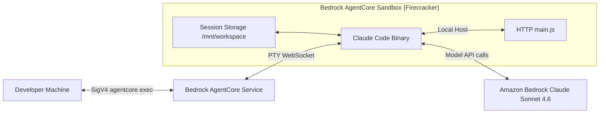
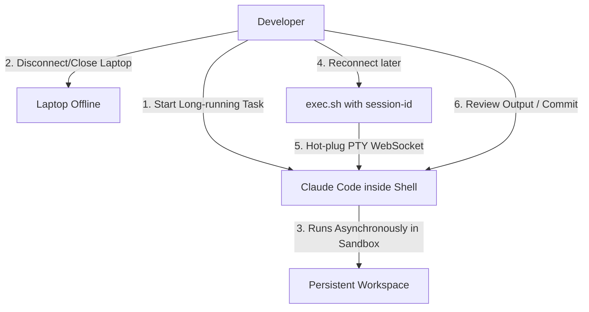

If you have ever set an AI coding agent like Claude Code loose on a large code modification task, you know the anxiety. The task will run for 45 minutes, recursive calls will compile code, search tests, and fix bugs. You are locked to your machine. If your Wi-Fi drops for a second, your laptop battery dies, or you close your laptop to go to lunch, the terminal session breaks, the shell process is killed, and the entire agent context is lost.

For agents to become true team members rather than simple command-line utilities, we need to shift our paradigm from "local developer assistants" to "cloud-hosted coworkers."

This post shows how to build a fully secure, persistent, and asynchronous AI coding environment in the cloud. By deploying the **Amazon Bedrock AgentCore Runtime** (which runs in isolated Firecracker microVMs) using **SST v4**, you can dispatch long-running engineering tasks, close your laptop, and let the agent work.

---

## 1. The Persistent Shell Sandbox

To build a persistent cloud-hosted coding assistant, we need to leverage the security and persistence features of AWS Bedrock AgentCore Runtime:



### 1.1 Amazon Bedrock AgentCore Runtime
Amazon Bedrock AgentCore provides the underlying host environment. Each session runs in an isolated Firecracker microVM, ensuring a zero-trust, secure sandbox.
- **Persistent Session Storage:** By mounting **Managed Session Storage** at `/mnt/workspace`, files, git history, and runtime environments persist across session pauses and restarts.
- **WebSocket TTY Terminal:** The `bedrock-agentcore:InvokeAgentRuntimeCommandWithWebSocketStream` action exposes a bidirectional WebSocket connection. It allows developers to attach a PTY shell directly into the running AgentCore session, providing a true SSH-like debugging experience.
- **Concurrency & Expire Rules:** Each AgentCore runtime supports up to 10 concurrent active shell sessions. During its **Preview** phase, Managed Session Storage has a 14-day idle expiry policy, and data is reset when the runtime version updates.

---

## 2. The Asynchronous Collaboration Model

Moving the agent to the cloud changes the developer user experience. Instead of sitting and watching terminal output, you adopt an asynchronous, event-driven workflow:



1. **Dispatch:** You assign a bug or a task to the agent.
2. **Disconnect:** You close your laptop. The container continues to run inside AWS.
3. **Hot-Plug Debugging:** If the agent runs into a blocker—a compile error it can't resolve or an ambiguous requirement—you can attach a WebSocket terminal, resolve the blocker manually, detach from the session, and close your laptop again. The agent picks up exactly where it left off.

---

## 3. The Pivot: From CDK to SST v4

During the initial design phase, the project utilized the `@aws/agentcore-cdk` construct and the `@aws/agentcore` CLI. However, this approach introduced several limitations that led to an infrastructure pivot:

### 3.1 Over-Privileged Default Roles
The CDK L3 construct automatically generated IAM execution roles with broad, wildcard model access (`foundation-model/*` and `inference-profile/*`). Because CloudFormation custom resources wrapped the role compilation, there was no clean way to narrow down the permissions. 

By pivoting to **SST v4** using naked Pulumi providers (`aws` and `aws-native`), we built the infrastructure entirely in TypeScript. This allows us to define a custom least-privilege execution role scoped strictly to the cross-region inference profile (`us.anthropic.claude-sonnet-4-6`) and the specific models required.

### 3.2 Simplified Build Pipeline
Rather than a local Docker asset build, the `@aws/agentcore-cdk` L3 construct wired up a remote build pipeline: a `CodeBuild::Project`, a `Lambda::Function`, and a custom resource to compile the container image. This isn't a CDK limitation — plain CDK's `DockerImageAsset` builds locally too — but it's what the construct's abstraction gave us.

Pivoting to SST v4 let us use Pulumi's native Docker-build provider directly, with the same local-build-then-push shape as a plain CDK asset, minus the L3 construct's three extra remote-build layers.

---

## 4. The Node.js 24 Runtime

The runtime container is built on Node.js 24, aligned with the project's Node standards. Building it surfaced three engineering lessons worth knowing before you write your own contract server:

### 4.1 Claude Code is a Self-Contained Native Binary
While Claude Code is distributed via npm, the npm package is merely a wrapper. The actual tool is installed via a native installer script:
```bash
curl -fsSL https://claude.ai/install.sh | bash
```
It bundles its own runtime and `ripgrep` binary, meaning that Claude Code does not depend on the container's Node.js environment to run.

### 4.2 Minimal HTTP Contract Server
For AgentCore to identify the container as healthy, it expects a web server on port 8080 responding to:
- `GET /ping` (Liveness checks)
- `POST /invocations` (Invocation handler)

We implemented this as a zero-dependency CommonJS server in `main.js` using Node's native `http` module.

### 4.3 Node ADOT Observability Gotchas
Node's AWS Distro for OpenTelemetry (ADOT) has two behaviors worth knowing upfront:
1. **No Binary Wrapper:** ADOT has no standalone CLI command to launch your app under. It's loaded via the `--require` flag instead:
   ```bash
   node --require @aws/aws-distro-opentelemetry-node-autoinstrumentation/register main.js
   ```
2. **CommonJS Requirement:** ADOT patches Node's `require()` hooks at startup. It does **not** support ESM `import` syntax out-of-the-box. If the project uses ESM, ADOT will silently fail to send traces. Therefore, the contract server must use CommonJS syntax (`require`), and `package.json` must **not** contain `"type": "module"`.

---

## 5. Login Shell Environment Persistence

A critical pitfall in the container configuration relates to how Bedrock handles interactive shells.

The environment variables specified in the Dockerfile `ENV` block or the AgentCore Runtime configuration only reach processes spawned under PID 1 (such as the contract server). However, when a developer runs `agentcore exec --it`, Bedrock spawns a fresh **login shell**. This shell does not inherit environment variables from PID 1.

Without these variables (`CLAUDE_CODE_USE_BEDROCK=1` and `ANTHROPIC_MODEL`), Claude Code will default to the Anthropic API instead of Bedrock, causing it to fail with "Not logged in" errors.

To solve this, write the Bedrock configuration directly to `/etc/profile.d/`:

```bash
RUN printf '%s\n' \
    'export AWS_REGION=us-east-1' \
    'export CLAUDE_CODE_USE_BEDROCK=1' \
    'export ANTHROPIC_MODEL=us.anthropic.claude-sonnet-4-6' \
    'export PATH="/home/bedrock_agentcore/.local/bin:$PATH"' \
    > /etc/profile.d/claude-bedrock.sh \
    && chmod 0644 /etc/profile.d/claude-bedrock.sh
```

This forces every login shell to load the necessary environment variables and add Claude Code to the `PATH`.

---

## 6. Code Implementation

Let's look at the key implementation files from the [PoC repository][poc-repo].

### 6.1 sst.config.ts
The entrypoint imports our infrastructure resources:

```typescript
/// <reference path="./.sst/platform/config.d.ts" />

export default $config({
  app(input) {
    return {
      name: "agentcore-claude-shell-poc",
      removal: input?.stage === "prod" ? "retain" : "remove",
      protect: input?.stage === "prod",
      home: "aws",
      providers: {
        aws: {
          region: "us-east-1",
          defaultTags: {
            tags: {
              Project: "agentcore-claude-shell-poc",
              Stage: input?.stage ?? "dev",
              ManagedBy: "sst",
            },
          },
        },
        "aws-native": {
          version: "1.69.0",
          region: "us-east-1",
        },
      },
    };
  },
  async run() {
    const runtime = await import("./infra/runtime");
    return {
      runtimeArn: runtime.runtimeArn,
      runtimeId: runtime.runtimeId,
    };
  },
});
```

### 6.2 infra/image.ts
Pulumi's `@pulumi/docker-build` provider builds the runtime image locally and pushes it to ECR. The `imageUri` export is pinned by digest, so the runtime resource always references the exact pushed image rather than a mutable `:latest` tag:

```typescript
import * as path from "node:path";
import * as dockerBuild from "@pulumi/docker-build";

// `aws` is an SST global — declared in .sst/platform/config.d.ts. No import needed.

// The Pulumi program runs from .sst/platform, so docker-build resolves relative paths from
// there. Anchor on the absolute project root via $cli.paths.root.
const contextDir = path.join($cli.paths.root, "app", "claude_shell_poc");

export const repository = new aws.ecr.Repository("ClaudeShellRepo", {
  name: "jeffclaudeshellpoc/claudeshellpoc",
  imageTagMutability: "MUTABLE",
  forceDelete: true,
  imageScanningConfiguration: { scanOnPush: true },
});

const authToken = aws.ecr.getAuthorizationTokenOutput({
  registryId: repository.registryId,
});

export const image = new dockerBuild.Image("ClaudeShellImage", {
  context: { location: contextDir },
  dockerfile: { location: `${contextDir}/Dockerfile` },
  platforms: ["linux/arm64"],
  tags: [$interpolate`${repository.repositoryUrl}:latest`],
  push: true,
  registries: [
    {
      address: repository.repositoryUrl,
      username: authToken.userName,
      password: authToken.password,
    },
  ],
});

// Pinned-by-digest URI — runtime always references the exact pushed image.
export const imageUri = $interpolate`${repository.repositoryUrl}@${image.digest}`;
```

A few details worth highlighting:

- **No `@pulumi/aws` import**: `aws` is exposed as an SST global. The same pattern applies to `awsnative` later. This eliminates the typical Pulumi boilerplate.
- **`linux/arm64`**: AgentCore happily runs ARM containers, and the build host (an EC2 Graviton instance in this case) is also ARM. No cross-arch QEMU emulation needed.
- **Digest pinning** (`${repositoryUrl}@${image.digest}`) ensures Pulumi correctly detects image changes and triggers a runtime update.

### 6.3 infra/iam.ts
The self-built runtime execution role restricts Bedrock invocation strictly to Claude Sonnet 4.6 — no `foundation-model/*` wildcard. The role also carries the baseline grants AgentCore needs (ECR pull, CloudWatch Logs, X-Ray) so we can drop the L3 construct entirely. Showing the headline statements:

```typescript
import { repository } from "./image";

// `aws` is an SST global — no import needed.

const region = "us-east-1";
const accountId = aws.getCallerIdentityOutput({}).accountId;
const inferenceProfile = "us.anthropic.claude-sonnet-4-6";

export const role = new aws.iam.Role("ClaudeShellRuntimeRole", {
  assumeRolePolicy: JSON.stringify({
    Version: "2012-10-17",
    Statement: [
      {
        Effect: "Allow",
        Principal: { Service: "bedrock-agentcore.amazonaws.com" },
        Action: "sts:AssumeRole",
      },
    ],
  }),
  description: "Least-privilege execution role for the Claude shell AgentCore runtime",
});

new aws.iam.RolePolicy("ClaudeShellRuntimePolicy", {
  role: role.id,
  policy: $resolve([accountId, repository.arn]).apply(([acct, repoArn]) =>
    JSON.stringify({
      Version: "2012-10-17",
      Statement: [
        {
          Sid: "BedrockSonnetOnly",
          Effect: "Allow",
          Action: ["bedrock:InvokeModel", "bedrock:InvokeModelWithResponseStream"],
          Resource: [
            `arn:aws:bedrock:*::foundation-model/anthropic.claude-sonnet-4-6*`,
            `arn:aws:bedrock:${region}:${acct}:inference-profile/${inferenceProfile}`,
          ],
        },
        {
          Sid: "BedrockProfileMetadata",
          Effect: "Allow",
          Action: ["bedrock:GetInferenceProfile"],
          Resource: `arn:aws:bedrock:${region}:${acct}:inference-profile/${inferenceProfile}`,
        },
        {
          Sid: "BedrockMarketplace",
          Effect: "Allow",
          Action: ["aws-marketplace:ViewSubscriptions", "aws-marketplace:Subscribe"],
          Resource: "*",
          Condition: { StringEquals: { "aws:CalledViaLast": "bedrock.amazonaws.com" } },
        },
        // Plus EcrAuth, EcrPull, LogsDescribe, LogsWrite, Xray, BedrockListProfiles
        // — see infra/iam.ts in the repo for the full nine-statement policy.
      ],
    }),
  ),
});

export const executionRoleArn = role.arn;
```

Two patterns worth calling out:

- **`aws.getCallerIdentityOutput({}).accountId`** returns a Pulumi `Output<string>`. Composing it into resource ARNs uses `$resolve(...).apply(...)` rather than awaiting a Promise — the latter would JSON-stringify a `[object Promise]` literal into the policy.
- **The marketplace statement with `aws:CalledViaLast`** is the same pattern as Claude Code's official Bedrock docs sample. It scopes marketplace subscription actions to calls that originated from Bedrock — narrower than a bare wildcard.

### 6.4 infra/runtime.ts
The runtime resource itself uses Pulumi's `aws-native` provider, pointing at the ECR image and the self-built role:

```typescript
import { imageUri } from "./image";
import { executionRoleArn } from "./iam";

// `awsnative` and `aws` are SST globals.

export const runtime = new awsnative.bedrockagentcore.Runtime("ClaudeShellRuntime", {
  agentRuntimeName: "JeffClaudeShellPoc_ClaudeShellPoc",
  description: "Container runtime with Claude Code preinstalled for interactive shell validation.",
  roleArn: executionRoleArn,
  agentRuntimeArtifact: {
    containerConfiguration: { containerUri: imageUri },
  },
  networkConfiguration: {
    networkMode: awsnative.bedrockagentcore.RuntimeNetworkMode.Public,
  },
  protocolConfiguration: awsnative.bedrockagentcore.RuntimeProtocolConfiguration.Http,
  environmentVariables: {
    AWS_REGION: "us-east-1",
    CLAUDE_CODE_USE_BEDROCK: "1",
    ANTHROPIC_MODEL: "us.anthropic.claude-sonnet-4-6",
  },
  filesystemConfigurations: [
    { sessionStorage: { mountPath: "/mnt/workspace" } },
  ],
});

export const runtimeArn = runtime.agentRuntimeArn;
export const runtimeId = runtime.agentRuntimeId;
```

### 6.5 app/claude_shell_poc/Dockerfile
The Node 24 runtime image preinstalls Claude Code using the native installer and configures ADOT:

```dockerfile
FROM public.ecr.aws/docker/library/node:24-bookworm-slim

# Shell tooling for the interactive demo. No nodejs/npm here — the base image
# provides Node 24, and Claude Code installs as a self-contained native binary.
RUN apt-get update && apt-get install -y --no-install-recommends \
    bash \
    ca-certificates \
    curl \
    git \
    jq \
    less \
    procps \
    && rm -rf /var/lib/apt/lists/*

# The node:24 base already ships a `node` user at UID/GID 1000; remove it so we
# can keep bedrock_agentcore at the conventional UID 1000.
RUN userdel -r node 2>/dev/null || true; \
    groupadd -g 1000 bedrock_agentcore && \
    useradd -m -u 1000 -g 1000 bedrock_agentcore && \
    mkdir -p /mnt/workspace

WORKDIR /app

ENV NODE_ENV=production \
    DOCKER_CONTAINER=1 \
    HOME=/home/bedrock_agentcore \
    AWS_REGION=us-east-1 \
    CLAUDE_CODE_USE_BEDROCK=1 \
    ANTHROPIC_MODEL=us.anthropic.claude-sonnet-4-6 \
    PATH="/home/bedrock_agentcore/.local/bin:/app/node_modules/.bin:$PATH"

# Docker ENV only reaches the CMD process (PID 1). `agentcore exec --it` spawns
# a fresh login shell that does NOT inherit PID 1's env, so without this it falls
# back to the Anthropic API and fails with "Not logged in". Mirror the Bedrock
# settings into /etc/profile.d so every interactive/login shell picks them up,
# and make sure the user's local bin (claude) is on PATH there too.
RUN printf '%s\n' \
    'export AWS_REGION=us-east-1' \
    'export CLAUDE_CODE_USE_BEDROCK=1' \
    'export ANTHROPIC_MODEL=us.anthropic.claude-sonnet-4-6' \
    'export PATH="/home/bedrock_agentcore/.local/bin:$PATH"' \
    > /etc/profile.d/claude-bedrock.sh \
    && chmod 0644 /etc/profile.d/claude-bedrock.sh

# Install the Node ADOT auto-instrumentation (provides `opentelemetry-instrument`).
COPY package.json ./
RUN npm install --omit=dev --no-audit --no-fund

# Install Claude Code as a self-contained native binary (official native installer).
# It does NOT depend on the image's Node; it bundles its own runtime + ripgrep.
USER bedrock_agentcore
RUN curl -fsSL https://claude.ai/install.sh | bash \
    && /home/bedrock_agentcore/.local/bin/claude --version
USER root

COPY --chown=bedrock_agentcore:bedrock_agentcore . .
RUN chown -R bedrock_agentcore:bedrock_agentcore /app /mnt/workspace /home/bedrock_agentcore

USER bedrock_agentcore

EXPOSE 8080 8000 9000

# Node ADOT has no `opentelemetry-instrument` binary (that's the Python distro);
# it ships a `--require`-able register hook (package "./register" export). Load it
# via --require so auto-instrumentation patches require() before main.js runs.
CMD ["node", "--require", "@aws/aws-distro-opentelemetry-node-autoinstrumentation/register", "main.js"]
```

### 6.6 scripts/exec.sh
The connection tool reads the runtime ARN from the SST output file (`.sst/outputs.json`) and establishes a pinned session:

```bash
#!/usr/bin/env bash
set -euo pipefail

ROOT="$(cd "$(dirname "${BASH_SOURCE[0]}")/.." && pwd)"
cd "$ROOT"

REGION="${AGENTCORE_REGION:-us-east-1}"

# Session pinning. By default we reuse ONE fixed session so repeated `exec`
# attach to the same microVM (warm, same /mnt/workspace) until it idles out
# (idleRuntimeSessionTimeout) or hits maxLifetime. Override to start a fresh
# session via either the SESSION_ID env var or the first positional arg.
#   ./scripts/exec.sh                       # reuse default fixed session
#   ./scripts/exec.sh my-other-session-id   # use a different (new) session
#   SESSION_ID=... ./scripts/exec.sh        # same, via env
#   AgentCore requires the session id to be 33-256 characters.
DEFAULT_SESSION_ID="agentcore-claude-shell-poc-default-session"
SESSION_ID="${1:-${SESSION_ID:-$DEFAULT_SESSION_ID}}"

if (( ${#SESSION_ID} < 33 || ${#SESSION_ID} > 256 )); then
  echo "Session id must be 33-256 characters (got ${#SESSION_ID}): '$SESSION_ID'" >&2
  exit 1
fi

# Jq is required to read the SST outputs unless RUNTIME_ARN is supplied directly.
if [[ -z "${RUNTIME_ARN:-}" ]] && ! command -v jq >/dev/null 2>&1; then
  echo "exec.sh needs 'jq' to read .sst/outputs.json (install: apt-get install jq / brew install jq), or set RUNTIME_ARN explicitly." >&2
  exit 1
fi

# Resolve the runtime ARN. Precedence:
#   1. Explicit RUNTIME_ARN env override
#   2. SST deploy outputs (.sst/outputs.json — written by `sst deploy`)
RUNTIME_ARN="${RUNTIME_ARN:-}"
if [[ -z "$RUNTIME_ARN" && -f "$ROOT/.sst/outputs.json" ]]; then
  RUNTIME_ARN="$(jq -r '.runtimeArn // empty' "$ROOT/.sst/outputs.json" 2>/dev/null || true)"
fi

if [[ -z "$RUNTIME_ARN" || "$RUNTIME_ARN" == "null" ]]; then
  echo "Runtime ARN not found. Run 'npm run deploy' first, or set RUNTIME_ARN explicitly." >&2
  exit 1
fi

echo "Attaching to session: $SESSION_ID" >&2

# Interactive, SigV4-authenticated shell into the runtime. This is an operator
# tool, not IaC — the runtime itself is managed by SST (infra/runtime.ts).
exec npx @aws/agentcore@0.19.0 exec --it \
  --runtime "$RUNTIME_ARN" --region "$REGION" --session-id "$SESSION_ID"
```

---

## 7. Operational Lessons from Running the PoC

A handful of operational details only become visible after you actually deploy and shell into the runtime. None of them are blockers, but each one will surprise you the first time you hit it:

### 7.1 Three Distinct "Sessions" — Don't Confuse Them
AgentCore exposes three layers of session that each have their own lifecycle:

- **Agent runtime** — the deployed container artifact (the resource declared in `infra/runtime.ts`). Lives until you `sst remove`.
- **Runtime session** — keyed by `--session-id` on the `agentcore exec` call. Holds the persistent filesystem state (`/mnt/workspace`, `/tmp`, etc.). Survives shell disconnects. Expires after 14 days of inactivity.
- **Shell session** — the WebSocket TTY connection itself. Has its own 10-second confirmation timeout and 1-of-5 reconnect policy. Disconnecting and reattaching with the same `--session-id` reconnects to the same runtime session, but it spawns a *new* shell session — you'll see a `[new shell session (previous session expired)]` notice on reconnect.

Concretely: a file you wrote to `/tmp/probe.txt` in one shell remains visible in a new shell session **only if you reconnect with the same `--session-id`**. Switching `--session-id` gives you a fresh runtime session with an empty filesystem. The `exec.sh` script in §6.6 hardcodes a `DEFAULT_SESSION_ID`, which is exactly what you want for solo use — every reconnect lands on the same warm workspace.

### 7.2 One-Shot `exec` Has an Argument-Splitting Quirk
The `agentcore exec` command nominally supports a one-shot mode (`agentcore exec --runtime ... -- claude --print "explain this codebase"`). In practice, the multi-word prompt argument gets split into separate argv entries somewhere in the CLI plumbing, and Claude Code receives only the first word. The production-friendly path is to **stay inside an interactive shell** — run `agentcore exec --it`, then invoke Claude (or any other multi-arg command) inside the shell where standard quoting works.

### 7.3 Watch Out for `INIT_CWD` Inheritance
If you run the PoC's deploy commands from a host shell that inherits `INIT_CWD` from a parent npm/pnpm process (e.g. a wrapper script that itself was launched by `npm run`), the `agentcore` CLI's project-root detection can mis-resolve and report `No agentcore project found`. The SST `infra/agentcore.ts` of the original prototype worked around this by setting `INIT_CWD` explicitly before invoking the deploy script. The current SST-native build sidesteps the CLI entirely, so this footgun mostly applies if you mix SST deploy with manual `agentcore` CLI invocations.

---

## 8. Cost Model and Closing Thoughts

Running Claude Code on Bedrock AgentCore introduces three cost surfaces, all of them modest at PoC scale:

- **AgentCore runtime compute** is billed only while a runtime session is active. The 14-day idle-expiry policy means a session that no one touches for two weeks gets reclaimed automatically — you don't pay rent on forgotten experiments.
- **Bedrock model tokens** are billed per `bedrock:InvokeModel` call. Pinning to a single inference profile (`us.anthropic.claude-sonnet-4-6`) makes the bill auditable: every Bedrock charge on the account is attributable to this PoC.
- **ECR storage** is the trivial line item. Setting `forceDelete: true` on the repository (see §6.2) means `sst remove` actually deletes the repo and all images. Without it, ECR keeps every image you ever pushed and you'll find old PoC artifacts on the bill long after you forgot the project.

Even at active development pace, these charges are negligible compared to developer downtime. When running a complex task locally, a developer is pinned to their terminal — unable to close the laptop, change networks, or switch contexts. Moving execution to a persistent AgentCore container with a self-built least-privilege role lets developers dispatch long-running engineering tasks, shut the laptop, and retrieve results asynchronously. The end-to-end picture is roughly four moving parts: SST v4 + Pulumi as the IaC, AgentCore Runtime as the secure host, Claude Code on Bedrock as the model layer, and `agentcore exec --it` as the operator entry point. Everything else is plumbing.

---

<!-- GitHub Repositories -->
[poc-repo]: https://github.com/zxkane/agentcore-claude-shell

<!-- Related Articles (Internal Links) -->
[credential-process-guide]: 
[aws-skills-post]: 
[claude-code-cost-guide]: 
[agent-toolkit-aws-post]: 

Related posts:

- [Agent Toolkit for AWS: What It Changes for Claude Code][agent-toolkit-aws-post] — the Bedrock AgentCore tool-calling layer that pairs with this runtime setup.
- [Build on AWS Faster with Claude Code and AWS Skills][aws-skills-post] — the skills workflow this AgentCore runtime is built to run unattended.
- [Secure AWS Credentials with credential_process][credential-process-guide] — how the runtime's Bedrock calls get scoped, least-privilege AWS credentials.
- [Claude Code Cost Per Project on AWS][claude-code-cost-guide] — attributing the Bedrock token spend this runtime generates back to a project.
