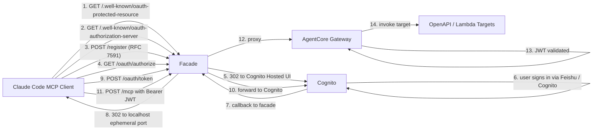

## Introduction

[Amazon Bedrock AgentCore Gateway][agentcore-gateway-docs] is the most pragmatic way to host a Model Context Protocol server on AWS today. Declare your tools as OpenAPI or as Lambda targets, get a managed multi-target MCP endpoint, and inherit AWS-native authentication via a `customJwtAuthorizer`. For machine-to-machine traffic that pattern is excellent.

The moment you ask an interactive MCP client — [Claude Code][claude-code], Cursor, the [MCP Inspector][mcp-inspector] — to talk to that same gateway with a per-user OAuth flow, the seams show. AgentCore Gateway expects a JWT and trusts whatever issuer you wired into its authorizer. Pair it with [Amazon Cognito][cognito] and the wiring works for the *server* side. It does not work for the *client* side, because Cognito is an OIDC identity provider, not an MCP-compliant authorization server. The two are not the same thing.

The MCP authorization spec is built on a specific stack of IETF RFCs — [RFC 9728][rfc-9728] (Protected Resource Metadata), [RFC 8414][rfc-8414] (Authorization Server Metadata), [RFC 7591][rfc-7591] (Dynamic Client Registration), and [RFC 7636][rfc-7636] (PKCE). I covered the full stack in my [MCP authorization deep-dive][mcp-oauth-deep-dive] and showed how [Keycloak fills it cleanly with one workaround][keycloak-mcp]. Cognito does not fill it. Without those RFCs, Claude Code never gets past metadata discovery and reports `Failed to connect`.

This post walks through an architecture I shipped recently: a small API Gateway + Lambda façade that adds the missing RFC surfaces in front of an AgentCore Gateway backed by Cognito. The result is a `claude mcp add <https-url>` that just works, while keeping Cognito as the identity provider and AgentCore Gateway as the multi-target MCP runtime.

## Why AgentCore Gateway

If you treat AgentCore Gateway purely as an MCP transport, the value is real and worth restating before we critique the auth story.

* **Multi-target multiplexing.** One MCP endpoint fronts many backends — OpenAPI HTTP services, Lambda functions, even Smithy models — without your client ever knowing they're separate.
* **Two backend shapes that cover most needs.** External HTTP backends (with their own JWT authorizer) plug in via OpenAPI; in-account Lambda backends invoked via the gateway's IAM role need no second auth layer at all.
* **Tool-level interceptors.** A gateway-attached Lambda can run on every `tools/list` and `tools/call` to gate which tools a given JWT scope sees. The interceptor is your scope-to-tool mapping in code.
* **In-place updates of the JWT authorizer's `allowedClients`.** Adding or removing a tenant's M2M client does not rotate the gateway URL. That is the kind of operational property you only appreciate after living without it.
* **Managed scaling, observability, and session isolation.** No fleet to run, no transport code to maintain.

For a sense of how an OAuth2 client interacts with this surface from the client side, see my earlier walkthroughs on [invoking AgentCore-hosted MCP servers][invoke-agentcore-mcp] and [using the MCP SDK's `OAuthClientProvider`][oauthclientprovider-agentcore].

## Where Cognito Falls Short for MCP

AgentCore Gateway's `customJwtAuthorizer` validates inbound JWTs against a `discoveryUrl` and an `allowedClients` list. Point that at Cognito, M2M traffic with `client_credentials` works immediately. Interactive flows are where the spec asymmetry bites.

The MCP authorization spec asks the *resource* to advertise its authorization server, and asks the *authorization server* to support a small handful of behaviours that Cognito does not.

| RFC | What MCP requires | What Cognito does |
|-----|-------------------|-------------------|
| [RFC 9728][rfc-9728] — Protected Resource Metadata | `/.well-known/oauth-protected-resource` returns the resource identifier and links to its `authorization_servers` | Not served by Cognito; AgentCore Gateway emits the header but points at the OIDC issuer |
| [RFC 8414][rfc-8414] — Authorization Server Metadata | `/.well-known/oauth-authorization-server` under the issuer URL | Cognito only serves OIDC discovery at `/.well-known/openid-configuration` under the `cognito-idp.<region>.amazonaws.com/<pool-id>` path |
| [RFC 7591][rfc-7591] — Dynamic Client Registration | Public `registration_endpoint` so clients with no preconfigured `client_id` can self-register | No public DCR endpoint; admin-only `CreateUserPoolClient` API |
| [RFC 6749 §3.1.2.3][rfc-6749] — exact `redirect_uri` match | Native MCP clients open OAuth callback listeners on a *random ephemeral port* | Hosted UI requires the `redirect_uri` to match a pre-registered `callbackUrls` entry exactly — you cannot enumerate every port |

Each gap is independently a hard stop for Claude Code. Together they explain a behaviour I watched many times during the spike: paste the gateway URL into `claude mcp add`, see Claude Code attempt RFC 9728 metadata discovery, hit an issuer that does not serve RFC 8414, and surface a generic "Failed to connect."

The third gap — DCR — is structural. MCP's design assumes a federated ecosystem where clients are not pre-provisioned by every server they want to talk to. SEP-991 [softens that with Client ID Metadata Documents][sep-991-post], but Claude Code's stable build still expects a registration endpoint to be advertised, and Cognito does not have one. The fourth gap is the most operationally annoying: Cognito's exact-match callback URL rule (per [RFC 6749 §3.1.2.3][rfc-6749]) is correct from a security perspective but incompatible with native-app loopback redirects ([RFC 8252 §7.3][rfc-8252]) on random ports.

This is the same shape of friction I documented for Keycloak — see [Implementing MCP OAuth 2.1 with Keycloak on AWS][keycloak-mcp] — except Keycloak only needed the [RFC 8707][rfc-8707] audience workaround and was otherwise compliant out of the box. Cognito needs four gaps closed, not one.

## The Façade Pattern

Closing those four gaps does not require replacing Cognito or AgentCore. It requires putting a thin, stateless adapter in front of both, which:

1. **Serves RFC 9728 / RFC 8414 metadata** that points back at itself for `authorization_endpoint`, `token_endpoint`, and `registration_endpoint` — so the client never tries to GET RFC 8414 from a Cognito URL where it does not exist.
2. **Implements RFC 7591** by returning the same pre-provisioned Cognito user-pool app client to every caller. Conceptually a "fake" DCR, behaviourally indistinguishable from the real thing for a confidential client whose secret is held by the façade.
3. **Acts as the single registered Cognito callback URL** and 302-redirects the authorization code to whatever loopback port the client picked. State is round-tripped through Cognito as an HMAC-signed opaque blob so the proxy stays stateless.
4. **Proxies everything else** straight to AgentCore Gateway, including the `/mcp` endpoint that carries the actual JSON-RPC traffic.

That is one Lambda behind one HTTP API in front of one AgentCore Gateway. The full architecture:



The façade does four small jobs. The agent runtime does the heavy lifting. Cognito remains the source of truth for identity. Nothing in the AgentCore Gateway configuration changes — its `customJwtAuthorizer` still trusts the Cognito issuer, the same as for an M2M client.

## Implementation: Four Routes That Matter

The façade lives in `src/lambdas/oauth2-facade/handler.ts`. It has more routes than I'll show here, but four of them carry the architectural weight. I'll walk each.

### Route 1: RFC 9728 Protected Resource Metadata

When AgentCore Gateway returns a 401, it emits a `WWW-Authenticate: Bearer resource_metadata="…"` header per RFC 9728. The MCP client follows that URL to learn which authorization server protects the resource. The façade serves the metadata itself and points back at itself as the authorization server:

```typescript
if (path === "/.well-known/oauth-protected-resource") {
  return json(200, {
    resource: `${base}/mcp`,
    authorization_servers: [base],
    scopes_supported: RESOURCE_SCOPES,
    bearer_methods_supported: ["header"],
  });
}
```

The crucial line is `authorization_servers: [base]`. Pointing at Cognito's OIDC issuer here would push the client straight back into the RFC 8414 gap. Pointing at the façade keeps discovery on a path the façade controls.

### Route 2: RFC 8414 Authorization Server Metadata

The same idea, one step further. The façade advertises *itself* as the `authorization_endpoint` and `token_endpoint`, while passing through `userinfo`, `revocation`, and `jwks_uri` to Cognito because those endpoints do not need any redirect proxying:

```typescript
if (path === "/.well-known/oauth-authorization-server") {
  return json(200, {
    issuer: ISSUER,
    authorization_endpoint: `${base}/oauth/authorize`,
    token_endpoint: `${base}/oauth/token`,
    userinfo_endpoint: USERINFO,
    revocation_endpoint: REVOCATION,
    jwks_uri: JWKS,
    registration_endpoint: `${base}/register`,
    response_types_supported: ["code"],
    grant_types_supported: ["authorization_code", "refresh_token"],
    code_challenge_methods_supported: ["S256"],
    token_endpoint_auth_methods_supported: [
      "client_secret_basic",
      "client_secret_post",
    ],
    scopes_supported: ["openid", "email", "profile", ...RESOURCE_SCOPES],
  });
}
```

`issuer` stays as the real Cognito issuer because the JWT's `iss` claim will carry that value. AgentCore Gateway's `customJwtAuthorizer` validates `iss` against the discovery URL it was configured with. If the façade lied about the issuer here, the JWT would still pass through Cognito unchanged and AgentCore would reject it. The façade rewrites *paths*, not *claims*.

`code_challenge_methods_supported` is `["S256"]` only — the proxy refuses `plain` PKCE explicitly, because `plain` transmits the verifier unhashed and negates the protection PKCE was meant to provide.

### Route 3: RFC 7591 Dynamic Client Registration

Cognito has no public DCR endpoint. Building one would mean exposing privileged Cognito admin APIs. The pragmatic alternative is to acknowledge that, in this deployment shape, every MCP client ends up using the *same* Cognito user-flow app client — its identity is the human user, not the calling application. So the façade implements a "fake DCR" that returns the same pre-provisioned client to every caller:

```typescript
if (path === "/register" && method === "POST") {
  let req: { redirect_uris?: string[] } = {};
  try { req = JSON.parse(event.body ?? "{}"); } catch {}
  return json(201, {
    client_id: USER_CLIENT_ID,
    client_secret: USER_CLIENT_SECRET,
    client_id_issued_at: Math.floor(Date.now() / 1000),
    client_secret_expires_at: 0,
    redirect_uris: req.redirect_uris ?? ["http://localhost:8080/callback"],
    grant_types: ["authorization_code", "refresh_token"],
    response_types: ["code"],
    token_endpoint_auth_method: "client_secret_post",
    scope: ["openid", "email", ...RESOURCE_SCOPES].join(" "),
  });
}
```

This satisfies Claude Code's expectation that a `registration_endpoint` exists and returns a `client_id` it can drive an authorization-code flow with. The trade-off — every MCP client ends up sharing one Cognito app client — is acceptable because the user identity flows through the JWT, not through `client_id`. If you need per-tenant isolation, partition by Cognito group / scope rather than by app client. SEP-991's URL-based client identity, if and when Claude Code adopts it, removes this trade-off entirely; until then, the fake DCR is the cleanest shim.

### Route 4: The Authorization-Code Redirect Proxy

This is where the work gets interesting. Cognito requires `callbackUrls` to match exactly per [RFC 6749 §3.1.2.3][rfc-6749]; native apps per [RFC 8252 §7.3][rfc-8252] use loopback URIs with arbitrary ports. Both rules are correct. They are not jointly satisfiable without an indirection.

The proxy collapses to three handlers. `GET /oauth/authorize` rewrites the redirect to point at the façade and signs the original `state` + `redirect_uri` into an HMAC blob:

```typescript
// Defense against open-redirector abuse: only loopback URIs round-trip
if (!isAllowedClientRedirect(clientRedirect)) {
  return json(400, { error: "invalid_request",
    error_description: "redirect_uri must be a loopback URL" });
}
if (!inParams.get("code_challenge")) {
  return json(400, { error: "invalid_request",
    error_description: "code_challenge is required (PKCE)" });
}

const facadeState = signState(
  { cs: clientState, r: clientRedirect },
  HMAC_KEY,
  Date.now(),
);

const out = new URLSearchParams();
for (const [k, v] of inParams.entries()) {
  if (k === "redirect_uri" || k === "state") continue;
  out.append(k, v);
}
out.set("redirect_uri", `${base}/oauth/callback`);
out.set("state", facadeState);

return redirect(`${AUTHORIZE}?${out.toString()}`);
```

`GET /oauth/callback` verifies the HMAC, extracts the original loopback URL, and 302s the auth code there:

```typescript
const decoded = verifyState(facadeState, HMAC_KEY, Date.now());
if (!decoded) return json(400, { error: "invalid_state", … });

// Defense in depth: re-check loopback even on a verified state
if (!isAllowedClientRedirect(decoded.r)) return json(400, …);

const out = new URLSearchParams();
if (code) out.set("code", code);
out.set("state", decoded.cs);
return redirect(`${decoded.r}?${out.toString()}`);
```

`POST /oauth/token` swaps the client's loopback `redirect_uri` for the façade's, so Cognito's `redirect_uri` replay check matches the single registered callback URL:

```typescript
if (inForm.has("redirect_uri") || inForm.get("grant_type") === "authorization_code") {
  inForm.set("redirect_uri", `${base}/oauth/callback`);
}
```

Two security properties of this proxy are worth dwelling on, because an OAuth redirect proxy is a textbook open-redirector if you build it carelessly:

1. **The HMAC is the only authority over the original `redirect_uri`.** Without it, anyone could forge a state that redirects the auth code to an attacker URL. The façade signs `{cs, r, ts}` with HMAC-SHA-256 over a base64url payload, with a 10-minute TTL and a 60-second future-skew tolerance. The key is held in SST Secret, never in code.
2. **Loopback-only enforcement, twice.** `isAllowedClientRedirect()` checks the URL is `http://localhost`, `127.0.0.1`, or `[::1]` once at `/oauth/authorize` (before the state is signed) and a second time at `/oauth/callback` (after verifying the HMAC). If the HMAC key ever leaks, a forged state still cannot redirect codes anywhere except a loopback address — and PKCE makes the code useless without the verifier.

The `state.ts` module is fifty lines and has no external dependencies beyond `node:crypto`. Stateless, no DynamoDB, no TTL bookkeeping. A typical signed state is 150 to 200 bytes, well under Cognito's 1024-character `state` limit.

## What the AgentCore Gateway Side Looks Like (with SST)

The façade is half the architecture. The other half is the AgentCore Gateway you would have built anyway, with one nuance: the user-flow Cognito app client must be in the gateway's `allowedClients` list alongside the M2M clients.

I use [SST v4][sst-docs] for the entire stack. SST is a thin layer over Pulumi that gives you first-class TypeScript primitives for AWS — `sst.aws.Function`, `sst.aws.ApiGatewayV2` — *and* preserves access to every native Pulumi resource (`aws.bedrock.AgentcoreGateway`, `aws.cognito.UserPool`) when SST has not yet shipped a wrapper. That mix matters here because AgentCore Gateway is new enough that there is no `sst.aws.AgentcoreGateway` yet, but it sits naturally next to the SST-native façade Lambda and HTTP API.

The whole infrastructure is six TypeScript files under `infra/`. Cognito + IdP federation + per-target M2M clients live in one; the AgentCore Gateway and its targets in another; the façade Lambda + HTTP API in a third. SST's `sst.config.ts` lazy-imports them in dependency order:

```typescript
// sst.config.ts
async run() {
  $transform(aws.lambda.Function, (args) => {
    if (!args.runtime || (typeof args.runtime === "string" && args.runtime.startsWith("nodejs"))) {
      args.runtime = "nodejs24.x";
    }
  });

  await import("./infra/cognito");       // user pool, Feishu IdP, M2M clients
  await import("./infra/facade-api");    // HTTP API + user-flow Cognito client
  await import("./infra/gateway");       // AgentCore Gateway + targets
  await import("./infra/facade");        // façade Lambda + routes
}
```

The AgentCore Gateway itself is a native Pulumi resource. The Cognito user-flow client and M2M clients flow into `allowedClients` as Pulumi `Output`s — SST resolves them at deploy time, no manual ARN copying:

```typescript
// infra/gateway.ts
const gateway = new aws.bedrock.AgentcoreGateway("McpGateway", {
  protocolType: "MCP",
  authorizerType: "CUSTOM_JWT",
  authorizerConfiguration: {
    customJwtAuthorizer: {
      discoveryUrl: cognitoIssuer.apply(
        (i) => `${i}/.well-known/openid-configuration`,
      ),
      allowedClients: [
        userAppClient.id,        // Claude Code (interactive)
        backendM2mClient.id,     // M2M for the in-account backend
        // … other M2M clients
      ],
    },
  },
});
```

`allowedClients` is in-place updatable on AgentCore Gateway, so adding a new tenant's M2M client is a one-line edit followed by `pnpm -C infra deploy --stage prod` — no gateway URL rotation, no client reconfiguration. The user-flow client is `generateSecret: true`; the façade Lambda — not the browser — holds the secret and forwards it through `client_secret_basic` on the token endpoint.

On the façade side, SST's first-class primitives keep the wiring tight. The HTTP API and Lambda are both `sst.aws.*` resources, and the Lambda's `environment` block carries `Output`s straight from the gateway and Cognito modules without intermediate string conversion:

```typescript
// infra/facade.ts
const facadeApi = new sst.aws.ApiGatewayV2("FacadeApi", {
  cors: {
    allowOrigins: ["*"],
    allowMethods: ["*"],
    allowHeaders: [
      "Authorization", "Content-Type", "Accept",
      "MCP-Protocol-Version",   // required by browser-based MCP clients
    ],
  },
});

const oauth2FacadeFn = new sst.aws.Function("Oauth2Facade", {
  handler: "src/lambdas/oauth2-facade/handler.handler",
  timeout: "30 seconds",
  memory: "256 MB",
  environment: {
    UPSTREAM_GATEWAY_URL: gatewayUrl,
    COGNITO_ISSUER: cognitoIssuer,
    COGNITO_AUTHORIZE_ENDPOINT: cognitoAuthorizeEndpoint,
    COGNITO_TOKEN_ENDPOINT: cognitoTokenEndpoint,
    USER_CLIENT_ID: userAppClient.id,
    USER_CLIENT_SECRET: userAppClient.clientSecret,
    OAUTH_STATE_HMAC_KEY: oauthStateHmacKey.value,
    // …
  },
});

facadeApi.route("ANY /{proxy+}", oauth2FacadeFn.arn);
facadeApi.route("ANY /", oauth2FacadeFn.arn);
```

The user-flow Cognito client has exactly one allowed callback URL — the façade's `/oauth/callback`, set via SST's `$interpolate` against the HTTP API's URL output:

```typescript
// infra/facade-api.ts
callbackUrls: [$interpolate`${facadeApi.url}/oauth/callback`],
logoutUrls:   [$interpolate`${facadeApi.url}/oauth/logout`],
```

Every other localhost callback the client opens is reached by the façade's 302, never by Cognito directly.

The HMAC key for opaque-state signing is an `sst.Secret`, set once per stage with `pnpm -C infra exec sst secret set OauthStateHmacKey "$(openssl rand -base64 32)" --stage <stage>`. The empty default lets fresh stages deploy clean before the operator seeds it; the Lambda returns 503 on OAuth flows if the key is missing, which is loud enough to catch in a smoke test.

The full stack — including PR-preview stages auto-managed via `pr-<N>` and a prod stage with `protect: true` — is what makes this pattern operationally cheap. Adding a new MCP backend is two file edits (a target declaration in `infra/gateway.ts`, an OpenAPI schema or Lambda handler) and a deploy. The façade is untouched.

## Cognito's Federation Story Carries Through

One reason to keep Cognito in this design rather than drop in for Keycloak is that Cognito's native federation surface keeps working untouched by the façade. In the deployment I built, the user pool federates to [Feishu][feishu-oauth-docs] via OIDC, but the same pattern applies to any [external IdP via Cognito's federated identities][cognito-federation] — Google, Apple, SAML, your enterprise OIDC.

```typescript
const feishuIdp = new aws.cognito.IdentityProvider("FeishuIdp", {
  userPoolId: cognitoUserPoolId,
  providerName: "Feishu",
  providerType: "OIDC",
  providerDetails: {
    client_id: feishuAppId,
    client_secret: feishuAppSecret,
    authorize_scopes: "openid email profile",
    oidc_issuer: "https://passport.feishu.cn",
    authorize_url: "https://passport.feishu.cn/suite/passport/oauth/authorize",
    token_url: "https://passport.feishu.cn/suite/passport/oauth/token",
    attributes_url: "https://passport.feishu.cn/suite/passport/oauth/userinfo",
    jwks_uri: "https://passport.feishu.cn/suite/passport/oauth/userinfo",
  },
  …
});
```

The MCP client never sees this. It hits the façade's RFC 8414 metadata, follows the `authorization_endpoint` to the façade, gets 302'd to Cognito's Hosted UI, and *Cognito* handles the IdP picker. Federation is invisible to the MCP layer, exactly as it should be.

## Comparing the Approaches

| Property | Keycloak (full IdP) | AgentCore + Cognito + Façade |
|----------|---------------------|------------------------------|
| RFC 9728 protected resource metadata | Native (configurable) | Façade serves it |
| RFC 8414 authorization server metadata | Native | Façade serves it |
| RFC 7591 DCR | Native | Façade fakes it (same client to everyone) |
| RFC 8707 audience binding | Workaround via audience mapper | Inherits Cognito's `client_id`-as-audience model |
| PKCE S256 | Native | Enforced by façade |
| Native loopback redirect | Native | Façade redirect proxy with HMAC state |
| Federation to enterprise IdPs | Native (broad) | Cognito's native federation |
| Operational footprint | ECS Fargate + Aurora Serverless | Two Lambdas + HTTP API + Cognito |
| Cost shape | Per-second container compute | Per-invocation Lambda |

[Keycloak][keycloak-mcp] gets you a fully MCP-compliant authorization server with a single [RFC 8707][rfc-8707] workaround. The trade-off is operating Keycloak — a stateful Java application with a Postgres backend.

The façade pattern is a different trade-off: you accept a small amount of TypeScript code in exchange for keeping Cognito and AgentCore Gateway. If you are already on Cognito, already on Bedrock, and your alternative would be re-platforming user identity, the façade is the lower-risk path. The Lambda is ~500 lines and the code surface is small enough to audit in a sitting. There is no database, no long-lived state, and the only secret is the HMAC key for opaque-state signing.

## Operational Notes

A few items that took longer than expected to get right:

* **The HMAC key is per-stage and stable.** Set it once with `sst secret set OauthStateHmacKey "$(openssl rand -base64 32)" --stage <stage>`. Rotating it invalidates all in-flight OAuth flows transparently — annoying, not catastrophic. There is no reason to auto-rotate it on every CI deploy.
* **`WWW-Authenticate` rewriting on the proxy path.** When the façade proxies the `/mcp` endpoint and AgentCore Gateway returns a 401, the upstream `WWW-Authenticate` header points at the gateway URL's RFC 9728 metadata, not the façade's. The façade rewrites it before returning — otherwise discovery walks the client straight back into the AgentCore-fronted version of the metadata, which advertises Cognito as the authorization server and re-opens the original problem.
* **Token endpoint authentication forwarding.** Claude Code sends `client_secret_basic` (Authorization header). The proxy forwards that header verbatim to Cognito. Without forwarding, Cognito sees no client credentials and returns `invalid_client` (HTTP 400) — a confusing failure mode the first time you hit it.
* **`MCP-Protocol-Version` in the CORS allowlist.** The façade's HTTP API needs `MCP-Protocol-Version` in `allowHeaders`, otherwise browser-based MCP clients (the Inspector) get blocked by preflight before any of the auth flow runs.

## Conclusion

AgentCore Gateway is a well-designed multi-target MCP runtime with a clean JWT authorization model. Cognito is a well-designed OIDC identity provider. Neither was built with the full MCP authorization spec in mind — that spec sits on RFC 9728 / 8414 / 7591 / 7636 in a way that overlaps but does not match either component's native surface.

A 500-line API Gateway + Lambda façade closes the four gaps: it serves the metadata documents the spec wants, fakes DCR by returning the pre-provisioned Cognito client, and proxies the authorization-code flow through a single registered callback URL with HMAC-signed opaque state for native-app loopback redirects. AgentCore Gateway and Cognito remain unmodified.

Where Keycloak gets you a full identity stack at the cost of operating one, this pattern lets you stay on managed Cognito and AgentCore Gateway and still hand a `claude mcp add <https-url>` to a teammate. For deployments that already live in this corner of AWS, the façade is the minimum viable adapter.

The whole pattern is small enough that the snippets above plus the architecture diagram are the entire load-bearing surface — the rest is SST scaffolding, an interceptor Lambda for tool-level scope gating, and the usual CI plumbing.

## Resources

### MCP and OAuth Specifications

- **[Model Context Protocol Authorization Specification][mcp-spec]** — the full MCP authorization spec, including the RFC stack
- **[RFC 6749 — OAuth 2.0 Authorization Framework][rfc-6749]** — including the `redirect_uri` exact-match rule
- **[RFC 7591 — OAuth 2.0 Dynamic Client Registration][rfc-7591]**
- **[RFC 7636 — Proof Key for Code Exchange (PKCE)][rfc-7636]**
- **[RFC 8252 — OAuth 2.0 for Native Apps][rfc-8252]** — loopback redirect URI rules
- **[RFC 8414 — OAuth 2.0 Authorization Server Metadata][rfc-8414]**
- **[RFC 8707 — Resource Indicators for OAuth 2.0][rfc-8707]**
- **[RFC 9728 — OAuth 2.0 Protected Resource Metadata][rfc-9728]**

### AWS Documentation

- **[Amazon Bedrock AgentCore Gateway][agentcore-gateway-docs]** — managed multi-target MCP runtime
- **[Amazon Cognito User Pools][cognito]** — federated identity provider
- **[Cognito Federated Identities][cognito-federation]** — connecting to external IdPs

### Related Articles

- **[Technical Deconstruction of MCP Authorization: A Deep Dive into OAuth 2.1 and IETF RFC Specifications][mcp-oauth-deep-dive]** — the underlying RFC stack and IdaaS compatibility matrix
- **[Implementing MCP OAuth 2.1 with Keycloak on AWS][keycloak-mcp]** — the comparison case: a full IdP with one workaround
- **[MCP OAuth Evolution: SEP-991 Simplifies Client Registration][sep-991-post]** — where DCR is going
- **[How invoking remote MCP servers hosted on AWS AgentCore][invoke-agentcore-mcp]** — earlier work on the AgentCore client side
- **[Leveraging MCP Client's OAuthClientProvider for Seamless AWS AgentCore Authentication][oauthclientprovider-agentcore]** — using the MCP SDK's native OAuth client

---

<!-- OAuth and RFC Specifications -->
[rfc-6749]: https://datatracker.ietf.org/doc/html/rfc6749
[rfc-7591]: https://datatracker.ietf.org/doc/html/rfc7591
[rfc-7636]: https://datatracker.ietf.org/doc/html/rfc7636
[rfc-8252]: https://datatracker.ietf.org/doc/html/rfc8252
[rfc-8414]: https://datatracker.ietf.org/doc/html/rfc8414
[rfc-8707]: https://datatracker.ietf.org/doc/html/rfc8707
[rfc-9728]: https://datatracker.ietf.org/doc/html/rfc9728

<!-- MCP Specifications -->
[mcp-spec]: https://modelcontextprotocol.io/specification/2025-11-25/basic/authorization
[mcp-inspector]: https://github.com/modelcontextprotocol/inspector

<!-- AWS Documentation -->
[agentcore-gateway-docs]: https://docs.aws.amazon.com/bedrock-agentcore/latest/devguide/gateway.html
[cognito]: https://docs.aws.amazon.com/cognito/latest/developerguide/cognito-user-identity-pools.html
[cognito-federation]: https://docs.aws.amazon.com/cognito/latest/developerguide/cognito-user-pools-identity-federation.html

<!-- IaC -->
[sst-docs]: https://sst.dev/docs/

<!-- External IdP -->
[feishu-oauth-docs]: https://open.feishu.cn/document/server-docs/authentication-management/access-token/web_app/web-app-overview

<!-- MCP Clients -->
[claude-code]: https://docs.claude.com/en/docs/claude-code/overview

<!-- Related Articles (Internal Links) -->
[mcp-oauth-deep-dive]: 
[keycloak-mcp]: 
[sep-991-post]: 
[invoke-agentcore-mcp]: 
[oauthclientprovider-agentcore]: 
