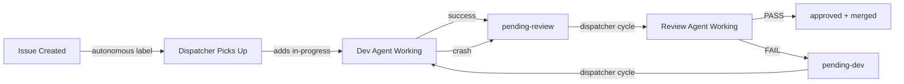
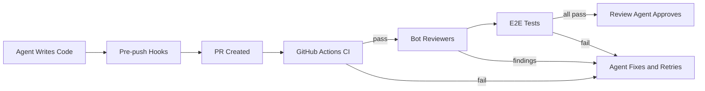

In a [previous post][prev-post], the **AI Digital Engineer** pattern was introduced, featuring a single Claude Code agent guided by Skills and enforced by Hooks to execute a complete engineering workflow. This approach demonstrated effectiveness in delivering production-ready code with guaranteed quality gates.

However, a fundamental limitation emerged: **one agent performing all tasks**.

This limitation highlighted the need for a multi-agent system, where a team of AI agents, each with a distinct role, could collaborate autonomously to transform GitHub issues into merged pull requests without human intervention.

<!--more-->

## The Limitation of a Solo AI Engineer

The single-agent approach detailed in the [previous post][prev-post] is suitable for interactive development workflows. A human creates an issue, initiates Claude Code execution, monitors progress, and triggers reviews. While the Skills + Hooks architecture ensures quality, human oversight is required for orchestration.

This approach presents several bottlenecks:

- **Manual dispatch** — Each task requires manual assignment to the AI agent.
- **Self-review** — The same agent responsible for code generation also performs the review, potentially reducing objectivity.
- **Sequential processing** — Tasks are processed one at a time, dependent on human checkpoints.
- **No crash recovery** — Progress is lost if a session terminates unexpectedly.

The objective is to establish a system where agents emulate a conventional engineering team structure: a **tech lead** assigns work, a **developer** implements features, and a **reviewer** independently verifies quality — all operating autonomously.

## Introducing the Autonomous Dev Team

The [Autonomous Dev Team][repo] establishes a fully automated development pipeline that automates the transformation of GitHub issues into merged pull requests, eliminating human intervention. It is powered by [OpenClaw][openclaw] as the orchestration layer and supports multiple AI coding CLIs: **Claude Code**, **Codex CLI**, and **Kiro CLI**.

The architecture emulates a standard engineering team with three distinct roles:

```
┌──────────────────────────────────────────────────────────────────────┐
│                     Autonomous Dev Team                              │
├──────────────────────┬───────────────────┬───────────────────────────┤
│  Dispatcher          │  Dev Agent        │  Review Agent             │
│  (OpenClaw)          │  (Claude/Codex/   │  (Claude/Codex/           │
│                      │   Kiro)           │   Kiro)                   │
├──────────────────────┼───────────────────┼───────────────────────────┤
│ • Scans issues       │ • Reads issue     │ • Finds linked PR         │
│   every 5 minutes    │   requirements    │ • Checks merge conflicts  │
│ • Dispatches agents  │ • Creates worktree│ • Runs review checklist   │
│ • Manages labels     │ • Implements TDD  │ • Verifies E2E tests      │
│ • Handles crashes    │ • Creates PR      │ • Approve or reject       │
│ • Enforces           │ • Marks checkboxes│ • Auto-merge on pass      │
│   concurrency        │ • Resumes sessions│ • Posts structured        │
│   limits             │                   │   findings                │
└──────────────────────┴───────────────────┴───────────────────────────┘
```

### How It Works: The Label-Based State Machine

The entire workflow is driven by GitHub issue labels. Each label represents a state, and agents transition between states based on their outcomes:



There is no central database or message queue. GitHub labels serve as the single source of truth. The dispatcher polls every 5 minutes, reads the labels, and executes predefined actions:

| Current Labels | Action |
|---------------|--------|
| `autonomous` (no state label) | Dispatch Dev Agent (new session) |
| `autonomous` + `pending-review` | Dispatch Review Agent |
| `autonomous` + `pending-dev` | Dispatch Dev Agent (resume session) |
| `autonomous` + `approved` | Done — PR merged |

## The Three Agents in Detail

### Agent 1: The Dispatcher (OpenClaw)

The dispatcher functions as the team's **tech lead**. It operates on a cron schedule (every 5 minutes), scans for actionable issues, and spawns the appropriate agent:

```bash
# Dispatcher workflow (simplified)
# 1. Check concurrency — don't exceed MAX_CONCURRENT (default: 5)
# 2. Find issues needing work
# 3. Spawn agent via nohup background process
# 4. Detect stale processes and recover

# Example: dispatching a dev agent
dispatch-local.sh dev-new $ISSUE_NUM

# Example: dispatching a review agent
dispatch-local.sh review $ISSUE_NUM

# Example: resuming after review rejection
dispatch-local.sh dev-resume $ISSUE_NUM $SESSION_ID
```

Key capabilities include:
- **Concurrency control** — Tracks active processes via PID files, adhering to the `MAX_CONCURRENT` limit.
- **Crash recovery** — Detects terminated processes and transitions stale `in-progress` issues to `pending-review`.
- **Session tracking** — Extracts session IDs from comments for resumable development.
- **Self-correction** — Manages edge cases such as unintended re-dispatching of already-approved issues.

### Agent 2: The Dev Agent (Developer)

The Dev Agent serves as the **implementer**. Upon dispatch, it performs the following:

1.  **Reads the issue** — Parses requirements and acceptance criteria.
2.  **Creates an isolated worktree** — Utilizes `git worktree add` to prevent cross-contamination between parallel tasks.
3.  **Follows TDD** — Writes tests prior to implementation, guided by the `autonomous-dev` skill.
4.  **Marks progress** — Checks off requirement checkboxes in the issue as each is completed.
5.  **Creates a PR** — Includes `Closes #<issue-number>` to link the issue.
6.  **Reports results** — Posts a structured session report with a session ID for resumability.

The Dev Agent supports two modes:

-   **New** — Executes fresh implementation from scratch.
-   **Resume** — Continues a previous session, processing review feedback and resolving issues without re-implementing completed work.

### Agent 3: The Review Agent (Reviewer)

The Review Agent acts as the **quality gate**. It operates independently from the Dev Agent (utilizing a different model and session) and adheres to a strict checklist:

1.  **Find the PR** — Locates the pull request linked to the issue via `Closes #N` references.
2.  **Check merge conflicts** — If conflicts are present, it performs a rebase onto the main branch and force-pushes.
3.  **Run review checklist** — Executes 10 items covering process compliance, code quality, testing, and infrastructure safety.
4.  **Trigger external reviews** — Posts `/q review` to invoke Amazon Q Developer for static analysis.
5.  **Run E2E tests** — Uses Chrome DevTools MCP to verify on the preview deployment.
6.  **Execute the Findings→Decision Gate** — This critical step prevents inconsistent verdicts.

The **Findings→Decision Gate** is a mandatory self-check: the review agent enumerates all findings, classifies each as BLOCKING or NON-BLOCKING, and only approves if there are zero blocking findings. This mechanism prevents the common failure mode where an agent provides a positive assessment despite listing problems.

## Real-World Workflow: A Complete Example

This section details a real feature implementation, illustrating the collaborative workflow of the three agents. This example originates from a production Next.js application where the autonomous dev team manages feature implementation and bug fixes.

### Phase 1: Issue Created and Dispatched

A feature request is created with the `autonomous` label — to add swipe gestures for day navigation on mobile. The dispatcher picks it up within 5 minutes:



The dispatcher adds the `in-progress` label, spawns the dev agent, and initiates monitoring. Upon dev agent completion (exit code 0), the dispatcher transitions the issue to `pending-review` and spawns the review agent.

### Phase 2: Review Agent Rejects with Structured Findings

The review agent executes its full checklist and identifies **5 blocking issues**:



This scenario demonstrates the value of the multi-agent architecture. A single agent performing self-review may overlook deficiencies in documentation or process adherence. An independent review agent identifies process violations that an implementing agent might bypass due to task-specific incentives.

### Phase 3: Dev Agent Self-Corrects

The review rejection triggers the dispatcher to transition the issue back to `pending-dev`. The dev agent resumes its previous session and addresses all 5 findings:



The dev agent independently identified and addressed required fixes. It processed the review comment, comprehended the requirements, and systematically addressed each point, notably by extracting `detectSwipe` as a pure function for enhanced testability.

### Phase 4: Review Passes

The review agent re-executes its checklist. This time, all items pass:



The review agent approves the PR. Since this issue includes the `no-auto-close` label, it notifies the maintainer for manual merging instead of automatic merging.

### A Bug Fix in Under an Hour

The team also manages bug resolutions with the same pipeline. Presented here is a CJK character encoding bug — from issue creation to merged PR in under one hour:







The dev agent did not merely address the symptom; it conducted a thorough root cause analysis, identified the URL encoding mismatch within the CloudFront → API Gateway → Lambda chain, and implemented a comprehensive fix with 22 unit tests covering CJK, diacritics, emoji, and mixed scripts.

## CI/CD as the Final Quality Gate

Autonomous agents can write code, but shipping reliable software demands more than passing an AI review. The Autonomous Dev Team integrates traditional software engineering practices — CI/CD pipelines, automated testing, and bot-assisted static analysis — as non-negotiable quality gates that agents cannot bypass.

### Why CI/CD Matters for AI-Generated Code

AI coding agents are prone to subtle failures that only surface during build or runtime: type errors caught by the compiler, import paths that work locally but break in CI, or dependency mismatches between environments. Without a CI pipeline enforcing these checks, an agent could generate code that "looks correct" in its session but fails in production.

The template enforces a strict progression:



### Hook-Enforced Quality Checkpoints

Claude Code hooks act as local gatekeepers that **block agent actions** until quality conditions are met:

| Hook | Trigger | Enforcement |
|------|---------|-------------|
| `check-unit-tests` | Before `git commit` | Warns if unit tests haven't been run for code changes |
| `check-pr-review` | Before `git push` | Blocks push until PR review skill has been executed |
| `verify-completion` | Before task completion | Blocks completion unless CI passes, E2E tests run, and all review threads resolved |
| `block-push-to-main` | Before `git push` | Prevents direct pushes to main branch |
| `block-commit-outside-worktree` | Before `git commit` | Ensures all work happens in isolated git worktrees |

The `verify-completion` hook deserves special attention. It queries the GitHub API in real-time to check CI status, counts unresolved review threads via GraphQL, and verifies that E2E tests have been executed. The agent **cannot claim the task is complete** until every checkpoint is green.

### GitHub Actions and Bot Reviewers

When a PR is pushed, GitHub Actions runs the project's standard CI pipeline — linting, type checking, unit tests, build verification, and preview deployment. These are the same checks that would gate a human developer's PR.

The review agent also integrates with bot reviewers like **Amazon Q Developer** for static analysis. It triggers a review via `/q review`, waits for findings, and either addresses them or documents design decisions before resolving each thread. This creates a layered defense:

1. **Local hooks** — Catch issues before code leaves the agent's session
2. **CI pipeline** — Validates build integrity, test coverage, and deployment
3. **Bot reviewers** — Static analysis from independent tools (Amazon Q, Codex)
4. **Review agent** — Holistic assessment with E2E verification on the preview environment

### E2E Tests on Preview Deployments

The review agent doesn't stop at code-level checks. Using Chrome DevTools MCP, it navigates to the preview deployment URL, executes happy-path test cases, verifies authentication flows, checks for console errors, and captures screenshots as evidence. These screenshots are uploaded and linked in the PR as a verification report.

This approach mirrors what a senior engineer would do during a thorough review: deploy the branch, click through the feature, and confirm it works end-to-end — except the agent does it automatically on every review cycle.


The system supports multiple AI coding CLIs through an abstraction layer:

```bash
# scripts/lib-agent.sh — Agent CLI abstraction
run_agent() {
  case "$AGENT_CMD" in
    claude)
      claude --session-id "$SESSION_ID" \
             --model "$MODEL" \
             -p "$PROMPT" \
             --allowedTools "$TOOLS"
      ;;
    codex)
      codex -p "$PROMPT" \
            --model "$MODEL" \
            --approval-mode full-auto
      ;;
    kiro)
      kiro -p "$PROMPT" \
           --model "$MODEL" \
           --non-interactive
      ;;
  esac
}
```

| Feature | Claude Code | Codex CLI | Kiro CLI |
|---------|-------------|-----------|----------|
| Dev Agent | Full support | Basic | Basic |
| Review Agent | Full support | Basic | Basic |
| Session Resume | Native (`--session-id`) | Falls back to new | Falls back to new |
| Model Selection | Configurable | Configurable | Configurable |

Claude Code offers the most comprehensive integration, particularly regarding session resumability, which facilitates the review→fix→re-review cycle without re-implementing completed work.

## Authentication: GitHub Apps for Audit Clarity

Each agent can operate as a distinct GitHub App bot, providing clear audit trails:

```
kane-coding-agent[bot]   → Dev Agent actions (commits, PR creation)
kane-test-agent[bot]     → Review Agent actions (reviews, approvals)
my-claw[bot]             → Dispatcher actions (label changes, comments)
```

This makes it straightforward to trace agent activities. The accompanying screenshots illustrate distinct bot avatars and identities, providing the same visibility as a human team.

The system also supports a simpler token-based mode where all agents share one identity, which is simpler for initial setup.

## Getting Started

### 1. Use the Template

The [autonomous-dev-team][repo] repository is a **GitHub template**. Utilize the "Use this template" button to create your own copy:



### 2. Configure Your Project

```bash
# Copy the config template
cp scripts/autonomous.conf.example scripts/autonomous.conf

# Edit with your settings
cat scripts/autonomous.conf
```

```ini
# Project identification
PROJECT_ID="my-project"
REPO="myorg/my-project"
PROJECT_DIR="/path/to/my-project"

# Agent CLI selection (claude, codex, or kiro)
AGENT_CMD="claude"

# Authentication mode (token or app)
GH_AUTH_MODE="token"

# Concurrency
MAX_CONCURRENT=5
```

### 3. Set Up OpenClaw Dispatcher

Install [OpenClaw][openclaw] and configure the dispatcher cron:

```bash
# Run dispatcher every 5 minutes
*/5 * * * * cd /path/to/autonomous-dev-team && openclaw run
```

### 4. Create an Issue with the `autonomous` Label

Create a GitHub issue, add the `autonomous` label, initiating the automated pipeline. Within 5 minutes, the dispatcher will spawn a dev agent, which will implement the feature, create a PR, and hand it off for review.

## From Solo to Team: What Changed

| Aspect | Solo AI Engineer | Autonomous Dev Team |
|--------|-----------------|---------------------|
| **Orchestration** | Human initiates each task | Dispatcher auto-assigns from issues |
| **Review** | Self-review (same agent) | Independent review agent |
| **Concurrency** | One task at a time | Up to 5 parallel tasks |
| **Crash Recovery** | Lost progress | Auto-retry with session resume |
| **Audit Trail** | Single conversation | Separate bot identities per role |
| **Human Involvement** | Initiate, monitor, approve | Create issue, optionally final merge |
| **Agent CLI** | Claude Code only | Claude Code, Codex CLI, Kiro CLI |
| **Quality Gates** | Manual CI check | Hook-enforced CI, bot review, E2E verification |

The Skills + Hooks architecture from the previous post continues to power each individual agent. The key innovation lies in the **orchestration layer** — comprising the dispatcher for work assignment, the label-based state machine for progress tracking, and the separation of implementation from review.

## Conclusion

The evolution from a solo AI engineer to an autonomous dev team parallels the growth observed in human engineering organizations. The initial phase involves a single capable developer (the AI Digital Engineer), which then scales to a team with specialized roles and clear handoff protocols.

The [Autonomous Dev Team][repo] template provides:

-   **Zero human intervention** — Issues automatically progress to merged PRs.
-   **Independent review** — Development and review agents operate with separate sessions and models.
-   **Crash resilience** — A label-based state machine with automatic retry functionality.
-   **Multi-CLI support** — Compatibility with Claude Code, Codex CLI, and Kiro CLI via a pluggable abstraction.
-   **Traditional quality gates** — CI/CD pipelines, bot reviewers, and E2E tests that agents cannot bypass.
-   **Clear audit trails** — GitHub App bots provide distinct per-agent identities.

The code is open source and available as a GitHub template. Implement it in a small project, observe the agents' collaboration, and subsequently scale its application.

## Resources

-   [Autonomous Dev Team Template][repo] — GitHub template with full pipeline setup
-   [OpenClaw][openclaw] — The orchestration engine that powers the dispatcher
-   [AI Digital Engineer (Previous Post)][prev-post] — The single-agent pattern that each agent follows internally
-   [Claude Code Hooks Documentation][claude-hooks-docs] — Quality gate enforcement
-   [Claude Code Skills Guide][claude-skills-docs] — Workflow orchestration

---

<!-- GitHub Repository -->
[repo]: https://github.com/zxkane/autonomous-dev-team
[openclaw]: https://github.com/openclaw/openclaw

<!-- Related Articles (Internal Links) -->
[prev-post]: 

<!-- Official Documentation -->
[claude-hooks-docs]: https://docs.anthropic.com/en/docs/claude-code/hooks
[claude-skills-docs]: https://docs.anthropic.com/en/docs/claude-code/skills
