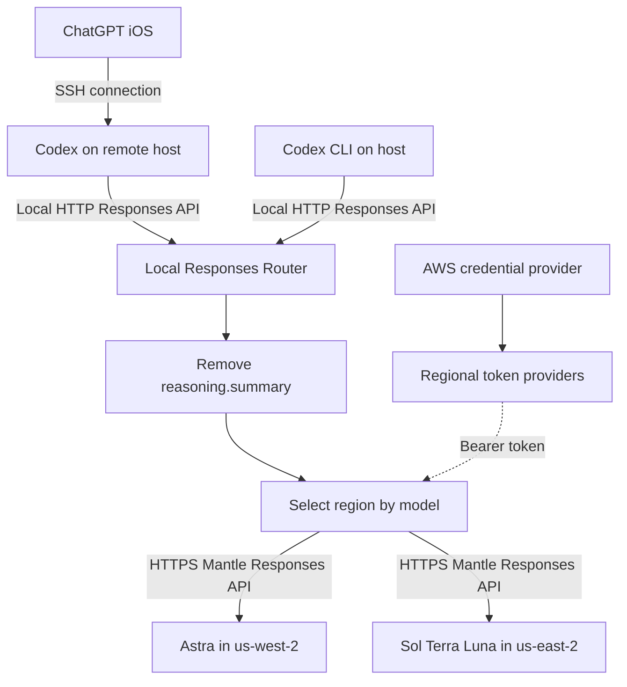

When Codex uses Bedrock's OpenAI-compatible API, switching models can break requests: the selected model changes, but the provider still points to the same AWS Region. The failure appears both when using Codex directly and when operating it through the ChatGPT app. In both cases, Codex makes the model API request. A model picker alone cannot move that request to the region where the new model is available.

The mobile workflow adds a separate compatibility issue. When I used ChatGPT iOS over SSH to operate Codex on a remote host, the model requests generated on that host still included `reasoning.summary`, which the Bedrock endpoint in use rejected.

The solution is a **local Responses API router between Codex and Bedrock**. Both CLI and app workflows use the provider configured in host-side Codex. The router selects a region from the request's `model`, removes the unsupported parameter, and calls Bedrock with a short-term token for that region. **I have verified this setup on a real iPhone using ChatGPT iOS, including switching models from the phone.**

In my setup, **ChatGPT iOS connects over SSH to Codex on a remote host**. SSH carries the connection between the app and host-side Codex. Codex then sends model requests to the router over the local Responses API, and the router calls Bedrock over HTTPS. The OpenAI-compatible API belongs to this host-side inference path; the phone does not call the router or Bedrock directly.

This walkthrough assumes the SSH connection already works. Install the router and configure the provider on the remote host. Every `127.0.0.1` address below refers to that host, and AWS credentials remain there.

> Verified on September 13, 2026. Regional availability comes from AWS documentation. The presence of `reasoning.summary` is an observation from this mobile workflow, not a public contract for every client version. This post covers the GPT models below on Bedrock Mantle; the same restrictions do not necessarily apply to other Bedrock models or APIs.

![ChatGPT iOS connects to remote Codex over SSH; a router on that host selects the Bedrock region][cover]

## Why switching models can break requests

### Select the model and region together

In the original configuration, the model and the provider's region were separate settings. The same mismatch occurs whether the model change comes from Codex or the ChatGPT app: Codex sends the resulting model request through its configured provider endpoint. Switching from Astra to Sol while the provider still pointed to `us-west-2` sent the new model's request to the old region. During troubleshooting, that combination returned 404 errors and also disrupted subsequent context compaction.

The router uses this fixed mapping:

| Model ID | Selected region |
| --- | --- |
| `openai.gpt-6-astra` | `us-west-2` |
| `openai.gpt-5.6-sol` | `us-east-2` |
| `openai.gpt-5.6-terra` | `us-east-2` |
| `openai.gpt-5.6-luna` | `us-east-2` |

This table defines **the routing policy, not the complete availability list**. The [Astra model card][astra] lists its Mantle endpoint only in `us-west-2`. The [GPT-5.6 documentation][gpt56] lists Sol in both US East regions, with Terra and Luna also available in `us-west-2`. Routing the latter three through Ohio (`us-east-2`) keeps the configuration simpler.

AWS also offers the [Responses API on Bedrock Runtime][responses], using `us.` or `global.` inference profiles with different endpoints, model identifiers, and authorization requirements. The linked AWS document covers both Mantle and a section titled “Using the Responses API on the bedrock-runtime endpoint.” This implementation uses Mantle's regional endpoints. A migration to Runtime requires a separate review of routing and permissions.

### Disabling summaries in configuration is not enough

Codex has a setting to disable reasoning summaries:

```toml
model_reasoning_summary = "none"
```

A client setting does not guarantee the contents of the JSON eventually sent upstream. In this iOS workflow, changing the host configuration alone did not reliably remove the field. I did not isolate whether the phone, connection layer, or host-side request construction added it. The router therefore removes the field before each upstream model request.

For example, an incoming request fragment might contain:

```json
{
  "model": "openai.gpt-5.6-sol",
  "reasoning": {
    "effort": "high",
    "summary": "auto"
  }
}
```

The corresponding fragment sent to Bedrock should be:

```json
{
  "model": "openai.gpt-5.6-sol",
  "reasoning": {
    "effort": "high"
  }
}
```

The important step is to **delete `reasoning.summary` entirely**. Setting its value to `"none"` or `null` still sends the parameter. Keep `reasoning.effort`: disabling a summary request does not disable the model's reasoning.

## Handle compatibility on the Codex host



The diagram shows the tested iOS-over-SSH workflow alongside direct CLI use. Codex, the router, and the credential providers all run on the remote host. SSH access and model inference are separate connections. The router handles only the host-side model API boundary: choosing a region, normalizing requests, constructing authentication headers, and forwarding responses. Codex continues to manage tool calls, conversation state, and local command execution.

Apply the compatibility rules to both paths:

- `POST /v1/responses` for regular and streaming generation.
- `POST /v1/responses/compact` for context compaction.

Fixing generation alone leaves a delayed failure: short conversations work, but a long task fails when it triggers compaction. Both paths must share the same model routing and parameter cleanup.

The example requires an explicit `model` and accepts only the exact paths listed above. It rejects query strings, trailing slashes, and unknown models rather than inferring a default. Forwarding a path does not establish that every model supports it; verify each model and operation you intend to use.

## Three implementation details that matter

### 1. Remove the request option without changing history

Do not recursively delete every field named `summary`. Reasoning items in `input`, their summaries, and `encrypted_content` may be part of conversation history. They are distinct from the top-level request option `reasoning.summary`.

This normalization function comes from the [complete example][example-router]. It uses the routing table in the same file and requires Node.js 24:

```javascript
export function normalize(body) {
  const parsed = JSON.parse(body);
  if (!parsed || typeof parsed !== 'object' || Array.isArray(parsed)) {
    throw new Error('Invalid payload');
  }
  if (typeof parsed.model !== 'string' || !Object.hasOwn(routes, parsed.model)) throw new Error('Unknown model');

  const reasoning = parsed.reasoning;
  if (reasoning && typeof reasoning === 'object' && !Array.isArray(reasoning)
      && Object.hasOwn(reasoning, 'summary')) {
    const lossless = JSON.parse(body, (_key, value, context) =>
      typeof value === 'number' ? JSON.rawJSON(context.source) : value);
    delete lossless.reasoning.summary;
    if (!Object.keys(lossless.reasoning).length) delete lossless.reasoning;
    return { region: routes[parsed.model], body: JSON.stringify(lossless), summaryRemoved: true };
  }
  return { region: routes[parsed.model], body, summaryRemoved: false };
}
```

The second parse preserves JSON number literals. A standard `JSON.parse` followed by `JSON.stringify` can round a large integer, changing a tool schema constraint from `9007199254740993` to `9007199254740992`. Removing a summary parameter must not corrupt the tool's input definition.

Requests that require no modification pass through unchanged. When rewriting is necessary, Node 24's `context.source` and `JSON.rawJSON` preserve numeric literals. If deleting `summary` leaves an empty `reasoning` object, the function removes that object as well.

### 2. Generate tokens per region while sharing an AWS identity

Model routing and authentication must use the same region. In testing, one Ohio token successfully called Sol, Terra, and Luna in that region. Reusing it for Astra in another region returned 401. A 401 alone does not prove a region mismatch; also check expiration, source credentials, and the endpoint. The router creates token providers per region without requiring a separate AWS identity for each model.

The [AWS short-term API key documentation][api-keys] provides `@aws/bedrock-token-generator`. Create a reusable provider with `getTokenProvider`, then call it for each request to obtain a token. **Reusing the provider does not mean caching one token indefinitely.**

The underlying AWS credentials must also remain a callable provider. Reading them once at startup and freezing the result would defeat refresh. The credential source determines what can renew automatically:

| Credential source | Automatic behavior | What still needs attention |
| --- | --- | --- |
| EC2 IAM role | Retrieve refreshed role credentials and generate tokens | Role, permission, or credential-service failures |
| SSO profile | Refresh credentials while the login session permits it | Sign in again when the login session expires |
| IAM user profile | Generate short-term tokens from valid credentials | Rotate the underlying long-term access key |
| Temporary credentials in environment variables | Generate tokens while those credentials remain valid | Update expired credentials and restart the process |

AWS short-term keys last at most 12 hours and cannot outlive the AWS session used to generate them. This example requests a one-hour lifetime. For more on keeping credentials outside configuration files, see [Using credential_process][credentials-post].

When `AWS_PROFILE` is explicitly set, the example uses that profile and does not silently fall back to another identity. Each router process uses a single credential environment. Changing variables in another terminal does not update a running router. To use multiple AWS identities concurrently, run separate instances on different ports and point each client at the matching instance.

### 3. Forward SSE as a stream

Streaming responses need incremental forwarding, backpressure handling, and cancellation. The example uses Node's `pipeline` to send the upstream response stream to the client and `AbortController` to abort the upstream connection when the client disconnects. It preserves the status code and body stream but copies only `Content-Type` from the upstream headers; it is not a fully transparent HTTP proxy.

Request bodies may also be compressed. Decompress them before parsing JSON, and enforce limits on both the compressed and decompressed sizes. The example supports single-layer gzip, deflate, Brotli, and zstd encoding, decompresses in memory, and limits each size to 32 MiB. That is a byte limit, not a model token limit or a cap on peak process memory.

After rewriting a request, do not reuse its old `Content-Length` or `Content-Encoding`. Do not forward the client's `Authorization` or Cookie headers to Bedrock either. Construct fresh upstream authentication headers.

The example does not automatically retry requests. If you add retries to a full service, refresh and retry only a clear expired-token rejection, with a bounded retry count and before sending output to the client. Do not replay a partially delivered stream or treat every 403 permission denial as token expiration.

## Run the Node 24 example and configure Codex

The complete example is available as a [public GitHub Gist][example-gist], including the router, tests, dependency lockfile, and [`.nvmrc`][example-nvmrc]. Clone it into a new directory:

```bash
git clone https://gist.github.com/5b94758c17b0b545540d7d0f63c850f5.git bedrock-router-example
cd bedrock-router-example
git checkout f70e713dac1c3c73985e943245e7c340c7a89a0d
```

Alternatively, download [router.mjs][example-router], [package.json][example-package], and the [dependency lockfile][example-lock] into one directory. Include the [test file][example-tests] to run `npm test`. The individual download links are pinned to the Gist revision used by this post. With Node.js 24 installed, run:

```bash
npm ci --ignore-scripts --no-audit --no-fund
npm test

# Mac or another host using an SSO profile
aws sso login --profile work
AWS_PROFILE=work npm start
```

Replace `work` with an existing profile name. On an EC2 host using an instance role, run `npm start` after checking that environment credentials are not overriding the default credential chain.

Run the example on the remote host. It listens on that host's `127.0.0.1:14673` and runs in the foreground. Keep that terminal open and start Codex from another terminal on the same host. Stop the router with `Ctrl-C`. The example does not modify existing configuration, install a startup service, or establish the phone connection for you.

On **the machine running Codex**, merge the following into your user-level `~/.codex/config.toml`, preserving your existing tools, permissions, and other settings:

```toml
model = "openai.gpt-5.6-sol"
model_provider = "bedrock-router"
model_reasoning_summary = "none"

[model_providers.bedrock-router]
name = "Bedrock regional router"
base_url = "http://127.0.0.1:14673/v1"
wire_api = "responses"
supports_websockets = false
```

See the [Codex configuration reference][codex-config] for these options. Do not put provider definitions in project-level `.codex/config.toml`: the current documentation says those network settings are ignored at project scope. The `base_url` ends at `/v1`; the client appends paths such as `/responses`. This example supports HTTP/SSE, not WebSocket transport.

The local inference endpoint does not require an API key. The router handles AWS authentication. This arrangement is intended for a single-user host where local processes are trusted: loopback does not isolate other users or processes on the machine. The example rejects browser Origin headers and non-loopback Host headers, but those checks do not replace access control on a shared host. Do not change the listener to `0.0.0.0` to connect your phone; continue using SSH to reach host-side Codex.

The host's AWS identity needs Mantle inference and bearer-token permissions for the target regions. Follow the [AWS API key permission guidance][key-security] and your account's policies. Possessing a token does not itself grant model access. This walkthrough does not create or modify IAM policies.

Restart or reconnect host-side Codex, then create a new task to verify the configuration. Existing tasks may retain their original provider. The model picker also depends on the client's model catalog: the example returns four models from `/v1/models`, but not every client automatically loads that list. Confirm that your Codex version recognizes the target models before testing switching.

**Scope of the downloadable example:** it demonstrates regional routing, parameter cleanup, regional tokens, and SSE forwarding for local, single-user testing. It does not include background process management, credential-helper isolation, corporate HTTP proxy integration, or complete recovery from SSO failures. If the SDK still reports an error after you sign in again, restart the example process. Add those operational features before relying on it as a long-running service.

## Verify the fix from the host and phone

### Start on the host

First, check the model list:

```bash
curl --noproxy '*' http://127.0.0.1:14673/v1/models
```

Then deliberately send the unsupported parameter in a streaming request. This call incurs Bedrock inference charges:

```bash
curl --noproxy '*' -N http://127.0.0.1:14673/v1/responses \
  -H 'Content-Type: application/json' \
  --data-binary '{
    "model": "openai.gpt-5.6-sol",
    "input": "Reply with ROUTER_OK only.",
    "reasoning": {"effort": "low", "summary": "auto"},
    "stream": true
  }'
```

A successful request should stream SSE events and end with a completion event. HTTP 200 alone is insufficient: inspect the final completion event and output. Repeat with each model to verify the regional mapping.

Next, connect to remote Codex from ChatGPT iOS over SSH to verify the complete workflow:

1. Create a task using the router provider and confirm that it returns a response.
2. Switch models in the available model picker and send another message.
3. Check that the observed `model` maps to the expected region and that the upstream request omits `reasoning.summary`.
4. Test compaction on a long task and cancellation during streaming output.
5. Test recovery after credential refresh or an SSO sign-in.

The example includes an opt-in diagnostic mode. Start it with `AWS_PROFILE=work BEDROCK_ROUTER_DEBUG=1 npm start` to emit diagnostic JSON records to `stderr` with `path`, `model`, `region`, `summary_removed`, and `upstream_status` after receiving each upstream response. It does not log request bodies, conversation content, or authentication headers. Credential and connection failures do not produce this response record.

Successful generation does not establish compatibility for every historical reasoning item, tool result, or compaction operation after a model switch. Validate real long-running tasks separately.

### What was tested

Host-side testing of the full implementation covered model routing, regular and streaming requests, compaction, and regional token behavior. The standalone teaching example has separate mock-upstream tests for request transformations, numeric precision, and HTTP/SSE behavior. Those tests do not replace live Bedrock calls.

**As of September 13, 2026, I have confirmed that the full setup works on a real iPhone in ChatGPT iOS, including model switching.** The phone operates remote Codex over SSH. Codex's outbound model API requests pass through the host-local router, which selects the region for the chosen model and consistently removes `reasoning.summary`.

That device validation applies to the complete setup in use. The downloadable teaching example remains validated through mock-upstream tests. The credential recovery and long-task compaction steps above are a checklist for your own environment, not a claim that every client version and scenario has been tested.

| Symptom | Check first |
| --- | --- |
| 404 after switching models | Whether the actual endpoint, model, and region match |
| `reasoning.summary` is still rejected | Whether requests bypass the router, compaction was missed, or an old process is still running |
| AWS 401 | Token region, expiration, and source credentials |
| AWS 403 | Identity, target resources, and bearer-token permissions |
| Mobile fails while the CLI works | SSH connection, remote Codex host, provider, and settings retained by old tasks |
| Output arrives all at once after a long pause | Whether an intermediate layer buffers SSE |

## Keep compatibility rules at the API boundary

Both failures came from differences between client requests and upstream capabilities. A model-to-region table, a small set of outbound compatibility rules, and refreshable regional token providers give host-side Codex model requests the same routing behavior whether a task is operated from the CLI or the ChatGPT app. Regional routing solves the shared model-switching problem; deleting `reasoning.summary` also handles the compatibility issue observed in the iOS workflow.

The essential `reasoning.summary` fix is small: delete the request option while preserving effort and history. Making it reliable for real Codex tasks also requires checking streaming, compaction, credential lifecycles, and configuration retained by existing sessions.

## Resources

- [Amazon Bedrock Responses API][responses]
- [GPT-6 Astra model card][astra]
- [GPT-5.6 Sol, Terra, and Luna][gpt56]
- [Generate and refresh short-term Bedrock API keys][api-keys]
- [Bedrock API key security and permissions][key-security]
- [Codex configuration reference][codex-config]
- [Complete example on GitHub Gist][example-gist]: [router][example-router], [dependencies][example-package], [lockfile][example-lock], and [tests][example-tests]

---

<!-- Page bundle assets -->
[cover]: ./images/cover.png

<!-- Public example: revision-pinned downloads -->
[example-gist]: https://gist.github.com/zxkane/5b94758c17b0b545540d7d0f63c850f5
[example-router]: https://gist.githubusercontent.com/zxkane/5b94758c17b0b545540d7d0f63c850f5/raw/f70e713dac1c3c73985e943245e7c340c7a89a0d/router.mjs
[example-package]: https://gist.githubusercontent.com/zxkane/5b94758c17b0b545540d7d0f63c850f5/raw/f70e713dac1c3c73985e943245e7c340c7a89a0d/package.json
[example-lock]: https://gist.githubusercontent.com/zxkane/5b94758c17b0b545540d7d0f63c850f5/raw/f70e713dac1c3c73985e943245e7c340c7a89a0d/package-lock.json
[example-tests]: https://gist.githubusercontent.com/zxkane/5b94758c17b0b545540d7d0f63c850f5/raw/f70e713dac1c3c73985e943245e7c340c7a89a0d/router.test.mjs

[example-nvmrc]: https://gist.githubusercontent.com/zxkane/5b94758c17b0b545540d7d0f63c850f5/raw/f70e713dac1c3c73985e943245e7c340c7a89a0d/.nvmrc

<!-- Official documentation -->
[astra]: https://docs.aws.amazon.com/bedrock/latest/userguide/model-card-openai-gpt-6-astra.html
[gpt56]: https://aws.amazon.com/blogs/machine-learning/get-started-with-openai-gpt-5-6-sol-terra-and-luna-on-amazon-bedrock/
[responses]: https://docs.aws.amazon.com/bedrock/latest/userguide/bedrock-mantle.html
[api-keys]: https://docs.aws.amazon.com/bedrock/latest/userguide/api-keys-generate.html
[key-security]: https://aws.amazon.com/blogs/security/securing-amazon-bedrock-api-keys-best-practices-for-implementation-and-management/
[codex-config]: https://developers.openai.com/codex/config-reference/

<!-- Related articles -->
[credentials-post]: 
