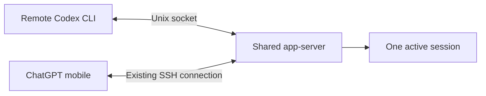

Start a Codex task in a remote SSH terminal, then check progress and send the next instruction from your phone. The key is **connecting both clients to the same running session**.

My phone already had an SSH connection to the remote host through ChatGPT's Codex interface. This fix lets it follow tasks started from the CLI. The commands below were checked against Codex CLI **0.159.3**; this workflow uses the Codex remote connection, rather than a regular ChatGPT conversation.

![Codex CLI and ChatGPT mobile connect to one app-server to share an active session][cover]

## Root cause: shared history, separate runtimes

Codex persists conversation history, but active tasks and event streams belong to a running instance. The [app-server protocol][app-server] distinguishes reading history (`thread/read`), resuming a thread (`thread/resume`), and starting work (`turn/start`).

**Reading the same history does not mean following the same active task.** If the CLI runs its own embedded instance while the phone connects to the background app-server, their live state is handled by separate services.

In my setup, the trigger was a shell wrapper that always appended `-c` to override the provider's `base_url`. In the version used here, **even an override identical to the saved configuration made the default launch path use embedded mode**, bypassing the shared daemon.

## Fix: connect both clients to one app-server



On **the remote host running Codex**, run:

```bash
# Start the shared daemon; leave it running if already started
codex app-server daemon start

# Create a session in the current project through that daemon
codex --remote unix://
```

`unix://` selects the host's default app-server control socket, as supported by the [official documentation][app-server]. It is a local socket address for the CLI; the phone continues using its existing SSH connection. No public listener is needed.

Open the same session from the phone. Both clients must use the same remote user, `CODEX_HOME` (default: `~/.codex`), and app-server. To resume a specific session from the terminal:

```bash
codex resume --remote unix:// <session-id>
```

I also changed my wrapper to append `--remote unix://` for ordinary interactive launches and `resume` when a reachable, matching daemon is available. It no longer injects `-c` when the provider URL is already correct. That makes plain `codex` use the shared service **in my wrapper**; the explicit commands above are the general way to reproduce it.

## Two checks

**Launch arguments.** Avoid `--no-daemon` and check for unnecessary `-c` or `-p` arguments injected by a wrapper. Keep shared settings in the remote user's `~/.codex/config.toml`.

**Running versions.** Updating the CLI does not guarantee that the running app-server has been updated:

```bash
codex --version
codex app-server daemon version
```

Compare `cliVersion` and `appServerVersion`. If `managedCodexVersion` is reported, check it against your installation policy too. After updating the daemon package, restart it when tasks have finished to avoid interrupting work.

To verify sharing, start a task in the terminal and follow its progress on the phone. Once it finishes, send the next instruction from the phone and confirm it appears in the terminal. Take turns submitting input. **Shared history is only the first check; live progress and subsequent messages must follow the same session.**

## Resources

- [Codex app-server: CLI connections, transports, and session protocol][app-server]

---

<!-- Page Bundle Images -->
[cover]: ./images/cover.png

<!-- Official Documentation -->
[app-server]: https://developers.openai.com/codex/app-server/
