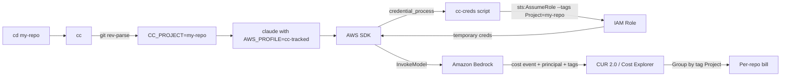

If you run `claude` against Amazon Bedrock across a dozen repos, your bill arrives as one opaque number. Until recently, the workaround was clunky — create an application inference profile per project, swap them by hand, hope you remembered which one was active. In April 2026, AWS [shipped native per-principal cost attribution for Bedrock][aws-bedrock-cost-attribution]: every `InvokeModel` call now carries the caller's IAM principal and session tags straight into Cost Explorer and CUR 2.0. That is enough to turn a ~60-line shell recipe into a per-repo billing system.

This post walks through the pattern I run locally — a `cc` shell wrapper that detects the current git project, a `credential_process` script that assumes a role with `Project=<repo>` as a session tag, and the IAM plumbing behind it. It builds on the `credential_process` foundation from my [previous post on secure AWS credentials][aws-credential-process-post].

## What AWS Shipped in April 2026

The [granular cost attribution feature for Amazon Bedrock][aws-bedrock-cost-attribution] attributes every `InvokeModel*` call to the IAM principal that made it, with no additional resources to create. Three mechanisms feed into the final cost line item:

1. **Principal tags** — static tags attached to an IAM user or role. Applied to every request that principal makes.
2. **[Session tags][aws-session-tags]** — dynamic tags passed through `sts:AssumeRole --tags` (or the equivalent OIDC/SAML assertion). Each assumed-role session can carry a different set.
3. **[CUR 2.0][aws-cur-2]** — the `line_item_iam_principal` column plus tag columns expose the attribution to queries and to Cost Explorer's "Group by tag" views.

Session tags are what matter for per-repo billing. One human, many projects, one source credential — and a different `Project` tag on every assumed-role session. No dedicated inference profiles, no ARN rotation, no application code changes. The feature is free in commercial regions; expect a 24–48 hour lag between activating a tag and seeing it in Cost Explorer.

## Architecture Overview

The system is five moving parts: a shell function that detects the project, an AWS CLI profile wired to a `credential_process` script, the script that calls STS with session tags, an IAM role configured to accept those tags, and the Cost Explorer tag activation that makes the `Project` tag billable. Every piece is inert without the others — which is a feature, because each piece is tiny.



The rest of this post walks each arrow in that diagram, from left to right.

## The `cc` Shell Wrapper

The wrapper does four things and nothing more: detect the current git project, set two environment variables, pass through optional role/profile overrides, and launch Claude Code against Bedrock. Drop it into `~/.bashrc`, `~/.zshrc`, or whatever your shell loads at startup.

```bash
cc() {
  local project
  project=$(basename "$(git rev-parse --show-toplevel 2>/dev/null || pwd)")
  CC_PROJECT="$project" \
  CC_USER="${USER:-unknown}" \
  CC_SOURCE_PROFILE="${CC_SOURCE_PROFILE:-default}" \
  CC_ROLE_ARN="${CC_ROLE_ARN:-}" \
  AWS_PROFILE=cc-tracked AWS_REGION=us-west-2 \
  CLAUDE_CODE_USE_BEDROCK=1 \
  ANTHROPIC_MODEL='global.anthropic.claude-opus-4-7' \
  claude "$@"
}
```

The `git rev-parse --show-toplevel 2>/dev/null || pwd` pattern falls back to the current directory when you are not inside a git repo, so `cc` still works for ad-hoc experiments — they just bill against the directory name instead of a repo name. `CC_USER` is also tagged so you get per-user attribution for free on shared boxes.

Set `CC_ROLE_ARN` once in the same shell rc file (it is the role that `cc-creds` will assume) and leave `CC_SOURCE_PROFILE` pointing at whatever base credential profile you already use.

## The `cc-creds` Credential Process Script

This is the heart of the setup. AWS SDKs will execute any program named in a profile's `credential_process` field and expect a one-line JSON envelope back (`Version: 1`, access key, secret, session token, expiration). The SDK then uses those credentials until `Expiration`, at which point it re-runs the script.

Save this as `cc-creds` somewhere on your `PATH` and `chmod +x` it:

```bash
#!/usr/bin/env bash
# credential_process for Claude Code with per-project session tags.
set -euo pipefail

PROJECT="${CC_PROJECT:-unknown}"
USER_TAG="${CC_USER:-${USER:-unknown}}"
SOURCE_PROFILE="${CC_SOURCE_PROFILE:-default}"
ROLE_ARN="${CC_ROLE_ARN:-}"
DURATION="${CC_SESSION_DURATION:-3600}"

if [[ -z "$ROLE_ARN" ]]; then
  echo '{"error":"CC_ROLE_ARN not set"}' >&2
  exit 1
fi

SESSION_NAME="cc-${PROJECT}-$(date +%s)"
SESSION_NAME=$(echo "$SESSION_NAME" | tr -c 'a-zA-Z0-9_=,.@-' '-' | cut -c1-64)

RESULT=$(AWS_PROFILE="$SOURCE_PROFILE" aws sts assume-role \
  --role-arn "$ROLE_ARN" \
  --role-session-name "$SESSION_NAME" \
  --duration-seconds "$DURATION" \
  --tags "[{\"Key\":\"Project\",\"Value\":\"${PROJECT}\"},{\"Key\":\"User\",\"Value\":\"${USER_TAG}\"}]" \
  --output json 2>&1) || {
  echo "sts assume-role failed: $RESULT" >&2
  exit 1
}

AK=$(echo "$RESULT" | python3 -c "import json,sys; print(json.load(sys.stdin)['Credentials']['AccessKeyId'])")
SK=$(echo "$RESULT" | python3 -c "import json,sys; print(json.load(sys.stdin)['Credentials']['SecretAccessKey'])")
ST=$(echo "$RESULT" | python3 -c "import json,sys; print(json.load(sys.stdin)['Credentials']['SessionToken'])")
EX=$(echo "$RESULT" | python3 -c "import json,sys; print(json.load(sys.stdin)['Credentials']['Expiration'])")

cat <<EOF
{"Version":1,"AccessKeyId":"$AK","SecretAccessKey":"$SK","SessionToken":"$ST","Expiration":"$EX"}
EOF
```

A few things worth pointing out:

- **Session name sanitization.** STS only allows `[a-zA-Z0-9_=,.@-]` in session names and caps them at 64 characters. Repo names with slashes or colons get cleaned up by the `tr -c` line.
- **`--duration-seconds`.** Default is 3600; the maximum for role chaining is 43200 (12h). The SDK caches credentials until `Expiration`, so longer durations mean fewer STS calls — but also slower reflection of IAM policy changes.
- **Pluggable source profile.** `CC_SOURCE_PROFILE` is deliberately unopinionated. It can point at an SSO profile, a static credential profile, or an [encrypted `credential_process` pattern like the one from my previous post][aws-credential-process-post]. Any profile whose credentials can call `sts:AssumeRole` will do.
- **Failure mode.** The script writes errors to stderr and exits non-zero. AWS SDKs treat that as a credential acquisition failure and surface it up to `claude`.

## AWS Side: IAM Role and Policies

Three pieces need to exist in AWS before `cc-creds` can assume a role with session tags.

### Trust Policy

Attach this trust policy to the role you want `cc` to assume. The critical detail is that `sts:TagSession` is a separate action from `sts:AssumeRole` — omit it and the `--tags` flag fails with an `AccessDenied` that looks, misleadingly, like a trust-relationship problem.

```json
{
  "Version": "2012-10-17",
  "Statement": [{
    "Effect": "Allow",
    "Principal": {"AWS": "arn:aws:iam::<aws-account-id>:user/you"},
    "Action": ["sts:AssumeRole", "sts:TagSession"]
  }]
}
```

Replace `<aws-account-id>` with your own account ID and `user/you` with the IAM user or role whose credentials back `CC_SOURCE_PROFILE`.

### Permissions Policy

The role only needs to invoke Bedrock. A minimal policy:

```json
{
  "Version": "2012-10-17",
  "Statement": [{
    "Effect": "Allow",
    "Action": [
      "bedrock:InvokeModel",
      "bedrock:InvokeModelWithResponseStream",
      "bedrock:GetInferenceProfile",
      "bedrock:ListInferenceProfiles"
    ],
    "Resource": "*"
  }]
}
```

See the [Bedrock IAM reference][aws-bedrock-iam] for the full action list if you need streaming, cross-region inference, or guardrails.

### Optional: Enforce the `Project` Tag

For team setups, add a `Deny` statement that refuses any Bedrock call without a `Project` session tag. This turns the attribution system into a contract — if the tag is missing, the call simply fails.

```json
{
  "Effect": "Deny",
  "Action": "bedrock:InvokeModel*",
  "Resource": "*",
  "Condition": {"Null": {"aws:PrincipalTag/Project": "true"}}
}
```

### Activate the Cost Allocation Tag

Last step: go to **Billing → Cost allocation tags → User-defined cost allocation tags** and activate `Project` (and `User`, if you are tagging that too). [Activating cost allocation tags][aws-cost-allocation-tags] is what moves the tag from "exists in CloudTrail" to "exists as a column in Cost Explorer and CUR 2.0". Expect 24–48 hours before the tag appears in the UI.

## Wiring It Together: `~/.aws/config`

Add one profile stanza. That's it.

```ini
[profile cc-tracked]
region = us-west-2
credential_process = cc-creds
```

Nothing else — no `role_arn`, no `source_profile`, no `sso_*`. All of that information flows in through environment variables set by the `cc` wrapper. Keeping the profile stanza this thin means you can reuse the same `cc-tracked` profile across every repo and every role you assume; only the env vars change.

## Seeing Your Bill Per Project

Open **Cost Explorer** and:

1. Filter service to **Amazon Bedrock**.
2. Group by **Tag → `Project`**.
3. Pick a daily or monthly granularity.

Bars are now labeled with your repo names. If the chart is empty on day one, that is the 24–48 hour tag-activation lag — come back tomorrow.

For programmatic analysis, [CUR 2.0][aws-cur-2] ships the raw data as Parquet or CSV in S3. The two columns you care about are `line_item_iam_principal` (the assumed-role session ARN, which includes the session name `cc-<project>-<timestamp>`) and `resource_tags_user_project` (the tag value). A single SQL query grouped by the tag column is enough to build your own dashboard.

## Why This Beats Application Inference Profiles

Before April 2026, the "official" way to get per-project Bedrock attribution was to create a dedicated application inference profile for each project and bake its ARN into the application's environment. It worked, but it scaled poorly.

| Dimension | Application inference profiles | Session tag attribution (this post) |
|-----------|-------------------------------|------------------------------------|
| Per-project setup | Create profile ARN; bake it into env | Zero — project auto-detected from git |
| Model changes | New ARN per model × per project | Nothing — tags decouple from models |
| Works with existing clients | Must reconfigure for profile ARN | Drop-in — any `InvokeModel` call attributed |
| Attribution dimensions | One (the profile itself) | Any tag: Project, User, Team, Env, … |
| Where cost surfaces | Profile-as-resource in Cost Explorer | `line_item_iam_principal` + tag columns |

Application inference profiles still have their place — they're useful for provisioned throughput, per-application guardrails, and controlled model routing. But for plain cost attribution, the session-tag approach is lighter, more flexible, and doesn't require you to manage extra resources.

## Gotchas

- **`sts:TagSession` is a separate action.** Omit it from the trust policy and the call fails silently with a generic `AccessDenied`. This is the single most common mistake.
- **Tag value character set.** STS session tag values allow `[A-Za-z0-9 _.:/=+\-@]`. Sanitize any repo name with unusual punctuation before passing it through.
- **Activation lag.** Tags take 24–48 hours to appear in Cost Explorer after you activate them in the Billing console. Do not assume the setup is broken because Day 1 looks empty.
- **Only `InvokeModel*` carries attribution.** Bedrock management APIs (listing models, describing agents) do not show up tagged in CUR 2.0. That is fine for cost attribution — management calls are free.
- **STS default limit: 500 `AssumeRole`/sec/account.** With 1-hour credential caching per session, hitting this is essentially impossible at a single developer's scale. Request a limit increase if you are fanning out to thousands of sessions.
- **Session tags are immutable within a session.** The SDK caches credentials until `Expiration`, so changing `CC_PROJECT` mid-session will not re-tag existing calls. This is almost always what you want — each `cc` invocation starts fresh.

## Conclusion

The [previous post in this pair][aws-credential-process-post] was about keeping credentials safe; this post is about keeping them *accountable*. Together they form a complete personal Bedrock setup in about 100 lines of shell: encrypted source credentials that are safe to back up, tagged temporary credentials that make every Bedrock call attributable, and an AWS-side configuration that surfaces those tags as cost allocation dimensions. The whole thing costs nothing extra on your AWS bill and requires no application changes.

Whatever LLM workloads you run on Bedrock — Claude Code, Bedrock Agents, or anything else — the same two-layer pattern applies: hygienic source credentials underneath, attributable session credentials on top. The April 2026 attribution feature is the missing piece that makes the top layer free.

Per-user attribution comes free from the same setup — `cc-creds` already sets a `User` tag. Activate `User` as a cost allocation tag too and you get a second dimension to slice by.

---

<!-- AWS Announcement and Documentation -->
[aws-bedrock-cost-attribution]: https://aws.amazon.com/blogs/machine-learning/introducing-granular-cost-attribution-for-amazon-bedrock/
[aws-session-tags]: https://docs.aws.amazon.com/IAM/latest/UserGuide/id_session-tags.html
[aws-sts-assume-role]: https://docs.aws.amazon.com/cli/latest/reference/sts/assume-role.html
[aws-cost-allocation-tags]: https://docs.aws.amazon.com/awsaccountbilling/latest/aboutv2/activating-tags.html
[aws-cur-2]: https://docs.aws.amazon.com/cur/latest/userguide/what-is-cur.html
[aws-credential-process-docs]: https://docs.aws.amazon.com/cli/latest/userguide/cli-configure-sourcing-external.html
[aws-bedrock-iam]: https://docs.aws.amazon.com/bedrock/latest/userguide/security-iam.html

<!-- Claude Code -->
[claude-code]: https://docs.anthropic.com/en/docs/claude-code/overview
[claude-code-bedrock]: https://docs.anthropic.com/en/docs/claude-code/amazon-bedrock

<!-- Related Posts (Internal) -->
[aws-credential-process-post]: 
