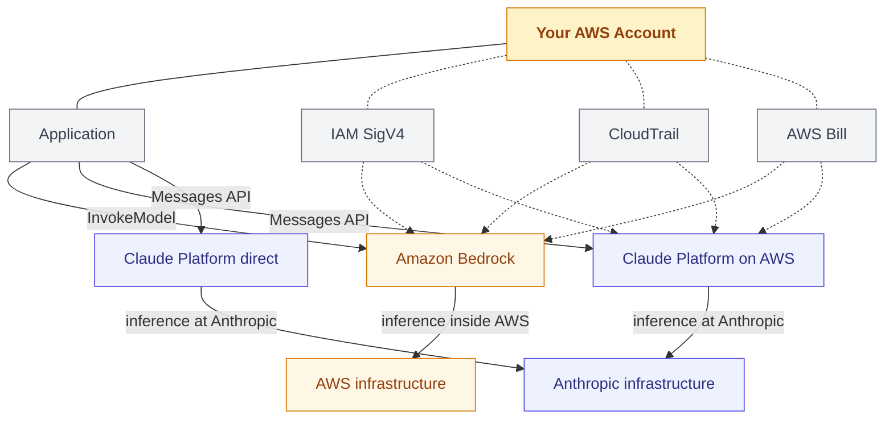
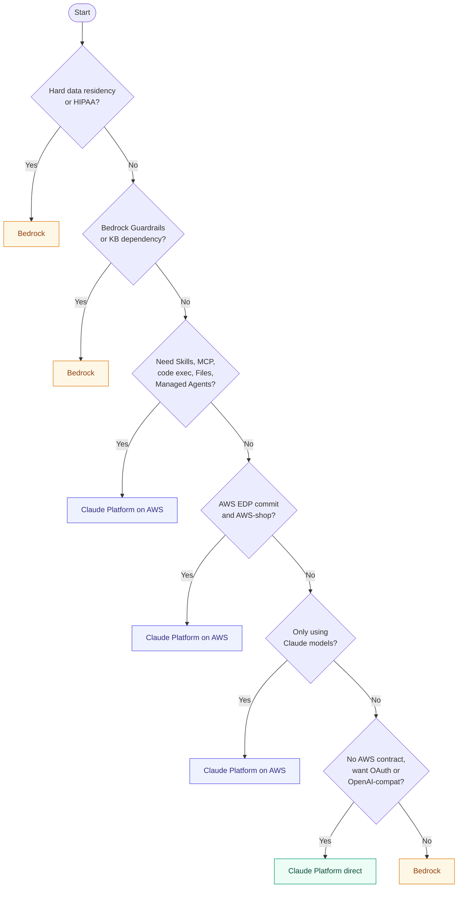

"Use Bedrock" was a one-line answer six months ago. As of May 11, 2026, it's not. Anthropic and AWS shipped [Claude Platform on AWS][aws-blog] to general availability — Anthropic's native developer platform, accessed through your AWS account, billed through AWS Marketplace, and operated by Anthropic outside the AWS security boundary.

There are now three ways to run Claude when AWS is anywhere in the picture:

1. **Amazon Bedrock** — AWS operates inference; AWS is the data processor.
2. **Claude Platform on AWS** — Anthropic operates inference; Anthropic and AWS are independent data processors. Auth, billing, and audit go through AWS-native plumbing.
3. **Claude Platform direct (claude.com)** — Anthropic everything. AWS is not in the loop.

The choice has real architectural implications: feature availability, who holds your data, what your CloudTrail trail actually records, whether HIPAA workloads can run there, and whether your AWS EDP commit can absorb the spend. Pick wrong and you'll either re-platform when a beta you need only exists on one path, or re-architect when an auditor asks why model inference is leaving the AWS security boundary.

This post is the decision tree.

---

## The three-way landscape



The key visual: in path 1, AWS is *both* the entry point and the inference operator. In path 2, AWS is the entry point but Anthropic is the inference operator. In path 3, AWS is not in the picture at all.

Two facts shape every downstream decision:

- **Who is the data processor?** On Bedrock, AWS is. On Claude Platform on AWS, the [user guide][cpa-userguide] is explicit: "Both Anthropic and AWS act as independent data processors" and "Data may not reside in AWS. Inference may route to Anthropic's primary cloud."
- **Whose feature roadmap do you ride?** Bedrock's feature surface is set by AWS's integration cadence. Claude Platform on AWS commits to "same-day model and feature access" — every new Anthropic API feature, including betas, ships there the day it ships on the first-party API.

If you internalize those two distinctions, the rest of this post is just consequences.

---

## Feature parity matrix (May 13, 2026)

The most cited reason to leave Bedrock has been feature lag. Here's the actual surface, today:

| Capability | Bedrock | Claude Platform on AWS | Direct (claude.com) |
|---|---|---|---|
| Messages API (Opus 4.7, Sonnet 4.6, Haiku 4.5) | Via Converse / InvokeModel | Native `/v1/messages` | Native `/v1/messages` |
| Prompt caching (5min + 1h TTL) | Yes | Yes (full) | Yes (full) |
| Streaming (SSE) | Yes | Yes | Yes |
| Batch processing | Yes (Batch Inference) | Yes (`/v1/messages/batches`) | Yes |
| Files API | No | Yes (beta) | Yes (beta) |
| Code execution (managed sandbox) | No | Yes (beta) | Yes (beta) |
| Web search / web fetch | No (use Bedrock Agents) | Yes | Yes |
| MCP connector | No | Yes (beta) | Yes (beta) |
| Agent Skills | No | Yes (beta, GA on AWS for tagging) | Yes (beta) |
| Claude Managed Agents | No | Yes (beta, no outcomes/webhooks/multi-agent) | Yes (beta, full) |
| Extended thinking | Yes | Yes | Yes |
| Guardrails (content filtering) | Yes (Bedrock Guardrails) | No (use app-layer) | No |
| Knowledge Bases (managed RAG) | Yes | No | No |
| Computer use | Yes | Yes | Yes |
| HIPAA-eligible | Yes (under AWS BAA) | No | Limited |
| Cross-region inference profiles | Yes | No (use `inference_geo` per request) | N/A |
| OAuth | No (SigV4/IAM) | No | Yes |
| OpenAI-compatible endpoints | No | No | Yes |

A few non-obvious entries are worth calling out.

**Workspace tagging is GA on Claude Platform on AWS but beta on the first-party API.** That's the one place where the AWS-fronted variant is actually *ahead* of direct — because tags need to flow into IAM and AWS Cost and Usage Reports, AWS-side billing tooling pushed it past beta first.

**HIPAA is an explicit "no" on Claude Platform on AWS.** From the AWS user guide: "Anthropic's HIPAA-ready program is not available on Claude Platform on AWS. Customers with HIPAA requirements should evaluate Claude in Amazon Bedrock instead." This is not an oversight to wait out — it's a structural consequence of Anthropic operating the inference stack outside AWS's security and compliance perimeter. If PHI touches your prompts, the path is Bedrock.

**Managed Agents has functional gaps on Claude Platform on AWS.** Outcome tracking, multi-agent sessions, and webhook delivery are not available; available on direct. Long-running autonomous sessions also require re-authentication every 6 hours, which forces SigV4 credential refresh logic into any agent that runs longer than that.

**Cross-region inference profiles are Bedrock-only.** Claude Platform on AWS uses `inference_geo` per request, with two values today: `us` (1.1× pricing multiplier, US data centers only) and `global` (default, standard pricing). EU residency on the platform side is not supported at launch — for EU-resident workloads, the answer remains Bedrock.

---

## Billing and the AWS commit question

The single biggest reason a finance team will care: where does the dollar land on your AWS bill?

**Amazon Bedrock.** Token usage is a Bedrock service line. It draws down AWS Enterprise Discount Program (EDP) commits the same way EC2 or S3 spend does — directly, no Marketplace intermediary. Private Pricing Agreements with AWS apply.

**Claude Platform on AWS.** Billing flows through [AWS Marketplace][aws-marketplace] as a SaaS subscription — Anthropic is the seller of record, AWS is the merchant. Token rates match the first-party Anthropic API (no AWS markup or discount), and the consumption shows up on your AWS bill as a Marketplace line item. The Marketplace EDP rule has two numbers worth knowing: 100% of eligible Marketplace spend retires your EDP commitment dollar-for-dollar (up from 50% historically), but the *total* fraction of your commitment that can be filled by Marketplace is typically capped at 25% (some contracts negotiate higher). A separate 2025 AWS policy change adds a "hosted on AWS" eligibility requirement for some Marketplace SaaS — Claude Platform on AWS is the kind of service AWS structured to qualify, but confirm with your account team before assuming, and check your specific EDP terms. Don't take a blog post's word for your contract.

**Claude Platform direct.** Billed by Anthropic, no AWS involvement, paid out-of-band. Doesn't help AWS commit at all.

The architectural takeaway: if your AWS spend is committed and Claude is going to be a meaningful line item, paths 1 and 2 both keep it inside the commit. Path 3 doesn't. For teams who started on direct API and grew into AWS-shop status, this is the most concrete reason path 2 exists at all — it converts a separate Anthropic invoice into a line on your existing AWS bill, with no model switch.

---

## What CloudTrail actually records

This is where the abstraction stops being equivalent across paths.

**Bedrock** logs `bedrock:InvokeModel`, `bedrock:InvokeModelWithResponseStream`, and the Converse equivalents. Every inference call is a CloudTrail event, classified by AWS as a Data event for high-volume routes.

**Claude Platform on AWS** uses a separate IAM service prefix: `aws-external-anthropic`. The action namespace is documented in the [IAM actions reference][cpa-iam] and looks like this:

| Route | IAM action | CloudTrail type |
|---|---|---|
| `POST /v1/messages` | `aws-external-anthropic:CreateInference` | Data |
| `POST /v1/messages/count_tokens` | `aws-external-anthropic:CountTokens` | Data |
| `POST /v1/messages/batches` | `aws-external-anthropic:CreateBatchInference` | Data |
| `POST /v1/files` | `aws-external-anthropic:CreateFile` | Data |
| `POST /v1/skills` | `aws-external-anthropic:CreateSkill` | Data |
| `POST /v1/organizations/workspaces` | `aws-external-anthropic:CreateWorkspace` | Management |

Workspace ARN format is `arn:aws:aws-external-anthropic:{region}:{account-id}:workspace/{workspace-id}`, which means workspace-scoped IAM policies, AWS Organizations SCPs, and permission boundaries all work. There is no per-workspace user list — workspace membership is *purely* an IAM evaluation. Adding someone to a workspace means attaching a policy that grants `aws-external-anthropic:*` against the workspace ARN; removing them means revoking the policy.

Two surprises in the IAM model that have already tripped up early adopters:

**`Get*` wildcards include reading model output and memory contents.** `GetFile` authorizes both metadata and the `/content` endpoint — a read-only role can download bytes. `GetMemoryStore` reads memory contents. If you intend a true read-only boundary that excludes data exfiltration, you can't use `aws-external-anthropic:Get*` directly; you must enumerate.

**Console federation issues 12-hour Claude Console sessions independent of the caller's IAM session.** Granting `aws-external-anthropic:AssumeConsole` lets a principal open the Claude Console — and that console session lasts up to 12 hours regardless of how short the caller's IAM session is. A short-lived federated role can mint a long-lived console session. Worse, actions inside the Claude Console after federation don't appear in CloudTrail; for audit, you have to use the Claude Console's own audit logs. Treat `AssumeConsole` as a high-privilege grant.

**Claude Platform direct** has no IAM, no CloudTrail. Audit goes through Anthropic's own admin tooling. For a regulated environment that requires AWS-native audit, this is enough by itself to disqualify path 3.

---

## Network path and PrivateLink

**Bedrock** supports VPC endpoints for `com.amazonaws.{region}.bedrock-runtime`. Traffic from your VPC to inference never leaves the AWS network.

**Claude Platform on AWS** supports [AWS PrivateLink][privatelink], but the user guide is careful: "PrivateLink covers only the path from your application to AWS; requests still leave AWS to reach Anthropic's infrastructure for inference." So PrivateLink here is a partial guarantee — it secures the on-ramp, not the destination. If your security review needs end-to-end network isolation inside AWS, PrivateLink on path 2 doesn't give you that. It hides the source IP and removes the public internet hop *to* AWS, but the leg from AWS to Anthropic's inference stack still happens over Anthropic's network.

**Claude Platform direct** is public internet only, full stop.

For workloads with hard "data must not traverse the public internet" requirements, only Bedrock with VPC endpoints clears the bar.

---

## Migrating from Bedrock to Claude Platform on AWS

The migration cost is mostly client-side and mostly minor. The Anthropic SDKs ship a dedicated AWS backend. Here's the change:

```python
# Before: Bedrock via boto3
import boto3
import json

client = boto3.client("bedrock-runtime", region_name="us-west-2")
response = client.invoke_model(
    modelId="us.anthropic.claude-sonnet-4-6-v1:0",
    body=json.dumps({
        "anthropic_version": "bedrock-2023-05-31",
        "max_tokens": 1024,
        "messages": [{"role": "user", "content": "Hello!"}],
    }),
)
print(json.loads(response["body"].read()))

# After: Claude Platform on AWS via the Anthropic SDK
from anthropic import AnthropicAWS

client = AnthropicAWS(aws_region="us-west-2")
message = client.messages.create(
    model="claude-sonnet-4-6",
    max_tokens=1024,
    inference_geo="us",
    messages=[{"role": "user", "content": "Hello!"}],
)
print(message)
```

Three things to notice.

**Model IDs lose the Bedrock prefix.** `us.anthropic.claude-sonnet-4-6-v1:0` becomes `claude-sonnet-4-6`. Native Anthropic naming applies.

**No more JSON body wrapping.** The Anthropic SDK takes typed parameters; you don't manually serialize `bedrock-2023-05-31` envelopes anymore. If you've built a wrapper layer around Bedrock to give yourself an Anthropic-style API, you can delete it.

**SigV4 is automatic** when you pass `aws_region` to `AnthropicAWS`. Or you can use an API key — set `CallWithBearerToken` on the principal. For long-running agents, API keys are easier than refreshing SigV4 credentials every 6 hours.

The endpoint format is `https://aws-external-anthropic.{region}.api.aws/v1/messages`. If you're calling the API directly with `curl`, you sign with the `aws-external-anthropic` service in the SigV4 scope:

```bash
curl "https://aws-external-anthropic.us-west-2.api.aws/v1/messages" \
  --aws-sigv4 "aws:amz:us-west-2:aws-external-anthropic" \
  --user "$AWS_ACCESS_KEY_ID:$AWS_SECRET_ACCESS_KEY" \
  -H "x-amz-security-token: $AWS_SESSION_TOKEN" \
  -H "content-type: application/json" \
  -H "anthropic-version: 2023-06-01" \
  -H "anthropic-workspace-id: $ANTHROPIC_AWS_WORKSPACE_ID" \
  -d '{"model": "claude-sonnet-4-6", "max_tokens": 1024,
       "messages": [{"role": "user", "content": "Hello!"}]}'
```

The `anthropic-workspace-id` header is required and points to the workspace in your account (`wrkspc_…` format). A default workspace is provisioned at sign-up; multi-workspace setups are managed through the `aws-external-anthropic:CreateWorkspace` action and SCPs.

What you *don't* get to migrate cleanly:

- **Bedrock Guardrails configurations** — no equivalent on Claude Platform on AWS. You either rebuild content filtering at the application layer, leave it on Bedrock, or accept the gap.
- **Bedrock Knowledge Bases retrievals** — no equivalent. Migrate to a separate retrieval layer (OpenSearch, pgvector, etc.) and pass context into messages directly.
- **HIPAA workloads** — see above. Don't migrate them.
- **Bedrock-side Claude Code tooling**, including the [Agent Toolkit for AWS][agent-toolkit-post] integration — that path stays Bedrock-native; the Toolkit isn't wired to Claude Platform on AWS at GA.

For everything else, the migration is a config change and a model ID rename.

---

## The decision tree

Six questions, in order. Stop at the first one that pins you.

**1. Do you have hard data residency or HIPAA requirements?**
Yes → **Bedrock**. Claude Platform on AWS is not under AWS BAAs and operates outside the AWS security boundary. EU residency requires Bedrock. This question is a hard gate; don't optimize past it.

**2. Are you using Bedrock Guardrails or Knowledge Bases as a managed dependency?**
Yes → **Bedrock**, unless you're prepared to rebuild those layers. The migration cost is real. If you're new and haven't committed to either, ignore this question.

**3. Do you need a feature only on Anthropic's roadmap (Skills, MCP connector, code execution, Files API, Managed Agents)?**
Yes → **Claude Platform on AWS**. Bedrock historically lags Anthropic features by months; the new platform commits to same-day parity. If you're building anything agentic with Skills or MCP, path 2 is the only AWS-native option that exists today.

**4. Is your spend committed to AWS through an EDP, and would consolidating Anthropic billing into AWS change procurement materially?**
Yes, and you're not pinned by 1 or 2 → **Claude Platform on AWS**. Path 3 doesn't draw down EDP. Path 1 does directly. Path 2 does through Marketplace at terms you should confirm with AWS, but it's qualitatively the same outcome as path 1 for most companies.

**5. Are you using only Claude (no Llama, no Mistral, no Titan)?**
Yes → **Claude Platform on AWS**. Bedrock's value proposition is the model shelf plus AWS-native governance. If you only ever invoke `anthropic.*` model IDs, you're paying for shelf space you don't use.

**6. Are you a small team, no AWS contract, and do you want OpenAI-compatible endpoints, OAuth, or the most aggressive Anthropic feature access?**
Yes → **Claude Platform direct (claude.com)**. Path 3 still has the broadest feature surface (no `inference_geo` restrictions, full Managed Agents, OAuth, OpenAI-compat endpoints). Skip the AWS detour entirely.



The mixed case worth naming: **production on Bedrock, R&D on Claude Platform on AWS.** Your auditable production workloads stay inside the AWS security boundary; your prototyping team gets day-one access to whatever Anthropic ships next. The two paths share IAM and CloudTrail, so the operational overhead is small. Just write the data boundary into the architecture diagram before anyone gets clever and starts pointing prod traffic at the wrong endpoint.

---

## What's still unclear at GA

A few questions don't have public answers yet, and a launch-day commit to path 2 needs to factor them in.

**Support escalation across two vendors.** When inference fails, is it an AWS ticket or an Anthropic ticket? AWS handles the auth and billing layer; Anthropic handles inference. Public SLAs for Claude Platform on AWS aren't documented in the same form Bedrock SLAs are. If your incident process depends on a single throat to choke, this matters.

**Beta feature pricing.** Token rates match the direct API. But Skills, Managed Agents, and code execution are beta — beta pricing has historically been a moving target on the direct API. Whether Bedrock-side private pricing offers automatically translate to Marketplace terms is a per-account question.

**Bedrock-to-Platform regional parity.** Bedrock has more granular regions; Claude Platform on AWS launched in 17. If your application is pinned to a specific region for latency or compliance, check the [What's New announcement][aws-blog] before assuming parity.

For early adopters, treat path 2 as a strategic option that's production-ready for most workloads but worth piloting before bulk-cutting over.

---

## Why this matters beyond the choice itself

The interesting thing about Claude Platform on AWS isn't the product — it's the shape of the deal. AWS allowed an external supplier to operate a platform inside its own catalog as a first-class option, ceding the data-processor seat in the process. That's not how the previous generation of cloud-AI partnerships worked. It's a signal worth noting if you're making multi-year commitments: the lock-in pattern that selected your model when you selected your cloud is starting to soften. The same model can now run in your AWS account on two structurally different bases, and an Anthropic engineer making a feature decision no longer has to wait for an AWS integration team to catch up.

For an architect, the practical consequence is that "model layer" and "cloud layer" are now genuinely separable axes in the diagram. Pick each on its own merits.

---

<!-- AWS Official Announcements -->
[aws-blog]: https://aws.amazon.com/blogs/machine-learning/introducing-claude-platform-on-aws-anthropics-native-platform-through-your-aws-account/
[aws-marketplace]: https://aws.amazon.com/marketplace/

<!-- AWS User Guide -->
[cpa-userguide]: https://docs.aws.amazon.com/claude-platform/latest/userguide/welcome.html
[cpa-iam]: https://docs.aws.amazon.com/claude-platform/latest/userguide/iam-actions.html
[privatelink]: https://docs.aws.amazon.com/vpc/latest/privatelink/what-is-privatelink.html

<!-- Related Articles -->
[agent-toolkit-post]: 
