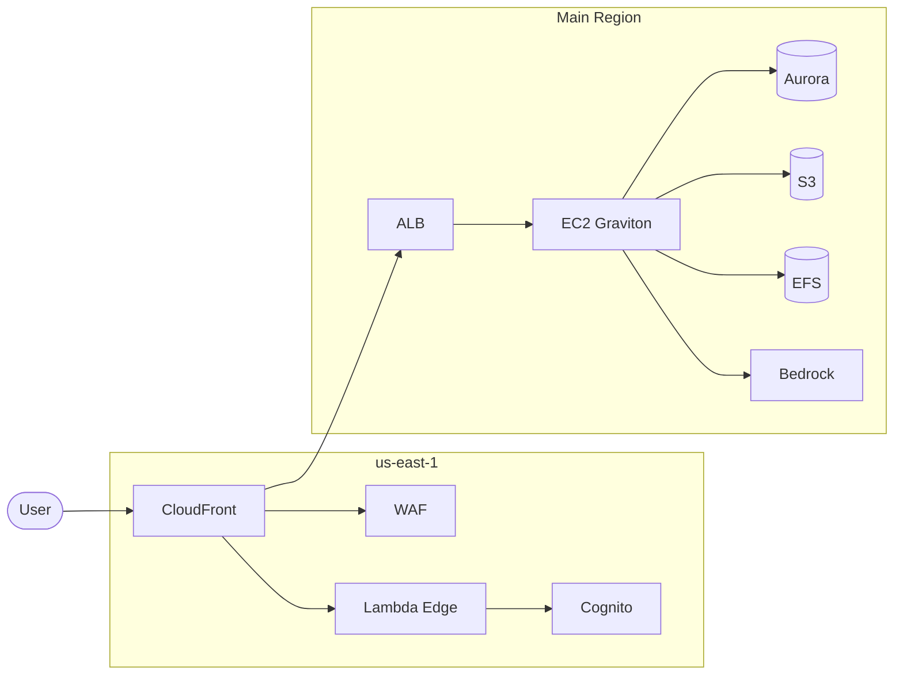
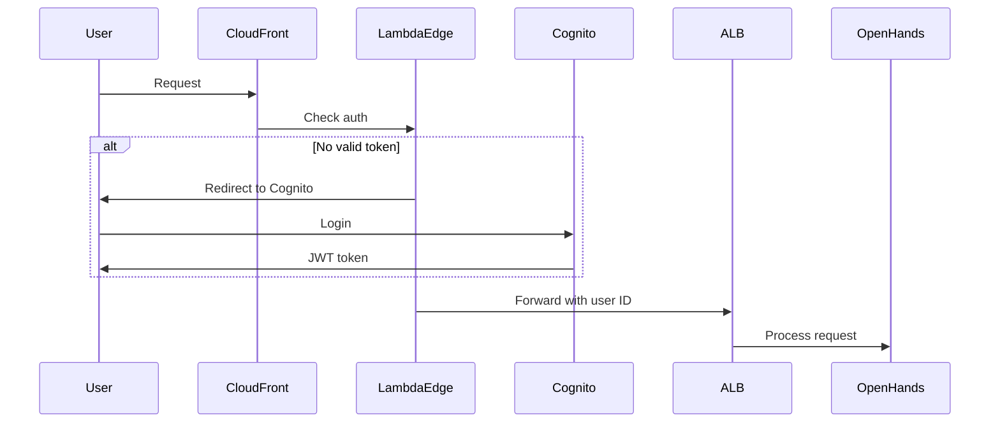

[OpenHands][openhands-github] is an open-source AI-driven development platform that enables AI agents to write code, fix bugs, and execute complex development tasks autonomously. The default setup works well for local development, but what if you want to run it for a team or make it accessible from anywhere?

This post introduces an [AWS CDK project][openhands-infra-repo] that extends OpenHands beyond single-user local usage. It adds multi-user authentication, persistent storage, and automatic recovery capabilities—transforming OpenHands into a shared service that your team can access from anywhere.

## The Rise of Cloud-Based AI Coding Agents

The AI coding landscape has evolved rapidly. While IDE-integrated tools like GitHub Copilot focus on code completion, a new category of **autonomous AI coding agents** has emerged—platforms that can independently plan, write, test, and deploy code with minimal human intervention.

**Commercial cloud platforms** now offer managed AI coding experiences:

- **[Devin][devin]** (Cognition AI): The first widely-known autonomous AI software engineer, handling complete tasks from planning to deployment
- **[Claude Code][claude-code]**: Anthropic's agentic coding tool that runs in your terminal, with Claude.ai offering [Artifacts][claude-artifacts] for interactive code generation
- **[OpenAI Codex][openai-codex]**: OpenAI's cloud-based coding agent running in sandboxed environments with GitHub integration
- **[v0][v0-vercel]** (Vercel): Cloud-based platform for generating full-stack applications with one-click deployment

These platforms provide convenience but come with trade-offs: **vendor lock-in**, **data privacy concerns**, **limited customization**, and **recurring subscription costs**.

**Why self-host OpenHands?**

| Consideration | Cloud Platforms | Self-Hosted OpenHands |
|--------------|-----------------|----------------------|
| Data privacy | Data processed by third parties | Your data stays in your AWS account |
| Customization | Limited to vendor features | Full control over configuration |
| Cost model | Per-seat subscription | Infrastructure cost (scales with usage) |
| LLM choice | Vendor-selected models | Any model (Bedrock, OpenAI, local) |
| Integration | Vendor-provided integrations | Custom integrations via API |

For organizations with strict compliance requirements, existing AWS infrastructure, or teams that prefer open-source solutions, self-hosting OpenHands provides the autonomous coding capabilities without the constraints of commercial platforms.

<!--more-->

## Why AWS CDK?

[AWS CDK][aws-cdk-docs] (Cloud Development Kit) is an Infrastructure as Code (IaC) tool that lets you define cloud infrastructure using familiar programming languages like TypeScript, Python, or Java. Instead of manually clicking through the AWS Console or writing verbose CloudFormation YAML, you write code that CDK compiles into CloudFormation templates.

**Key benefits for this project:**

- **Reproducible deployments**: Deploy the same infrastructure to dev, staging, and production accounts with a single codebase
- **Multi-account management**: Use CDK's cross-account deployment capabilities to manage OpenHands instances across different AWS accounts
- **Version controlled infrastructure**: Track infrastructure changes in Git, review in pull requests, and roll back if needed
- **Type safety**: TypeScript catches configuration errors at compile time rather than deployment time
- **Reusable constructs**: The six stacks in this project can be customized via context parameters for different environments

For teams running OpenHands across multiple AWS accounts (e.g., separate accounts for each team or environment), CDK makes it straightforward to maintain consistency while allowing per-account customization.

## OpenHands OSS vs This Project

Before diving into the architecture, let's understand what the default OpenHands provides and what this project adds.

### Default OpenHands (Local Setup)

Out of the box, OpenHands runs as a single Docker container:

| Aspect | Default Behavior |
|--------|------------------|
| **Database** | SQLite (single file) |
| **Storage** | Local filesystem |
| **Users** | Single user (localhost only) |
| **Authentication** | None |
| **LLM** | Multiple providers (API keys required) |
| **Persistence** | Lost when container removed |
| **Scaling** | Single container |

This works well for individual developers experimenting locally, but has limitations for team usage or always-on deployments.

### What This Project Adds

The openhands-infra project addresses these limitations:

| Aspect | This Project |
|--------|--------------|
| **Database** | Aurora Serverless v2 PostgreSQL |
| **Storage** | S3 (events) + EFS (workspaces) |
| **Users** | Multi-user with Cognito |
| **Authentication** | OAuth 2.0 via Lambda@Edge |
| **LLM** | AWS Bedrock (no API keys needed) |
| **Persistence** | Self-healing (survives instance replacement) |
| **Scaling** | Auto Scaling Group |

## Architecture Overview

The infrastructure uses six CDK stacks across two AWS regions:



**Edge Layer (us-east-1)**: CloudFront for global access, Lambda@Edge for authentication, Cognito for user management, WAF for protection.

**Main Region**: EC2 with Docker Compose running OpenHands, Aurora for conversation metadata, S3 for events, EFS for workspace files, Bedrock for LLM access.

## Key Differences Explained

### 1. Multi-User Authentication

**OSS**: No authentication—anyone with access to the URL can use it.

**This Project**: Cognito User Pool with OAuth 2.0 flow. Lambda@Edge validates JWT tokens at the CloudFront edge before requests reach the backend.



Each user's conversations are isolated—stored in per-user S3 paths and labeled containers.

### 2. Persistent Storage

**OSS**: SQLite file and local storage. Data is lost when the container is removed.

**This Project**: Three-tier persistent storage:

| Data Type | Storage | What Happens on Instance Replacement |
|-----------|---------|--------------------------------------|
| Conversation metadata | Aurora PostgreSQL | Preserved |
| Conversation events | S3 (versioned) | Preserved |
| Workspace files | EFS | Preserved |
| Instance state | EBS | Cleared |

When an EC2 instance is replaced (due to scaling, updates, or failures), users can resume their conversations. The new instance mounts the same EFS workspace and reconnects to Aurora.

### 3. LLM Integration

**OSS**: Supports many LLM providers (OpenAI, Anthropic, Google, local models, etc.) but requires users to configure and manage their own API keys.

**This Project**: Uses AWS Bedrock with IAM role-based access. No API keys needed—the EC2 instance's IAM role grants access to Claude models. This simplifies credential management and enables usage tracking via AWS billing.

### 4. Container Discovery

**OSS**: Single container with direct port access.

**This Project**: OpenHands creates sandbox containers dynamically for each conversation. An OpenResty proxy discovers these containers via Docker API and routes requests using wildcard subdomains:

```
https://5000-abc123.runtime.openhands.example.com/
         ↓
OpenResty queries Docker API → finds container → proxies to container IP:5000
```

This allows multiple concurrent conversations with isolated runtime environments.

## Deployment

### Prerequisites

- VPC with private subnets (2+ AZs)
- NAT Gateway
- Route 53 hosted zone
- Node.js 20+

### Quick Start

```bash
git clone https://github.com/zxkane/openhands-infra.git
cd openhands-infra
npm install

# Bootstrap CDK
npx cdk bootstrap --region us-west-2
npx cdk bootstrap --region us-east-1

# Deploy
npx cdk deploy --all \
  --context vpcId=vpc-xxxxx \
  --context hostedZoneId=Z0xxxxx \
  --context domainName=example.com \
  --context subDomain=openhands
```

After deployment, access `https://openhands.example.com` and log in with Cognito credentials.

## Cost Considerations

Running this infrastructure costs approximately **$375-420/month** for the base setup:

| Component | Monthly Cost |
|-----------|--------------|
| EC2 m7g.xlarge (Graviton) | ~$112 |
| Aurora Serverless v2 | ~$43-80 |
| CloudFront + ALB | ~$110 |
| VPC Endpoints | ~$50 |
| Other (EBS, S3, NAT, etc.) | ~$60-70 |

Bedrock usage is additional and varies based on Claude model and token consumption.

The cost is higher than running locally, but provides:
- Always-on availability
- Multi-user support
- Automatic backups
- Self-healing on failures

## When to Use This Project

**Good fit for:**
- Teams wanting shared access to OpenHands
- Organizations preferring AWS-managed services
- Deployments requiring authentication and audit trails
- Scenarios needing persistent conversations across sessions

**May be overkill for:**
- Individual developers working locally
- Quick experimentation or demos
- Cost-sensitive use cases with occasional usage

## Limitations and Trade-offs

- **WebSocket requirement**: CloudFront VPC Origin doesn't support WebSocket, so the ALB is internet-facing with origin verification headers
- **Single region compute**: The EC2 instances run in one region (though CloudFront provides global edge access)
- **Admin-managed users**: Cognito is configured without self-signup; an admin must create user accounts

## Resources

- [openhands-infra Repository][openhands-infra-repo]
- [OpenHands Documentation][openhands-docs]
- [AWS CDK Documentation][aws-cdk-docs]

---

<!-- GitHub Repositories -->
[openhands-github]: https://github.com/All-Hands-AI/OpenHands
[openhands-infra-repo]: https://github.com/zxkane/openhands-infra

<!-- Official Documentation -->
[openhands-docs]: https://docs.all-hands.dev/
[aws-cdk-docs]: https://docs.aws.amazon.com/cdk/latest/guide/

<!-- Cloud AI Coding Platforms -->
[devin]: https://devin.ai/
[claude-code]: https://docs.anthropic.com/en/docs/claude-code
[claude-artifacts]: https://support.anthropic.com/en/articles/9487310-what-are-artifacts-and-how-do-i-use-them
[openai-codex]: https://openai.com/codex
[v0-vercel]: https://v0.dev/
