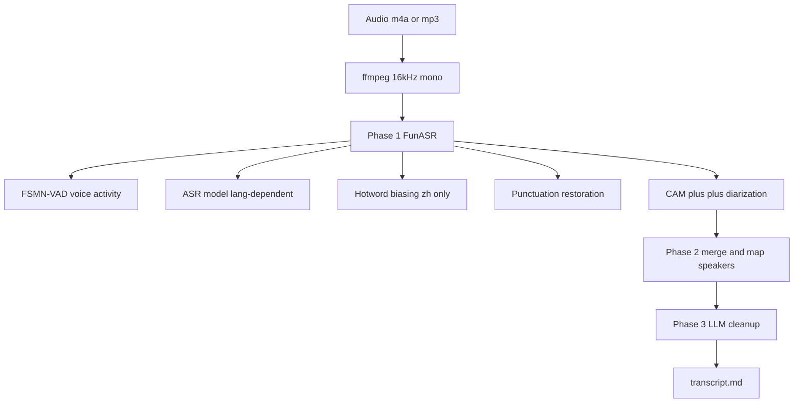

Two recordings sat on my disk waiting to be turned into searchable text. A 4-hour 13-minute discussion from a TGO founders' group — eight speakers, Chinese, Zoom audio. A 1-hour 8-minute podcast episode (屠龙之术 Vol.94 × 知本论) where two hosts spent the whole hour dissecting [OpenClaw][tulongzhishu-vol94] — its positioning, the AI-agent narrative, and investors' reactions.

Both were full of specific claims, speaker-attributed opinions, and Chinese brand terms I wanted to grep later. Neither would transcribe cleanly with the tools I tried first.

Commercial ASR APIs failed on at least one of three axes: per-minute pricing that stings for multi-hour hobby-scale work, poor recall for emerging Chinese brand names like "龙虾" (the nickname for OpenClaw) or "屠龙之术", and speaker diarization that quietly collapses an eight-person meeting into five voices. Off-the-shelf open-source pipelines were closer — but long-audio diarization was painfully slow and there was no single packaged workflow I could hand to a coding agent.

So I wrote [one][skill-repo].

## Why off-the-shelf doesn't fit long, multi-speaker audio

Three failure modes kept recurring:

**Length and pricing.** Major hosted APIs cap single-file duration or bill per minute. A single 4-hour meeting runs real money at typical rates — fine for a business, friction for iterating on a hobbyist pipeline.

**Chinese proper-noun recall.** Out-of-the-box ASR consistently mangles emerging brand names. In the hotword-biasing experiment that ships with the skill, "龙虾" (OpenClaw's community nickname) went from 28 recognized mentions to 42 with biasing — a 50% uplift. Person names like "高琦" went from zero to seven. Stock ASR simply could not hear words it had never been trained on.

**Diarization fragility on long audio.** FunASR's speaker clustering runs spectral decomposition on the full N×N Laplacian, where N is the number of voice-activity segments. For a 4-hour recording N is 6000+, and the stock pipeline takes **over ten hours** to cluster on a L40S GPU. The fix is a one-line swap, covered in the engineering deep-dive below.

I wanted a workflow I could run locally, resume when it crashed, iterate on, and hand to any coding agent as a skill.

## The skill: audio-transcriber-funasr

[`zxkane/audio-transcriber-funasr`][skill-repo] is an agent skill that wraps [FunASR][funasr] (Alibaba DAMO's open-source speech toolkit) into a one-command pipeline with speaker diarization, hotword biasing, and LLM cleanup.

Install it into any coding agent that supports the [skills.sh][skills-sh] standard — Claude Code, Cursor, Codex, Cline:

```bash
npx skills add zxkane/audio-transcriber-funasr
```

What the pipeline looks like end-to-end:



Five things come bundled:

- **Four language presets** — [SeACo-Paraformer][seaco-paraformer] for Chinese with hotwords (CER 1.95%), Paraformer-en for English, [SenseVoiceSmall][sensevoice] for auto-detect across zh/en/ja/ko/yue, and [Whisper-large-v3-turbo][whisper-turbo] for 99 languages.
- **Speaker diarization** via [CAM++][cam-plus] on every preset that emits per-sentence timestamps (`zh`, `zh-basic`, `en`).
- **Hotword biasing** on SeACo-Paraformer — inject participant names, project names, and domain terms to improve ASR recall on words the base model has never seen.
- **LLM post-cleanup** to remove fillers, fix homophone errors, polish grammar, and verify speaker labels. Supports Bedrock, Anthropic, and any OpenAI-compatible endpoint (vLLM, Ollama, commercial APIs) — pick your backend with environment variables.
- **A clustering patch** that swaps `scipy.linalg.eigh` (O(N³)) for `scipy.sparse.linalg.eigsh` (O(N²·k)) — cutting a 4-hour recording's clustering step from 10+ hours to ~10 seconds. The setup script installs it automatically.

Resume-from-checkpoint is on by default — a crashed run picks up at the last completed phase instead of re-transcribing 4 hours of audio.

## Case study 1: a 1-hour podcast episode

The recording: Vol.94 of 屠龙之术 ("the art of slaying dragons" — host 庄明浩, an investor in Chinese tech), crossed over with 知本论 (host 孙冰洁). Released 2026-04-16, 1h 8m 53s, two speakers, Chinese.

The shownotes gave me everything needed to prepare supporting files:

- A speaker context JSON describing who each host is and what they do
- A hotwords file with the proper nouns that mattered: `OpenClaw`, `龙虾`, `Manus`, `屠龙之术`, `知本论`, `PayPal`, `DeepSeek`, and both host names

One command to run the whole pipeline:

```bash
SCRIPTS=${CLAUDE_PLUGIN_ROOT}/skills/funasr-transcribe/scripts

python3 $SCRIPTS/transcribe_funasr.py episode.flac \
  --lang zh --num-speakers 2 \
  --speakers "庄明浩,孙冰洁" \
  --hotwords hotwords.txt \
  --speaker-context speaker-context.json \
  --title "Vol.94 再不聊聊openclaw可能就不需要聊了"
```

A lightly-trimmed excerpt from the resulting transcript, showing the cold open:

```text
[00:00:07] 孙冰洁: 大语言模型很像一个发动机，它甚至已经到了F1的引擎。
可是民众没有办法直接拿引擎来用。Manus就是非常简单版的脚手架，跟车一样。

[00:00:17] 庄明浩: 这个到底是技术落地的信号，还是一场赚快钱的狂欢？

[00:00:21] 庄明浩: 第一波赚钱的肯定是卖课的。
在美国也一样，所有公司的最优解就是应蹭尽蹭。
```

**First voice ≠ host.** The raw FunASR output labels speakers by first-appearance order — in this episode the guest 孙冰洁 speaks first, so `SPEAKER_00` is actually the guest. The skill handles this automatically in two layers: Phase 2 scans the first five minutes for explicit self-introductions ("我是X", "I'm X") and swaps labels if needed; Phase 3 asks the LLM to verify roles against the `speaker-context.json` before cleanup begins. For two-speaker podcasts this is a binary CORRECT/SWAP call; for 3+ speakers it becomes a full JSON reassignment.

**Hotwords matter, but only in Chinese.** Every term in `hotwords.txt` was Chinese. English loanwords like "PayPal" or "Manus" I deliberately left out — SeACo-Paraformer's hotword biasing operates on Chinese token embeddings and can actually regress recall on English terms. More on that in the deep-dive.

**End-to-end timing on a L40S GPU:** under ten minutes, dominated by the LLM cleanup call for the single 68-minute chunk. The FunASR model load, VAD, ASR, punctuation, and clustering together took well under a minute.

## Case study 2: a 4-hour, 8-speaker meeting

The harder recording: a 4h 13m TGO founders' discussion with eight speakers on a Zoom call, mostly Chinese with occasional English technical terms.

The first thirty seconds of the transcript, raw from the pipeline:

```text
[00:00:00] 用户1：做得快吗？
[00:00:07] 用户2：我没写。
[00:00:10] 用户3：这个靠传统的 SIP 电话过来。
[00:00:48] 用户4：这个。
[00:00:53] 用户3：好像不知道有没有，
先把它录下来，能拿到那个音频，然后再处理。
```

Three realities of long multi-speaker audio surfaced immediately:

**Diarization merges acoustically similar voices.** CAM++ detected seven distinct speaker IDs, not eight. Two participants with similar vocal profiles collapsed into one cluster. This is normal on conference-call audio where bandwidth compression flattens formants. Remedies built into the skill: pass `--num-speakers 8` to hint the expected count; provide `--speaker-context` with per-person keywords and let the LLM split merged IDs using those clues (the skill's own test suite reports ~73% success at this). For fully accurate labels, a short post-run pass by a human who knows the participants is still the fastest path.

**The O(N³) tax on long audio is real.** For this recording, N — the number of voice-activity segments — was over six thousand. Without the clustering patch, `scipy.linalg.eigh` on the full Laplacian takes **more than ten hours** on a L40S GPU. With the patch, the same step completes in roughly ten seconds. The clustering patch is the single most important optimization in the skill for recordings longer than about an hour.

**LLM cleanup becomes the wall-clock bottleneck.** On the L40S the FunASR phase (model load + VAD + ASR + punctuation + patched clustering) ran in under five minutes. The LLM cleanup pass — 17 chunks through a frontier model — took roughly 35 minutes. Total end-to-end: about 38 minutes for a 4h 13m recording — roughly 7× faster than real time.

The skill checkpoints after every phase, so a network blip or rate-limit hit during chunk 14 of 17 doesn't cost you the previous 30 minutes.

## Three engineering details that make it work

### Hotword biasing is Chinese-only — and can hurt English

SeACo-Paraformer supports hotword biasing: you pass a list of terms you expect to appear in the audio, and the model biases its decoding toward those tokens. Empirically, on a 4h 14m Chinese meeting with 27 hotwords:

| Term                   | Without hotwords | With hotwords | Change              |
| ---------------------- | ---------------: | ------------: | ------------------- |
| 龙虾                    |               28 |            42 | **+50%**            |
| 高琦 (person)           |                0 |             7 | **0 → 7**           |
| 鲲鹏 (org)              |                6 |             7 | +1                  |
| 搬瓦工 (brand)          |                0 |             1 | **0 → 1**           |
| Rebase (English)       |                5 |             0 | **regression**      |
| Tailwind (English)     |                3 |             1 | **regression**      |

Two things to take away. First, for Chinese proper nouns the uplift is significant — brand names and domain terms that the base model has never seen become recognizable. Second, English loanwords can *regress* when included in hotwords, because SeACo's biasing operates on the Chinese token vocabulary and fights with the model's existing English handling.

Practical rule: put Chinese terms in `hotwords.txt`, leave English terms out, and fix any remaining English errors in the Phase 3 LLM cleanup pass. If English term accuracy matters more than hotword uplift, use `--lang zh-basic` (the plain Paraformer variant without hotword support).

### The clustering patch: ten hours to ten seconds

This is the highest-impact patch in the pipeline, and it reduces to a one-line swap.

FunASR's `SpectralCluster.get_spec_embs()` computes speaker embeddings by running eigendecomposition on the graph Laplacian:

```python
# stock FunASR — computes ALL N eigenvalues
from scipy.linalg import eigh
eigenvalues, eigenvectors = eigh(L)
```

[`scipy.linalg.eigh`][scipy-eigh] is a dense symmetric-eigendecomposition routine. It returns all N eigenpairs, running in O(N³). For a 4-hour recording where N ≈ 6000, that's roughly 2×10¹¹ operations — measured on a L40S GPU, over ten hours of wall-clock time.

But k-way spectral clustering only needs the k smallest eigenvalues. The patch in [`scripts/patch_clustering.py`][skill-repo] replaces the call with a sparse iterative solver:

```python
# patched — computes only the k smallest eigenvalues
from scipy.sparse.linalg import eigsh
eigenvalues, eigenvectors = eigsh(L_sparse, k=num_speakers, which='SM')
```

[`scipy.sparse.linalg.eigsh`][scipy-eigsh] uses Lanczos iteration and stops after finding the k eigenvalues you actually want. Complexity drops to O(N²·k). On the same 4-hour recording: ~10 seconds.

A second optimization: the `p_pruning()` step (which sparsifies the affinity matrix) was a Python loop in the stock implementation; the patch rewrites it with numpy broadcasting. The combined effect is large enough that without the patch, 4-hour diarization is effectively impossible on a single GPU; with it, clustering is a footnote in the total runtime.

General takeaway for numerical pipelines: when a step feels "slow, but I guess that's just how it is," check what the inner routine is actually computing. Here it was computing thousands of eigenvalues that nobody ever read.

### LLM cleanup is a core phase, not an optional polish

Raw ASR output is readable but tiring. Fillers (嗯, 啊, um, uh), self-corrections, homophone errors that only the surrounding context disambiguates, and sentence boundaries broken by aggressive VAD all accumulate. Across a 4-hour transcript, the readability tax is real.

The skill's LLM cleanup phase does four things per chunk:

1. **Remove fillers** without losing semantic content.
2. **Fix homophone errors** using local context — Chinese ASR confuses 尔 / 儿 / 而 constantly, and only context disambiguates.
3. **Polish grammar** while preserving wording and tone. The system prompt explicitly forbids rewriting.
4. **Verify speaker labels** (when `--speaker-context` is provided) by checking whether the first chunk's attributions are consistent with the provided roles.

The backend is configurable: set `AWS_REGION` for Bedrock, `ANTHROPIC_API_KEY` for Anthropic, or `OPENAI_API_KEY` + `OPENAI_BASE_URL` for any OpenAI-compatible endpoint (including self-hosted vLLM and Ollama). A local Qwen-72B via vLLM gets the same cleanup quality as a hosted frontier model at no marginal cost per chunk.

## Performance: GPU vs CPU

Benchmarked on the 4h 14m, 9-speaker Chinese recording that ships in the skill's own tests:

| Phase                     | GPU (L40S 46GB)     | CPU               |
| ------------------------- | ------------------- | ----------------- |
| Model load                | 14s                 | ~30s              |
| Transcription             | 169s                | 30–60 min         |
| Clustering (patched)      | ~10s                | 2–5 min           |
| LLM cleanup (17 chunks)   | ~35 min             | ~35 min (network-bound) |
| **Total**                 | **~38 min**         | **70–100 min**    |

The important framing: **LLM cleanup dominates total wall-clock time on GPU**. Moving to CPU is less painful than the transcription row suggests, because the LLM call is network-bound either way. A 4-hour meeting on a laptop-class CPU runs overnight, not over a weekend.

First-run model download is ~944 MB for SeACo-Paraformer; cached after that. The tool earns its setup cost only at multi-hour or recurring volume — for one-off short clips, a hosted API is faster end-to-end.

## When *not* to use this

- **Real-time captioning or live streaming** — this is a batch pipeline. For live use cases, Whisper-streaming variants or a hosted live-transcription service are better fits.
- **Pure English short clips** — AWS Transcribe or OpenAI Whisper is a simpler path. You don't need hotword biasing or a 944 MB local model.
- **Auto-detect or Whisper preset plus speaker labels** — `--lang auto` (SenseVoiceSmall) and `--lang whisper` don't emit per-sentence timestamps, so CAM++ diarization is disabled for those presets. Use `zh`, `zh-basic`, or `en` when you need speaker attribution.
- **You have no patience for a first-run model download** — the setup script pulls ~944 MB of FunASR models on first use. Subsequent runs use the local cache.

## Resources

The skill repository: [zxkane/audio-transcriber-funasr][skill-repo]. It ships with the clustering patch, setup script, and both the skills.sh manifest and a Claude Code plugin manifest, so the same code works across coding agents.

Natural follow-ups I'm working on next: (1) a lightweight RAG index over a growing local transcript corpus so "what did X say about Y three months ago" becomes a single query, and (2) per-episode summaries gated by the same LLM cleanup backend.

Related posts:

- [From Solo AI Engineer to Autonomous Dev Team][openclaw-autonomous] — the OpenClaw multi-agent workflow this blog's recent posts have been building toward.
- [The AI Digital Engineer Pattern][claude-code-workflow] — single-agent predecessor to the autonomous team.

---

<!-- GitHub Repositories -->
[skill-repo]: https://github.com/zxkane/audio-transcriber-funasr
[skills-sh]: https://skills.sh

<!-- FunASR and Models -->
[funasr]: https://github.com/modelscope/FunASR
[seaco-paraformer]: https://www.modelscope.cn/models/iic/speech_seaco_paraformer_large_asr_nat-zh-cn-16k-common-vocab8404-pytorch
[cam-plus]: https://www.modelscope.cn/models/iic/speech_campplus_sv_zh-cn_16k-common
[sensevoice]: https://www.modelscope.cn/models/iic/SenseVoiceSmall
[whisper-turbo]: https://www.modelscope.cn/models/iic/Whisper-large-v3-turbo

<!-- scipy references for clustering patch -->
[scipy-eigh]: https://docs.scipy.org/doc/scipy/reference/generated/scipy.linalg.eigh.html
[scipy-eigsh]: https://docs.scipy.org/doc/scipy/reference/generated/scipy.sparse.linalg.eigsh.html

<!-- Podcast source -->
[tulongzhishu-vol94]: https://www.xiaoyuzhoufm.com/episode/69e0d423b977fb2c471ea30c

<!-- Related posts -->
[openclaw-autonomous]: 
[claude-code-workflow]: 
