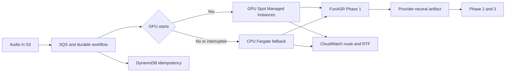

## 1. The Three-Phase Transcription Pipeline

A production podcast transcript is not produced by one model call. The pipeline behind these measurements has three stages:

1. **Phase 1:** VAD, speech recognition, punctuation, timestamps, and speaker diarization.
2. **Phase 2:** speaker identity verification and label correction.
3. **Phase 3:** transcript cleanup, rewrite constraints, and quality gates.

These phase names are local to this implementation, not an industry-standard taxonomy. For the economics comparison, the relevant boundary is Phase 1: the stage that Gemini Transcribe or FunASR can directly produce. The existing Phase 2 and Phase 3 implementations are held constant, so their shared LLM costs are excluded from both sides. This is a Phase 1 infrastructure comparison, not a total-pipeline TCO result; any provider-driven change in downstream inference or correction work must be measured separately.

That boundary matters because Gemini exposes two fundamentally different outputs:

- **Verbatim mode** is appropriate for a Phase 1 comparison. It preserves fillers and false starts, and it can return diarization and word timestamps.
- **Smart mode** removes disfluencies, resolves self-corrections, and formats the transcript for reading. It overlaps with later cleanup work and cannot be combined with diarization or timestamps.

Smart output may reduce downstream processing, but it must be evaluated as an end-to-end pipeline variant, not scored against raw ASR as if both systems produced the same artifact.

### Why Smart Mode Does Not Replace All Three Phases

Smart mode looks close to an end-to-end option because one request performs speech recognition and generic transcript cleanup. For a simple monologue that only needs readable text, it may replace most of the pipeline. It does not, however, satisfy the production artifact contract used here:

| Required artifact or operation | Smart mode alone | Remaining gap |
|:---|:---:|:---|
| Readable transcript with fillers and false starts removed | Yes | This covers part of Phase 1 and a generic subset of Phase 3 |
| Speaker diarization with word timestamps | No | Google's [transcription guide][gemini-transcribe-guide] says Smart mode cannot be combined with either feature |
| Real speaker identities | No | Diarization returns anonymous labels such as `spk_1`; Phase 2 maps them to known people and repairs label swaps |
| Application-specific rewrite constraints | No | Phase 3 enforces podcast-specific terminology, structure, and preservation rules |
| Quality gates and source-grounded audit | No | Smart mode intentionally edits the spoken form, so omissions and semantic changes still need validation against a structured or verbatim artifact |

It is possible to submit the audio twice: once in Structured mode for diarization and timestamps, and once in Smart mode for reading-ready text. That design processes the same audio through two API calls and introduces a reconciliation step between outputs. It may still be worthwhile, but it is no longer a one-call replacement for the three-phase pipeline.

The precise conclusion is that Smart mode can replace **generic cleanup work**, not speaker identity verification or production quality control. Its economic value should therefore be measured by the Phase 3 inference and human editing it actually removes.

With that scope defined, Google's dedicated [Gemini 3.5 Transcribe][gemini-transcribe-model] models become a serious managed alternative to the open-source route. They add native speaker diarization, word-level timestamps, custom vocabulary, automatic language detection, code-switching, and a Smart mode that removes fillers and resolves spoken self-corrections.

The production question is economic: should the Phase 1 stage run through a managed API, or remain self-hosted on [FunASR][funasr] with GPU Spot capacity and a CPU fallback? My earlier [FunASR podcast transcription guide][funasr-podcast-guide] covers the model pipeline itself; this post focuses on the measured cost and operational tradeoffs.

I used a 30-day production observation covering **130 completed episodes** and **333.25 known audio hours**, then normalized the observed economics to a **300-hour comparison cohort**:

- Gemini 3.5 Transcribe costs about **$90 for 300 audio hours** at Google's current effective blended estimate of $0.005 per minute as of 2026-09-06.
- The observed AWS open-source route costs about **$11.69 for the same 300 audio hours**, including GPU compute, ECS Managed Instances fees, GPU-lane EBS and regional transfer, and CPU fallback usage.
- The published Gemini estimate is therefore about **7.7x the observed AWS spend** for this workload.

Gemini buys a wider native feature surface and much lower infrastructure ownership. The open-source stack retains a large recurring-volume cost advantage and more control over data, models, and failure handling.

---

## 2. What Gemini 3.5 Transcribe Adds

The recorded model is `gemini-3.5-transcribe`, accessed through the Gemini [Interactions API and Files API][gemini-transcribe-guide]. The streaming model is `gemini-3.5-transcribe-live`, accessed through the Live API.

For prerecorded podcast processing, the recorded model offers the relevant feature set:

| Capability | Gemini 3.5 Transcribe behavior |
|:---|:---|
| Languages | Automatic detection across 85+ languages, including code-switching |
| Recorded-audio limit | Up to 1 hour per request |
| Annotated-audio limit | Up to 30 minutes with diarization or word timestamps |
| Speaker diarization | Up to 8 speakers; attribution for 3+ speakers is experimental |
| Word timestamps | Word-level start/end offsets; Google warns they can reduce accuracy |
| Custom vocabulary | Up to 1,000 phrases; focused lists of 100 or fewer are recommended |
| Smart transcription | Filler removal, self-correction resolution, and automatic formatting |
| Batch API | Not supported |
| Published paid estimate | About $0.003/min audio input + $0.002/min text output, or ~$0.005/min blended |

Three configuration constraints directly affect benchmark design:

1. **Smart mode cannot be combined with diarization or word timestamps.**
2. **Custom vocabulary can be combined with diarization, but not with word timestamps.**
3. **Annotated podcast audio must be chunked at 30 minutes**, with overlap and speaker continuity handled by the caller.

So a credible benchmark needs separate Gemini arms:

- **Structured:** verbatim + diarization + word timestamps.
- **Vocabulary + diarization:** verbatim + custom vocabulary + diarization, without word timestamps.
- **Smart:** readability-oriented output, reported separately from the Phase 1 quality table.

Trying to create one "everything enabled" request is both invalid and methodologically confused.

### A Small Real-Audio Pilot

Before looking at production-scale cost, I ran a 60-second Chinese podcast clip through two recorded-audio configurations:

| Gemini arm | Upload | API | Total | API real-time factor |
|:---|---:|---:|---:|---:|
| Structured | 2.1 s | 8.5 s | 10.6 s | 0.142 |
| Vocabulary-only | 2.9 s | 6.0 s | 8.9 s | 0.100 |

The output corrected obvious context errors in the existing FunASR transcript, including a mistaken Chinese phrase where the surrounding discussion clearly referred to "AI." That is promising, but it is not a quality verdict: a single clip without blinded human ground truth cannot establish CER, speaker attribution accuracy, or hallucination rate.

The pilot does establish that Gemini is fast enough for asynchronous podcast processing. The remaining questions are quality across difficult cohorts, quota-aware throughput, chunk stitching, and economics.

## 3. The Production Dataset Behind the 300-Hour View

The open-source measurements cover the 30-day period from **2026-08-05 inclusive to 2026-09-04 exclusive**.

| Production metric | Observed value |
|:---|---:|
| Completed episodes | 130 |
| Episodes with positive source duration | 125 |
| Episodes with missing duration | 5 |
| Known source audio | 333.25 h |
| Mean-imputed source audio | 346.58 h |
| GPU lane cost | $9.56 |
| CPU fallback cost | $3.43 |
| Observed Phase 1 AWS cost | $12.99 |

These are aggregate production billing and telemetry observations, not a portable AWS rate-card reconstruction. Region, instance mix, Spot prices, ECS Managed Instances fees, EBS, transfer, retries, and fallback frequency will change the result for another deployment. Engineering labor, model maintenance, and on-call cost are not included.

The 125 episodes with positive duration average **2.67 hours each**, which is consistent with a long-form podcast workload.

The 300-hour comparison uses known-duration audio. Because the 5 missing durations are excluded from the denominator, this produces a **conservative upper bound on the observed AWS unit cost**:

```text
Open-source Phase 1
  = $12.988454
    / 333.2475 audio hours
    * 300 hours
  = $11.69

Gemini 3.5 Transcribe
  = 300 hours
    * 60 minutes
    * $0.005/minute
  = $90.00
```

The two columns have different evidence types:

- The AWS number is a normalization of **observed production spend**, including retries and the actual GPU/CPU routing mix.
- The Gemini number is a **pricing model** using Google's current published effective blended estimate. Actual billing is token-based, so dense speech and output shape can move it.

Neither includes Phase 2 or Phase 3. The comparison also excludes implementation labor and ongoing operational ownership, so it should not be read as a complete build-versus-buy break-even calculation.

## 4. Phase 1 Cost and Throughput Results

### Cost at 300 Audio Hours

| Phase 1 option | Evidence basis | Cost per audio hour | 300-hour cost |
|:---|:---|---:|---:|
| Gemini 3.5 Transcribe | Current effective blended estimate | ~$0.300 | **~$90.00** |
| FunASR on AWS | Observed 30-day production mix | ~$0.039 | **~$11.69** |

For this workload:

- The published Gemini estimate is **7.7x the observed AWS spend**
- Observed AWS spend is **$78.31 lower per 300 audio hours**
- Observed AWS spend is about **87% below** the Gemini estimate

A linear 1,000-hour extrapolation produces roughly **$300 for Gemini** versus **$39 for the observed AWS route**. This extrapolation covers service and infrastructure spend only; it does not establish total-cost payback after engineering and operations.

### GPU and CPU Processing Behavior

Both worker routes emitted decoded-audio duration during a paired 12-day measurement interval:

| Metric | GPU Spot route | CPU fallback route |
|:---|---:|---:|
| Tasks | 227 | 87 |
| Audio processed | 250.44 h | 92.83 h |
| FunASR processing time | 7.20 h | 18.24 h |
| Weighted real-time factor | 0.0287 | 0.1965 |
| Processing speed | **34.8x real time** | **5.09x real time** |

These rows count worker executions, not unique episodes. The 12-day telemetry window includes chunked work, retries, reprocessing, and backlog that can originate outside the 30-day completion cohort, so its task and decoded-audio totals should not be reconciled directly with the episode table. The data is used here only to compare per-route processing speed.

The GPU route was **6.84x faster** inside FunASR after normalizing for audio duration. At those real-time factors:

- 300 hours sent serially through the GPU lane represents about **8.62 worker-hours** of FunASR processing.
- The same 300 hours entirely on CPU represents about **58.94 worker-hours**.

The CPU path is deliberately not the headline cost optimization. Its primary job is to keep the queue moving when GPU Spot capacity cannot be fulfilled, an instance is reclaimed, or a GPU task fails its start-time budget. The $11.69 baseline includes both routes because production traffic actually used both; omitting CPU fallback cost would understate the real operating expense. Even at 5.09x real time, CPU can drain asynchronous podcast work without turning temporary GPU scarcity into an outage.

## 5. AWS Architecture for the Open-Source Route

The architecture keeps Phase 1 artifacts provider-neutral and makes fallback an explicit workflow decision:



[ECS Managed Instances][aws-ecs-managed-instances] handles instance provisioning, scaling, patching, and lifecycle management while allowing GPU-specific instance requirements. A Managed Instances capacity provider configured for Spot supplies the preferred GPU lane.

The CPU lane is a separate Fargate task definition. This separation is intentional: ECS capacity-provider strategies cannot freely mix Managed Instances and Fargate provider types in one strategy. The workflow must catch a capacity/start failure, Spot interruption, or queue-age threshold and then launch the CPU task explicitly.

[Step Functions can run ECS tasks and wait for completion][aws-step-functions-ecs], but the same pattern also works with an [AWS Lambda durable function][aws-lambda-durable]. A durable execution checkpoints and resumes across Lambda invocations instead of holding one invocation open for the whole ECS task:

1. Write an immutable input object and content hash to S3.
2. Attempt the GPU task with a bounded capacity retry budget.
3. Route to CPU when the GPU start SLO is exhausted or the task is interrupted.
4. Write the same versioned Phase 1 schema from either worker.
5. Advance the episode only after an idempotent artifact check.

Every task should emit at least:

- source audio seconds
- Phase 1 processing milliseconds
- route and instance family
- capacity outcome
- retry and interruption counts
- queue-to-start latency
- output segment and speaker counts

Without those dimensions, a low monthly bill can hide a growing backlog or a fallback lane carrying much more traffic than intended.

## 6. How to Run a Defensible 300-Hour Quality Benchmark

Operational metrics can be collected across all 300 hours. Human ground truth should be concentrated where it changes the decision.

### Corpus Design

Use identical audio hashes across all provider arms and stratify the 300 hours into:

- two-speaker Mandarin interviews
- 3-8 speaker panels
- Mandarin-English code-switching
- terminology-heavy technical discussions
- noisy remote-call audio
- episodes crossing 30-minute chunk boundaries, measuring stitching latency, boundary omissions or duplication, and speaker continuity
- long-form episodes over four hours

The full corpus measures success rate, retries, wall time, RTF, chunk failures, and cost. A blinded 8-12 hour subset of annotated windows is a pragmatic starting point for expensive human-scored metrics, not a universal sample-size claim. Final sampling should be set by preregistered precision targets, per-cohort coverage, normalization rules, diarization collars, overlap treatment, and annotator agreement.

### Provider Arms

| Arm | Purpose | Directly comparable metrics |
|:---|:---|:---|
| FunASR production | Current Phase 1 baseline | CER, term recall, speaker attribution, timestamps, RTF, cost |
| FunASR vocabulary | Measure metadata-derived term biasing | CER, term precision/recall, RTF, cost |
| Gemini structured | Native diarization and timestamps | CER, speaker attribution, timestamp error, RTF, cost |
| Gemini vocabulary + diarization | Domain terminology and speaker attribution without word timestamps | CER, term precision/recall, speaker attribution, RTF, cost |
| Gemini Smart | Reading-ready transcript experiment | Human edit distance, omissions, semantic preservation |

Do not score Gemini Smart against a verbatim reference with ordinary CER and call the result worse. Smart mode intentionally deletes fillers and resolves false starts. Its correct question is whether it reduces human editing and downstream LLM work without changing meaning.

### Quality Metrics

For the annotated windows, report:

- Chinese character error rate and English word error rate
- named-term precision and recall
- speaker-attributed error rate
- diarization DER/JER
- word timestamp median and p95 error
- omission, duplication, and hallucination counts
- human correction time per audio hour

The last metric is important. A managed API can justify a higher Phase 1 price if it materially reduces Phase 2/3 inference or editorial correction. Raw ASR cost is not the complete economic outcome.

## 7. Gemini or Open Source: Where Each Wins

### Choose Gemini 3.5 Transcribe When

- You need to launch quickly without owning model images, GPU capacity, or worker observability.
- The workload is low-volume or irregular enough that infrastructure engineering dominates model spend.
- The long tail of 85+ languages and code-switching matters more than tuning one language deeply.
- Native Live transcription is required.
- Smart transcription can replace a meaningful downstream cleanup step.

For production audio, use the paid tier. Google's [pricing and data-use table][gemini-pricing] says free-tier content may be used to improve products, while paid-tier content is not. The [Gemini API terms][gemini-terms] should still be reviewed against the dataset's consent and retention requirements. A shadow benchmark should use authorized audio, delete Files API uploads after processing, keep raw artifacts and credentials out of Git, restrict transcript logs, and publish only aggregate results.

### Choose the Open-Source AWS Stack When

- Recurring volume is measured in hundreds or thousands of audio hours.
- Data control and model pinning are requirements.
- You need custom segmentation, vocabulary generation, or diarization repair.
- Long recordings should not inherit a 30-minute annotated-request boundary.
- You can operate asynchronous queues and tolerate a few minutes of capacity startup.

Based on the current Phase 1 workload, the open-source route remains the default. A broader provider switch should wait for paired quality results and downstream correction-cost measurements.

### The Practical Hybrid

The best production design is not necessarily a permanent provider switch:

1. Keep FunASR on GPU Spot as the normal Phase 1 route.
2. Use CPU fallback to preserve liveness during GPU capacity shortages.
3. Shadow a representative corpus through Gemini structured and vocabulary + diarization arms.
4. Route selected language or quality cohorts to Gemini only when measured correction savings justify the price delta.
5. Keep a provider-neutral Phase 1 artifact so downstream phases do not care which engine produced it.

This uses Gemini as a quality and capability option without converting every audio minute into an external API charge.

## 8. Conclusion

Gemini 3.5 Transcribe is the first Gemini speech API I would treat as a direct ASR product rather than a multimodal-model workaround. Native diarization, timestamps, vocabulary biasing, code-switching, and Smart transcription make it operationally credible.

At production podcast volume, the observed Phase 1 infrastructure spend remains difficult to beat. A 300-hour workload models to about **$90 on Gemini** versus **$11.69 on the observed AWS FunASR route**. The AWS stack also processed GPU work at **34.8x real time**, while the CPU fallback stayed above **5x real time** and protected the pipeline from GPU capacity shortages.

The decision is therefore not "API or self-hosting." It is:

- use open source for the high-volume, controlled default;
- use CPU as a capacity-resilience lane, not as the marketing headline;
- use Gemini where its measured quality, language coverage, or downstream-work reduction earns the additional cost.

That is a stronger architecture than betting the whole pipeline on either provider.

---

<!-- Google Official Documentation -->
[gemini-transcribe-model]: https://ai.google.dev/gemini-api/docs/models/gemini-3.5-transcribe
[gemini-transcribe-guide]: https://ai.google.dev/gemini-api/docs/transcribe
[gemini-pricing]: https://ai.google.dev/gemini-api/docs/pricing
[gemini-terms]: https://ai.google.dev/gemini-api/terms

<!-- AWS Official Documentation -->
[aws-ecs-managed-instances]: https://docs.aws.amazon.com/AmazonECS/latest/developerguide/ManagedInstances.html
[aws-step-functions-ecs]: https://docs.aws.amazon.com/step-functions/latest/dg/connect-ecs.html
[aws-lambda-durable]: https://docs.aws.amazon.com/lambda/latest/dg/durable-functions.html

<!-- Open Source -->
[funasr]: https://github.com/modelscope/FunASR

<!-- Related Articles -->
[funasr-podcast-guide]: 
