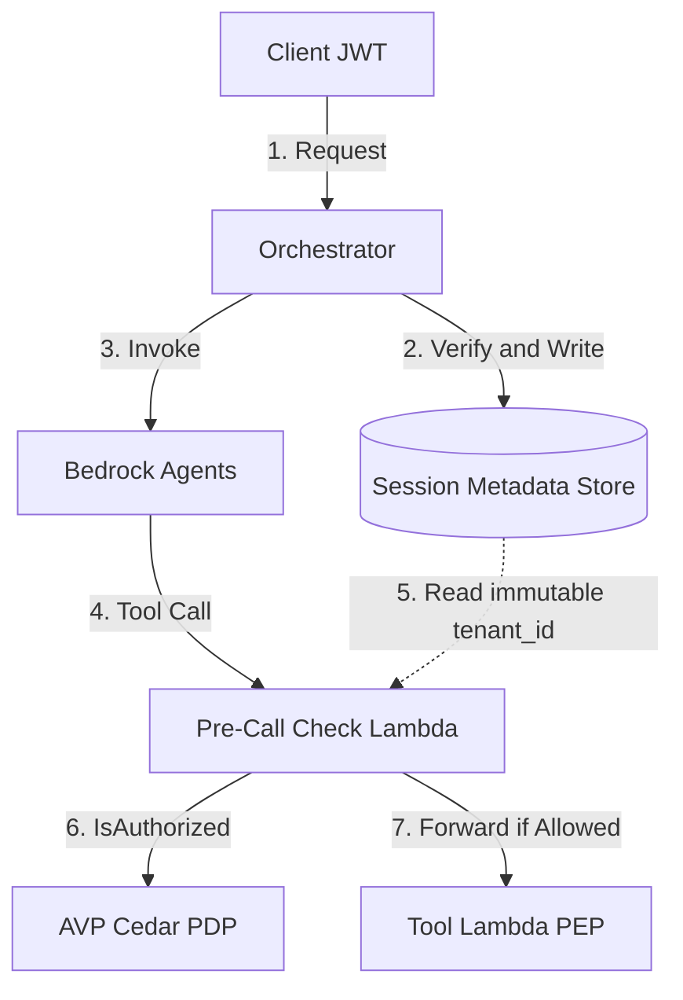

## TL;DR (30-Second Read)

With Amazon Bedrock AgentCore now generally available — including **AgentCore Identity** for agent authentication and **AgentCore Policy**, which enforces Cedar rules by intercepting every tool call before execution — the security design for multi-tenant SaaS on Bedrock Agents has reached an inflection point. This blueprint addresses the hardest problem in agentic SaaS: a Large Language Model (LLM) that, through prompt injection or hallucination, crosses tenant boundaries or escalates privileges. The answer is a **zero-trust, low-latency, two-layer authorization architecture with real-time quota enforcement**, built on Amazon Verified Permissions (AVP) and the Cedar policy engine.

- **Who this is for**: Cloud architects and senior security/backend engineers building or running multi-tenant SaaS on Amazon Bedrock Agents.
- **If you read only one section**: jump to [Two-Layer Authorization Architecture][two-layer], the most directly actionable part of the design.

---

## 1. Threat Model

When you build enterprise multi-tenant AI agent SaaS, the agent's dynamic decision-making and autonomous reasoning introduce security threats that traditional web applications never faced. This blueprint defends against three core failure modes:

1. **Impersonation and tenant injection.** An attacker uses prompt injection to tamper with the agent's runtime context (for example, session attributes), tricking a tool Lambda into performing a cross-tenant data operation.
2. **Permission creep.** Across multi-step reasoning, an agent — driven by hallucination or a malicious prompt — accumulates excessive privilege between iterations, or chains individually harmless tools to reach a high-risk operation.
3. **Data isolation failure.** Inconsistent resource identification or bolt-on authorization logic causes the Policy Enforcement Point (PEP) to skip the tenant context during a check, leaking data across tenants.

---

## 2. Trust Boundaries and Trust Anchors

To eliminate attacks that exploit **mutability**, the system must establish a single trusted source — a *trust anchor* — for both the principal and resource identity, and treat them as **intrinsic identity** rather than runtime-mutable context.

| Identity Dimension | Trusted Source | Implementation and Tamper-Resistance |
| :--- | :--- | :--- |
| **Principal Tenant ID** | Session Metadata Store (immutable) | 1. Abandon `sessionAttributes`, which are vulnerable to mutation. 2. Use an external Session Metadata Store (such as DynamoDB) keyed by `session_id`, binding `tenant_id`, `cognito_sub`, and `created_at`. 3. The orchestrator writes this record after JWT verification; the tool and PEP have read-only access, and the agent has no write permission. |
| **Resource Tenant ID** | Resource Prefix Convention (intrinsic) | 1. Enforce a tenant-prefix convention on resource identifiers (such as `tenant-{id}/resources/{resource-id}`). 2. The tenant ID is part of the resource identity, not a bolt-on field. 3. Even if the agent omits tenant context in its parameters, the PEP can extract it by parsing the resource ID, preventing escalation. |



{}
Never trust a `tenant_id` produced by the LLM or passed through `sessionAttributes`. Every security check must compare against the **Session Metadata Store** (the principal trust anchor) and the **prefix convention** (the resource trust anchor).
{}

---

## 3. Cedar Policy Patterns

Using Amazon Verified Permissions (AVP) as the Policy Decision Point (PDP), declarative Cedar policies express three tenant-control models.

### Pattern A: Owner-Isolated (Strong Tenant Isolation)

The bottom-line hard boundary: a principal may only act on resources belonging to the same tenant.

```cedar
// Pattern A: Owner-Isolated (strong tenant isolation)
permit (
    principal,
    action in [
        Action::"GetDocument",
        Action::"UpdateDocument",
        Action::"DeleteDocument"
    ],
    resource
)
when {
    principal.tenant_id == resource.tenant_id
};
```

### Pattern B: Role-Tiered (Fine-Grained Roles Within a Tenant)

Within the isolation boundary, grant different permissions to Admin, Member, and Guest roles.

```cedar
// Pattern B: Role-Tiered (fine-grained roles within a tenant)
// 1. Admin, Member, and Guest in the tenant may read documents
permit (
    principal,
    action in [Action::"ReadDocument"],
    resource
)
when {
    principal.tenant_id == resource.tenant_id &&
    principal.role in ["Admin", "Member", "Guest"]
};

// 2. Only Admin and Member may write or modify documents
permit (
    principal,
    action in [Action::"WriteDocument", Action::"CreateDocument"],
    resource
)
when {
    principal.tenant_id == resource.tenant_id &&
    principal.role in ["Admin", "Member"]
};

// 3. Only Admin may perform high-risk configuration operations
permit (
    principal,
    action in [Action::"DeleteTenantSpace", Action::"ConfigureIntegrations"],
    resource
)
when {
    principal.tenant_id == resource.tenant_id &&
    principal.role == "Admin"
};
```

### Pattern C: Quota-Bounded (Plan-Aware Real-Time Quota Enforcement)

Dynamically block over-quota requests. The tenant's quota state is **not** stored in Cedar; the PEP fetches it in real time and passes it to the PDP through `context`.

```cedar
// Pattern C: Quota-Bounded (plan-aware real-time quota enforcement)
// Enterprise tenants may call expensive tools directly
permit (
    principal,
    action in [Action::"InvokePremiumTool"],
    resource
)
when {
    principal.tenant_id == resource.tenant_id &&
    principal.tier == "Enterprise"
};

// Standard tenants must pass a context-supplied quota check
permit (
    principal,
    action in [Action::"InvokePremiumTool"],
    resource
)
when {
    principal.tenant_id == resource.tenant_id &&
    principal.tier == "Standard" &&
    context.monthly_api_calls < context.api_call_limit
};
```

{}
For concurrent quota updates, use a **DynamoDB conditional update** for atomicity, and perform a **read-after-write (strongly consistent, no-cache) read** before evaluation to prevent over-quota window bypass.
{}

---

## 4. Two-Layer Authorization Architecture

To balance defense and runtime cost, the system uses a two-layer design: a **pre-call check** (first-line entrance filter) and a **post-call PEP** (second-line in-Lambda safety net). This mirrors how AgentCore Policy itself intercepts tool calls before execution — the pre-call layer is the place to do it cheaply, while the post-call PEP remains the defense-in-depth backstop.

```
+--------------------------------------------------------------------------+
|                       Orchestrator (Cognito JWT)                         |
+--------------------------------------------------------------------------+
                                     |
                                     v
+--------------------------------------------------------------------------+
| 1. Pre-Call Check (Action Group Entrance)                                |
|    - Intercept structured params from Bedrock Agents (OpenAPI schema)    |
|    - Map to an (Action, Resource) tuple                                  |
|    - Read principal.tenant_id from the Session Metadata Store            |
|    - Extract resource.tenant_id from the resource prefix                 |
|    - AVP Evaluate -> DENY: return a unified 403 JSON to the runtime      |
+--------------------------------------------------------------------------+
                                     |
                                  ALLOW
                                     v
+--------------------------------------------------------------------------+
| 2. Post-Call PEP (Tool Lambda PEP) - Safety Net                          |
|    - Guards against pre-call misses or bypass                            |
|    - Re-evaluates by calling the AVP PDP again                           |
|    - DENY: block execution, return structured 403, trip circuit + audit  |
+--------------------------------------------------------------------------+
```

### A. Layer 1: Pre-Call Check (Entrance Interception)

- **Responsibility**: intercept *after* a Bedrock Agents action group fires but *before* the real business Lambda (the tool) executes.
- **Mechanism**:
  1. Configure a single OpenAPI schema on the action group so Bedrock Agents calls carry structured JSON parameters.
  2. The pre-check Lambda reads those structured JSON parameters directly, extracting the resource identifier (such as an S3 key or DynamoDB key). It does **not** rely on extracting identifiers from free-form LLM output.
  3. Extract the tenant ID via the prefix convention and compare it against the Session Metadata.
  4. **Unified DENY response.** On `DENY`, the pre-call check returns *exactly the same* structured 403 payload as the post-call PEP (see 4.B), which the Bedrock Agents runtime interprets as tool output — keeping the API response contract uniform.
  5. **Prefix parsing and Cedar resource construction (implementation detail).** After parsing the structured parameters, the PEP must split the resource ID (for example `tenant-corp-99/doc-a1b2c3`) into a `(tenant_id, resource_id)` tuple, construct the matching Cedar resource entity `Document::"tenant-corp-99:doc-a1b2c3"`, and explicitly set the attribute `resource.tenant_id = "tenant-corp-99"`. This mapping from a naming convention to Cedar policy evaluation is the crux — the Cedar engine does not parse prefixes on its own.
- **Benefits**:
  - Avoids the cold-start and execution cost of tool Lambdas triggered by malicious or redundant calls.
  - Cuts off illegal calls early, saving substantial LLM tokens.
  - Produces clearer, more direct audit signals.

### B. Layer 2: Post-Call PEP (Safety Net)

- **Responsibility**: the PEP logic inside the tool Lambda, the defense-in-depth backstop.
- **Unified 403 DENY response shape.** Whether triggered at the pre-call check or the post-call PEP, a `DENY` does **not** crash. It returns a single structured 403 payload to Bedrock Agents:

  ```json
  {
    "status": "error",
    "code": "AccessDenied",
    "message": "Security policy violation: operation not permitted for this tenant context."
  }
  ```

  This lets the Bedrock Agents runtime recognize an "unauthorized" outcome and present the permission limit gracefully to the user instead of crashing the system.

### C. Iteration Limits and Circuit Breaker

1. **Max iterations.** To stop Bedrock Agents from entering a "hallucination retry loop" when blocked (repeatedly swapping resource IDs to bypass policy), the orchestrator enforces **class-aware defaults**:
   - **Write or sensitive workflows**: a small default (such as 5). This conservative default comes from injection-and-retry patterns common in production; raise it to match the maximum depth of legitimate business workflows in your deployment.
   - **Read-heavy or research workflows**: allow 10–15 iterations to preserve complex reasoning chains.
2. **PEP-level circuit breaker.**
   - **Trigger**: if a session triggers **3 consecutive** `DENY` results during tool calls, trip the breaker.
   - **State marking**: on trip, mark the session `compromised=true` in the Session Metadata Store.
   - **Cheapest enforcement path**: read and check the `compromised` flag as the **first step of the pre-call check Lambda**. If `true`, block immediately and return a hard-fail (`SESSION_REVOKED`) — no need to make an expensive AVP (Cedar PDP) call.
   - **Audit evidence chain**: on trip, write a `circuit_breaker_tripped` event to the audit trail and record the N denials that caused it as evidence.

---

## 5. Structured Audit Trail Schema

To satisfy independent audit requirements such as SOC 2 and ISO 27001, every authorization decision (pre-call and post-call), plus circuit-breaker and over-quota events, must be emitted as standard JSON audit logs.

### Audit Log JSON Schema — Extension Fields

- `event_type`: event type (`AgentAuthorizationEvaluation` / `circuit_breaker_tripped`).
- `deny_reason`: reason for denial (`policy_denied` / `quota_exceeded` / `quota_store_unreachable` / `circuit_breaker_active`).
- `determining_policies`: the specific Cedar policy IDs that determined the decision. This maps to the AVP `IsAuthorized` response field [`determiningPolicies`][avp-isauthorized]. Note an important AVP semantic: on an **implicit DENY** (no matching policy), `determiningPolicies` is an **empty array** — so absence of a policy ID is itself a meaningful audit signal, not a gap.
- `execution_status`: an execution status code that records the final decision outcome.

### Allowed Values for `execution_status`

To trace the final outcome of a request's lifecycle in the audit trail, `execution_status` must be one of the following enumerated values:

| Allowed Value | Meaning | When It Fires |
| :--- | :--- | :--- |
| `PROCESSED` | Normal evaluation | Request was permitted (`ALLOW`) by AVP, or denied (`DENY`) by a normal policy decision. |
| `DENY` | PEP interception | Blocked by the PEP inside the tool. |
| `SESSION_REVOKED` | Session revoked / circuit tripped | PEP-level circuit breaker tripped, or the session `compromised` flag is active; subsequent calls are rejected directly in this state. |
| `SYSTEM_FALLBACK_DENY` | System-failure fail-closed block | AVP / Cedar PDP is down, or the Session Metadata Store is unavailable, triggering a fail-closed block. |

### Example Audit Log Events

#### Example 1: Quota Exceeded Deny

```json
{
  "timestamp": "2026-06-06T02:30:15Z",
  "event_type": "AgentAuthorizationEvaluation",
  "tenant_id": "tenant-corp-99",
  "session_id": "bedrock-session-47609bf2",
  "principal": "User::tenant-corp-99:user-alex",
  "action": "Action::InvokePremiumTool",
  "resource": "Document::tenant-corp-99:doc-a1b2c3",
  "decision": "DENY",
  "deny_reason": "quota_exceeded",
  "quota_metric": "monthly_api_calls",
  "determining_policies": ["policy-quota-limit-standard"],
  "execution_status": "PROCESSED"
}
```

#### Example 2: Circuit Breaker Tripped

```json
{
  "timestamp": "2026-06-06T02:31:05Z",
  "event_type": "circuit_breaker_tripped",
  "tenant_id": "tenant-corp-99",
  "session_id": "bedrock-session-47609bf2",
  "principal": "User::tenant-corp-99:user-alex",
  "circuit_breaker_deny_history": [
    {
      "timestamp": "2026-06-06T02:30:45Z",
      "action": "Action::UpdateDocument",
      "resource": "Document::tenant-corp-99:doc-888"
    },
    {
      "timestamp": "2026-06-06T02:30:52Z",
      "action": "Action::UpdateDocument",
      "resource": "Document::tenant-corp-99:doc-889"
    },
    {
      "timestamp": "2026-06-06T02:31:01Z",
      "action": "Action::UpdateDocument",
      "resource": "Document::tenant-corp-99:doc-890"
    }
  ],
  "execution_status": "SESSION_REVOKED"
}
```

---

## 6. Failure Modes and Observability Matrix

| Failure Scenario | Potential Impact | Protection and Degradation Strategy | Audit Log and Alerting Metric |
| :--- | :--- | :--- | :--- |
| **AVP / Cedar PDP down or evaluation fails** | Authorization decision blocked | **Fail-closed (hard block)**: the PEP catches the exception and defaults to `DENY`, refusing all access. | Raise a `CedarPDPUnreachable` critical alarm; write an audit log with decision source `SYSTEM_FALLBACK_DENY`. |
| **Quota Store (DynamoDB) hot partition / throttling** | Cannot confirm real-time quota state | **Tier-aware fail-safe**: 1. **Free / Standard tier**: allow read-only / standard tools that do not depend on quota; block only quota-dependent premium tools (return `QuotaStatusUnknown`). 2. **Enterprise tier**: under a strong SLA commitment, force **fail-closed**, rejecting all premium tool calls with `QuotaStatusUnknown`. | 1. Raise a `QuotaStoreThrottle` alarm, plus a new `QuotaStoreThrottleAffectingFreeTier` metric (track free-tier degradation error rate to monitor churn risk). 2. Mark `deny_reason` as `quota_store_unreachable` (distinct from `quota_exceeded`). |
| **Cognito JWT expired or malformed** | Unverified identity | **Fail-closed (unauthorized block)**: the orchestrator rejects at the entrance, making no downstream calls. | Raise an `AuthTokenValidationFailed` metric; block and emit an HTTP 401 audit log at the outermost gateway. |
| **Session Metadata Store (DynamoDB) down** | Lost tenant binding | **Fail-closed (hard block)**: unable to recover the principal's true tenant identity, the pre-check blocks all downstream calls. | Raise a `SessionMetadataUnreachable` critical alarm; record decision `SYSTEM_FALLBACK_DENY` in the audit log. |

---

## 7. Conclusion

Multi-tenant isolation for AI agents is not the same problem as multi-tenant isolation for a CRUD API. The agent reasons, retries, and composes tools at runtime, so the security boundary has to be **explicit, external, and fail-closed** — never inferred from anything the model produced. The three anchors of this blueprint hold that line:

1. **Identity comes from a trust anchor, not the model.** Principal tenant ID lives in an immutable Session Metadata Store; resource tenant ID is intrinsic to the resource name. The LLM never gets a vote.
2. **Authorization is two layers, decided by Cedar.** A cheap pre-call check stops most bad calls before any tool runs; a post-call PEP is the defense-in-depth backstop. Both call the same AVP PDP and return the same structured 403.
3. **Every decision is auditable and every failure is fail-closed.** `determiningPolicies`, `execution_status`, and the circuit-breaker evidence chain give auditors a complete record, while PDP or store outages degrade to `DENY`, never to open access.

Now that AgentCore Identity and AgentCore Policy are generally available, much of this can lean on managed building blocks — AgentCore Policy already intercepts tool calls with Cedar, and AgentCore Identity handles inbound JWT authorization (see how an [API Gateway façade closes the OAuth gaps for AgentCore Gateway + Cognito][agentcore-mcp-oauth]). The patterns here remain the design contract you enforce on top of them. If you are weighing where the isolation boundary should sit in the first place, the [serverless multi-tenant OpenHands on AWS][openhands-multitenant] post works the same problem from the infrastructure side.

### Resources

- [Amazon Bedrock AgentCore documentation][agentcore-docs]
- [AgentCore Identity][agentcore-identity]
- [AgentCore Policy (Cedar-based tool-call control)][agentcore-policy]
- [Amazon Verified Permissions — IsAuthorized API][avp-isauthorized]
- [Cedar policy language][cedar-lang]

---

<!-- AWS Official Documentation -->
[agentcore-docs]: https://docs.aws.amazon.com/bedrock-agentcore/latest/devguide/what-is-bedrock-agentcore.html
[agentcore-identity]: https://docs.aws.amazon.com/bedrock-agentcore/latest/devguide/identity.html
[agentcore-policy]: https://docs.aws.amazon.com/bedrock-agentcore/latest/devguide/policy.html
[avp-isauthorized]: https://docs.aws.amazon.com/verifiedpermissions/latest/apireference/API_IsAuthorized.html

<!-- Cedar -->
[cedar-lang]: https://www.cedarpolicy.com/

<!-- Related Articles (Internal Links) -->
[agentcore-mcp-oauth]: 
[openhands-multitenant]: 

<!-- Intra-post anchors -->
[two-layer]: #4-two-layer-authorization-architecture
