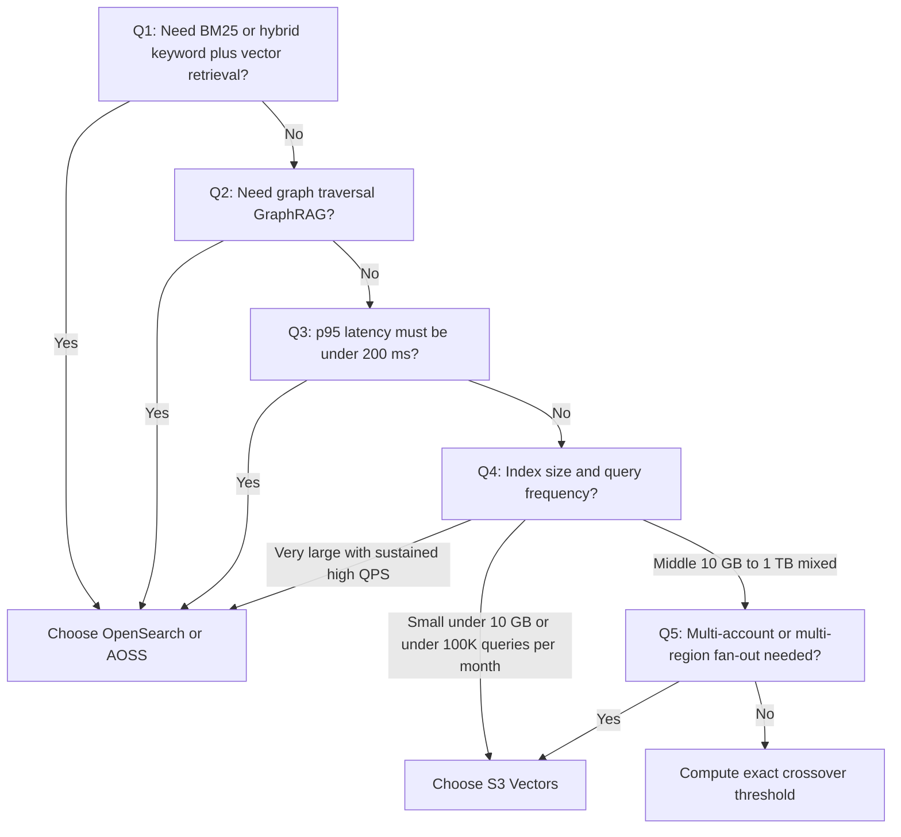

Choosing a vector store on AWS for generative AI (GenAI) workloads used to be a one-line decision: pick Amazon OpenSearch Service or its serverless variant (AOSS) and move on. That changed when [Amazon S3 Vectors][aws-s3-vectors-docs] went GA in 2025. By storing vector data directly in S3 and pricing it on a fully consumption-based model, S3 Vectors has reset the cost-performance frontier for vector search.

This post is not a rehash of the official documentation. It distills selection and tuning experience across more than 30 production GenAI projects shipped over the past year. You will get a decision tree, the cost-crossover math between the two services, and the specific migration pitfalls that bite hardest in practice — including the cosine-distance range mismatch and the metadata structure constraints.

---

## 1. TL;DR

Four rules of thumb:

1. **Large scale, write-heavy, sub-second latency tolerated, pure vector retrieval** — choose **S3 Vectors**. Per the AWS official example, 250K vectors × 40 indices × 1M queries/month costs roughly **$11.38/month**. Scale up to 10M vectors per index across 40 indices (400M total) with 10M queries/month and the bill is still around **$1,217.29/month**. The same workload on AOSS starts at **$175.20/month** for a 1-OCU dev configuration and **$350.40/month** for a 2-OCU HA production baseline (1 OCU indexing + 1 OCU search, each spread across two AZs as 0.5 + 0.5).
2. **Hybrid search (BM25 keyword + vector), complex filtering, GeoIP, or k-NN plugins required** — stay on **OpenSearch / AOSS**. S3 Vectors is a pure vector database with no tokenization, prefix matching, or full-text fusion.
3. **Graph-and-vector hybrid retrieval (GraphRAG, LightRAG)** — only **OpenSearch** works today. Frameworks like LightRAG embed deeply nested topology in vector metadata, while S3 Vectors only accepts flat key/value pairs capped at 2 KB of filterable metadata.
4. **Hot-path retrieval with strict latency SLOs (p95 < 200 ms)** — S3 Vectors is the cost minimum at most data sizes, but its managed ANN index over S3 produces p95 latencies in the 100–300 ms range under typical workloads. For request paths where 100 ms matters, AOSS or an OpenSearch Domain remains the safer choice.

> **The most-overlooked migration trap:** when moving from OpenSearch to S3 Vectors, the cosine ordering is **opposite**. OpenSearch's k-NN query returns a relevance `_score` in `[0, 1]` where **higher = more similar** (under the Lucene engine, `score = (2 − d) / 2 = (1 + cos_sim) / 2`). S3 Vectors returns a raw cosine **distance** `d = 1 − cos_sim` in `[0, 2]` where **lower = more similar**. Any upstream `min_score` filter that was tuned against OpenSearch will silently invert recall unless you renormalize.

---

## 2. Selection Decision Tree

The decision tree below captures the five priority-ordered checks we run in our architecture reviews:



---

## 3. Feature Matrix

Before drilling into cost math, the comparison table below clarifies the boundaries between the three options:

| Dimension | S3 Vectors | OpenSearch Serverless (AOSS) | OpenSearch Domain |
|:---|:---|:---|:---|
| **Entry-level price (minimum config)** | First-month minimum ~ **$0.60** (10 GB storage; no PUT, no queries) | Dev (1 OCU) ~ **$175.20/month**; HA prod (2 OCU minimum, 1 indexing + 1 search) ~ **$350.40/month** | t3.small.search ~ **$30.00/month** + EBS |
| **Billing model** | Pay-per-use (storage + writes + API calls + data processing) | Capacity-based (per-OCU-hour, auto-scaled) | Resource-based (instance-hour + disk) |
| **Max vectors per index** | **2 billion** (10K indices per bucket; 20T per bucket) | Bound by OCU memory (~50M/OCU in practice) | Bound by instance type |
| **Vector dimensions supported** | **1–4096** | 1–16,000 (limited by mapping) | Same as AOSS |
| **Top-K per query** | **100** | 10,000 | 10,000 |
| **Hybrid search** | Not supported (pure vector) | Supported via Neural Search plugin | Supported |
| **Custom analyzers / plugins** | Not supported | Limited (no third-party installs) | Supported |
| **Per-vector metadata limit** | **40 KB total; 2 KB / 50 keys filterable** | No hard cap (governed by mapping) | No hard cap |
| **Write throttling** | 1,000 req/s; max 500 vectors/batch; 2,500 vectors/s aggregate | Bound by OCU capacity | Bound by instance type |
| **IAM model** | IAM-native (`s3vectors:` actions) | IAM policy + data-access policy (two layers) | Resource policy + fine-grained access control (FGAC) |
| **Best fit** | Long-tail archives, AI agent long-term memory, write-heavy | Real-time e-commerce search, hybrid retrieval, multi-tenant SaaS | Migrating existing search clusters; HNSW tuning required |

---

## 4. Cost Crossover Math

The breakeven threshold between S3 Vectors and AOSS depends on three variables: index size, QPS, and AOSS OCU sizing rules.

S3 Vectors is **fully consumption-priced**; AOSS is **capacity-priced** by the hour. All numbers below are list pricing for **US East (N. Virginia) as of May 2026**; verify against the [S3 Vectors pricing page][aws-s3-vectors-pricing] and the [OpenSearch pricing page][aws-opensearch-pricing] before building a long-term budget.

### 4.1 S3 Vectors price components

*   **Storage:** $0.06 / GB-month (logical GB across all vector indices in a bucket).
*   **Writes (PUT):** $0.20 per logical GB uploaded (logical GB includes vector data, key, and metadata after AWS-side optimization — not raw float32 bytes).
*   **Query API:** $2.50 / million calls.
*   **Data processing:** tiered per index. Within a single index, the first 100K vectors are billed at **$0.004 / TB scanned**; vectors beyond 100K within that same index are billed at **$0.002 / TB scanned**. The tiering is per-index, not bucket-wide.

### 4.2 AWS official examples vs AOSS

Both examples use 1,536-dimensional vectors with ~6 KB of metadata each, distributed across 40 indices.

#### Example A — small/medium workload

*   **Data:** 10M vectors total (250K per index × 40 indices, ~59 GB stored).
*   **Queries:** 1M / month.
*   **S3 Vectors itemization:**
    *   Storage: $3.54
    *   PUT: $1.97
    *   API + data processing: $5.87 (API $2.50, data processing $3.37)
    *   **Total: $11.38/month**
*   **AOSS equivalent:** dev configuration of 1 OCU bottoms out at **$175.20/month**.
*   **Conclusion:** **S3 Vectors is ~15× cheaper.**

#### Example B — medium/large workload

*   **Data:** 400M vectors total (10M per index × 40 indices, ~2,353 GB stored).
*   **Queries:** 10M / month.
*   **S3 Vectors itemization:**
    *   Storage: $141.21
    *   PUT: $78.46
    *   API + data processing: $997.62 (API $25.00, data processing $972.62)
    *   **Total: $1,217.29/month**
*   **AOSS equivalent:** the 2-OCU HA minimum costs $350.40/month, but a 400M-vector workload will not fit in 2 OCUs in practice (~50M vectors per OCU is a reasonable rule of thumb under default HNSW parameters). Sized for the workload, the AOSS bill rises broadly into the 8–16 OCU range — i.e. **$1,400–$2,800/month** before storage.
*   **Conclusion:** S3 Vectors at $1,217/month is roughly **3.5×** the cost of the 2-OCU HA minimum on paper, but the 2-OCU minimum cannot house 400M vectors. Once AOSS is sized realistically (8–16 OCU at $1,400–$2,800/month), **S3 Vectors comes out roughly even or cheaper**, depending on QPS pattern.

> **Key insight:** S3 Vectors data-processing cost scales linearly with both per-query scan size and QPS. The crossover with AOSS is not at a single index size — it is the point where AOSS OCU count, sized to your real working set, costs less than the per-query scan bill on S3 Vectors. For p95-bound, hot-path workloads this point arrives quickly; for cold-path or batch workloads it never does.

---

## 5. Production Selection Notes

The cases below summarize production selection outcomes (project names anonymized).

### 5.1 Player feedback (VOC) analytics pipeline — winner: S3 Vectors

*   **Workload:** multilingual player feedback and ticket clustering for offline analysis.
*   **Scale:** ~10M historical feedback vectors (1,024-dim, ~59 GB stored), ~50K new vectors/day.
*   **Query rate:** one clustering batch per hour, ~720–2,000 queries/month.
*   **Actual cost:** **~$5.30/month** (storage $3.54 + writes $1.72 + queries $0.04). Versus the $350.40/month AOSS 2-OCU HA baseline, that's a **~66× saving**.
*   **Implementation notes:** CDK manages index idempotency via `AwsCustomResource`. The writer uses `ThreadPoolExecutor(4)` to call `s3vectors.put_vectors` in parallel with batches of 25 (well below the 500/batch and 2,500 vectors/sec aggregate caps in the feature matrix, leaving headroom for retries without hitting the throttle).
*   **Lessons learned:**
    1.  **Metadata size guardrails.** The embedded text payload itself can be long, but filterable metadata is capped at 2 KB. The ingestion layer truncates long fields into summaries to avoid import failures.
    2.  **Partial-failure handling.** When a 25-vector batch contains one malformed vector, `VectorizeResult` returns `PARTIAL`. The writer parses and retries the failed items rather than rolling back the whole batch.

### 5.2 AI marketing copy generation — winner: S3 Vectors

*   **Workload:** historical reference corpus (long-term memory) for an AI marketing copy agent.
*   **Scale:** 200K reference snippets (~2 GB).
*   **Query rate:** ~43K queries/day (~0.5 QPS, ~1.3M/month).
*   **Actual cost:** **~$7.10/month** (storage $0.12 + PUT $0.40 + API & data processing $6.58) — about **1/25 of the $175.20/month AOSS dev minimum**, or **1/49 of the $350.40/month HA production baseline**.
*   **Implementation notes:** a Python `VectorStorageManager` exposes a unified backend interface and switches between `s3_vectors` and `opensearch` via environment variable, decoupling the storage layer to keep migrations smooth.

### 5.3 Retail product multimodal retrieval — winner: S3 Vectors

*   **Workload:** dual-tower (image + text) retrieval over an e-commerce catalog.
*   **Scale:** 4M vectors (2M SKUs × 2 vectors per SKU — image + text — at 40–80 GB).
*   **Query rate:** ~43K searches/day (~1.3M/month). Dual-tower means each user search triggers two vector queries, totaling ~2.6M vector queries/month.
*   **Estimated cost** (actual bill depends on vector size, QPS, and metadata; verify with the AWS Pricing Calculator):
    *   **Standard parameters (1,024-dim, 4-shard index):** **~$36.54/month**.
    *   **Worst case (2,048-dim, 1-shard index):** **~$192.97/month**.
    Even at the worst-case parameters, the cost is still only **~55%** of the $350.40/month AOSS 2-OCU HA baseline.
*   **Lessons learned:**
    1.  **Nova MME `embeddingPurpose` consistency.** With Amazon Nova multimodal embedding (MME) models, writes must specify `embeddingPurpose = "GENERIC_INDEX"` and queries must specify `"GENERIC_RETRIEVAL"`. Mixing the two silently degrades retrieval quality with no error.
    2.  **Lightweight existence checks.** To enforce idempotent ingestion, use `s3vectors.get_vectors(returnData=False, returnMetadata=False)` to test for key presence without paying for vector payload egress.

### 5.4 Manufacturing multimodal knowledge base — winner: OpenSearch Domain

*   **Workload:** RAG over engineering drawings, SOPs, and process specs for a manufacturing line.
*   **Scale:** 5M vectors, ~15K queries/day. Metadata includes nested part hierarchies, SOP versions, and release timestamps.
*   **Why OpenSearch was kept:**
    1.  **Hybrid retrieval (BM25 + vector) is required.** Engineering drawings and process specs contain specialized part codes and version strings (for example, `SOP-CN-2026-V3`). Pure vector recall scores poorly on such tokens; OpenSearch tokenization plus weighted RRF fusion is necessary.
    2.  **Context expansion design.** The application uses `ContextExtendMethod.NEIGHBOR` to look up neighbor chunks via `parent_doc_id` and adjacent `chunk_id`, which requires nested boolean filters that S3 Vectors cannot express.

### 5.5 After-sales GraphRAG — winner: OpenSearch Domain

*   **Workload:** GraphRAG over an after-sales fault graph for diagnostic recommendation.
*   **Scale:** 3M vectors with deep graph topology stored in metadata.
*   **Why OpenSearch was kept:**
    1.  **Nested metadata for graph storage.** LightRAG stores complex graph topology inside vector metadata (for example, `<SEP>`-delimited `file_path` arrays and related-node references). S3 Vectors only allows flat KV metadata under 2 KB.
    2.  **Prefix wildcard search.** GraphRAG depends on `doc_id*` prefix matches to walk all entities under a parent document. S3 Vectors has no wildcard or fuzzy filter support.

### 5.6 Online content moderation — winner: OpenSearch Domain

*   **Workload:** synchronous similarity check on chat messages against a violation feature library.
*   **Scale:** 10M feature vectors, peak ~300 QPS.
*   **Why OpenSearch was kept:**
    1.  **Strict SLA.** As an inline component of synchronous chat moderation, the workload requires p95 < 30 ms. S3 Vectors p95 sits at 100–300 ms, which cannot block in real time.
    2.  **Composite boolean filters.** Moderation requires hard tenant isolation by `app-id` and time-window filtering by `created-time`. OpenSearch is heavily optimized for boolean filtering and caching.

---

## 6. Migration Pitfall Guide

If you are migrating from OpenSearch / AOSS to S3 Vectors, the following points must be covered in code:

### 6.1 Cosine distance renormalization

S3 Vectors returns `distanceMetric=cosine` as a raw cosine **distance** `d = 1 − cos_sim`, naturally in `[0, 2]` (since `cos_sim ∈ [−1, 1]`); **lower is more similar**.

OpenSearch's k-NN query (Lucene engine) returns a relevance `_score` in `[0, 1]` via the [documented formula][opensearch-knn-spaces] `score = (2 − d) / 2 = (1 + cos_sim) / 2`; **higher is more similar**.

The two values are not on the same scale and are ordered in opposite directions. Any legacy `min_score = 0.7` filter from OpenSearch will not just shift its threshold — it will reverse pass/fail semantics.

```python
# Migration helper: convert S3 Vectors cosine distance to OpenSearch-style score
def to_opensearch_score(s3v_distance: float) -> float:
    # cos_sim = 1 - d   →   score = (1 + cos_sim) / 2 = (2 - d) / 2
    return (2.0 - s3v_distance) / 2.0
```

Applying the legacy `min_score = 0.7` filter to raw S3 Vectors distances would silently flip recall — re-derive the threshold against the converted score, or rewrite the filter against the distance with the inequality reversed (`distance ≤ 0.6` for the equivalent cutoff).

### 6.2 Split metadata between S3 Vectors and S3 buckets

In OpenSearch, dropping the entire raw text into the `_source` metadata for downstream rendering is a common pattern.

In S3 Vectors, the design must enforce a **vectors-in-S3-Vectors, text-in-S3** split:

*   Filterable attributes must be flat (no nesting) and stay strictly under 2 KB.
*   The `s3vectors.put_vectors` metadata payload should carry only `file_key` plus required filter tags.
*   After retrieval, asynchronously fetch the source JSON from S3 by `file_key`.

### 6.3 The Nova MME `embeddingPurpose` trap

For multimodal retrieval, writes to Nova must set `embeddingPurpose = "GENERIC_INDEX"`; queries must set `"GENERIC_RETRIEVAL"`. Mixing the two skews the underlying angle calculation and tanks recall — without throwing any error.

### 6.4 Idempotent deployment and retention

For infrastructure-as-code:

*   **CDK retention policy.** S3 Vectors has no built-in snapshotting. When defining `CfnVectorBucket` in CDK, set `RemovalPolicy` to `RETAIN`. An accidental delete loses millions of vectors with no recovery path.
*   **Idempotency.** Inside `AwsCustomResource`, ignore `ConflictException` so repeated deploys do not red-line the pipeline.

---

## 7. Open Questions

S3 Vectors is promising, but a few gaps remain before it can fully replace OpenSearch:

1.  **Cosine distance range is not officially specified.** The `[0, 2]` range follows directly from the `1 − cos_sim` formula and matches OpenSearch's documented k-NN distance, but the S3 Vectors API reference does not currently spell it out as a contract. Validate in a dev environment before migrating production traffic.
2.  **No native cross-region replication (CRR) for vector indices.** Standard S3 CRR can replicate the underlying objects in a vector bucket, but the vector index metadata and query endpoint do not automatically follow — the secondary region must rebuild the index programmatically. Globally available architectures must therefore dual-write at the application layer via a message queue.
3.  **Sparse independent benchmarks at scale.** AWS claims sub-second latency at tens-of-billions scale, but independent community benchmarks past ~1B vectors remain rare.

---

## 8. Conclusion

For pure-vector workloads where p95 latency can sit at 200–300 ms and QPS is moderate or bursty, **S3 Vectors is the new default**. The cost story is decisive at small and medium scale (15–66× cheaper across our $5–$36/month workloads) and stays competitive at 400M vectors once AOSS is sized realistically. Reserve OpenSearch / AOSS for the cases this post catalogues: hybrid retrieval, graph traversal, sub-100 ms SLOs, or nested metadata filters.

The two migration traps that caught us hardest were the [cosine score / distance direction reversal][cosine-renormalization] and the [40 KB / 2 KB metadata split][metadata-split]. Get those right before flipping the application's `min_score` threshold.

### Resources

*   [Amazon S3 Vectors documentation][aws-s3-vectors-docs]
*   [S3 Vectors pricing][aws-s3-vectors-pricing]
*   [OpenSearch Service pricing][aws-opensearch-pricing]
*   [OpenSearch k-NN spaces — cosine formula][opensearch-knn-spaces]

---

<!-- AWS Official Documentation -->
[aws-s3-vectors-docs]: https://docs.aws.amazon.com/AmazonS3/latest/userguide/s3-vectors.html
[aws-s3-vectors-pricing]: https://aws.amazon.com/s3/pricing/
[aws-opensearch-pricing]: https://aws.amazon.com/opensearch-service/pricing/
[opensearch-knn-spaces]: https://docs.opensearch.org/latest/field-types/supported-field-types/knn-spaces/

<!-- Intra-post anchors -->
[cosine-renormalization]: #61-cosine-distance-renormalization
[metadata-split]: #62-split-metadata-between-s3-vectors-and-s3-buckets
