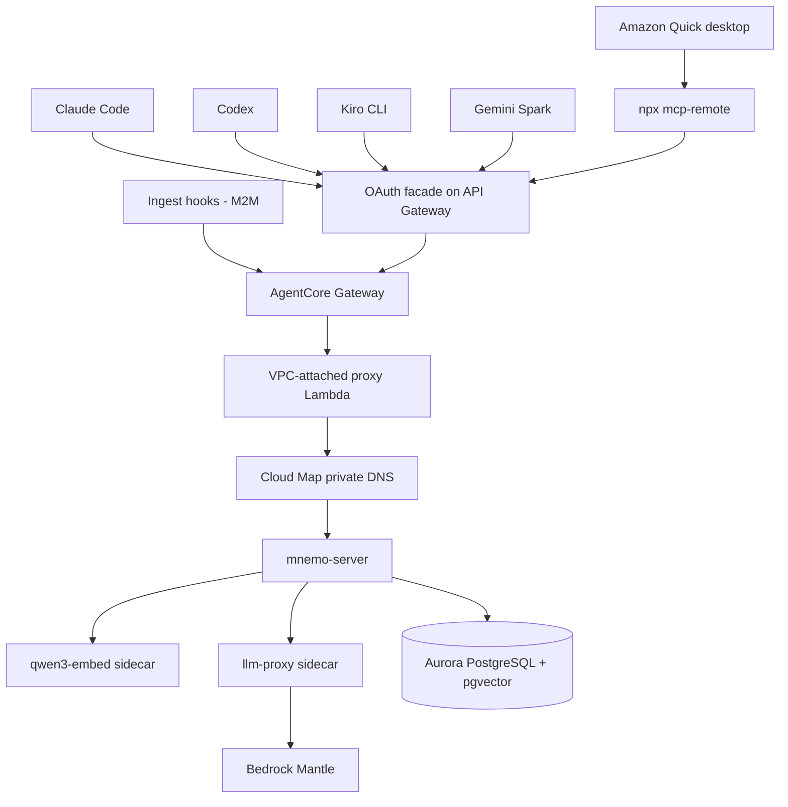
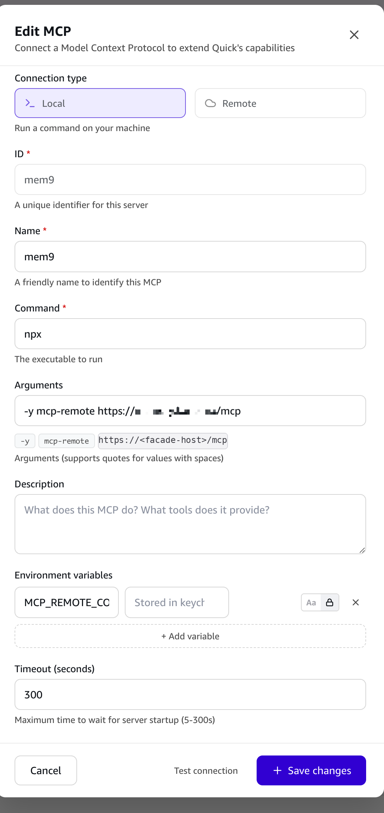

## Introduction

Every agent session starts amnesic. You explain your deployment topology to Claude Code on Monday, and on Tuesday Codex asks the same question. You tell one agent that Aurora MySQL cannot run your vector workload, and the next agent cheerfully proposes it. The knowledge that actually compounds — decisions and their rationale, environment quirks, the gotcha that cost you an afternoon — evaporates at the end of every context window.

The obvious fix is a hosted memory product. Point every agent at a SaaS memory API and let it accumulate. That works, and it means your accumulated engineering judgment now lives in someone else's account, under their retention policy, their deletion semantics, and their acquisition risk. For a personal knowledge base that is an odd trade: the more valuable the memory becomes, the worse the dependency gets.

I took the other path. [mem9][mem9-upstream] is an Apache-2.0 agent-memory server (the binary is `mnemo-server`), and I deployed it into my own AWS account as [mem9-on-aws][mem9-on-aws] — self-hosted agent memory, shared across every agent I use, on infrastructure I control. This post is about what that constraint actually costs to honor, and the part I found genuinely interesting: **different classes of agent worker need structurally different doors into the same store.**

## What data autonomy actually demands

"Own your data" sounds like a preference. Treated as a hard requirement, it behaves like a design constraint — each demand eliminates the easy answer.

**1. Memory content stays in my account.** This rules out mem9's own SaaS offering and every hosted memory API. Not because they're untrustworthy, but because the requirement is about custody, not trust.

**2. Embeddings are computed in my account too.** This is the demand people skip, and it's the one with teeth. Memory content is only half the artifact; the vector is a lossy but very real projection of the same text. Shipping content to a third-party embedding API to avoid running a model is exactly the leak you were trying to prevent.

That constraint immediately collided with reality. Amazon Bedrock's OpenAI-compatible Mantle surface offers Chat Completions and Responses — but **no `/embeddings` endpoint**. Bedrock's embedding models exist, but they're reached through `InvokeModel`, which is not the OpenAI shape mem9 expects. So the choice was to patch mem9's embedding client or to host an OpenAI-shaped embedding service myself. I hosted one: a `qwen3-embed` sidecar serving `Qwen3-Embedding-0.6B` as ONNX on localhost, producing 1024-dimensional vectors, baked into the image so it's always warm.

**3. Memory is exportable and deletable on demand.** This pushes toward a boring, queryable store rather than a proprietary index. mem9 supports a TiDB backend and a PostgreSQL backend, and I wanted Postgres regardless — but the decision was made for me. mem9's TiDB path depends on TiDB-only vector features (`VECTOR` columns, `VEC_COSINE_DISTANCE`, and `EMBED_TEXT` auto-embedding), none of which Aurora MySQL provides. So: **Aurora PostgreSQL Serverless v2 with `pgvector`**, where my memories are rows I can `SELECT` and `DELETE` with plain SQL.

**4. The server is never publicly reachable.** No public endpoint, no ALB, no VPC Lattice. The only way in is an authenticated MCP surface — which turns out to be the interesting constraint, because MCP is also exactly how every agent client wants to talk to it.

## The architecture that falls out

Those four demands leave surprisingly little room. What emerged is a single-writer Fargate task fronted by an [Amazon Bedrock AgentCore Gateway][agentcore-gateway] MCP surface:



The ECS task runs **three containers**: `mnemo-server` on port 8080, the `qwen3-embed` sidecar on 8081, and an `llm-proxy` sidecar on 8082. That last one exists because of an upstream constraint worth knowing: mem9 reads `MNEMO_LLM_API_KEY` **once at startup and treats it as immutable**, and sends no custom headers. Bedrock Mantle needs a short-lived bearer token and a cost-attribution header. Those two facts are irreconcilable, so `mnemo-server` is configured with a dummy local key pointing at `localhost:8082`, and the proxy mints and refreshes the real bearer, injects the project header, and forwards to Mantle. `mnemo-server` never calls AWS directly.

AgentCore Gateway reaches the private server through a [Lambda target][agentcore-lambda-target]: the Gateway invokes a VPC-attached proxy Lambda, which resolves `mnemo-server` over [AWS Cloud Map][cloud-map-dns] private DNS. No public ingress anywhere in the path.

The Gateway exposes four MCP tools: `add_memory`, `search_memories`, `ingest_messages`, and `get_ingest_job_status`. Inbound auth is Amazon Cognito. I wrote up the OAuth side of this separately — Cognito is an OIDC provider, not an MCP-compliant authorization server, and closing that gap took [a thin API Gateway façade][agentcore-oauth-facade] implementing the RFC surfaces MCP clients expect. If the underlying spec stack is unfamiliar, I've also covered [the MCP authorization RFCs in depth][mcp-oauth-deep-dive] and [how remote MCP servers on AgentCore are invoked][invoke-agentcore-mcp].

## One store, many workers

Here's the part I didn't anticipate. I assumed "expose MCP over OAuth" would be a single integration I'd do once. In practice, the agent workers I use fall into **four classes with structurally different authentication needs**, and the store has to admit all of them.

| Worker class | Examples | How it authenticates |
| --- | --- | --- |
| Native loopback OAuth | Claude Code, Codex, Kiro CLI, Claude Cowork | RFC 8252 loopback redirect; no server-side config needed |
| Hosted-redirect OAuth | Gemini Spark | Fixed vendor-hosted callback URL that the authorization server must allowlist |
| stdio bridge | Amazon Quick desktop | Local `npx mcp-remote` process owns the OAuth session |
| Headless machine-to-machine | The transcript ingest hooks | Cognito `client_credentials`, no browser involved |

### Class 1: native loopback OAuth

The easy case. Claude Code, Codex, and Kiro CLI all run on my machine and can open a loopback listener, so they follow [RFC 8252][rfc-8252] and need no server-side configuration at all:

```bash
claude mcp add --transport http --scope user mem9 "$MEM9_MCP_FACADE_URL"
codex mcp add mem9 --url "$MEM9_MCP_FACADE_URL"
codex mcp login mem9
```

Claude Cowork belongs here too. AWS describes Cowork as [a cloud agent calling local tools through MCP][mcp-bridge-post], and lists MCP connectors among the capabilities available to [Claude Platform on AWS][claude-platform-aws] clients, where both Cowork and Claude Code appear as examples (I compared that platform against plain Bedrock in [a separate decision tree][claude-platform-decision-tree]). Because it speaks remote MCP with OAuth the way Claude Code does, it needs no server-side accommodation either — point it at the façade URL and complete the browser login once.

### Class 2: hosted-redirect OAuth

Gemini Spark is where the assumption breaks. It's a hosted agent, so there is no loopback listener — the OAuth callback goes to a **fixed Google-hosted URL**. A custom MCP server gets registered under **Custom apps for Spark** on the Spark apps page, and once connected, Spark enumerates the tools it discovered:


Those four action names are the AgentCore Gateway naming convention — `<target-name>___<tool-name>` with a triple underscore — so what Spark lists is precisely the Gateway's tool surface, reached through the same façade the CLI agents use.

The architectural consequence is that a hosted client's callback URL must be **explicitly allowlisted server-side**, which a loopback client never needs. That's why the façade carries a stage-scoped allowlist of complete callback URLs rather than accepting whatever redirect arrives:

```bash
pnpm -C infra exec sst secret set OauthAllowedCallbackUrls \
  '["https://existing.example.com/callback","https://new.example.com/callback"]' \
  --stage prod
```

Exact-match only — no host or path wildcards, no credentials, no fragments. Hosted clients also tend to carry more OAuth `state` than Cognito's parameter comfortably holds, so the façade keeps the client's URL and opaque state in a nonce-bound, HMAC-signed cookie (`Secure`, `HttpOnly`, `SameSite=Lax`, 10-minute lifetime) and hands Cognito only a compact signed nonce.

Two caveats on this section, stated plainly: Gemini Spark is in beta and I could not find public documentation for its custom-app auth contract, so everything above is from my own working setup rather than a vendor spec. And the interactive OAuth path is deliberately **read-only** — more on that below.

### Class 3: the stdio bridge

Amazon Quick was the surprise — and it's the product I've spent the most time inside, having previously written [a deep dive on Quick Suite][quicksuite-deep-dive]. Quick's **web** MCP integration is well documented and genuinely capable: it supports three-legged and two-legged OAuth plus [Dynamic Client Registration][quick-mcp-web], discovering authorization server metadata via RFC 9728. It's a textbook Class 2 client, redirecting to [a fixed regional URL][quick-mcp-blog] of the form `https://<region>.quicksight.aws.amazon.com/sn/oauthcallback`.

The Quick **desktop** app is a different MCP client in the same product. It offers a `Remote` connection type — but that type's only credential field is a static bearer **Token**. No OAuth, no PKCE, no DCR. So an OAuth-protected gateway simply cannot be added as a Remote server there.

The way through is the `Local` connection type, which runs a command on your machine — AWS lists `npx` among the common `Command` values ([desktop connectors][quick-desktop-connectors]). Point it at `mcp-remote`, and that local process handles the OAuth dance and bridges stdio to the remote streamable-HTTP endpoint:



A 300-second startup timeout is worth setting here, because the first run has to fetch the package and may open a browser for consent.

One more detail on that screen deserves attention: Quick desktop's **Import** connection type reads existing MCP configuration from Kiro, Claude Code, AIM, and Antigravity. A new worker class can inherit the wiring the code agents already have — which is the whole thesis, implemented by the vendor.

### Class 4: headless machine-to-machine

The fourth class isn't an interactive client at all. Automatic transcript ingestion runs **outside** the agent turn, in a hook, with no browser and no user present. It authenticates with a Cognito `client_credentials` grant against the raw Gateway endpoint, using machine-local credentials in a gitignored file:

```sh
# ~/.mem9-mcp.env  (chmod 600; never commit)
export MEM9_MCP_URL="<raw AgentCore Gateway MCP endpoint>"
export MEM9_MCP_TOKEN_ENDPOINT="https://<domain>.auth.<region>.amazoncognito.com/oauth2/token"
export MEM9_MCP_CLIENT_ID="<cognito M2M client id>"
export MEM9_MCP_CLIENT_SECRET="<cognito M2M client secret>"
export MEM9_MCP_SCOPE="mem9-mcp/read mem9-mcp/write"
export MEM9_MCP_TARGET="prod-mem9-rest"
```

### The privilege split worth stealing

Those four classes produce one design decision I'd reuse anywhere: **the interactive path and the automated path have different scopes.**

The browser-login façade every human-driven client uses is **read-only**. Write scope lives exclusively on the M2M path used by the ingest hooks. An agent can search my memory all day through the interactive session; it cannot write to it. Writes happen only through the hook layer, which ships a bounded, filtered window on a known schedule.

The security benefit is that prompt injection in an agent session cannot poison the memory store — the session literally lacks the scope. The operational benefit is that every write flows through one auditable code path instead of N clients' varying interpretations of "remember this."

## Your memory versus the vendor's memory

Worth naming explicitly: most of these products ship their own memory. Amazon Quick on desktop "builds a knowledge graph of the people, projects, and decisions relevant to you" and "retains your preferences and workflows in long-term memory" ([Quick on desktop][quick-desktop]). That's a real feature and it works well.

It's also a silo. It is per-product, not portable, not exportable on my terms, and invisible to every other agent I use. Two agents each maintaining excellent private memories of the same engineer is strictly worse than both reading one shared store — the whole point is that Monday's context is available to Tuesday's *different* agent.

So I use both, deliberately, for different things. Vendor memory holds product-local preferences. mem9 holds the durable, cross-agent facts: decisions and their rationale, environment gotchas, hard-won constraints. The distinction that matters is which one I can still read after I stop paying.

## Making it automatic

A memory store nobody writes to is a wiki nobody edits. The hooks are what make this real, and they live in my dotfiles rather than in the infrastructure repo — one implementation symlinked into three agent homes:

```bash
create_symlink "$SCRIPT_DIR/common/.claude-config/hooks/mem9" "$HOME_DIR/.codex/hooks/mem9"
create_symlink "$SCRIPT_DIR/common/.claude-config/hooks/mem9" "$HOME_DIR/.kiro/hooks/mem9"
```

Each client fires different events with different payload shapes, normalized in one small module:

| Client | Recall hook | Ingest hooks | Usable event data |
| --- | --- | --- | --- |
| Claude Code | `UserPromptSubmit` | `Stop`, `PreCompact`, `SessionEnd` | `session_id`, `transcript_path` |
| Codex | `UserPromptSubmit` | `Stop`, `PreCompact` | prompt cache + `last_assistant_message` |
| Kiro CLI | `userPromptSubmit` | `stop` | `KIRO_SESSION_ID`, `prompt`, `assistant_response` |

The asymmetry is instructive. Claude Code hands you a transcript path, so ingestion can read the real conversation. Codex and Kiro don't, so the recall hook caches each prompt and pairs it with the final assistant message at `Stop`. Even the response channel differs — Claude Code expects a `hookSpecificOutput` JSON envelope, while Kiro injects successful `userPromptSubmit` stdout directly into context, so the same recall text has to be formatted two ways.

Every hook is **best-effort by design**: missing config, a parse error, or a network failure exits 0. A memory layer that can block your agent session is worse than no memory layer.

### What actually gets uploaded

This is where the sovereignty argument would quietly collapse if I were careless, so the ingest filter is deliberately narrow. Only user and assistant **text** in a bounded window is sent — up to 4 messages / 20 KB on `Stop`, up to 12 messages / 120 KB on `PreCompact`. Stripped before transmission: tool calls, tool results, progress updates, startup instructions, sidechains, meta entries, and previously injected `<relevant-memories>` blocks.

That last exclusion matters more than it looks. Without it, recalled memories get re-ingested as if they were new observations, and the store slowly fills with echoes of itself.

## What it costs to own

Sovereignty has a bill, and it's mostly fixed cost:

| Driver | Assumption | Monthly |
| --- | --- | --- |
| ECS Fargate | one arm64 task, 2 vCPU / 6 GB, always on | ~$78 |
| Aurora PostgreSQL Serverless v2 | 0.5 ACU floor, light I/O | $50–60 |
| Supporting services | CloudWatch, Secrets Manager, ECR, Lambda, API Gateway, Cognito, Gateway ops | $5–20 |
| **Baseline** | before model usage | **$135–160** |

These are architecture estimates as of August 2026, not a quote — prices vary by region and change. The honest comparison isn't against a SaaS memory subscription; it's against a subscription *plus* the cost of not owning the data. Whether that's worth $135 a month is a genuinely personal call, and for a low-volume single-operator deployment the always-on Fargate task is the line item to attack first.

The subtler cost is operational. Two lessons from running it:

**Memory needs garbage collection.** Left alone, a memory store accumulates contradictions, near-duplicate fragments, and facts that were true in June. A weekly Fargate task clusters existing memories, uses an LLM to detect contradictions and staleness, and applies at most **20 mutations per run**. It defaults to report-only and **never executes a DELETE** — it can merge fragments, archive the strictly older side of a contradiction, or mark a fact stale. Deletions require explicit approval routed through Slack. Automating deletion of your own knowledge base is a decision to make on purpose, not by default.

**Concurrent writes will find your weak spot.** The consolidation job's merge step reads a surviving memory, then rewrites it with the merged content. It guarded that rewrite with an `If-Match` version header — which upstream treated as **advisory**, logging a warning and applying the write anyway. An ingest arriving between the read and the write was silently overwritten, and the skip counter never moved. The fix was to make `If-Match` authoritative so a stale version returns 412 rather than a warning. If you build on someone else's server, verify that its optimistic-concurrency headers actually enforce anything.

## Lessons

**Take "own the data" literally and let it design the system.** Every genuinely load-bearing decision here — Postgres over TiDB, a self-hosted embedding sidecar, no public ingress — came from refusing to soften one of the four constraints. The awkward one, embeddings, is where the requirement earned its keep.

**Expect an auth taxonomy, not an integration.** The single most useful mental shift was to stop thinking "add MCP clients" and start classifying workers by *how they can prove who they are*: loopback, hosted redirect, local bridge, or machine credentials. Each class needs different server-side accommodation, and that shape is stable across vendors.

**Split read and write scope by transport.** Read-only for interactive sessions, write scope only on the headless path. It's cheap, it neutralizes a class of prompt-injection risk, and it funnels every write through one auditable path.

**Filter what you ingest, then filter it again.** The bounded window and the stripped `<relevant-memories>` blocks are what keep the store from becoming a transcript archive that echoes itself.

The result is unglamorous and works: five agents, three of them writing automatically, one memory layer, entirely inside my own account — and I can `SELECT` it, export it, or drop it whenever I want.

---

<!-- Upstream Project -->
[mem9-upstream]: https://github.com/mem9-ai/mem9
[mem9-on-aws]: https://github.com/zxkane/mem9-on-aws

<!-- AWS Documentation -->
[agentcore-gateway]: https://docs.aws.amazon.com/bedrock-agentcore/latest/devguide/gateway.html
[agentcore-lambda-target]: https://docs.aws.amazon.com/bedrock-agentcore/latest/devguide/gateway-add-target-api-target-config.html
[cloud-map-dns]: https://docs.aws.amazon.com/cloud-map/latest/api/API_CreatePrivateDnsNamespace.html
[quick-mcp-web]: https://docs.aws.amazon.com/quick/latest/userguide/mcp-integration.html
[quick-mcp-blog]: https://aws.amazon.com/blogs/machine-learning/integrate-external-tools-with-amazon-quick-agents-using-model-context-protocol-mcp/
[quick-desktop-connectors]: https://docs.aws.amazon.com/quick/latest/userguide/connections-desktop.html
[quick-desktop]: https://docs.aws.amazon.com/quick/latest/userguide/what-is-desktop.html
[claude-platform-aws]: https://aws.amazon.com/blogs/machine-learning/introducing-claude-platform-on-aws-anthropics-native-platform-through-your-aws-account/
[mcp-bridge-post]: https://aws.amazon.com/blogs/machine-learning/how-we-built-an-mcp-bridge-to-give-our-agentcore-hosted-ai-agent-access-to-local-mcp-tools/

<!-- Specifications -->
[rfc-8252]: https://datatracker.ietf.org/doc/html/rfc8252

<!-- Related Articles (Internal Links) -->
[agentcore-oauth-facade]: 
[mcp-oauth-deep-dive]: 
[invoke-agentcore-mcp]: 
[claude-platform-decision-tree]: 
[quicksuite-deep-dive]: 
