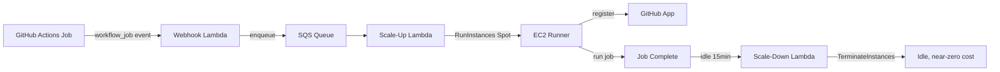

[Autonomous AI dev teams][autonomous-team] move the bottleneck. When a dispatcher fans out work to dev and review agents every 5 minutes, the constraint is no longer human attention — it is the **CI/CD pipeline that gates every PR**. Each agent push triggers builds, tests, E2E verification, and bot reviews. With even a small team of agents iterating in parallel, GitHub Actions minutes become the dominant operational cost.

Hosted runners are convenient, but they are billed per-minute and capped at 2 cores on the standard tier. For a team of agents that pushes dozens of times an hour and runs container builds + Playwright suites, the math stops working. The lever is **self-hosted runners on AWS spot EC2** — bigger instances, multi-architecture, scaling to zero when idle.

<!--more-->

## Why CI/CD Becomes the Bottleneck for AI Agents

In the [autonomous dev team][autonomous-team] architecture, three categories of agent activity push the CI/CD pipeline:

| Activity | Frequency | Cost characteristic |
|----------|-----------|---------------------|
| Dev agent commits | Multiple per task; one per fix iteration | Each commit re-runs lint, type, unit, build |
| Review agent verification | Every PR; every revision | Triggers preview deploy, E2E tests, bot review |
| Hook-enforced re-checks | Before commit, before push, before completion | Hits CI status APIs, may trigger reruns |

A single feature implementation typically iterates 3–8 times through the dev → review → fix loop. Each iteration is a full pipeline run. Multiply by parallel issues, multiply again by container image builds and Playwright suites, and the monthly hosted-runner bill scales linearly with agent throughput.

The other constraint is **horsepower**. Modern projects target both `arm64` (Graviton, Apple Silicon, AWS Lambda arm64) and `x86_64` (legacy services, GPU container base images, vendor SDKs). GitHub does offer standard `arm64` hosted runners (`ubuntu-24.04-arm`, `ubuntu-22.04-arm`) on all plans now, but in private repos they're capped at 2 vCPU — the same ceiling as the x64 standard tier. For container builds, full Playwright suites, and any compile step that scales with cores, 2 vCPU is the bottleneck. Larger hosted runners exist on Team / Enterprise plans, but their per-minute pricing is a multiple of the standard rate.

## The Self-Hosted Spot Approach

The mechanics are straightforward:



The control plane is a set of small Lambda functions that translate GitHub webhook events into EC2 spot launches. The data plane is whatever EC2 instance type fits the job. When no jobs are queued the data plane scales to zero — **the only running cost between bursts is the small Lambda + SQS + S3 control plane**.

Several open-source projects implement this pattern. The reference implementation used here is the [`terraform-aws-github-runner`][upstream] module, originally from Philips Labs and now community-maintained. A [feature branch][fork] of the module ships an opinionated multi-architecture deployment under `deployments/shared-runners/` — that deployment is the example this post walks through, not the subject. Copy the patterns, adapt the rest.

## Multi-Architecture Fleet Behind One Webhook

The example deployment routes a single GitHub App webhook to two distinct fleets, dispatched by GitHub label:

```hcl
multi_runner_config = {
  "linux-arm64" = {
    matcherConfig = {
      labelMatchers = [["self-hosted", "linux", "arm64"]]
      exactMatch    = true
    }
    runner_config = merge(local.common_runner_config, {
      runner_architecture   = "arm64"
      instance_types        = ["c8g.2xlarge"]
      runners_maximum_count = 10
      # owners = self-account: the AMI is built by Packer in this account.
      # Use a public AMI ID + Canonical's owner ID if you skip the AMI build.
      ami = {
        filter = { name = ["github-runner-ubuntu-noble-arm64-*"] }
        owners = [data.aws_caller_identity.current.account_id]
      }
    })
  }

  "linux-amd64" = {
    matcherConfig = {
      labelMatchers = [["self-hosted", "linux", "x64"]]
      exactMatch    = true
    }
    runner_config = merge(local.common_runner_config, {
      runner_architecture   = "x64"
      instance_types        = ["c7a.4xlarge", "c7i.4xlarge", "m7a.4xlarge"]
      runners_maximum_count = 5
    })
  }
}
```

Three properties are worth highlighting:

**Exact-match label routing.** Setting `exactMatch = true` on each matcher prevents a job tagged `[self-hosted, linux, x64]` from accidentally landing on the arm64 fleet. Without it, partial matches let a job leak across architectures and either fail the build or burn an instance for nothing.

**Multi-pool spot for amd64.** The amd64 fleet lists three instance families (`c7a` AMD, `c7i` Intel, `m7a` AMD higher-memory). When AWS spot capacity tightens on any single pool, the allocator picks another. The arm64 fleet uses one type because Graviton4 `c8g.2xlarge` capacity has been consistently available in `us-east-1` across the AZs we use; multi-pool fallback would still be a safer default for fleets at higher scale or in capacity-constrained regions.

**Per-fleet caps.** `runners_maximum_count` is enforced inside the scale-up Lambda — every invocation queries the current count and clamps new launches to `min(requested, max - current)`. With `scale_up_reserved_concurrent_executions = 1`, only one Lambda instance executes at a time, which avoids races on the count check. The tradeoff: at high burst (say, 20 agent pushes within a minute), SQS messages drain sequentially rather than in parallel — fine for most teams, but raise the reserved concurrency if your agents tend to spike all at once.

A typical workflow picks its fleet:

```yaml
jobs:
  arm64-build:
    runs-on: [self-hosted, linux, arm64]
    # ...
  amd64-build:
    runs-on: [self-hosted, linux, x64]
    # ...
```

Or makes the choice configurable per repo:

```yaml
runs-on: ${{ vars.RUNNER_LABEL && fromJSON(vars.RUNNER_LABEL) || 'ubuntu-latest' }}
```

Set the repo variable `RUNNER_LABEL` to a **JSON array string**, not a plain label — for example `["self-hosted","linux","arm64"]`. The `fromJSON` parses it back into a labels list.

## Spot Allocation: Why `price-capacity-optimized` Beats `lowest-price`

The Terraform module's default is `lowest-price`. The example deployment overrides this:

```hcl
common_runner_config = {
  instance_target_capacity_type = "spot"
  instance_allocation_strategy  = "price-capacity-optimized"
  # ...
}
```

`lowest-price` picks the cheapest pool at the moment of launch. That works until a popular pool tightens and the allocator keeps picking it because it remains nominally the cheapest, while interruptions spike. `price-capacity-optimized` is AWS's recommended strategy: it weights price *and* available capacity, biasing toward pools where launch is most likely to succeed and least likely to be reclaimed in the near term.

For an autonomous AI dev team, this is the difference between "the review agent re-runs E2E tests three times because its runner kept getting interrupted" and "the job runs once on a stable pool and finishes." Interruption recovery is not free — the scale-up Lambda has to handle the queued retry, the dev agent may need to fetch new logs, and wall-clock time stretches.

When a spot interruption *does* hit a running job, GitHub marks the job as failed (the runner stops responding before completing the job). Configure `job_retry` in the module (the example deployment uses `max_attempts: 1` with a 180-second delay) to automatically requeue the workflow_job event; the agent then sees a normal failure-and-retry rather than a stuck pipeline. For higher availability, `enable_on_demand_failover_for_errors = ["InsufficientInstanceCapacity"]` (a per-fleet field on the multi-runner submodule) falls back to on-demand when spot can't be scheduled at all.

## Hardened AMIs: Security and Determinism at Build Time

A self-hosted runner is a long-running process that executes arbitrary code from your repos. Treat its AMI like a production server image, not a CI cache. Pre-baking also eliminates first-boot drift and shaves seconds off cold-start. The example deployment ships two Packer directories — `images/ubuntu-noble-arm64/` and `images/ubuntu-noble/` — that build from Canonical's Ubuntu 24.04 Pro base and bake in the entire runner toolchain. (Pro is the same OS as standard 24.04 LTS; the Pro base AMI just carries the entitlement metadata for ESM and livepatch, which earns its keep when you're running the same image for months between rebuilds.)

The security and determinism baseline:

**Latest OS patches at build time.** Packer runs `apt-get -y upgrade` (with `force-confdef` + `force-confold` to avoid interactive prompts) before snapshotting, so the AMI ships with the kernel/glibc/openssl patches available at build time. Schedule periodic rebuilds — fresh AMIs are how you ship the next month's CVE fixes to the fleet.

**Encrypted EBS root.** The launch template specifies `encrypted = true` on the gp3 root volume. Default-encrypt the account, but enforce it at the launch template too — defense in depth costs nothing here.

**IMDSv2 enforced on both the AMI and the builder.** Setting `imds_support = "v2.0"` on the Packer source makes the resulting AMI register as IMDSv2-only, blocking SSRF-style metadata exfiltration from any process on the runner. The builder instance also needs `metadata_options { http_tokens = "required" }`, because AWS accounts with `httpTokensEnforced` reject any IMDSv1 launch — including the launch Packer itself does to build the AMI. Easy to miss, easy to debug from the launch error.

**No first-boot userdata, no runner-binary download.** Combined with `enable_runner_binaries_syncer = false` and `enable_userdata = false`, every spot launch is a fast, deterministic boot — no first-boot apt churn, no runner binary fetched from S3 at launch time. Whatever lives on the AMI is what runs.

**Minimal IAM on the runner instance role.** The runner only needs SSM (for debugging, optional), CloudWatch Logs, and any per-job permissions your workflows actually require. Don't reuse a build-server role with broad write access — every workflow that runs is implicitly trusted with that role's permissions.

The toolchain baked in:

| Tool | Why |
|------|-----|
| Node.js 24 | Frontend builds, Lambda runtime parity |
| Bun | Fast TS/JS bundling for AI dev workflows |
| Playwright Chromium | E2E tests run by review agents |
| Docker CE | Container image builds |
| AWS CLI v2 | Deploy steps, integration tests |
| CloudWatch Agent | Metrics + logs without extra setup |

## Shared-Runner Isolation: What's at Stake

A shared self-hosted runner that serves multiple repos is a cross-repo trust boundary. GitHub's [security hardening guide][gh-security-hardening] is direct about this: self-hosted runners are *not recommended for public repositories* (any PR can run code on them), and runners shared at the org level are explicitly flagged because "a security compromise of these environments can result in a wide impact."

Two design choices keep the blast radius small:

**Lock the fleet to specific repos.** The example deployment uses `repository_white_list` to scope the GitHub App to a known set of repos, and configures runners at the **repo** level rather than the org level. This is the upstream module's [recommended starting point][gh-runner-docs] and matches GitHub's own guidance.

**Prefer ephemeral runners for any repo with untrusted contributors.** The example uses persistent runners with a 15-minute idle window — acceptable for a private fleet of trusted repos, where the cost of relaunch latency outweighs the marginal isolation benefit. For repos with external PRs or higher-risk workloads, flip `enable_ephemeral_runners = true` (and `enable_jit_config = true`); each runner then handles exactly one job and is destroyed. You pay relaunch latency on every job, but a compromised job can't observe the next one. GitHub also notes that even with JIT runners, *re-using underlying hardware* can leak data between runs — combine ephemeral runners with a fresh-instance-per-job lifecycle (the default when EC2 termination follows job completion) so no two jobs ever share a host.

**Run two fleets when trust levels mix.** If your project mixes trusted internal repos with untrusted external contributions, the safest move is two separate fleets — persistent and cheap for the trusted side, ephemeral and isolated for the rest. The same `multi-runner` module handles both behind one webhook with different label matchers.

## Per-Project Cost Attribution Without Per-Project Fleets

A shared runner fleet handles jobs from many repos in its lifetime. Tagging EC2 instances with `Project=foo` would attribute the wrong project — a single runner instance might handle a job from `repo-a` followed by a job from `repo-b` before going idle.

**The right answer is CloudWatch Logs Insights against the webhook Lambda log**, not CloudWatch Metrics. The upstream Lambdas don't emit `repository` as a metric dimension (only as EMF metadata, which Metrics Explorer cannot aggregate). The webhook Lambda *does* log full repo + job + action + conclusion on every `workflow_job` event:

```text
fields github.repository as repo, github.action as action
| filter ispresent(github.repository)
| stats count() as events by repo, action
| sort events desc
```

For wall-clock cost attribution, derive duration from the timestamp delta between the queued and completed events for the same `workflowJobId`. In Logs Insights, `@timestamp` behaves as a millisecond-resolution numeric value for arithmetic — `(max(@timestamp) - min(@timestamp))` returns milliseconds, dividing by 1000 yields seconds. (Wrap with `toMillis(@timestamp)` if you want the numeric conversion explicit.)

```text
fields @timestamp, github.repository as repo, github.workflowJobId as job_id
| filter ispresent(job_id) and ispresent(repo)
| stats min(@timestamp) as first_at,
        max(@timestamp) as last_at,
        (max(@timestamp) - min(@timestamp)) / 1000 as wall_sec,
        count() as events
        by repo, job_id
| filter events >= 2
| stats count() as jobs,
        sum(wall_sec) as total_wall_sec,
        avg(wall_sec) as avg_wall_sec
        by repo
| sort total_wall_sec desc
```

`wall_sec` is GitHub's view, which includes time spent waiting for a runner *and* the log-delivery jitter between events — treat it as an approximation, not exact compute time. For pure compute time, key the same query off `action = in_progress` events instead. (Verify the field path against your own webhook log — the JSON shape can shift across module versions.)

In our fleet a high `skipped` ratio on a repo (60%+ of completed jobs) has reliably traced back to a `paths` filter that's too broad — every push fires every job, GitHub-side conditional skip dismisses most of them, but each one still costs a webhook → SQS → Lambda round-trip. Worth fixing at the repo, not the fleet.

## What This Costs in Practice

Sampled from `us-east-1` in May 2026; spot prices move with demand and AZ:

| Resource | Approximate cost |
|----------|------------------|
| EC2 Spot `c8g.2xlarge` (arm64, 8 vCPU) | $0.11–0.16/hr |
| EC2 Spot `c7a.4xlarge` (amd64, 16 vCPU) | $0.34–0.46/hr |
| Lambda + SQS + S3 control plane | ~$0.50–1.00/month |
| NAT Gateway (if not already shared) | ~$32/month + $0.045/GB data |

Idle compute scales to zero — between bursts the only running cost is the control plane (and NAT, if your VPC needs a dedicated one). Runners stay alive for a 15-minute idle window after the last job (configurable via `idle_config`), so a burst of agent activity doesn't pay relaunch cost for the next job.

The cost comparison is unit-economics, not apples-to-apples hardware:

- A standard GitHub-hosted Linux x64 minute is **$0.006/min**, billed against private-repo minutes.
- A `c8g.2xlarge` spot at $0.13/hr is **~$0.0022/min** — about 2.7× cheaper per minute.
- The `c8g.2xlarge` has 8 vCPU vs the standard hosted runner's 2 vCPU, so a CPU-bound job (compile, container build, Playwright suite) typically finishes ~2× faster wall-clock.
- Combined effect: roughly **5× lower cost-per-job** for compute-heavy work. I/O-bound jobs see closer to the raw 2.7× rate ratio. For an autonomous dev team running mostly compile + test + Playwright cycles, 5× is a defensible expectation; the high end of the range needs a measured benchmark from your own fleet.

## Hand-Off Back to the Autonomous Dev Team

Stitching this back to the original constraint: an [autonomous dev team][autonomous-team] is rate-limited by what its CI/CD pipeline costs and how fast it runs. With self-hosted spot runners:

- **Faster iteration** — `c8g.2xlarge` finishes lint/type/test cycles in roughly half the wall-clock time of a 2-vCPU hosted runner, so the dev → review → fix loop closes quicker.
- **Native arm64** — no emulation when projects target Graviton or Lambda arm64, cutting build time again.
- **Better unit economics** — cost is still a function of job count and runtime, but the per-minute rate drops sharply and the fleet cap holds an upper bound on burst spend.
- **Near-zero idle** — between bursts the data plane scales to zero; only the small control plane (and NAT, if any) keeps running.

The CI pipeline stops being the cost ceiling, and the agents can iterate freely. The remaining bottleneck shifts back to where it belongs — **what the agents are actually building**.

## Resources

-   [terraform-aws-github-runner (upstream)][upstream] — the community Terraform module
-   [feat/multi-runners branch][fork] — example multi-architecture deployment under `deployments/shared-runners/`
-   [Autonomous Dev Team (previous post)][autonomous-team] — the agent architecture this CI infrastructure supports
-   [AWS Spot allocation strategies][spot-strategies] — `price-capacity-optimized` rationale
-   [GitHub Actions self-hosted runner docs][gh-runner-docs] — registration, security model, label semantics
-   [GitHub Actions security hardening][gh-security-hardening] — shared runner risks, ephemeral runners, JIT config

---

<!-- GitHub Repository -->
[upstream]: https://github.com/github-aws-runners/terraform-aws-github-runner
[fork]: https://github.com/zxkane/terraform-aws-github-runner/tree/feat/multi-runners

<!-- Related Articles (Internal Links) -->
[autonomous-team]: 

<!-- Official Documentation -->
[spot-strategies]: https://docs.aws.amazon.com/AWSEC2/latest/UserGuide/ec2-fleet-allocation-strategy.html
[gh-runner-docs]: https://docs.github.com/en/actions/hosting-your-own-runners
[gh-security-hardening]: https://docs.github.com/en/actions/security-for-github-actions/security-guides/security-hardening-for-github-actions
