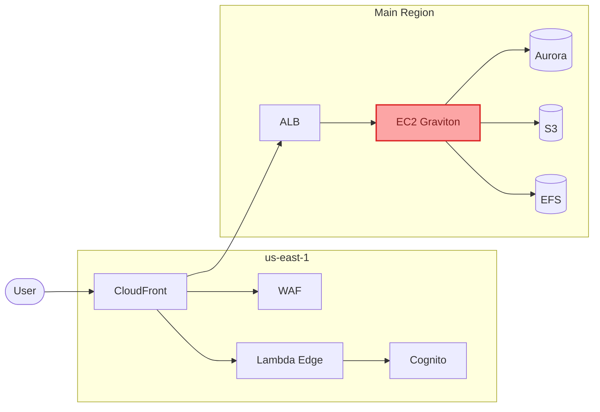
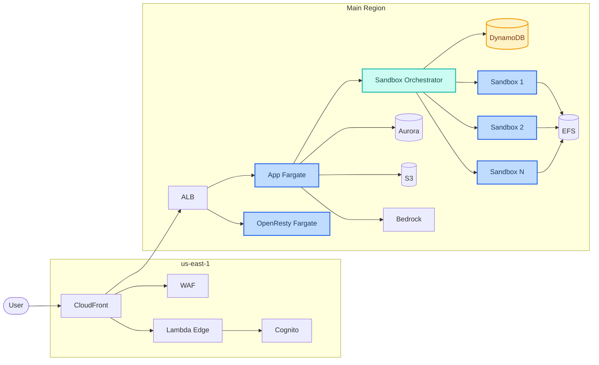
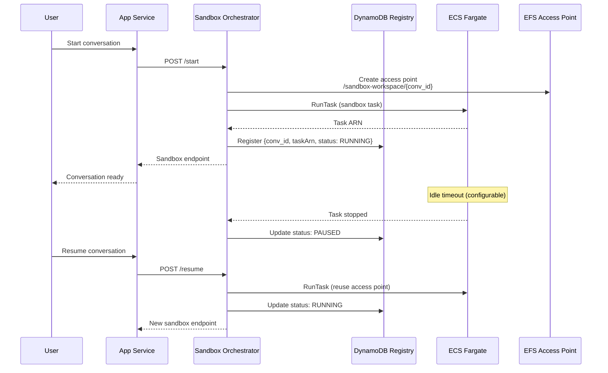
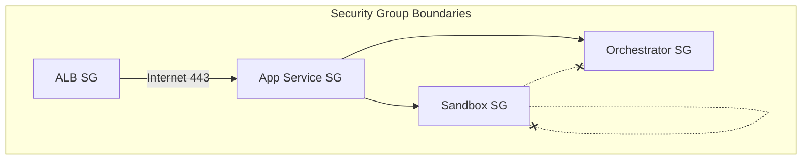

In a [previous post][previous-post], I introduced an [AWS CDK project][openhands-infra-repo] for deploying [OpenHands][openhands-github] on EC2, featuring Cognito authentication and Aurora PostgreSQL. While this architecture successfully facilitated initial deployment, operating a shared AI coding platform for a team revealed three fundamental limitations:

1.  **Shared Resources**: All sandbox containers executed on a single EC2 instance, leading to contention for CPU and memory.
2.  **Persistent Cost**: The EC2 instance incurred approximately $375/month, regardless of platform utilization.
3.  **Lack of Tenant Isolation**: Sandbox containers possessed network access to each other.

The [v1.0.0 release][openhands-infra-v1] of `openhands-infra` addresses these limitations by fully replacing EC2 with **ECS Fargate**. This revised architecture provides per-conversation isolation through dedicated Fargate tasks, eliminates idle costs by stopping tasks when inactive, and prevents cross-tenant communication via granular security groups.

This post details the architectural evolution and the AWS services that enable these capabilities.

<!--more-->

## Architecture Evolution

The initial architecture utilized a single EC2 Graviton instance running Docker Compose. The updated architecture distributes workloads across managed Fargate services, leveraging [Cloud Map][cloud-map-docs] for private DNS-based service discovery.

### Before: EC2-Based (v0.1.0)



### After: Fully Serverless (v1.0.0)



The comprehensive EC2 layer, encompassing launch templates, Auto Scaling Groups, user-data scripts (~200 lines of bash), Watchtower for auto-updates, and Docker Compose orchestration, has been entirely replaced. The new architecture integrates three Fargate services (App, OpenResty, Sandbox Orchestrator), a DynamoDB registry for tracking sandbox lifecycles, and Cloud Map for private DNS service discovery.

| Aspect | EC2 (v0.1.0) | Fargate (v1.0.0) |
| :---------------- | :-------------------- | :------------------------------ |
| **CDK Stacks** | 6 | 10 |
| **Compute** | EC2 ASG (m7g.xlarge) | ECS Fargate (ARM64) |
| **Sandbox Isolation** | Shared EFS mount | Per-conversation EFS access points |
| **Network Isolation** | Self-referencing security group | Per-role security groups |
| **Service Discovery** | Docker Compose on EC2 | Cloud Map private DNS |
| **Idle Cost** | ~$375/month (always-on) | Tasks stop when idle |
| **Updates** | Watchtower auto-pull | ECS deployment circuit breaker |

## Per-Conversation Fargate Isolation

A key architectural shift involves the management of sandbox containers. In the EC2 architecture, OpenHands directly spawned Docker containers on the host, resulting in shared EFS mounts, network resources, and compute capacity among all containers.

The Fargate architecture introduces a **sandbox orchestrator** responsible for managing the complete lifecycle of per-conversation [ECS Fargate][ecs-fargate-docs] tasks, as illustrated in the following sequence:



### Filesystem Isolation with EFS Access Points

Each conversation is provisioned with a dedicated [EFS access point][efs-access-points-docs], rooted at `/sandbox-workspace/<conversation_id>` and configured with POSIX `uid/gid 1000`. This access point establishes a **physical root boundary**, preventing containers from accessing parent directories or other conversation workspaces.

Upon conversation termination or sandbox task replacement, the associated access point is purged. When a conversation resumes, a new Fargate task is launched using the same access point, ensuring the persistence of all workspace files.

### Service Discovery with Cloud Map

The App service and Sandbox Orchestrator leverage [AWS Cloud Map][cloud-map-docs] for private DNS-based service discovery. The orchestrator registers as `orchestrator.openhands.local:8081`, while the App service connects to `app.openhands.local:3000`. This mechanism replaces the Docker Compose networking previously utilized for inter-service communication on a single EC2 host.

## Multi-Tenant Security

The transition to Fargate facilitates a layered security model, an enhancement not achievable with shared-host Docker containers.

### Network Isolation

The EC2 architecture permitted inter-sandbox communication over any TCP port via a self-referencing security group rule. The Fargate architecture eliminates this vulnerability:



Each role (ALB, App, Orchestrator, Sandbox) is assigned a distinct security group. Sandbox tasks are restricted to receiving connections solely from the App service, thereby precluding communication with other sandboxes, direct access to the orchestrator API, or circumvention of CloudFront/Lambda@Edge authentication.

### Per-User Configuration with KMS Encryption

A dedicated **User Configuration API**, implemented via Lambda and [HTTP API Gateway][api-gateway-docs], enables users to customize their OpenHands experience:

*   **MCP Server Configurations**: Users can integrate custom [MCP servers][mcp-docs] for third-party tool integration.
*   **Third-Party Integrations**: GitHub and Slack tokens are supported with automatic MCP injection.
*   **LLM Model Selection**: Users can select from available [Bedrock][bedrock-docs] models (e.g., Claude Opus 4.5, Sonnet 4.5, Haiku 4.5).

All user secrets (API keys, tokens) are protected using [KMS][kms-docs] envelope encryption, ensuring that sensitive values are never logged or exposed via API responses. User configurations are merged with the global `config.toml` at runtime, allowing administrators to define baseline defaults while empowering users to personalize their experience.

### Orphan Task Detection

Within a distributed system, race conditions can result in orphaned Fargate tasks operating without corresponding DynamoDB records. An [EventBridge][eventbridge-docs] rule monitors ECS Task State Change events, triggering a Lambda function that performs the following actions:

1.  Enumerates all `RUNNING` sandbox tasks.
2.  Compares the enumerated tasks against DynamoDB records.
3.  Applies a 5-minute grace period for tasks still in the startup phase.
4.  Stops any identified orphan tasks.
5.  Publishes `OrphanSandboxesStopped` [CloudWatch][cloudwatch-docs] metrics for monitoring purposes.

This event-driven cleanup mechanism prevents cost accumulation from abandoned resources.

## Zero Idle Cost Architecture

The primary advantage of the Fargate migration is the paradigm shift from an **always-on** to a **pay-per-use** cost model.

### Cost Comparison

In the EC2 architecture, the instance must be sized to accommodate **all concurrent sandboxes** on a single host. Each OpenHands sandbox requires approximately 4 vCPU and 8 GB of memory. Supporting 10-20 concurrent conversations demands a large instance such as `m7g.4xlarge` (16 vCPU, 64 GB) or `m7g.8xlarge` (32 vCPU, 128 GB) — and that instance runs 24/7 regardless of actual usage.

The Fargate architecture decouples the App service from sandbox compute. CloudWatch metrics from a staging deployment confirmed that the App service is a **control plane only** — handling API routing, session management, and S3/DB reads — with average CPU utilization under 1% and memory usage around 580 MB. This allows the App to start with just **1 vCPU / 2 GB** (~$29/month on ARM64 Fargate), with target tracking auto scaling (1-3 tasks, 60% CPU threshold) handling traffic spikes. Sandboxes launch as independent Fargate tasks billed per-second, scaling from zero to dozens of concurrent conversations with no pre-provisioning.

| Component | EC2 (v0.1.0) | Fargate (v1.0.0) |
| :---------------- | :---------------------------- | :------------------------------- |
| **Compute (App + Sandbox)** | EC2 m7g.4xlarge: ~$450/mo | Fargate App (1 vCPU): ~$29/mo |
| **Sandbox compute** | Included (always on) | Per-second billing (scale to zero) |
| **Database** | Aurora: ~$43-80/mo | Aurora: ~$43-80/mo |
| **Networking** | CloudFront + ALB: ~$110/mo | CloudFront + ALB: ~$110/mo |
| **VPC Endpoints** | ~$50/mo | ~$50/mo |
| **Other** | EBS + S3 + NAT: ~$60-70/mo | S3 + NAT: ~$50-60/mo |
| **Total base** | **~$710-760/mo** | **~$280-330/mo** |
| **Per additional sandbox** | Requires larger EC2 instance | ~$0.18/hr per active task |

The cost advantage is substantial. The EC2 model requires over-provisioning for peak capacity — paying for a large instance even during off-hours when no one is coding. The Fargate model pays only for active conversations. A team of 10 engineers who each use OpenHands for 4 hours per day would consume approximately **$54/month** in sandbox compute (10 users x 4 hrs x 20 workdays x $0.18/hr), bringing the total to ~$334-384/month — compared to the EC2 model's fixed ~$710-760/month for an instance large enough to support them.

### Idle Timeout Mechanism

Each sandbox task is configured with an adjustable idle timeout (10 minutes for staging, 30 minutes for production). When no activity is detected:

1.  An idle monitor Lambda identifies inactive tasks.
2.  Tasks are gracefully terminated.
3.  DynamoDB records are updated to `PAUSED` status.
4.  The conversation is archived, but all workspace files persist on EFS.

Upon user return, the App service invokes the orchestrator's `/resume` endpoint, which launches a new Fargate task utilizing the existing EFS access point. This ensures conversation continuity, leveraging Aurora for metadata, S3 for event storage, and EFS for workspace data.

### Warm Pool for Rapid Startup

The cold-start latency for a Fargate task typically ranges from 30-60 seconds. To enhance user experience, the orchestrator maintains a configurable **warm pool** (default: 2 pre-warmed tasks). A warm pool synchronization process periodically verifies the availability of pre-started tasks every 15 seconds. When a new conversation is initiated, a pre-warmed task is immediately claimed, circumventing cold-start delays.

This approach represents a cost-performance trade-off: warm pool tasks consume Fargate compute resources while awaiting assignment, but they mitigate the cold-start latency that would otherwise disrupt user interaction.

## AWS Services Composition

The v1.0.0 architecture integrates over 10 AWS services, each fulfilling a specific role:

| AWS Service | Role |
| :---------------------------- | :------------------------------------------------------ |
| [ECS Fargate][ecs-fargate-docs] | Compute for App, OpenResty, and sandbox tasks |
| [Cloud Map][cloud-map-docs] | Private DNS service discovery for inter-service communication |
| [DynamoDB][dynamodb-docs] | Sandbox lifecycle registry (conversation → task mapping) |
| [EFS][efs-docs] | Persistent workspace storage with per-conversation access points |
| [Aurora Serverless v2][aurora-docs] | Conversation metadata with RDS Proxy connection pooling |
| [EventBridge][eventbridge-docs] | Event-driven sandbox cleanup based on task state changes |
| [Lambda][lambda-docs] | Idle monitoring, orphan detection, user config API, DB bootstrap |
| [KMS][kms-docs] | Envelope encryption for user secrets |
| [CloudFront][cloudfront-docs] | Global edge distribution with Lambda@Edge for authentication |
| [Cognito][cognito-docs] | User authentication using OAuth 2.0 / Managed Login v2 |
| [WAF][waf-docs] | Rate limiting and request filtering |
| [Bedrock][bedrock-docs] | LLM access (Claude models) via IAM roles |
| [VPC Endpoints][vpc-endpoints-docs] | Private connectivity to AWS services (eliminates public internet access) |

All AWS API calls originating from Fargate tasks are routed through [VPC Endpoints][vpc-endpoints-docs], ensuring that sandboxes communicate with AWS services without traversing the public internet. [RDS Proxy][rds-proxy-docs] manages connection pooling for Aurora, thereby preventing connection exhaustion under concurrent database access from multiple Fargate tasks.

The infrastructure is defined across **10 CDK stacks**, with an explicit deployment order:

```
Auth → Network → Monitoring → Security → Database →
  UserConfig → Cluster → Sandbox → Compute → Edge
```

## Deployment

### Prerequisites

*   VPC with private subnets (minimum 2 AZs)
*   NAT Gateway
*   Route 53 hosted zone
*   Node.js 20+

### Quick Start

```bash
git clone https://github.com/zxkane/openhands-infra.git
cd openhands-infra
npm install

# Bootstrap CDK (both regions required)
npx cdk bootstrap --region us-west-2
npx cdk bootstrap --region us-east-1

# Deploy all 10 stacks
npx cdk deploy --all \
  --context vpcId=vpc-xxxxx \
  --context hostedZoneId=Z0xxxxx \
  --context domainName=example.com \
  --context subDomain=openhands
```

Following deployment, access `https://openhands.example.com` and authenticate using Cognito credentials. Each user benefits from isolated conversations with dedicated, per-conversation sandboxes that spin up on demand and terminate when idle.

## Conclusion

The architectural evolution from EC2 to fully serverless ECS Fargate transforms `openhands-infra` from a single-user deployment tool into a production-ready, multi-tenant platform. Per-conversation Fargate isolation establishes robust security boundaries, event-driven cleanup prevents unnecessary costs, and the pay-per-second compute model aligns infrastructure expenditure with actual usage.

The [openhands-infra repository][openhands-infra-repo] is open source. For details on the original EC2-based architecture, refer to the [previous post][previous-post].

## Resources

*   [openhands-infra Repository (v1.0.0)][openhands-infra-v1]
*   [OpenHands Documentation][openhands-docs]
*   [AWS CDK Documentation][aws-cdk-docs]

---

<!-- GitHub Repositories -->
[openhands-github]: https://github.com/All-Hands-AI/OpenHands
[openhands-infra-repo]: https://github.com/zxkane/openhands-infra
[openhands-infra-v1]: https://github.com/zxkane/openhands-infra/releases/tag/v1.0.0

<!-- Official Documentation -->
[openhands-docs]: https://docs.all-hands.dev/
[aws-cdk-docs]: https://docs.aws.amazon.com/cdk/latest/guide/

<!-- AWS Service Documentation -->
[ecs-fargate-docs]: https://docs.aws.amazon.com/AmazonECS/latest/developerguide/AWS_Fargate.html
[cloud-map-docs]: https://docs.aws.amazon.com/cloud-map/latest/dg/what-is-cloud-map.html
[dynamodb-docs]: https://docs.aws.amazon.com/amazondynamodb/latest/developerguide/Introduction.html
[efs-docs]: https://docs.aws.amazon.com/efs/latest/ug/whatisefs.html
[efs-access-points-docs]: https://docs.aws.amazon.com/efs/latest/ug/efs-access-points.html
[aurora-docs]: https://docs.aws.amazon.com/AmazonRDS/latest/AuroraUserGuide/aurora-serverless-v2.html
[rds-proxy-docs]: https://docs.aws.amazon.com/AmazonRDS/latest/UserGuide/rds-proxy.html
[eventbridge-docs]: https://docs.aws.amazon.com/eventbridge/latest/userguide/eb-what-is.html
[lambda-docs]: https://docs.aws.amazon.com/lambda/latest/dg/welcome.html
[kms-docs]: https://docs.aws.amazon.com/kms/latest/developerguide/overview.html
[cloudfront-docs]: https://docs.aws.amazon.com/AmazonCloudFront/latest/DeveloperGuide/Introduction.html
[cognito-docs]: https://docs.aws.amazon.com/cognito/latest/developerguide/what-is-amazon-cognito.html
[waf-docs]: https://docs.aws.amazon.com/waf/latest/developerguide/what-is-aws-waf.html
[bedrock-docs]: https://docs.aws.amazon.com/bedrock/latest/userguide/what-is-bedrock.html
[vpc-endpoints-docs]: https://docs.aws.amazon.com/vpc/latest/privatelink/vpc-endpoints.html
[api-gateway-docs]: https://docs.aws.amazon.com/apigateway/latest/developerguide/http-api.html
[cloudwatch-docs]: https://docs.aws.amazon.com/AmazonCloudWatch/latest/monitoring/WhatIsCloudWatch.html
[mcp-docs]: https://modelcontextprotocol.io/

<!-- Related Articles (Internal Links) -->
[previous-post]: 
