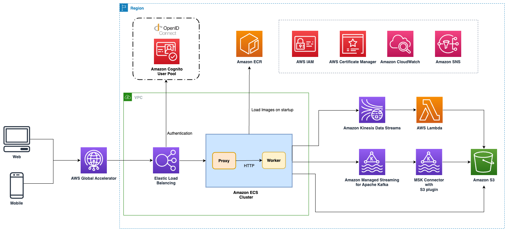

In this post, we will delve into the data ingestion service of our [clickstream solution][clickstream-series]. This service is a vital part of the clickstream analytics system. It is designed to be reliable, resilient, high-performing, flexible, and cost-effective. It plays a key role in capturing clickstream data from various sources and delivering it to downstream processing and modeling components.

## Overview Architecture

The data ingestion service of our clickstream solution is a standard web service that can be used by a wide range of clients, including web servers, mobile apps, IoT devices, and third-party platforms. It offers the following capabilities:

- Optional use of [AWS Global Accelerator][aga] for accelerating end-users' global footprints and fast failover for multi-Region architectures.
- Application Load Balancer for backend fleet load balancing, SSL certificate offload, basic payload verification, and authentication via OIDC provider.
- The backend service is hosted on Amazon Elastic Container Service (Amazon ECS), supporting either EC2 or serverless Fargate (in future releases) for container hosting.
- Two-service backend architecture:
    1. Apache Nginx service for processing CORS requests and forwarding incoming events.
    2. Worker service powered by open-source [Vector][vector] for sending events to the configured sink service and enriching events with fields like `ingest time` and `source IP`.
- Support for three different sink services based on user preference:
    - [Amazon Kinesis][aws-kinesis] or Apache Kafka for near real-time analysis with seconds latency.
    - [Amazon Managed Streaming for Apache Kafka][msk] (MSK) for those who prefer a fully managed Apache Kafka service, self-managed Kafka also is supported.
    - [Amazon S3][aws-s3] bucket for cost-effective sink when real-time analysis isn't required.
- Provisioning of [MSK Connect][msk-connect] instances or [AWS Lambda][aws-lambda] functions to periodically synchronize events from upstream services to S3 bucket when using Kafka or Kinesis as sink destinations.

## Design Tenets

### Reliability

Reliability is crucial for data ingestion, especially when handling large-scale events. Our service ensures reliability through:

  - Auto Scaling groups with warm pools for rapid scaling during traffic spikes.
  - Buffering mechanisms using Amazon Kinesis Data Streams, Amazon MSK, or Amazon S3 to handle sudden traffic spikes and potential downstream processing delays.
  - All sink requests to Kafka and Kinesis are synchronized; the error HTTP status code (500 or greater) will be returned when failing to write an event to the downstream sink destination. All SDKs of clickstream will retry the event-sending request when receiving the error response code from the data ingestion service.  However, using Amazon S3 as a sink destination is a bit different. The worker uses an in-memory cache to buffer the incoming events, then persists the batch events (use total event size or time interval as threshold) to the S3 bucket. It might lose a few events if the container or host instance is crashed or restarted before the batch events are persisted. Once the incoming events are persisted in streaming services (Kafka or Kinesis), the solution uses asynchronized jobs to write the events to the S3 bucket to make sure all events are well received.

### Resilience

Our data ingestion service is designed to withstand and recover from various failures and disruptions:

  - Multi-AZ deployment for enhanced fault tolerance and high availability.
  - Retry mechanisms with exponential backoff for handling transient failures.

### High Performance at Scale

Optimized for high performance, especially during large scaling events:

  - AWS Global Accelerator integration for improved global availability and performance.
  - High-performance ingestion service capable of handling 4000 to 6000 requests per second (RPS) per EC2 server, with horizontal scaling to serve massive data volumes. Due to the ingestion service being stateless, we could use a horizontal scaling policy to serve the massive data volumes. We successfully guided the customer to serve the 500, 000 RPS in a single ingestion fleet.

### Flexibility

The service offers flexibility through:

- Multiple sink options: Amazon S3, Amazon Kinesis Data Streams, and Amazon MSK.
- Customizable authentication and compatibility with third-party clickstream SDKs or clients.

### Cost-Effectiveness

We ensure cost-effectiveness by:

- Leveraging serverless technologies for a pay-per-use model.
- Implementing data lifecycle management for optimized storage costs.
- Utilizing auto-scaling fleet with built-in policies to scale in during low-load periods.

## Resources Management

Resource management is handled through AWS CloudFormation and AWS CDK, with:

- Separate CloudFormation nested stacks for different sink destinations.
- Conditional resource management to control sink destination configurations.
- Shared stack for managing replacement CloudFormation resources to minimize outages during service updates.

In conclusion, the data ingestion service is a critical component of our clickstream analytics system, providing reliable, resilient, high-performance, flexible, and cost-effective capabilities for capturing and processing clickstream data. Its robust architecture makes it suitable for businesses of all sizes, from small startups to large enterprises handling massive data volumes.

Stay tuned for our next post, where we'll delve into the data processing module of the clickstream analytics system!

[clickstream-series]: 
[aga]: https://aws.amazon.com/global-accelerator/
[vector]: https://vector.dev/
[aws-kinesis]: https://aws.amazon.com/kinesis/
[msk]: https://aws.amazon.com/msk/
[msk-connect]: https://docs.aws.amazon.com/msk/latest/developerguide/msk-connect.html
[aws-lambda]: https://aws.amazon.com/lambda/
[aws-s3]: https://aws.amazon.com/s3/
