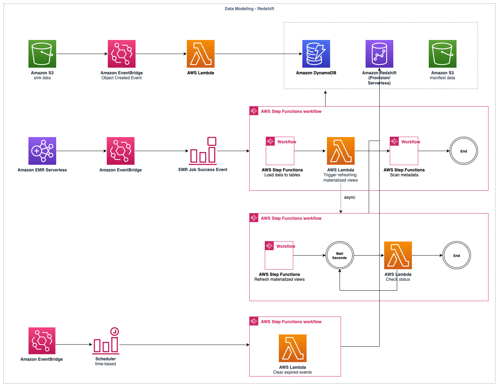

In this post, we will delve into the data modeling module of our [clickstream solution][clickstream-series]. This module is an optional component that creates data models in the [Amazon Redshift][redshift] data warehouse and calculates reporting dimensions based on the event, session, and user factor tables generated in the [data processing module][data-processing].

## Overview Architecture

The overview architecture demonstrates how the solution orchestrates loading clickstream data into the Amazon Redshift data warehouse and triggers data modeling within Redshift.

## Data Loading Workflow

The first workflow in the architecture diagram above illustrates how factor event, session, item, and user records are loaded into the Redshift data warehouse for further processing. The sequence for loading clickstream data into Redshift is as follows:

1. Raw event data is processed by Apache Spark, a distributed system that shards the data across multiple nodes and sinks the processed data to S3 without maintaining order. The best approach for processing this sink data is using an event-driven architecture. We subscribe to the `ObjectCreated` event of the sink S3 bucket in EventBridge, then record the file information in DynamoDB as a to-be-processed item.

2. When the EMR job execution completes, the `Job Success` event of the EMR Serverless job execution is emitted via EventBridge. This triggers the load data workflow orchestrated by AWS Step Functions to load the items from the DynamoDB table into Redshift.

3. The workflow mentioned in the previous step parallelly triggers four sub-workflows to load records into the corresponding target tables (event, user, session, and item).

4. Each sub-workflow follows the same procedures:

    - It scans the DynamoDB table to find a batch of files to be loaded into the target Redshift table.
    - Once files are found, a manifest file required by the [Redshift COPY command][copy] is created in the S3 bucket, which is the most efficient way to load batch data into Redshift tables.
    - The workflow submits batch SQL statements to Redshift via the [Redshift Data API][data-api], then periodically checks the execution status with backoff until completion.
    - When a batch of files is loaded into Redshift, the workflow scans the DynamoDB table again to load another batch if available, continuing until all existing files are loaded.

5. The statements to load data into Redshift tables follow these steps:

    - Copy the batch files from S3 into a temporary staging table with the same schema as the target table. The COPY command removes any duplicate records in that batch of data.
    - Use the [MERGE command][merge] to upsert the records to the target table, avoiding duplicate items.

A best practice for using Step Functions to orchestrate long-running workflows is to be aware of the [hard limit for **Maximum execution history size**][state-machine-executions-limition] in standard state machines. To mitigate this limitation, extract steps as sub-workflows when orchestrating long-running processes.

## Data Modeling Workflow

Once a batch of data is loaded into the tables, the load data workflow asynchronously starts the data modeling workflow without waiting for its completion. The data modeling in the clickstream solution consists of materialized views, self-managed view tables, dimension tables, and stored procedures. The workflow triggers the refreshing of materialized views, incrementally populates data into the `clickstream_base_view` table (which joins event and session data), and executes stored procedures to calculate daily metric dimensions for out-of-the-box dashboards. For cost-effectiveness, materialized view refreshing and base view population are executed at four-hour intervals by default, even if data loading occurs more frequently. The daily metric calculation is executed on a daily basis by default.

## Metadata Scanning Workflow

The final step of the data loading workflow asynchronously triggers another workflow to scan metadata of new events on a daily basis. It aggregates the keys of custom properties for events and users, collecting their top 20 values and counts, then persists this information to the database (DynamoDB) of the [web console][web-console] for further exploratory analysis and metadata management.

## Data Expiration Workflow

The solution is designed to keep only recent (_hot_) events in Redshift to reduce data volume during exploratory event analysis. A time-based event scheduler triggers a workflow to clean up aging events as specified by the user.

## Redshift Management

The solution supports both provisioned Redshift clusters and Redshift Serverless. Users must provision the Redshift cluster outside of the solution and can choose an existing provisioned Redshift cluster in the same region and account when configuring the pipeline.

Redshift Serverless is handled slightly differently. The solution provisions a new Redshift Serverless namespace and workgroup, using [IAM roles to access Redshift Serverless][serverless-iam] without creating an administrator user with a password. For information on accessing Redshift Serverless in the query editor, see the question "I already enable data modeling on Redshift, so why can't I see the schema and tables created by this solution in the Redshift query editor?" in the [FAQ][faq-data-pipeline].

The two types of Redshift offer different pricing models for various use scenarios:

- Provisioned Redshift has a fixed cost, suitable for long-running workloads such as streaming ingestion.
- Redshift Serverless uses a pay-as-you-go model, where you only pay for actual usage. It's ideal for varied workloads. See [this post][redshift-serverless-cost] for a deep dive into Redshift Serverless costs and use cases.

You can also combine Redshift Serverless and provisioned Redshift to share the same data for optimal performance and cost trade-offs. See the question "How to implement a dedicated Redshift for Analytics Studio?" in the [FAQ][faq-analytics-studio] for information on combining the two types of Redshift in clickstream analysis.

## Redshift Resource Management

The solution uses the infrastructure-as-code (IaC) tool [AWS CDK][cdk] to manage cloud resources. After provisioning the data pipeline with the given configuration, users can immediately use the solution without additional manual configurations. This means that Redshift tables, views, materialized views, and other resources are created or updated when the data pipeline is created or updated. The challenge of updating existing materialized views or creating new ones based on large volumes of existing records (tens of billions or more) is time-consuming, potentially taking minutes to hours depending on data volume and overall Redshift cluster load. This could cause the entire pipeline provisioning process to timeout or fail on rollback if Redshift resource updates are synchronized steps in the pipeline creation or update phase.

To address this, the solution makes the job of updating Redshift resources an asynchronous workflow, which never blocks pipeline creation or updates. The workflow is designed to be idempotent, allowing safe resumption of the job if it fails due to timeout or other constraints.

## Redshift Schema Best Practices

### Properly Configure `BACKUP` Option for MATERIALIZED VIEW

When creating [materialized views][create-mv] in Redshift that are crucial for persisting data for business purposes, use the `BACKUP YES` option. This ensures that the materialized view is included in automated and manual cluster snapshots.

For provisioned Redshift clusters, this practice is particularly important. When a cluster is maintained due to underlying hardware failure, it typically involves dumping a snapshot and restoring a new cluster from that snapshot. Materialized views created with the `BACKUP NO` option would be lost in this process.

### Use Proper Sort Key

Clickstream events are time-series data, with each event containing a mandatory `event_timestamp` field of type **timestamp**. This field serves as the [sort key][sort-key] for the event table, distributing records across Redshift clusters. When querying the event table, using the `event_timestamp` field in filter conditions is crucial. Without specifying this field in query conditions, Redshift would perform a full table scan, significantly impacting performance.

### Use SUPER Type for Semi-structured Data

Clickstream events often require the ability to store arbitrary key-value pairs as custom properties for events and users. This presents a challenge for traditional relational databases. A common approach is to create an `event_prop` table to store these dynamic key-value pairs, like so:

| uuid                                   | event_id | key           | value         | value_type |
|----------------------------------------|----------|---------------|---------------|------------|
| 123e4567-e89b-12d3-a456-426614174000   | 1        | user_id       | 42            | INTEGER    |
| 123e4567-e89b-12d3-a456-426614174001   | 1        | session_id    | abc123        | STRING     |
| 123e4567-e89b-12d3-a456-426614174002   | 1        | event_type    | click         | STRING     |
| 123e4567-e89b-12d3-a456-426614174003   | 2        | user_id       | 43            | INTEGER    |
| 123e4567-e89b-12d3-a456-426614174004   | 2        | session_id    | def456        | STRING     |
| 123e4567-e89b-12d3-a456-426614174005   | 2        | event_type    | view          | STRING     |
| 123e4567-e89b-12d3-a456-426614174006   | 2        | custom_field  | my_field_value | STRING     |

However, querying custom properties of events becomes extremely slow when joining billions of event records with hundreds of billions of event property records (assuming an event has 10 or more properties).

The [SUPER type][super-type] in Redshift offers a solution to this problem. It can contain complex values such as arrays, nested structures, and other complex structures associated with serialization formats like JSON. The SUPER data type is a set of schemaless array and structure values that encompass all other scalar types in Amazon Redshift. Our solution utilizes a SUPER field to represent the custom properties of events and users, containing an object with arbitrary key-value pairs.

[clickstream-series]: 
[data-processing]: 
[redshift]: https://aws.amazon.com/redshift/
[copy]: https://docs.aws.amazon.com/redshift/latest/dg/r_COPY.html
[data-api]: https://docs.aws.amazon.com/redshift/latest/mgmt/data-api.html
[merge]: https://docs.aws.amazon.com/redshift/latest/dg/r_MERGE.html
[web-console]: 
[serverless-iam]: https://docs.aws.amazon.com/redshift/latest/mgmt/serverless-iam.html
[faq-data-pipeline]: https://docs.aws.amazon.com/solutions/latest/clickstream-analytics-on-aws/frequently-asked-questions.html#data-pipeline-faq
[redshift-serverless-cost]: 
[faq-analytics-studio]: https://docs.aws.amazon.com/solutions/latest/clickstream-analytics-on-aws/frequently-asked-questions.html#analytics-studio-3
[cdk]: https://aws.amazon.com/cdk/
[state-machine-executions-limition]: https://docs.aws.amazon.com/step-functions/latest/dg/service-quotas.html#service-limits-state-machine-executions
[sort-key]: https://docs.aws.amazon.com/redshift/latest/dg/t_Sorting_data.html
[super-type]: https://docs.aws.amazon.com/redshift/latest/dg/r_SUPER_type.html
[create-mv]: https://docs.aws.amazon.com/redshift/latest/dg/materialized-view-create-sql-command.html