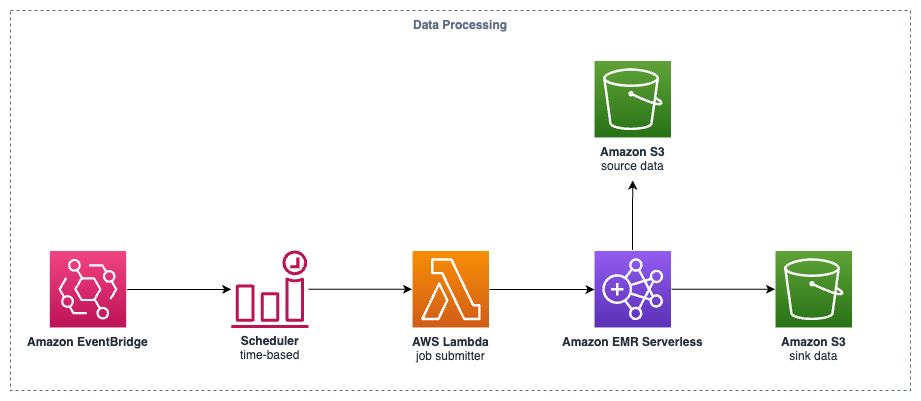

In this post, we will delve into the data processing module of our [clickstream solution][clickstream-series]. This module is an optional component that normalizes raw clickstream events by cleaning, transforming, and enriching them to fit the standard clickstream data schema defined in the solution. It's designed for flexibility, reliability, high performance, and cost-effectiveness.

## Overview Architecture

The data processing is designed for batch or micro-batch data processing to optimize performance and cost-effectiveness. It's primarily an Apache Spark application running on [Amazon EMR Serverless][emr-serverless] to achieve a balance between high performance and cost. It offers the following capabilities:

- The data processing job is triggered by a time-based [Amazon EventBridge][eventbridge] rule. The rule can be set to a fixed interval or any EventBridge rule-supported crontab expression. Users can tune the interval based on their business needs and budget; generally, more frequent processing intervals incur higher costs.
- A Lambda function is executed when the scheduler is triggered. This function acts as a job submitter, which submits a new job to the EMR Serverless application created in the data pipeline provisioning. It performs the following steps:
    - Scans the S3 bucket storing the raw events collected by the [data ingestion service][data-ingestion].
    - Estimates the minimum computing resources needed for processing the batch data based on the data volume. It uses the last modified timestamp of S3 objects, which is a strongly consistent system, to find new and previously unprocessed files.
    - Does nothing if no new data files are found in the S3 bucket since the last run. This saves costs, especially in test environments with occasional events.
    - Submits a new job execution to the EMR Serverless application with initial CPU cores, memory size, and timestamp range as the application's arguments.
- The data processing application, powered by Apache Spark, loads the given data files, cleans, transforms, and enriches the data, and finally writes the results back to the sink S3 bucket.

## Flexibility - A Pluggable Data Processing Implementation

The solution provides flexibility to support multiple SDKs and even unknown third-party clients based on HTTP protocol, as mentioned in the [data ingestion][data-ingestion-flexbility] section. The data processing application has a pluggable implementation to support other data transform and data enrichment implementations. When introducing a new client that sends clickstream events, you can create a custom data transform implementation to clean and transform the data to the normalized data schema of the solution. You can also specify zero or multiple enrichment implementations to enhance the clickstream event.

By default, the solution provides three data transformers to support [the official SDKs of the clickstream solution][sdk], Google Tag Manager for server-side tagging (you can follow the [Guidance for Using Google Tag Manager for Server-Side Website Analytics on AWS][gtm-serverside-guidance] to set up GTM server-side servers on AWS), and [Sensors Data][sensors-data].

Additionally, the solution provides the following built-in enrichments for clickstream events:

- **IP enrichment**: Uses [GeoLite2 Free Geolocation Data][geolite2] by MaxMind to enrich source IP with city, continent, and country information.
- **UA enrichement**: Uses [ua_parser Java library][uap] to enrich User-Agent in the HTTP header with device and browser information.
- **Traffic source enrichment**: Uses page referrer, well-known UTM parameters, and configurable mediums to enrich the source, medium, campaign, and Click ID of the traffic for your websites and mobile applications.

If you want to analyze your custom data with these built-in benefits, you can refer to [this documentation][custom-plugins] to start developing your transform implementation and custom enrichment implementations.

## Data Schema

The data processing module processes raw clickstream events, which are mostly JSON data containing one or more client-side events, into the normalized data schema defined in the solution for further data modeling. The solution uses the following four tables to represent clickstream events:

- **Event**: This table stores event data. Each record represents an individual event. The event records keep all common properties collected by the SDK and the custom properties specified by the user as a JSON object. Additionally, the data processing application appends a few JSON object columns to collect process info such as source IP, source file, etc.
- **User**: This table stores the latest user attributes. Each record represents a visitor (pseudonymous user).
- **Item**: This table stores event-item data. Each record represents an event that is associated with an item.
- **Session**: This table stores session data. Each record represents a session for each pseudonymous user. See [detailed session definition][preset-events] in the SDK manual.

## Data Storage

By default all processed data are stored in S3 bucket forever, you can use the lifecycle of S3 object to automatically deleting the out-dated files and save costs.

All processed files are saved in the data lake (S3 bucket) in Parquet format. The prefix of the object path contains the `project id` and `app id` for each application in the same project. The data processing module also creates a Glue table for each project when provisioning the pipeline. Users can use [Amazon Athena][athena] to query the processed data with predefined partitions (`app id`, `year`, `month`, and `day`) to improve performance and save costs.

By default, all processed data is stored in the S3 bucket indefinitely. You can use S3 object lifecycle policies to automatically delete outdated files and save costs.

## Cost-effectiveness

Due to the nature of batch data processing, we use EMR Serverless to achieve a balance between performance and cost-effectiveness. The EMR Serverless application is not charged when no job is executing.

Secondly, the job submitter intelligently allocates only the necessary compute resources for job execution to avoid using excessive resources and save costs.

Third, the EMR Serverless application uses [AWS Graviton][graviton] architecture, providing at least 20% cost savings with better performance compared to using x86_64 architecture, without requiring any code changes!

Based on the characteristics of batch data processing, larger data volumes and right-sized compute resources can achieve a better performance-cost ratio. In the benchmark conducted by the team, it costs $0.26 per GB when processing an appropriately sized data volume.

[clickstream-series]: 
[emr-serverless]: https://aws.amazon.com/emr/serverless/
[eventbridge]: https://aws.amazon.com/eventbridge/
[data-ingestion]: 
[data-ingestion-flexbility]: 
[sdk]: https://docs.aws.amazon.com/solutions/latest/clickstream-analytics-on-aws/sdk-manual.html
[gtm-serverside-guidance]: https://aws.amazon.com/solutions/guidance/using-google-tag-manager-for-server-side-website-analytics-on-aws/
[sensors-data]: https://github.com/sensorsdata
[geolite2]: https://dev.maxmind.com/geoip/geolite2-free-geolocation-data
[uap]: https://github.com/ua-parser/uap-java
[custom-plugins]: https://docs.aws.amazon.com/solutions/latest/clickstream-analytics-on-aws/processing-plugin.html#develop-custom-plugins
[data-schema]: https://docs.aws.amazon.com/solutions/latest/clickstream-analytics-on-aws/data-schema.html#columns
[preset-events]: https://docs.aws.amazon.com/solutions/latest/clickstream-analytics-on-aws/web-sdk.html#preset-events-2
[athena]: https://aws.amazon.com/athena/
[graviton]: https://aws.amazon.com/ec2/graviton/