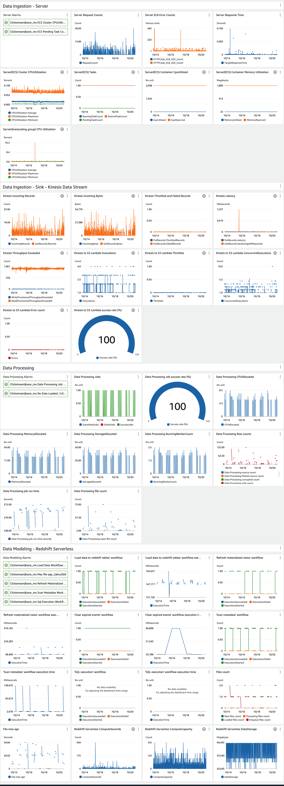
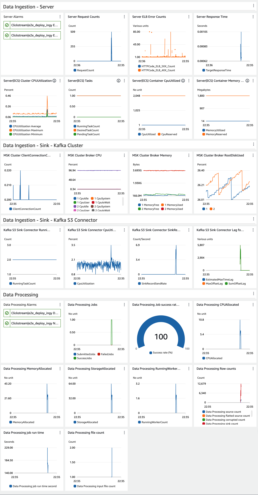

In this post, we will explore the observability features of our [clickstream solution][clickstream-series]. Observability is crucial for understanding the health of your data pipeline, identifying issues promptly, and ensuring optimal performance. We'll cover the monitoring, logging, and troubleshooting capabilities built into the solution.

## Overview

The clickstream analytics solution incorporates several observability features to help users monitor and maintain their data pipelines:

1. Logging
2. Custom CloudWatch dashboards
3. Automated alerting
4. Pipeline health checks
5. Troubleshooting tools

Let's delve into each of these components.

## Logging

The solution utilizes [Amazon CloudWatch Logs][cloudwatch-logs] and [Amazon S3][s3] to centralize logs from various components of the data pipeline and store them cost-effectively. This includes:

- [Data ingestion][data-ingestion] service logs, generated from the containers in ECS. You can also enable [access logs for the Application Load Balancer][alb-access-log] when configuring the data pipeline.
- [Data processing][data-processing] job logs, which use [Amazon EMR Serverless][emr-serverless] to process the raw ingestion data and persist the job logs in an S3 bucket.
- [Data modeling][data-modeling] workflow logs, which use [AWS Step Functions][sfn] and [AWS Lambda][lambda] to orchestrate the workflow. All these logs are stored in CloudWatch Logs. Lambda functions now support [configuring CloudWatch log groups][lambda-loggroup], allowing all logs to be stored in a single CloudWatch log group, facilitating easy searching and analysis across the entire workflow.
- [Web console][web-console] application logs, which are stored in CloudWatch Logs.

Furthermore, if you need to search and analyze logs across the entire data pipeline, consider implementing the AWS solution [Centralized Logging with OpenSearch][clo].

## Custom CloudWatch Dashboards

The solution automatically creates [custom CloudWatch dashboards][cloudwatch-dashboards] for each data pipeline. These dashboards provide at-a-glance views of key metrics, including:

- Ingestion service health and performance
- Data processing job health and key metrics statistics
- Data modeling workflow health and performance
- Redshift resource usage

The challenge lies in the modular design of the data pipeline. The pipeline has different components based on user choices, and even the data modeling on Redshift can be either Redshift Serverless or provisioned Redshift. Therefore, the dashboard is not fixed before the customer creates the data pipeline. The implementation approach is as follows:

- A common metrics stack is deployed before all other components, monitoring the metrics configurations in [AWS Systems Manager Parameter Store][ssm-parameter-store].
- Each module (stack) creates one or more metric configurations as standard parameters (which are free but have a 4KB size limit) with the name pattern `/Clickstream/metrics/<project id>/<stack id prefix>/<stack id>/<index>`.
- A function in the common metrics stack updates the dashboard based on the metrics specified in the parameters.

You can refer to the FAQ [How do I monitor the health of the data pipeline for my project?][key-metrics-explanation] for guidance on using these metrics to monitor the health of your data pipeline.

## Automated Alerting

To proactively notify users of potential issues, the solution sets up built-in [CloudWatch Alarms][cloudwatch-alarms] for critical metrics. These alarms can trigger notifications via Amazon SNS, allowing users to respond quickly to problems. Some key alarms include:

- ECS Cluster CPU Utilization, used for scaling out/in of the ingestion fleet
- ECS Pending Task Count, which alarms when the fleet is scaling out
- Data processing job failures
- Failures in the workflow of loading data into Redshift
- Abnormal situations where no data is loaded into Redshift
- Maximum file age exceeding the data processing interval threshold, which often indicates a failure in the data loading workflow or insufficient Redshift capacity
- Failures in the workflow of refreshing materialized views
- Failures in the workflow of scanning metadata

## Troubleshooting

To aid in troubleshooting, consider the following steps:

1. Review the [Troubleshooting][clickstream-troubleshoot] documentation to see if it addresses your issue.

2. **Log Queries**: Query CloudWatch Logs for common troubleshooting scenarios. When encountering an "Internal Server Error" in the solution web console, collect verbose error logs of the Lambda function running the solution web console as follows:
      1. Navigate to the CloudFormation stack of the solution web console.
      2. Click the **Resources** tab to search for the Lambda function with Logical ID `ApiFunction68`.
      3. Click the link in the **Physical ID** column to open the Lambda function on the Function page.
      4. Choose **Monitor** and then select **View logs in CloudWatch**. Refer to [Accessing logs with the console][lambda-cloudwatch-log] for more details.

3. **Error Pattern Detection**: Use automated analysis of logs to identify common error patterns and suggest potential solutions.

4. **Data Quality Checks**: Implement regular checks on processed data to identify potential data quality issues early in the pipeline.

5. **Performance Analyzer**: Utilize tools to analyze and optimize query performance in Redshift, including recommendations for table design and query structure.

6. **Contact Support**: [Get expert assistance with this solution][contact-support] if you have an active support plan.

## Best Practices for Pipeline Observability

To make the most of these observability features, consider the following best practices:

1. **Regular Monitoring**: Check the CloudWatch dashboards regularly to familiarize yourself with normal patterns and quickly spot anomalies.

2. **Alert Tuning**: Adjust alert thresholds based on your specific use case to minimize false positives while ensuring you catch real issues. Add additional alerts as needed.

3. **Log Analysis**: Use CloudWatch Logs Insights to perform ad-hoc analysis on your logs when troubleshooting specific issues.

4. **On-call Integration**: Integrate alert notifications with your preferred tools, such as PagerDuty or AWS Chatbot.

5. **Continuous Improvement**: Use the insights gained from observability tools to continuously improve your data pipeline's performance and reliability.

## Conclusion

Observability is a critical aspect of maintaining a healthy and efficient clickstream analytics pipeline. By leveraging the built-in monitoring, logging, and troubleshooting capabilities of the solution, you can ensure that your data pipeline remains robust and performant, allowing you to focus on deriving insights from your clickstream data.

[clickstream-series]: 
[cloudwatch-logs]: https://aws.amazon.com/cloudwatch/features/#Logs
[s3]: https://aws.amazon.com/s3/
[web-console]: 
[data-ingestion]: 
[data-processing]: 
[data-modeling]: 
[alb-access-log]: https://docs.aws.amazon.com/elasticloadbalancing/latest/application/load-balancer-access-logs.html
[clo]: https://aws.amazon.com/solutions/implementations/centralized-logging-with-opensearch/
[emr-serverless]: https://aws.amazon.com/emr/serverless/
[lambda]: https://aws.amazon.com/cn/lambda/
[sfn]: https://aws.amazon.com/step-functions/
[lambda-loggroup]: https://docs.aws.amazon.com/lambda/latest/dg/monitoring-cloudwatchlogs-advanced.html#monitoring-cloudwatchlogs-loggroups
[cloudwatch-dashboards]: https://docs.aws.amazon.com/AmazonCloudWatch/latest/monitoring/CloudWatch_Dashboards.html
[ssm-parameter-store]: https://docs.aws.amazon.com/systems-manager/latest/userguide/systems-manager-parameter-store.html
[key-metrics-explanation]: https://docs.aws.amazon.com/solutions/latest/clickstream-analytics-on-aws/frequently-asked-questions.html#data-pipeline-faq
[cloudwatch-alarms]: https://docs.aws.amazon.com/AmazonCloudWatch/latest/monitoring/AlarmThatSendsEmail.html
[cloudwatch-insights]: https://docs.aws.amazon.com/AmazonCloudWatch/latest/logs/AnalyzingLogData.html
[clickstream-troubleshoot]: https://docs.aws.amazon.com/solutions/latest/clickstream-analytics-on-aws/troubleshooting.html
[lambda-cloudwatch-log]: https://docs.aws.amazon.com/lambda/latest/dg/monitoring-cloudwatchlogs-view.html#monitoring-cloudwatchlogs-console
[contact-support]: https://docs.aws.amazon.com/solutions/latest/clickstream-analytics-on-aws/contact-aws-support.html