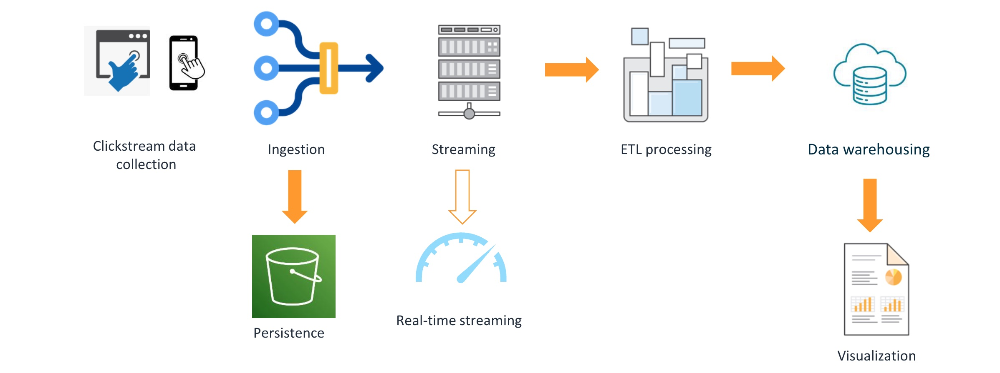

In the last couple of months, I led a team to build a comprehensive and open-sourced [solution][clickstream-landing-page] that helps customers analyze clickstream events on the cloud. The solution provides data autonomy, allowing users full access to raw data, near real-time ingestion, flexible configurations, and cost-effectiveness. It is a system that utilizes serverless services to cater to various customers, whether small businesses or large-scale events with massive data volumes, offering fully managed services with minimal operational efforts or the flexibility to use preferred open-source technical stacks.

The clickstream analytics system typically consists of several modules: SDKs, Data Ingest, Data Processing, Data Modeling and Visualization.

Building a well-architected and secure cloud-native system with modular, resilient, and cost-effective components is always challenging. The solution provides a production-ready and decoupled implementation, with most modules being optional. 

I will thoroughly explore all modules to deeply dive how to build a cloud-native system and implement a system that supports multiple technical variations and components.

- [Serverless Web Console][web-console]

[clickstream-landing-page]: https://aws.amazon.com/solutions/implementations/clickstream-analytics-on-aws/
[web-console]: 