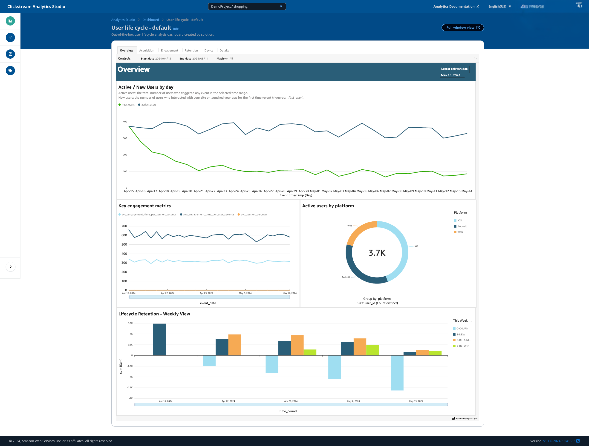
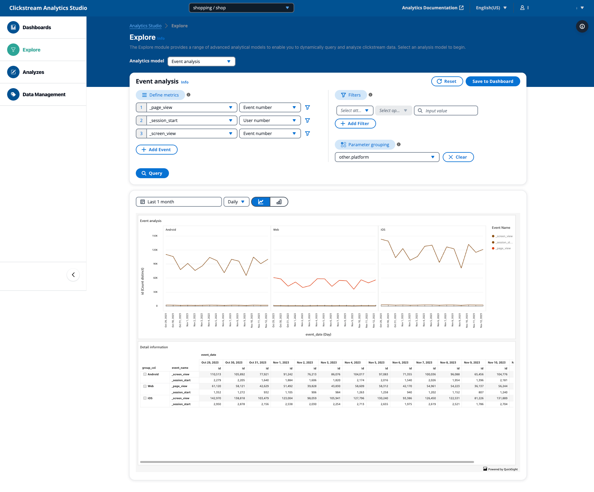

In this post, we will explore the reporting module of our [clickstream solution][clickstream-series]. This module leverages [Amazon QuickSight][quicksight] to provide powerful visualization and analysis capabilities for clickstream data, enabling users to gain valuable insights from their data.

<!--more-->

## Overview

The reporting module is engineered to be flexible, user-friendly, scalable, and highly customizable. It provides a comprehensive suite of capabilities designed to meet diverse analytical needs:

- Integration with Amazon QuickSight for interactive data visualization and dashboard creation.
- Pre-built dashboards for common clickstream analytics use cases.
- A collection of advanced analytics models, including event analysis, funnel analysis, path analysis, retention analysis, and attribution analysis.
- Custom dashboard creation capabilities.

## Out-of-the-box Dashboards

The clickstream solution comes with a set of pre-built dashboards that provide immediate value to users. These dashboards cover common analytics use cases and are designed to work with the standardized data schema produced by the [data processing][data-processing] and [data modeling][data-modeling] modules.

The out-of-the-box dashboards include:

1. **Overview**: Provides a high-level summary of key metrics and trends.
2. **Acquisition**: Focuses on user acquisition channels and their performance.
3. **Engagement**: Analyzes user engagement patterns and metrics.
4. **Retention**: Examines user retention rates and factors affecting them.
5. **Device**: Provides insights into the devices, operating systems, and browsers used by your app or website users.
6. **Details**: Views common and custom dimensions for individual events, and queries all user attributes for a specific user.

These dashboards are automatically created and configured when a new application pipeline is registered, allowing users to start gaining insights immediately without any additional setup.

The solution leverages the [CreateAnalysis API][cfn-quicksight-analysis] to create the analysis and dashboard programmatically.

## Custom Reporting

While the out-of-the-box dashboards cover many common use cases, the solution also provides the flexibility for users to create custom reports tailored to their specific needs.

The custom reporting feature leverages Amazon QuickSight's capabilities, allowing users to:

1. Create new visualizations using the rich set of chart types available in QuickSight.
2. Design custom dashboards by combining various visualizations.
3. Use advanced features like parameters, controls, and calculated fields to create interactive and dynamic reports.
4. Join other data sources outside of clickstream data for comprehensive analysis.

To facilitate custom reporting, the solution creates a semantic layer in QuickSight, which includes:

- A dataset based on the `clickstream_event_base_view` table in Redshift.
- Predefined dimensions and measures derived from the clickstream data.
- Proper relationships between tables to enable easy joining of data.

This semantic layer abstracts the complexity of the underlying data model, making it easier for business users to create reports without needing to write complex SQL queries.

## Data Exploration

For more advanced users or those who need to perform ad-hoc analysis, the solution provides a data exploration interface within the [Analytics Studio][analytics-studio].

The data exploration feature allows users to:

1. Explore event data with built-in analysis models without SQL and QuickSight knowledge.
2. Create temporary visualizations based on query results.
3. Save and share insights derived from exploratory analysis.

This feature is particularly useful for:

- Investigating specific user behaviors or event patterns.
- Validating hypotheses about user interactions.
- Identifying new metrics or dimensions for custom reporting.

## Performance Optimization

To ensure optimal performance of the reporting module, especially when dealing with large volumes of clickstream data, the solution implements several optimization strategies:

1. **Materialized Views**: Frequently used aggregations and complex joins are pre-computed and stored as materialized views in Redshift, reducing query time for common reporting scenarios.

2. **Precalculation**: The metrics used in out-of-the-box dashboards are pre-calculated on a daily basis and stored in individual tables.

3. **Caching**: QuickSight's [SPICE][quicksight-spice] engine is utilized to cache frequently accessed data, improving dashboard load times. See the FAQ [How to speed up the loading of the default dashboard?][spice-faq] to enable SPICE for the out-of-the-box dashboard.

4. **Query Optimization**: The semantic layer in QuickSight is designed with performance in mind, using appropriate aggregations and filters to minimize data scanned during queries.

## Security and Access Control

The reporting module integrates with the solution's overall security model, ensuring that:

1. Only authorized users can access the dashboards and exploration interface.
2. All data transfers between QuickSight and Redshift are encrypted in transit within the VPC via QuickSight's [VPC connection][vpc-connection].

## Conclusion

The reporting module of the clickstream analytics solution provides a powerful and flexible way to derive insights from clickstream data. By combining out-of-the-box dashboards, custom reporting capabilities, and a data exploration interface, it caters to a wide range of analytics needs while maintaining performance and security.

[clickstream-series]: 
[quicksight]: https://aws.amazon.com/quicksight/
[cfn-quicksight-analysis]: https://docs.aws.amazon.com/quicksight/latest/APIReference/API_CreateAnalysis.html
[data-processing]: 
[data-modeling]: 
[analytics-studio]: https://docs.aws.amazon.com/solutions/latest/clickstream-analytics-on-aws/analytics-studio.html
[quicksight-spice]: https://docs.aws.amazon.com/quicksight/latest/user/welcome.html#spice
[spice-faq]: https://docs.aws.amazon.com/solutions/latest/clickstream-analytics-on-aws/frequently-asked-questions.html#analytics-studio-3
[vpc-connection]: https://docs.aws.amazon.com/quicksight/latest/user/working-with-aws-vpc.html