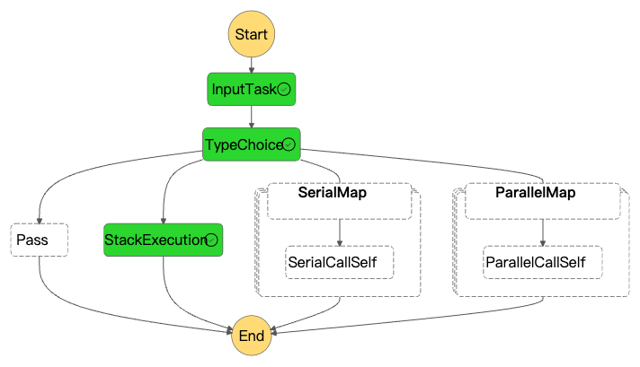

This post explores the [web console][web-console] module of the [clickstream solution][clickstream-series].

The web console allows users to create and manage projects with their data pipeline, which ingests, processes, analyzes, and visualizes clickstream data. In version 1.1, the [Analytics Studio][analytics-studio] was introduced for **business analysts**, enabling them to view metrics dashboards, explore clickstream data, design customized dashboards, and manage metadata without requiring in-depth knowledge of data warehouses and SQL.

## One code base for different architectures

The web console is a web application built using AWS serverless technologies, as demonstrated in the [Build serverless web application with AWS Serverless][serverless-app-posts] series.


Another use case is deploying the web console within a private network, such as a VPC, to meet compliance requirements. In this architecture, CloudFront, S3, and API Gateway are replaced by an internal application load balancer and Lambda functions running within the VPC.


When implementing those two deployment modes, using the [AWS Lambda Web Adapter][lwa] allows for sharing the same code base to gracefully process the events sent from both API Gateway and Application Load Balancer.

## Authentication and Authorization

The web console supports two deployment modes for authentication:

1. If the AWS region has Amazon Cognito User Pool available, the solution can automatically create a Cognito user pool as an OIDC provider.
2. If the region does not have Cognito User Pool, or the user wants to use existing third-party OIDC providers like Okta or Keycloak, the solution allows [specifying the OIDC provider information][deploy-w-oidc].

For the API layer, a custom authorizer is used when the API is provided by API Gateway, and a middleware of Express framework is used when the API is provided by Application Load Balancer.

The backend code uses the Express framework to implement the authorization of the API, supporting both deployment modes.

## Centralized web console

The clickstream tenet utilizes a single web console, which serves as the control plane, to manage one or more isolated data pipelines across any supported region.

## Pipeline lifecycle management

The web console manages the lifecycle of the project's data pipeline, which is composed of modular components managed by multiple AWS CloudFormation stacks. The web console uses Step Functions workflows to orchestrate the workflow for managing the lifecycle of those CloudFormation stacks. The workflows are abstracted as parallel execution, serial execution and stack execution.




And the status change events of CloudFormation stacks are emitted to SNS topic via EventBridge, then the message is deliverred to same region or cross region SQS queue for meeting the [centralized web console][centralized-console].


## Service availability checks

The web console provides a wizard that allows users to provision a data pipeline on the cloud based on their requirements, such as pipeline region, VPC, sink type, and data processing interval. Since AWS services have varying [regional availability][regional-product-services] and features, the web console needs to dynamically display the available options based on the service availability, which it checks through [the CloudFormation registry][cfn-registry], as the pipeline components are managed by CloudFormation.

Below is a sample code snippet for checking the availability of key services used in the solution.
```typescript
import { CloudFormationClient, DescribeTypeCommand } from '@aws-sdk/client-cloudformation';

export const describeType = async (region: string, typeName: string) => {
  try {
    const cloudFormationClient = new CloudFormationClient({
      ...aws_sdk_client_common_config,
      region,
    });
    const params: DescribeTypeCommand = new DescribeTypeCommand({
      Type: 'RESOURCE',
      TypeName: typeName,
    });
    return await cloudFormationClient.send(params);
  } catch (error) {
    logger.warn('Describe AWS Resource Types Error', { error });
    return undefined;
  }
};

export const pingServiceResource = async (region: string, service: string) => {
  let resourceName = '';
  switch (service) {
    case 'emr-serverless':
      resourceName = 'AWS::EMRServerless::Application';
      break;
    case 'msk':
      resourceName = 'AWS::KafkaConnect::Connector';
      break;
    case 'redshift-serverless':
      resourceName = 'AWS::RedshiftServerless::Workgroup';
      break;
    case 'quicksight':
      resourceName = 'AWS::QuickSight::Dashboard';
      break;
    case 'athena':
      resourceName = 'AWS::Athena::WorkGroup';
      break;
    case 'global-accelerator':
      resourceName = 'AWS::GlobalAccelerator::Accelerator';
      break;
    case 'flink':
      resourceName = 'AWS::KinesisAnalyticsV2::Application';
      break;
    default:
      break;
  };
  if (!resourceName) return false;
  const resource = await describeType(region, resourceName);
  return !!resource?.Arn;
};
```

## Optimize package size


One crucial best practice when working with serverless functions like AWS Lambda is optimizing the package size. Just like in the analogy shown here, a smaller and more compact package results in faster performance, lower costs, and more efficient resource utilization. However, when we reach the node_modules folder, it's akin to a vast, sprawling structure, representing an unoptimized and bloated package size. This can lead to slower cold starts, higher compute costs, and potential issues with deployment limits.
By following best practices such as minimizing dependencies, leveraging code bundling and tree-shaking techniques, and optimizing asset handling, you can achieve an optimized package size, ensuring your serverless functions are lean, efficient, and cost-effective.

Originally, the solution uses `node_prune` to remove useless dependencies in _node_modules_ for reducing the lambda size. The package size was reduced to **120MB** from 200MB.
After introducing new dependencies, the original package size became 300MB. `Node_prune` could not reduce the size to meet the hard limit of Lambda package size 256 MB.
The team introduced a new open-sourced tool [vercel/ncc][ncc] for bundling and tree-shaking the node_modules. `Vercel/ncc` bundled the solution code and dependencies as a single file, it only 20MB from original 300MB. It’s amazing!


One more thing to keep in mind is to maintain the relative path of the configuration files used by your application.

## Embedded QuickSight dashboards

Analytics Studio is a component of the clickstream web console that integrates Amazon QuickSight dashboards into our web application.


In the [Exploration][exploration] of Analytics Studio, the web console will automatically create temporary visuals and dashboards for each query owned by the QuickSight role/user used by the web console, ensuring these temporary resources remain invisible to other QuickSight users.

[clickstream-series]: 
[web-console]: https://docs.aws.amazon.com/solutions/latest/clickstream-analytics-on-aws/how-the-solution-works.html#web-console
[analytics-studio]: https://docs.aws.amazon.com/solutions/latest/clickstream-analytics-on-aws/analytics-studio.html
[serverless-app-posts]: 
[lwa]: 
[deploy-w-oidc]: https://docs.aws.amazon.com/solutions/latest/clickstream-analytics-on-aws/launch-with-openid-connect-oidc.html
[regional-product-services]: https://aws.amazon.com/about-aws/global-infrastructure/regional-product-services/
[cfn-registry]: https://docs.aws.amazon.com/AWSCloudFormation/latest/UserGuide/registry-public.html
[centralized-console]: 
[ncc]: https://github.com/vercel/ncc
[exploration]: https://docs.aws.amazon.com/solutions/latest/clickstream-analytics-on-aws/exploration.html
