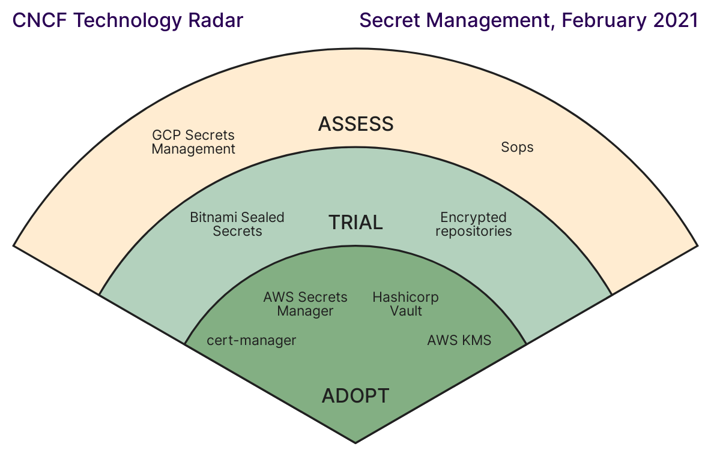

## 背景

密钥的管理对于使用 GitOps 方式做持续发布是一个挑战，特别是当目标部署平台是 Kubernetes 的时候。
K8S 使用声明式配置管理最终状态，而[K8S中的密钥][k8s-secrets]仅仅是将密钥内容做了[base64][base64]格式的编码。
在[基于 Flux 的 GitOps 实战][flux-in-action]介绍了使用[Bitnami Sealed Secrets][use-sealed-secrets-with-flux]加密密钥内容，
可以安全的将加密后的Kubernetes Manifest文件提交到Git代码仓库，由Sealed Secrets发现这些SealedSecret的密码，
并解密后动态的创建K8S原生Secrets对象。

<!--more-->

SealedSecret 解决了如何在 Git 代码仓库中安全的保存密钥的痛点，但是该方式仍然需要系统管理员自行的妥善保存
SealedSecret 使用的私钥，以及如何从灾难中恢复的场景。此外，整个密钥的生命周期管理在K8S集群内部，
无法让集群外的工作负载安全有效的使用这些密钥，例如，云厂商上托管的 RDS 类型数据库。

## 使用外部密钥服务管理K8S密钥 

在 CNCF 基金会在2021年做的一份关于[密钥管理的技术雷达][cncf-radar-secrets-management]报告上指出，
[AWS Secrets Manager][aws-secrets-manager], [HashiCorp Vault][vault] 被列为成熟的密钥管理服务或方案。
如果可以在 Kubernetes 中使用这些成熟的密钥服务或方案来管理密钥将可以同时获得密钥服务安全功能强大和 Kubernetes 任务编排的多重收益。



## External Secrets Operator(ESO)

针对以上不足之处，接下来介绍的 [External Secrets Operator][external-secrets] 将按这个思路解决这些问题。

> External Secrets Operator 是一个 Kubernetes Operator，它集成了外部密钥管理系统，
例如 [AWS Secrets Manager][aws-secrets-manager]、[HashiCorp Vault][vault]、Google Secrets Manager、Azure Key Vault 等等。
他使用外部密钥管理服务的 API 读取信息并自动将值注入 Kubernetes Secret。

以上是 External Secrets Operator 的简介，看了以后是不是觉得特别眼熟。他跟同时 CNCF 下另一个 DNS
解析服务[External DNS][external-dns]非常的类似，为 Kubernetes 内的域名解析注册提供统一的实现体验，
同其他众多第三方成熟的 DNS 解析集成。

下面将介绍如何在使用 FluxCD 管理 External Secrets Operator，以及在 EKS 中使用 [AWS Secrets Manager][aws-secrets-manager] 管理的密钥。

### FluxCD 部署 External Secrets Operator

External Secrets Operator 支持[使用 Helm 安装][eso-install-with-helm]，Flux 部署 ESO 同安装其他 Helm Chart 类似。

1. 加入 ESO 的 Helm 仓库
```yaml
apiVersion: source.toolkit.fluxcd.io/v1beta1
kind: HelmRepository
metadata:
  name: external-secrets
spec:
  interval: 10m
  url: https://charts.external-secrets.io
```
2. 通过 HelmRelease 部署 ESO
```yaml {hl_lines=["13-17"]}
apiVersion: helm.toolkit.fluxcd.io/v2beta1
kind: HelmRelease
metadata:
  name: external-secrets
spec:
  # Override Release name to avoid the pattern Namespace-Release
  # Ref: https://fluxcd.io/docs/components/helm/api/#helm.toolkit.fluxcd.io/v2beta1.HelmRelease
  releaseName: external-secrets
  targetNamespace: kube-system
  interval: 10m
  chart:
    spec:
      chart: external-secrets
      sourceRef:
        kind: HelmRepository
        name: external-secrets
        namespace: kube-system
  values:
    installCRDs: true
  serviceAccountName: helm-controller
  timeout: 5m
  test:
    enable: true
    ignoreFailures: true        
  install:
    crds: CreateReplace
    remediation:
      retries: 3
  upgrade:
    crds: CreateReplace
    remediation:
      remediateLastFailure: false 
```

### 为 ESO 创建配置 IRSA

EKS 通过[IRSA][irsa]将 K8S 内 RBAC 的 ServiceAccount 同 IAM role 统一在一起，
可以让K8S内的工作负载通过原生的 ServiceAccount 绑定 IAM Role，无需显示的指定 AccessKey/Secret 来访问 AWS API。

因为 ESO 必须通过 AWS API 访问读取保存在 AWS Secrets Manager 中的密钥。所以需要为 ESO 配置 AWS 访问密钥或[使用 IRSA 支持][eso-irsa]。

1. 根据 [ESO 文档][eso-iam-policy]建议的 AWS Secrets Manager 权限创建 IAM Policy
```json
{
  "Version": "2012-10-17",
  "Statement": [
    {
      "Effect": "Allow",
      "Action": [
        "secretsmanager:GetResourcePolicy",
        "secretsmanager:GetSecretValue",
        "secretsmanager:DescribeSecret",
        "secretsmanager:ListSecretVersionIds"
      ],
      "Resource": [
        "arn:aws:secretsmanager:us-west-2:111122223333:secret:dev/*" # 替换 region, accountid, 密钥的名称前缀 
      ]
    }
  ]
}

```
2. 使用`eksctl`工具为 EKS 集群创建ESO需要的 Role 及绑定 ESO 需要的权限，例如，
```bash
eksctl create iamserviceaccount --cluster=gitops-cluster --name=external-secrets \
--role-only --role-name=gitops-cluster-dev-external-secrets-role --region ap-southeast-1 \
--namespace=kube-system --attach-policy-arn=arn:aws:iam::123456789012:policy/gitops-dev-external-secrets-sm \
--approve
```
> `namespace`需要跟ESO部署的命令空间保持一致

> `name` 需要跟部署 ESO Chart 指定的 ServiceAccount 名称一致，默认为 `external-secrets`

3. 使用 Kustomization patch 为 ESO Chart 创建的 ServiceAccount 指定 IAM role
```yaml {hl_lines=["7-22"]}
apiVersion: kustomize.config.k8s.io/v1beta1
kind: Kustomization
resources:
  - ../../base
  - ./secrets.yaml
patches:
  - patch: |
     - op: add
       path: /spec/patches/-
       value:
        patch: |
          - op: add
            path: /spec/values/serviceAccount/annotations/eks.amazonaws.com~1role-arn
            value: arn:aws:iam::845861764576:role/gitops-cluster-dev-external-secrets-role
        target:
          kind: HelmRelease
          name: external-secrets
    target:
      group: kustomize.toolkit.fluxcd.io
      version: v1beta2
      kind: Kustomization
      name: external-secrets
```

### 创建 `SecretStore` 或 `ClusterSecretStore` 配置访问 AWS Secrets Manager
```yaml
apiVersion: external-secrets.io/v1beta1
kind: ClusterSecretStore
metadata:
  name: secretstore
  namespace: kube-system
spec:
  provider:
    aws:
      service: SecretsManager
      region: ap-southeast-1
      auth:
        jwt:
          serviceAccountRef:
            name: external-secrets
            namespace: kube-system
```
上面的配置使用了 ServiceAccount 的短时间有效期 JWT token 访问 AWS API，避免了在集群内管理保存 AWS 访问凭证。

### 创建 `ExternalSecret` 对象从 Secrets Manager 获取密钥并配置到 K8S 的 Secret 对象
```yaml
apiVersion: external-secrets.io/v1beta1
kind: ExternalSecret
metadata:
  name: slack-url
  namespace: kube-system
spec:
  refreshInterval: 1h
  secretStoreRef:
    name: secretstore
    kind: ClusterSecretStore
  target:
    name: slack-url
    creationPolicy: Owner
    deletionPolicy: Delete
  data:
    - secretKey: address
      remoteRef:
        key: dev/slackurl
```
如上的 `ExternalSecret` 对象声明了在 `kube-system` 命令空间创建名为 `slack-url` 的密钥。ESO会通过名为 `secretstore`
的 `ClusterSecretStore` 对象获取 AWS Secrets Manager 访问凭证，将名为 `dev/slackurl` 的 AWS Secrets Manager 密钥内容设置到
K8S Secret `slack-url` 的 `address` 键值。

### 确保 FluxCD 创建 ESO 资源的顺序
如上部署通过 Helm 部署了 ESO，通过 ESO 自定义资源创建了 `ClusterSecretStore` 和 `ExternalSecret` 创建密钥。
这些资源通过不同的 Flux 控制器(Kustomization或Helm)所创建，这些资源可用的顺序没有办法保证先后顺序。但是 ESO
的自定义资源对象声明（如`ClusterSecretStore`）依赖 ESO 完整的部署创建自定义资源声明。这里通过嵌套的 Flux Kustomization
对象来管理不同对象间的依赖。示例实现如下，
```yaml {hl_lines=[1,2,10,12]}
apiVersion: kustomize.toolkit.fluxcd.io/v1beta2
kind: Kustomization
metadata:
  name: secrets
  namespace: flux-system
spec:
  interval: 10m0s
  path: ./infrastructure/overlays/development/secrets
  prune: true
  dependsOn:
    - name: sealed-secrets
    - name: external-secrets
  sourceRef:
    kind: GitRepository
    name: flux-system
```

[ESO Examples 文档][eso-with-flux]也详细解释了 FluxCD 中的这个问题，并且示例了解决方法。

## 小结

本文介绍了 External Secrets Operator 将成熟且经过验证的密钥管理服务（如 AWS Secrets Manager）引入到 Kubernetes 原生生态。
用户可以保留使用这些密钥服务的最佳实践和经验，同时让 K8S 编排的任务也无需改动仍然使用云原生的方式访问密钥。
整个方案兼容了安全成熟的密钥管理同 K8S 内程序访问密钥的需求。

随后简短的示例了如何在 EKS 环境最佳实践的管理 ESO 部署，同时示例了如何使用 FluxCD GitOps 方式同时管理 ESO 部署和外部密钥。
完整的代码示例可以[这个仓库][repo]获取。

如果用户有需求通过文件访问 AWS Secrets Manager 的密钥，可以使用 AWS 开源的
[AWS Secrets Manager and Config Provider for Secret Store CSI Driver][secrets-store-csi-driver-provider-aws],
这个项目将 Secrets Manager/Parameter Store 通过 CSI Driver 挂载到容器，提供文件系统的访问。

[k8s-secrets]: https://kubernetes.io/docs/concepts/configuration/secret/
[base64]: https://en.wikipedia.org/wiki/Base64
[flux-in-action]: 
[use-sealed-secrets-with-flux]: 
[cncf-radar-secrets-management]: https://radar.cncf.io/2021-02-secrets-management
[external-secrets]: https://external-secrets.io/
[aws-secrets-manager]: https://aws.amazon.com/secrets-manager/
[vault]: https://www.vaultproject.io/
[external-dns]: https://github.com/kubernetes-sigs/external-dns
[eso-with-flux]: https://external-secrets.io/v0.5.6/examples-gitops-using-fluxcd/
[eso-install-with-helm]: https://external-secrets.io/v0.5.6/guides-getting-started/#installing-with-helm
[eso-irsa]: https://external-secrets.io/v0.5.6/provider-aws-secrets-manager/#eks-service-account-credentials
[eso-iam-policy]: https://external-secrets.io/v0.5.6/provider-aws-secrets-manager/#iam-policy
[irsa]: https://docs.aws.amazon.com/eks/latest/userguide/iam-roles-for-service-accounts.html
[secrets-store-csi-driver-provider-aws]: https://docs.aws.amazon.com/secretsmanager/latest/userguide/integrating_csi_driver.html
[repo]: https://github.com/zxkane/eks-gitops