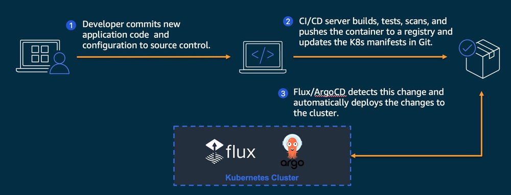
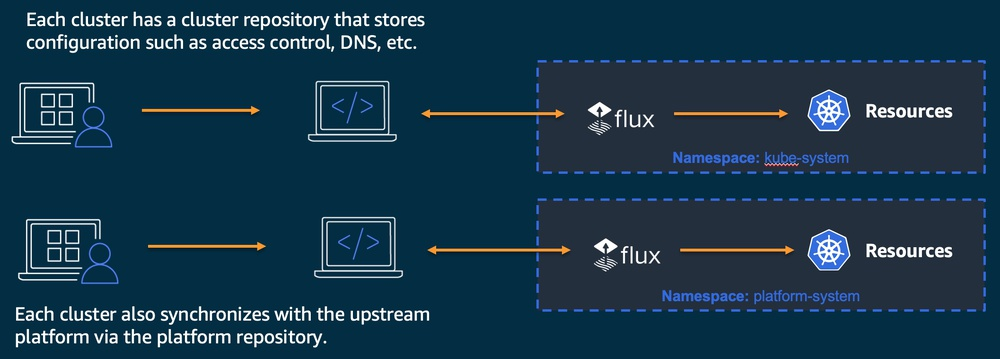
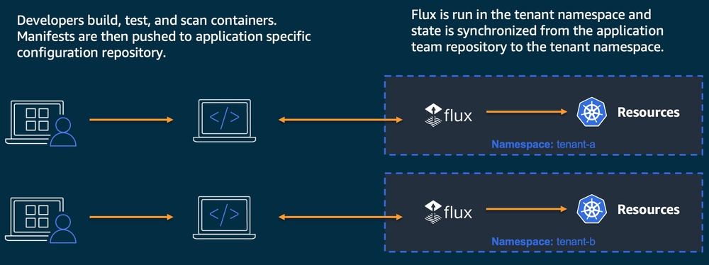

今天 Kuberentes 已经成为IT基础设施的重要玩家，容器编排领域的事实标准。写于3年前的文章[不要自建 Kuberentes][managed-k8s] 的观点已经被绝大多数的企业所认可和接受。

然而同众多企业接触中发现，企业有很高的意愿采用 Kuberentes 管理工作负载，并且已有大量的企业已经将 Kuberentes 用于生产环境。
但如何对多套不同阶段的 Kuberentes 集群来做持续部署，做到高安全性、权限分离、可审计、保证业务团队的敏捷等需求感到困惑。
目前客户实现方式非常多样，并没有很好的遵循业界的最佳实践。

<!--more-->

GitOps 是目前最佳的一种方法来实现基于 Kuberentes 集群的持续部署，且同时满足安全性、权限分离等企业级需求。

## 什么是 GitOps

[GitOps][gitops] 是一种为云原生应用程序实施持续部署的方法。 它通过使用开发人员已经熟悉的工具，包括 Git 和持续部署工具，
专注于在操作基础架构时以开发人员为中心的体验。

GitOps 的核心思想包括，

- 拥有一个 Git 存储库，该存储库始终包含对生产环境中当前所需基础设施的**声明性描述**，以及一个使生产环境与存储库中描述的状态相匹配的自动化过程
- 期望的状态以强制**不变性**和**版本控制**的方式存储，并保留完整的版本历史
- 如果您想部署一个新的应用程序或更新一个现有的应用程序，您只需要更新存储库，软件代理**自动**从源中提取所需的状态声明，自动化过程会处理其他所有事情
- 软件代理**持续**观察实际系统状态并**尝试应用**所需状态

同传统的持续部署系统对比如下，

| 传统 CD 系统  | GitOps 系统 |
| :----:        |    :----:   |
| 由推送事件触发，如代码提交、定时任务、手动等      | 系统不断轮询变更       |
| 仅部署变更的部分   | 为任何部署声明了整个系统        |
| 系统可能会在部署之间漂移   | 系统将纠正任何漂移        |
| CD 程序必须有权访问部署环境   | 部署管道在系统范围内被授权运行        |

GitOps 不会处理如下声明，

- 持久化的应用数据，例如来自用户上传
- 基于 Schema 的部署，例如数据库 schema

即使采用了 GitOps 部署，对于以上数据的备份和恢复同样很重要。

[声明式配置][k8s-declarative-config]是 Kuberentes 从 Day 1 开始提供支持的，
可以说 Kuberentes 声明式配置很好的匹配了 GitOps 原理中的声明性描述需求。
结合[自定义资源定义][k8s-crd]将声明式配置扩展到了自定义资源，K8S 中的自定义资源也可以
无缝的适配 GitOps 部署方法。

## Kuberentes 上 GitOps 最佳实践

GitOps 方法下，Git 成为系统所需状态的唯一事实来源，支持可重复的自动化部署、集群管理和监控。
复用企业中已经非常成熟的 Git 工作流程来完成编译、测试、扫描等持续集成步骤，
当系统最终状态的声明代码进入 Git 仓库主线分支后，依托 GitOps 工具链来完成验证部署，到观测告警，
到操作修复达到系统最终状态的闭环(见图1)。

下面让我们来看看理想中的 Kuberentes 上的 GitOps 最佳实践。

### 基于 GitOps 的持续部署

以下是基于 GitOps 的 Kuberentes 部署流程，

1. 开发者提交应用代码和配置到源代码仓库。
2. 持续集成服务器编译、测试、扫描并且推送新版本的镜像到镜像仓库，同时更新 K8S manifests 到 Git 仓库。
3. GitOps 代理(如 ArgoCD/Flux) 检测到 Git 仓库变更并自动变动到 K8S 集群。
 

### 基于 GitOps 的多集群管理

- 当 Pull Request 被合并到平台仓库，配置在多集群上的 GitOps 代理将监控这个仓库，
并且部署这些更新到 `kube-system` 或者平台命名空间。
- 每个集群有一个集群仓库用于存储配置，例如访问控制、DNS等。同时每个集群通过平台仓库
同上游平台同步。

### GitOps 下的应用开发体验

1. 业务团队负责镜像的编译、测试和扫描等。声明配置被提交到业务/应用特定的配置仓库。
2. GitOps 代理运行在特定的租户命名空间，应用的状态从应用团队的仓库同步到特定的租户命名空间。

### 支持多租户的集群

同上，不同的业务/应用团队有各自的配置仓库。在集群中，不同的业务/应用由不同的命名空间隔离，
被 GitOps 代理持续部署在各自不同的命名空间中。

### 使用 Helm 管理应用程序

[Helm][helm] 是 Kuberentes 生态下的包管理器，类似 [Debian 下的 `apt`][debian-package-management]。
对 Helm 提供无缝的支持将可以利用到现有成熟的K8S应用打包生态，无论是部署三方组件还是企业已经存在的应用。

### 对多环境的部署管理

在企业应用中多套环境、多云、混合云的场景是非常常见的，对应用的部署需要通过基础清单加上各个环境个性化的清单来
简化对多套环境的部署管理。

[Kustomize][kustomize] 正是为解决这个问题而创建，并且已经成为 K8S 原生工具链中的一部分。对 Kustomize 提供支持，
将很好的在 GitOps 中满足此类需求。

综上，从持续部署，多集群管理，多租户支持和现有工具链、生态集成方面，描述了对
Kubernetes 上 GitOps 的理想状态。接下来让我们来讨论下现有的 GitOps 工具，
是否可以很好的支持前面描绘的 GitOps 的理想状态。

## 云原生的 GitOps 工具

由于 Kubernetes 是 [CNCF][cncf] 基金会的核心项目，整个生态会首先关注 CNCF 基金会下的项目，对 GitOps 来说同样如此。

CNCF 在2020年发布了 [Continuous Delivery 技术雷达][cncf-radar-cd]，[Flux][flux] 和 [Helm][helm] 两个项目被归类为
采用，[Kustomize][kustomize] 是被归类为试用，[Argo CD][argocd] 在雷达中为技术评估。

CNCF 在2021年发布的 [Multicluster Management 技术雷达][cncf-radar-multicluster] 中的 **Core Services and Add-ons** 
管理雷达，Flux, Kustomize, Argo 和 Helm 等项目都被评为可采用。

基于前面对 GitOps 的核心定义，CNCF 的技术雷达象限以及[社区的对比][newstack-gitops]，目前整个社区中最为
普及的 GitOps 工具是 Argo CD 和 Flux。

### Push 还是 Poll?

GitOps 在实践中面临是采用推(push)还是拉(pull)的部署风格选择。

采用**推**部署风格会有如下好处，

- 简单易理解。这种部署方式已经被众多知名的 CI/CD 工具所采用，例如 Jenkins CI，AWS Code系列。
- 灵活。易于同其他的脚本或工具集成。拉(pull)风格的 GitOps 代理只能运行在 Kuberentes 中。

采用**拉**部署风格会有如下好处，

- 更加安全。因为 GitOps 代理运行在 Kubernetes 集群中，因此仅需要最小的权限用于部署。简化网络配置不需要该集群同 CD 程序建立网络连接，尤其在管理多集群时尤为简洁。
- 一致性。管理多集群时，确保了每个集群的管理方式都是一样的。
- 隔离性。每个集群的部署不依赖于集中的流水线 CD 程序。
- 可伸缩性。该方式可以容易的扩展到同时管理成百上千的集群。

从以上对比可见，采用拉(pull)的部署风格从安全性、可伸缩性、隔离性、一致性都更优，GitOps 部署方式应该首选**拉**部署风格。

### 主流云原生 GitOps 对比

下表详细对比了 Argo CD / Flux v2，供参考。

|              | ArgoCD  | Flux v2 |
| :----        | :----        |    :----   |
| 安装/配置 | 一个命令安装，但没有原生的机制实现配置。需要通过 UI 或创建大量清单      | 一个命令完成安装和配置       |
| 部署风格 | 推(push) / 拉(pull)      | 拉(pull)       |
| 秘钥管理[1] | Sealed secrets      | Sealed secrets / Mozilla SOPS       |
| Webhook 接收[2] | 支持      | 支持      |
| 告警和通知 | 内置集成 slack，email，Google Chat 等。 | 内置集成 slack，discord，MS Teams 等。  |
| 镜像更新自动化 | 支持      | 支持       |
| Reconciliation 可配置性 | 有限支持（只能全局设置 reconciliation 时间，不能为每个应用设置不同的 reconciliation 时间。） | 支持设置 sync(同步) 和 reconciliation 间隔  |
| 应用交付 -- 原生 Kuberentes 清单(YAML) | 是的，Argo CD 应用程序的副作用是需要在重试中重新应用资源。 | 支持，被视同为 kustomization yaml |
| 应用交付 -- Kustomization | 支持 | 支持，还提供 [GitOps 组件][flux-components]间的依赖  |
| 应用交付 -- Helm charts | 支持，但没有使用 Helm Go 语言程序库。 Helm chart 钩子被转为 Argo CD syncwaves/hooks。因此，不支持 Helm cli。 | 支持，原生支持 chart 钩子，可作为组件相互依赖。支持 Helm cli。 |
| Web UI | 支持，提供了完整的 UI 操作。 | 没有官方 UI 实现。开源平台 [Weave GitOps][weave-gitops] 基于 Flux 提供 UI。 |
| 多租户权限管理 | 支持，实现了独立于 Kubernetes 基于访问控制列表的 RBAC，具有细粒度控制。 | 是的，它严格基于 Kubernetes 的 RBAC 能力，需要结合其他 CNCF 项目做粒度控制，比如 [Kyverno][kyverno]。 |
| 多集群管理 -- 多集群管理和部署 | 支持，对集群做了原生抽象。 | 支持。理论上支持使用 `KubeConfig` 设置通过 Kustomziation 和 Helm 在一个 Flux 中管理多个集群上的工作负载。 |
| 多集群管理 -- 创建集群 | 不支持，需要通过第三方工具。例如，CAPI, Crossplane, Open Cluster Management 等。 | 不支持，需要通过第三方工具。例如，CAPI, Crossplane, Open Cluster Management 等。 |
| GitOps 工具自身的可观测性 | 通过 Prometheus + Grafana 提供。 | 通过 Prometheus + Grafana 提供。 |

通过上表从 GitOps 核心理念来看，无论 ArgoCD 还是 Flux 都满足 GitOps 的理念。且满足了企业级需求，如多租户权限、多集群管理、
秘钥管理、告警通知、支持 Helm 和 Kustomization。从自身的实现上说，ArgoCD 提供了完整的抽象，包括且不限于 Cluster、RBAC、Application、Hook 等。
这样的做法具备了更加广泛的功能集的可能，但同时增加了自身程序的复杂度，也提高了用户的学习门槛。Flux 自身架构更加简洁，[默认组件仅有 Source, Kustomize, 
Helm, Notification, Image automation 这5个组件][flux-components]，尽量复用 Kuberentes 原生能力，例如使用 ServiceAccount 实现多租户的 RBAC 控制，
降低了用户的学习门槛，同云原生社区其他项目的兼容性更强。

[1]: Git仓库可能公开读且明文保存 Secrets 对象，需要将其加密后再提交到 Git

[2]: 默认采用 Poll 轮询拉取 Git 仓库变更，提供 Webhook 接口可被 Git 仓库提交事件触发

## 小结

本文介绍了什么是 GitOps，Kuberentes 上基于 GitOps 实现持续部署的最佳实践，以及 CNCF 下 GitOps 方向最为流行项目
Argo CD 和 Flux 的对比。[后续将以 Flux v2 为实战][part2]，深入介绍如何实现 GitOps 持续部署且同时满足各类企业级需求。

## 参考资料

- [GitOps: Cloud-native Continuous Deployment][gitops]
- The CNCF End User Technology Radar [Continuous Delivery, June 2020][cncf-radar-cd]
- The CNCF End User Technology Radar [Multicluster Management, June 2021][cncf-radar-multicluster]
- [Push vs. Pull in GitOps: Is There Really a Difference?][push-pull-in-gitops]
- [Why is a PULL vs a PUSH pipeline important?][pull-vs-push-pipeline]
- [GitOps on Kubernetes: Deciding Between Argo CD and Flux][newstack-gitops]

[managed-k8s]: 
[gitops]: https://www.gitops.tech/
[k8s-declarative-config]: https://kubernetes.io/docs/tasks/manage-kubernetes-objects/declarative-config/
[k8s-crd]: https://kubernetes.io/docs/concepts/extend-kubernetes/api-extension/custom-resources/#customresourcedefinitions
[helm]: https://helm.sh/
[debian-package-management]: https://www.debian.org/doc/manuals/debian-reference/ch02.en.html
[kustomize]: https://kustomize.io/
[cncf]: https://www.cncf.io/
[cncf-radar-multicluster]: https://radar.cncf.io/2021-06-multicluster-management
[cncf-radar-cd]: https://radar.cncf.io/2020-06-continuous-delivery
[flux]: https://fluxcd.io/
[argocd]: https://github.com/argoproj/argo-cd
[newstack-gitops]: https://thenewstack.io/gitops-on-kubernetes-deciding-between-argo-cd-and-flux/
[flux-components]: https://fluxcd.io/docs/components/
[weave-gitops]: https://github.com/weaveworks/weave-gitops
[kyverno]: https://kyverno.io/
[push-pull-in-gitops]: https://thenewstack.io/push-vs-pull-in-gitops-is-there-really-a-difference/
[pull-vs-push-pipeline]: https://www.weave.works/blog/why-is-a-pull-vs-a-push-pipeline-important
[part2]: 